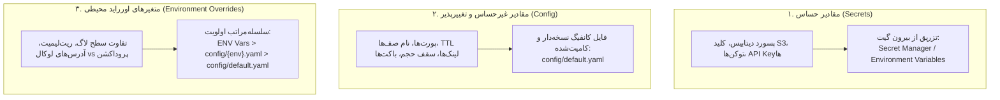

| فیلد / Field | مقدار / Value |
| :--- | :--- |
| **Title (EN)** | Configuration & Secret Management Strategy |
| **Title (FA)** | استراتژی جامع مدیریت پیکربندی، متغیرها و رمزهای عبور |
| **ID** | DOC-ARCH-009 |
| **Category** | `architecture` |
| **Status** | `Approved` |
| **Owner** | Core Architecture & DevOps Team |
| **Last Updated** | 2026-09-28 |
| **Summary (EN)** | Authoritative system-wide strategy for configuration and secrets management, establishing three-tier variable classification, strict fail-fast policies, zero hardcoded constants, and versioned YAML configs. |
| **Summary (FA)** | سند مرجع و الزام‌آور مدیریت پیکربندی و اطلاعات حساس؛ تبیین دسته‌بندی سه‌گانه متغیرها، توقف فوری سرویس در غیاب سکرت‌ها (Fail-Fast)، ممنوعیت ثوابت هاردکد در کد و استفاده از کانفیگ نسخه‌دار YAML. |
| **Tags** | `architecture`, `config`, `secrets`, `security`, `fail-fast`, `devops`, `governance` |

---

# استراتژی مدیریت پیکربندی و رمزهای عبور (Configuration & Secrets Strategy)

> **اصل بنیادین پیکربندی (Configuration Invariant):**  
> در سراسر پلتفرم **Lemmo**، هیچ متغیر تغییرپذیر یا مقدار عملیاتی مجاز نیست به صورت هاردکد (`const` یا مقدار مستقیم) در سورس‌کد سرویس‌ها تعریف شود. کلیه مقادیر غیرحساس باید از فایل‌های کانفیگ ساختاریافته و نسخه‌دار (`config/default.yaml`) خوانده شوند و کلیه اطلاعات حساس (Secrets) باید منحصراً در زمان اجرا از محیط خارج از گیت تزریق گردند. در غیاب هر مقدار حساس، سرویس موظف به توقف فوری (Fail-Fast) است.

---

## ۱. دسته‌بندی سه‌گانه متغیرها و محل استقرار آن‌ها

برای حفظ امنیت پلتفرم، تفکیک وظایف و پایبندی به اصول استاندارد دوازده فاکتور (The Twelve-Factor App)، تمام متغیرهای مورد نیاز سرویس‌ها به سه دسته تفکیک می‌شوند:



### ۱.۱. مقادیر حساس (Secrets)
- **شامل:** رمز عبور پایگاه‌های داده (`DB_PASSWORD`)، کلیدهای دسترسی و محرمانه MinIO/S3 (`MINIO_SECRET_KEY`)، توکن‌های JWT و هش‌های رمزنگاری، کلیدهای API پراویدرهای خارجی هوش مصنوعی (نظیر Fal.ai, Replicate, OpenAI).
- **چرا نباید در کد یا گیت باشد؟** هرگونه ثبت رمز در فایل‌های تحت کنترل گیت منجر به نشت امنیتی، ریسک بهره‌برداری غیرمجاز، عدم امکان چرخش امن رمزها (Credential Rotation) و ابطال گواهی‌های امنیتی می‌گردد.
- **محل زندگی و تزریق:** این مقادیر **هرگز** در هیچ فایلی که به گیت کامیت می‌شود قرار نمی‌گیرند. این داده‌ها در زمان اجرا توسط ارکستراتور زیرساخت، ابزارهای Secret Manager، یا از طریق متغیرهای محیطی امن سیستم (Env Vars) خارج از کنترل گیت به کانتینر تزریق می‌شوند.

### ۱.۲. مقادیر غیرحساس و تغییرپذیر (Config)
- **شامل:** پورت‌های اتصال gRPC و HTTP، نام صف‌ها و Exchangeهای پیام‌رسان (`ExchangeJobs`, `QueueJobsMain`)، مدت‌زمان اعتبار پیوندها (Presigned URL TTL)، سقف حجم آپلود فایل‌ها، نام باکت‌های ذخیره‌سازی، حداکثر تعداد تلاش مجدد (Max Retries) و زمان‌های وقفه (Timeouts).
- **چرا باید در فایل کانفیگ نسخه‌دار کامیت‌شده باشد؟** این مقادیر رفتار فنی و تجاری سیستم را تعیین می‌کنند. حضور آن‌ها در فایل‌های ساختاریافته (نظیر `config/default.yaml`) در کنار سورس‌کد سرویس امکان بررسی تغییرات از طریق Pull Request، ردگیری تاریخی (Git Blame)، و تطبیق معماری را برای تمام اعضای تیم تضمین می‌کند.
- **محل زندگی:** منحصراً در پوشه `config/` در ریشه هر میکروسرویس و درون فایل پایه `default.yaml`.

### ۱.۳. اورراید محیطی (Environment Overrides)
- **مفهوم:** مقادیری که بر حسب محیط اجرا (`development`, `staging`, `production`) باید رفتاری متفاوت داشته باشند؛ به عنوان مثال لاگ‌لول در محیط توسعه `debug` و در پروداکشن `warn` است، یا آدرس سرویس‌های جانبی در محیط لوکال `localhost` و در داکر نام کانتینر شبکه است.
- **سلسله‌مراتب اولویت بارگذاری (Hierarchy of Truth):**
  1. **متغیرهای محیطی مستقیم رانتایم (Environment Variables):** بالاترین اولویت؛ برای سکرت‌ها و اوررایدهای فوری زیرساخت.
  2. **فایل کانفیگ اختصاصی محیط (`config/{environment}.yaml`):** اولویت دوم؛ برای مقادیر پیش‌فرض اختصاصی `staging` یا `production`.
  3. **فایل کانفیگ پایه (`config/default.yaml`):** مبنای پایدار و پیش‌فرض سیستم برای کلیه متغیرهای غیرحساس.

---

## ۲. قاعده حاکمیتی بازگشت به پیش‌فرض (Fallback Policy)

قانون مواجهه با متغیرهای تعریف‌نشده در زمان راه‌اندازی (Startup) سرویس:

| نوع متغیر | سیاست مجاز Fallback | رفتار الزامی سیستم |
|---|:---:|---|
| **مقادیر حساس (Secrets)** | ❌ **اکیداً ممنوع** | **توقف فوری (Fail-Fast):** اگر متغیر حساس در محیط ست نشده باشد، سرویس باید با ثبت لاگ ساختاریافته خطا، از بالا آمدن ممانعت کرده و بلافاصله با کد خروج غیرصفر (`os.Exit(1)`) متوقف شود. هرگز نباید از پسوردهای دیفالت لوکال (مانند `"postgres"` یا `"minioadmin"`) به عنوان Fallback در کد استفاده شود. |
| **مقادیر غیرحساس (Config)** | ✅ **مجاز مشروط** | **تنها از طریق فایل کانفیگ:** اگر مقدار متغیری در متغیرهای محیطی یا اوررایدهای محیطی تعریف نشده باشد، سرویس مجاز است آن را از فایل `config/default.yaml` بخواند. Fallback از طریق constant هاردکد در کد یا رشته ثابت در تابع `getEnv` اکیداً ممنوع است. |

---

## ۳. قاعده منع مطلق هاردکد (Zero Hardcoded Constants In Source)

1. **ممنوعیت ثوابت رفتاری در کد Go و TypeScript:**  
   هیچ مقدار عددی یا رشته‌ای قابل تغییر (مانند پورت سرور، آدرس دیتابیس، نام باکت، نام صف، TTL، سقف حجم) نباید با کلیدواژه `const` یا مقدار مستقیم درون توابع، هندلرها یا ساختارهای دامنه تعریف شود.
2. **پیکربندی تایپ‌شده (Strongly-Typed Config Object):**  
   تمامی لایه‌های معماری تمیز (Clean Architecture) اعم از Domain، Ports، App و Adapters باید وابستگی‌های تنظیمی خود را به عنوان پارامتر ورودی از یک ساختار تایپ‌شده (`Config Struct`) دریافت کنند.
3. **متمرکزسازی بارگذاری:**  
   تنها یک نقطه ورود در هر میکروسرویس مسئول بارگذاری و اعتبارسنجی کانفیگ است (`core/config` یا ماژول کانفیگ سرویس) و سایر پکیج‌ها حق خواندن مستقیم متغیرهای محیطی (`os.Getenv` یا `process.env`) را ندارند.

---

## ۴. الزام پوشش جامع بر تمام سرویس‌ها (Universal Monorepo Coverage)

این استراتژی یک استاندارد فراگیر است و هیچ استثنایی برای سرویس‌های قدیمی یا جدید وجود ندارد:
- کلیه سرویس‌های مستقر فعلی: `core/`, `project-service`, `node-registry-service`, `orchestrator-service`, `storage-service`, `job-service`.
- کلیه سرویس‌های آتی فازهای ۷ و ۸: `model-router-service`, `image-service`, `quota-service`, `usage-service`, `workspace-service`.
- اپلیکیشن‌های فرانت‌اند: `app/` و `auth/` (پیکربندی کلاینت صرفاً از طریق متغیرهای رسمی با پیشوند `NEXT_PUBLIC_` و کانفیگ‌های بدون سکرت).

---

## ۵. فرایند تصویب، نظارت و بازبینی (Governance & Approval Matrix)

به منظور جلوگیری از نشت‌های امنیتی و تغییرات ناخواسته معماری:

| نوع تغییر | تاییدکننده الزامی در PR Review | گیت‌های خودکار بررسی (CI Automation) |
|---|---|---|
| **تغییر در فایل‌های کانفیگ (`config/*.yaml`)** | لید معماری فنی (`@tech-lead`) | ولیدیشن سینتکس YAML و اعتبارسنجی با Struct سرویس |
| **افزودن یا تغییر متغیر حساس (Secret Definition)** | لید فنی + مسئول امنیت/دواپس (`@security-lead`) | اسکن گیت جهت اطمینان از عدم ثبت مقدار واقعی (`gitleaks` / `trufflehog`) |
| **تغییر در پکیج هسته پیکربندی (`api/core/config/`)** | تیم معماری مونو‌ریپو | پاس شدن تست‌های واحد لودینگ، سلسله‌مراتب اولویت و تست Fail-Fast |

---

## ۶. الگوی استاندارد پیاده‌سازی مرجع در سرویس‌های Go

```yaml
# نمونه فایل مرجع: services/<name>/config/default.yaml
server:
  grpc_port: 50051
  http_port: 8080
  environment: development
  log_level: info

database:
  host: localhost
  port: 5432
  name: lemmo_service
  sslmode: disable
  # توجه: پسورد دیتابیس در فایل کانفیگ نوشته نمی‌شود و از DB_PASSWORD خوانده می‌شود.

rabbitmq:
  exchange_jobs: "lemmo.jobs"
  exchange_dlx: "lemmo.jobs.dlx"
  queue_main: "lemmo.jobs.main"
  queue_dlq: "lemmo.jobs.dlq"

storage:
  default_bucket: "lemmo-assets"
  presigned_ttl_seconds: 900
  max_upload_size_bytes: 104857600
```

```go
// الگوی اعتبارسنجی و Fail-Fast در لایه کانفیگ
func (c *ServiceConfig) Validate() error {
    if c.Database.Password == "" {
        return errors.New("CRITICAL: database password is missing; refusing to start (fail-fast)")
    }
    if c.Storage.MinioSecretKey == "" {
        return errors.New("CRITICAL: storage secret key is missing; refusing to start (fail-fast)")
    }
    return nil
}
```
