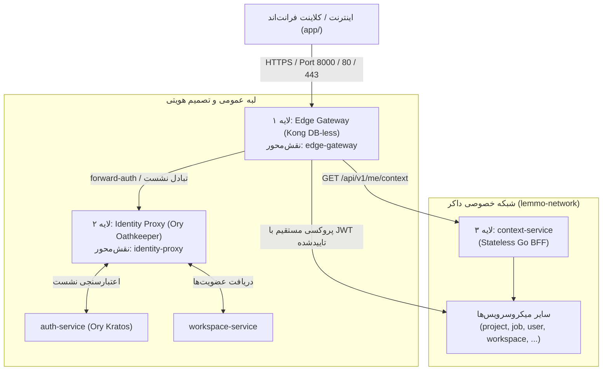

| فیلد / Field | مقدار / Value |
| :--- | :--- |
| **Title (EN)** | Three-Tier Edge Gateway & BFF Architecture |
| **Title (FA)** | معماری سه‌لایه درگاه ورودی لبه و سرویس کانتکست (BFF) |
| **ID** | ADR-013 |
| **Category** | `architecture` |
| **Status** | `Approved` |
| **Owner** | Core Architecture Team / @behroz |
| **Last Updated** | 2026-10-02 |
| **Summary (EN)** | Architectural decision establishing a 3-tier perimeter ingress: Declarative Kong edge gateway, Ory Oathkeeper identity proxy translating Kratos sessions to short-lived JWTs, and a stateless Go context-service for UI-only aggregated context. |
| **Summary (FA)** | تصمیم مصوب معماری جهت استقرار درگاه سه‌لایه لبه: گیت‌وی کانفیگ‌محور Kong، پروکسی هویتی Ory Oathkeeper جهت تبدیل سشن‌های Kratos به JWT کوتاه‌مدت، و سرویس تجمیع‌کننده کانتکست (context-service) صرفاً جهت نمایش در UI. |
| **Tags** | `gateway`, `kong`, `oathkeeper`, `jwt`, `bff`, `context`, `security` |

---

# ADR-013: معماری سه‌لایه درگاه ورودی لبه و سرویس کانتکست (BFF)

## ۱. زمینه و انگیزه (Context & Problem Statement)

در مراحل ۱ تا ۱۰ معماری پلتفرم Lemmo، دوازده میکروسرویس مستقل ایجاد شدند که مستقیماً پورت‌های gRPC و HTTP خود را برای تست‌های اولیه باز کرده بودند. با ورود به فاز عملیاتی، نیازمندی‌های حیاتی زیر پدیدار شدند:
1. **ایزولاسیون کامل شبکه داخلی:** هیچ کاربری نباید دسترسی مستقیم به پورت‌های میکروسرویس‌های داخلی در شبکه خصوصی داکر (`lemmo-network`) داشته باشد.
2. **محافظت از لبه (Edge Protection):** نیازمندی به ریت‌لیمیت چندلایه، مسدودسازی تطبیقی IP، ضدربات و محدودیت سایز درخواست بدون تحمیل بار به سرویس‌های تجاری.
3. **کاهش فشار روی Ory Kratos:** در صورت اعتبارسنجی همگام کوکی نشست (`/sessions/whoami`) برای هر درخواست کلاینت، سرور Kratos به یک گلوگاه (Bottleneck) شدید تبدیل می‌شود.
4. **تجمیع کانتکست برای کلاینت (Context Aggregation per ADR-Backend-007):** طبق الگوی کانتکست پروژه `nons`، آنبوردینگ استیت ماشین جداگانه ندارد و وضعیت کاربر، ورک‌اسپیس فعال، سهمیه‌ها و اکشن بعدی باید به صورت مشتق‌شده (Derived) به فرانت‌اند ارائه شود، اما این داده نباید مرجع تصمیمات امنیتی و مالی بک‌اند باشد.

---

## ۲. تصمیمات مصوب (Decisions)

### ۲.۱. ساختار سه‌لایه درگاه ورودی (Three-Tier Topology)

ترافیک ورودی کلاینت‌ها از معماری سه‌لایه زیر عبور می‌کند:



1. **لایه ۱: Edge Gateway (`edge-gateway` بر بستر Kong در حالت DB-less):**
   - تک‌دروازه عمومی ورود ترافیک بیرونی.
   - کانفیگ کاملاً متنی و نسخه‌بندی‌شده در گیت (`infra/gateway/config/kong.yml`) بدون نیاز به دیتابیس.
   - مسئولیت‌ها: SSL Termination، ریت‌لیمیتینگ توزیع‌شده با بک‌اند Redis، ممانعت IP، محدودیت حجم ریکوئست، و اعتبارسنجی بومی امضای JWT با JWKS.
   - **پشتیبانی بومی از استریم‌های زنده (SSE):** در روت‌های `/api/v1/jobs/.*/events`، تنظیمات `response_buffering: false`، `request_buffering: false` و `read_timeout: 3600000` (۱ ساعت) به صورت محلی در سطح روت اعمال می‌شود.

2. **لایه ۲: Identity Decision Proxy (`identity-proxy` بر بستر Ory Oathkeeper):**
   - نسخه داکر پین‌شده بالاتر از `0.40.10` (جهت مصونیت قطعی از CVE-2026-33496).
   - احراز هویت اولیه کوکی با authenticator بومی `cookie_session` از طریق Kratos.
   - صدور JWT کوتاه‌مدت (TTL بین ۵ الی ۱۵ دقیقه با قابلیت تنظیم) از طریق mutator بومی `id_token`.
   - تزریق عضویت‌های ورک‌اسپیس کاربر (`workspaces: [{id, type, role}]`) داخل claimهای JWT از طریق mutator هیدراتور با یک فراخوانی به `workspace-service`.
   - پس از صدور JWT، کلیه درخواست‌های بعدی تا انقضای توکن مستقیماً در لایه ۱ (Kong) به صورت محلی در حافظه تصدیق می‌شوند و هیچ فشاری به Kratos وارد نمی‌شود.

3. **لایه ۳: سرویس تجمیع کانتکست (`context-service` در `services/context-service/`):**
   - یک میکروسرویس بدون حالت (Stateless) با Go و معماری تمیز (Clean Architecture ذیل ADR-009).
   - پیاده‌سازی اندپوینت جامع `GET /api/v1/me/context` جهت همگام‌سازی استور Zustand فرانت‌اند.
   - فاقد دیتابیس اختصاصی؛ تجمیع همزمان از کلاینت‌های gRPC سرویس‌های `user-service`, `workspace-service`, `quota-service` و `usage-service`.

---

### ۲.۲. قرارداد اندپوینت کانتکست کلاینت (`GET /api/v1/me/context`)

ساختار JSON خروجی اندپوینت کانتکست به شرح زیر تصویب شد:

```json
{
  "user": {
    "id": "1f84e369-564a-4bb3-b55a-e41dbbf07af7",
    "email": "alice@example.com",
    "handle": "alice_dev",
    "status": "ACTIVE",
    "preferences": {
      "theme": "dark",
      "locale": "fa"
    }
  },
  "active_workspace": {
    "id": "454e37ca-2988-455c-975e-154ff27dc788",
    "name": "Personal Workspace",
    "type": "PERSONAL",
    "role": "OWNER"
  },
  "workspaces": [
    {
      "id": "454e37ca-2988-455c-975e-154ff27dc788",
      "name": "Personal Workspace",
      "type": "PERSONAL",
      "role": "OWNER"
    }
  ],
  "entitlements": {
    "tier": "FREE",
    "wallet_balance": 1000,
    "features": ["canvas_basic", "export_png"]
  },
  "onboarding": {
    "completed": false,
    "steps": {
      "profile_completed": true,
      "workspace_created": true,
      "first_project_created": false
    },
    "next_action": "CREATE_FIRST_PROJECT"
  }
}
```

> **[!CRITICAL] قانون الزام حاکمیتی کانتکست (UI-Only Context Invariant):**  
> داده‌های برگشتی در اندپوینت کانتکست (به‌ویژه `wallet_balance`، `features` و `role`) ممکن است در کش چند ثانیه قدیمی باشند و **صرفاً جهت رندر نمای بصری UI** است. هیچ سرویس کلاینت یا بک‌اندازه‌ای مجاز نیست به مقادیر این پاسخ برای تصمیمات امنیتی، احراز دسترسی، یا کسر اعتبار تکیه کند. تایید نهایی مجوز و موجودی والت منحصراً در لحظه اجرای تراکنش توسط سرویس‌های مسئول (`quota-service` و `iam-engine`) انجام می‌پذیرد.

---

### ۲.۳. سیاست تشخیص ورک‌اسپیس فعال و لغو آنی دسترسی با پلاگین یکپارچه (`lemmo-access-enforcer`)

1. **تشخیص ورک‌اسپیس:**
   - فرانت‌اند هدر `X-Workspace-ID` را ارسال می‌کند.
   - گیت‌وی عضویت کاربر را بر اساس Claimهای معتبر داخل JWT چک می‌کند. اگر کاربر عضو نبود، خطای `403 Workspace Forbidden` صادر می‌شود.
   - در صورت عدم ارسال هدر، گیت‌وی به صورت خودکار ورک‌اسپیس نوع `PERSONAL` را از Claimهای JWT استخراج و تزریق می‌کند.
   - گیت‌وی هدرهای تاییدشده و امن `X-Workspace-ID` و `X-Workspace-Role` را به سرویس‌های پایین‌دست تزریق می‌کند (هدر خام کلاینت فیلتر می‌شود).
2. **پلاگین یکپارچه اعتبارسنجی دسترسی (`lemmo-access-enforcer`) و پایپ‌لاین Redis:**
   - به منظور جلوگیری از چندین رفت‌وبرگشت شبکه، تمام بررسی‌های امنیتی در یک پلاگین واحد Lua با نام `lemmo-access-enforcer` و با یک رفت‌وبرگشت واحد (`Redis Pipeline`) در کمتر از ۰.۵ میلی‌ثانیه اجرا می‌شوند:
     1. **تعلیق کاربر:** `lemmo:user:suspended:{user_id}` → در صورت وجود: `403 ACCOUNT_TEMPORARILY_SUSPENDED` همراه با هدر `Retry-After`.
     2. **وضعیت کل ورک‌اسپیس:** `lemmo:workspace:status:{workspace_id}` → در صورت وضعیت غیرفعال/تعلیق: `403 WORKSPACE_INACTIVE`.
     3. **نسخه عضویت فردی کاربر:** `lemmo:membership:version:{workspace_id}:{user_id}` → در صورت عدم تطابق با نسخه موجود در کلیم توکن: `403 MEMBERSHIP_VERSION_MISMATCH` (هدایت کلاینت به تمدید توکن).

---

### ۲.۴. مهار طوفان درخواست‌ها (Thundering Herd) و تمدید ایمن توکن

- **الگوی تمدید پیش‌دستانه در فرانت‌اند (Proactive Client Refresh):** کلاینت فرانت‌اند (`app/`) با استفاده از اینترسپتور، ۱ دقیقه پیش از انقضای توکن (در دقیقه ۱۴ از TTL ۱۵ دقیقه‌ای)، به صورت پس‌زمینه و نامحسوس توکن جدید را دریافت می‌کند تا کاربر هیچ‌گاه با توکن منقضی مواجه نشود.
- **قفل تک‌پرواز در لبه (Single-Flight Distributed Lock with Redis):**  
  در صورتی که چندین تب یا درخواست موازی به صورت همزمان با توکن منقضی‌شده به گیت‌وی برسند:
  - گیت‌وی با کلید موقت `lemmo:lock:refresh:{user_id}` با `SETNX` (انقضای ۳ ثانیه) قفل توزیع‌شده دریافت می‌کند.
  - تنها درخواست برنده به `identity-proxy` رفته و توکن جدید را اخذ و در کلید موقت `lemmo:latest_token:{user_id}` قرار می‌دهد.
  - سایر درخواست‌های همزمان با تاخیر ۵۰ میلی‌ثانیه‌ای منتظر نتیجه مانده و از همان توکن جدید استفاده می‌کنند؛ بدین ترتیب تماس‌های موازی به Kratos به ۱ تماس محدود می‌شود.

---

### ۲.۵. استراتژی جامع دفاع در برابر CSRF

1. **معماری پیش‌فرض Token-First با Bearer Token:** فرانت‌اند توکن JWT صادرشده را در حافظه استور جاوااسکریپت (Zustand) نگهداری کرده و در هدر استاندارد `Authorization: Bearer <token>` ارسال می‌کند که ذاتاً در برابر حملات CSRF صددرصد مصون است.
2. **محافظت دوگانه در صورت استفاده از کوکی (`lemmo_jwt`):**
   - کوکی با ویژگی‌های `HttpOnly; SameSite=Lax; Secure` صادر می‌شود.
   - برای تمامی متدهای ناامن (`POST`, `PUT`, `PATCH`, `DELETE`)، وجود هدر سفارشی غیرقابل جعل `X-Requested-With: LemmoStudio` الزامی است. چون مرورگرها ارسال هدرهای سفارشی در درخواست‌های کراس‌سایت را منوط به تایید پیش‌پرواز CORS (`OPTIONS Preflight`) می‌کنند، هرگونه حمله Cross-Site عملاً مسدود می‌گردد.

---

### ۲.۶. مسدودسازی تطبیقی IP (`lemmo-ip-guard`) و بازخورد هانی‌پات (`lemmo-honeypot-trap`)

1. **ماژول محافظت IP در حافظه اشتراکی (`lemmo-ip-guard`):**  
   - لیست IPهای مسدود در حافظه اشتراکی Nginx (`lua_shared_dict ip_denylist 10m`) با زمان جستجوی $O(1)$ نگهداری می‌شود.
   - یک ورکر دوره‌ای پس‌زمینه (هر ۶۰ ثانیه) لیست جدید دامنه‌ها و IPهای متخلف را از مجموعه Redis `lemmo:denylist:ips` و `reference-data-registry` همگام می‌سازد.
2. **قلاب تشدید جریمه هانی‌پات (`lemmo-honeypot-trap`):**  
   - روت‌های فریبنده نظیر `/.env`، `/admin/v1/debug` و `/api/v1/internal/*` به پلاگین `lemmo-honeypot-trap` مجهز هستند.
   - با اصابت اولین درخواست مهاجم:
     1. آدرس IP به صورت خودکار در مجموعه `lemmo:denylist:ips` با انقضای موقت (مثلاً ۲۴ ساعت) ثبت می‌شود.
     2. رویداد امنیتی `security.honeypot.triggered.v1` جهت لاگ ممیزی و اطلاع‌رسانی ارسال می‌گردد.
     3. پاسخ با تأخیر تصنعی (Tarpit Delay ۱ ثانیه‌ای جهت اتلاف منابع مهاجم) به صورت خطای `404 Not Found` بازگردانده شده و درخواست‌های بعدی همان IP بلافاصله در لبه مسدود می‌شوند.

---

### ۲.۷. سیاست ایزولاسیون شبکه و استانداردهای محیط تست و پروداکشن

1. **محیط توسعه لوکال (`dev.yml`):**
   - پورت گیت‌وی روی `8000` هاست باز است. کلاینت استودیو (`app/`) منحصراً به `http://localhost:8000` متصل می‌شود.
   - پورت‌های مستقیم داخلی سرویس‌ها (مانند `50051`, `8080`, `50062`, `8091`) صرفاً جهت اجرای سریع تست‌های ایزوله Go و عیب‌یابی مستقیم توسعه‌دهنده باز باقی می‌مانند.
2. **محیط استیجینگ و پروداکشن (Security through Absence):**
   - پورت‌های هاست برای سرویس‌های داخلی به صورت ساختاری در فایل‌های Compose پروداکشن غایب هستند.
   - تنها پورت‌های مجاز هاست، پورت‌های `80` و `443` گیت‌وی خواهند بود.
3. **الزام تست E2E از مسیر گیت‌وی در CI:**
   - علاوه بر تست‌های ایزوله هر سرویس، یک سوئیت تست الزامی که منحصراً از مسیر `localhost:8000` عبور می‌کند باید در تمام اجراهای CI اجرا و پاس شود.

---

## ۳. پیامدها و اثرات (Consequences)

- **مزایا:**
  - صفر شدن تماس‌های شبکه‌ای به Kratos برای درخواست‌های دارای JWT معتبر.
  - عدم بازتولید چرخ در زمینه‌های ریت‌لیمیتینگ، ضداسپم، و بافرینگ به دلیل استفاده از Kong و Oathkeeper.
  - کلاینت فرانت‌اند یک نقطه ورود واحد و قرارداد پایدار کانتکست برای وضعیت آنبوردینگ در اختیار دارد.
  - حفاظت کامل از سرویس‌های تجاری در برابر حملات داس و کاربران معلق در لبه شبکه.
- **محدودیت‌ها و وظایف بعدی:**
  - نیاز به راه‌اندازی و نگهداری کانتینرهای `edge-gateway` و `identity-proxy` در `infra/gateway/`.
  - تنظیم و مستندسازی دقیق فایل پیکربندی دکلراتیو Kong (`kong.yml`) و قوانین دسترسی Oathkeeper (`access-rules.yml`).
