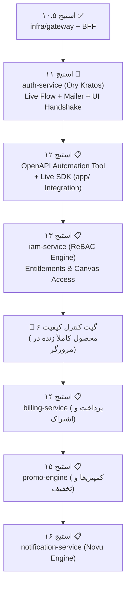

| فیلد / Field | مقدار / Value |
| :--- | :--- |
| **Title (EN)** | Roadmap Reprioritization: Core Identity, Client Integration, Tooling & IAM Engine First |
| **Title (FA)** | بازآرایی استراتژیک نقشه راه: اولویت‌بخشی به هویت زنده، اتصال فرانت‌اند، ابزارسازی و موتور IAM |
| **ID** | ADR-014 |
| **Category** | `roadmap` |
| **Status** | `Approved` |
| **Owner** | Product Owner & Core Architecture Team / @behroz |
| **Last Updated** | 2026-10-02 |
| **Summary (EN)** | Strategic realignment of the backend roadmap: Prioritizing live user registration/login (auth-service/Kratos), automated OpenAPI tooling, full frontend SDK integration (app/ live adapter), and fine-grained authorization (iam-service) before peripheral monetization and notification modules. |
| **Summary (FA)** | بازآرایی استراتژیک نقشه راه بک‌اند: اولویت‌بخشی قطعی به جریان زنده ثبت‌نام/ورود (auth-service/Kratos)، ابزار تولید خودکار OpenAPI، اتصال کامل SDK فرانت‌اند (app/) و موتور مجوزهای دانه‌ریز (iam-service) پیش از ماژول‌های پیرامونی پرداخت و اعلان‌ها. |
| **Tags** | `roadmap`, `auth-service`, `iam-service`, `openapi`, `sdk`, `frontend-handshake`, `governance` |

---

# ADR-014: بازآرایی استراتژیک نقشه راه: اولویت‌بخشی به هویت زنده، اتصال فرانت‌اند، ابزارسازی و موتور IAM

> **اطلاعیه به‌روزرسانی حاکمیتی (Superseded Notice - 2026-10-07):**  
> بخش‌های ۲.۱ و ۲.۳ این سند در خصوص توالی مراحل فاز ۲ و مراحل پس از Gate 6 رسماً توسط **[ADR-017](./ADR-017-phase2-realignment-feed-tools-agent-server-deployment.md)** بازنگری و **جایگزین (Superseded)** شده است. در برنامه‌ریزی جدید، مراحل ۱۴ تا ۱۶ به سرویس‌های فید، ابزارها و چت ایجنت اختصاص یافته و مراحل ۱۷ و ۱۸ به یکپارچه‌سازی لوکال و استقرار سرور اختصاص دارد. سیستم‌های مالی و اعلان‌ها به فاز ۳ (مراحل ۱۹ تا ۲۱) منتقل شده‌اند.

## ۱. زمینه و انگیزه (Context & Problem Statement)

در برنامه‌ریزی اولیه فاز ۲، پس از استقرار درگاه ورودی (`infra/gateway` - Stage 10.5)، سرویس‌های اعلان‌ها (`notification-service`) و صورت‌حساب (`billing-service`) برای مراحل ۱۱ و ۱۲ در نظر گرفته شده بودند.
با این حال، بررسی واقع‌بینانه وضعیت محصول نشان داد که:
1. **قفل بودن درگاه ورود کاربر واقعی:** علی‌رغم آماده بودن منطق ذخیره کاربر در `user-service` و تبدیل سشن در `identity-proxy`، سرور واقعی Ory Kratos در استک داکر بالا نیامده و فرم‌های رابط کاربری `auth/` صرفاً به صورت ماک با `setTimeout` کار می‌کنند. در نتیجه هیچ کاربر واقعی نمی‌تواند وارد سیستم شود.
2. **عدم اتصال زنده استودیو (`app/`):** رابط کاربری استودیو و بوم هنوز روی حالت ماک (`NEXT_PUBLIC_API_MODE=mock`) قرار دارد و آداپتور زنده شبکه در پکیج `@/sdk` تکمیل نشده است.
3. **نبود ابزار خودکار تولید قراردادها (OpenAPI / Swagger Tooling):** تیم فرانت‌اند نیازمند تعاریف استاندارد و خودکار OpenAPI برای مصرف بی‌دردسر اندپوینت‌های گیت‌وی است.
4. **ضرورت موتور رسمی مجوزها (`iam-service`):** کنترل دسترسی‌ها، علاوه بر نقش‌های کلی ورک‌اسپیس، نیازمند اعطای صریح امتیازات (Entitlement Grants) و ماتریس دسترسی به اسناد و نودهای بوم است.

توسعه سرویس‌های اعلان‌ها و درگاه پرداخت زمانی ارزش دارد که سیستم دارای یک هسته زنده، کلاینت متصل، و فرآیند واقعی ورود و اجرای گراف باشد.

---

## ۲. تصمیمات مصوب (Decisions)

### ۲.۱. بازآرایی فاز ۲ نقشه راه: تمرکز بر هسته زنده و اتصال کامل کلاینت

نقشه راه مراحل بعدی بک‌اند به شرح زیر بازآرایی و تثبیت شد:

---

### ۲.۲. شرح تفصیلی مراحل بازتعریف‌شده

#### مرحله ۱۱: استقرار کامل سرویس هویت و فرآیند زنده ورود/ثبت‌نام (`auth-service` / Live Auth Flow)
- **دامنه بک‌اند:**
  - استقرار کانتینر رسمی **Ory Kratos** در استک داکر (`infra/auth/` یا `lemmo-infra-kratos`) با پیکربندی کامل، دیتابیس مستقل Postgres و اسکیماهای هویتی Lemmo.
  - استقرار سرور ایمیل توسعه (Mailpit / MailHog) برای دریافت و تست واقعی کدهای یکبارمصرف (OTP) و لینک‌های ورود جادویی (Magic Link).
  - اتصال مستقیم وب‌هوک Post-Registration کراتوس به اندپوینت `lemmo-svc-user:8091/internal/v1/users/sync-kratos`.
- **دامنه فرانت‌اند و اتصال:**
  - تبدیل رابط کاربری **[`auth/`](../../../../auth)** از حالت ماک به کلاینت زنده Kratos SDK.
  - ارسال واقعی فرم‌های ایمیل/OTP، دریافت کوکی سشن معتبر `ory_kratos_session` و پیاده‌سازی ریدایرکت بدون وقفه به استودیو (`app/`).

#### مرحله ۱۲: ابزار تولید خودکار OpenAPI و نهایی‌سازی SDK کلاینت استودیو (`tooling & ts-sdk`)
- **دامنه ابزارسازی:**
  - توسعه اسکریپت یا CLI اختصاصی در `tools/` جهت تولید خودکار مستندات **OpenAPI 3.1 / Swagger JSON** از روی فایل‌های Protobuf و اندپوینت‌های REST گیت‌وی.
  - انتشار مشخصات OpenAPI برای مصرف در تولید کلاینت‌ها و مستندسازی پرتال توسعه‌دهندگان.
- **دامنه اتصال استودیو (`app/`):**
  - پیاده‌سازی آداپتور شبکه واقعی در `app/src/sdk/live/live-adapter.ts`.
  - تنظیم متغیر محیطی `NEXT_PUBLIC_API_MODE=live` در استودیو.
  - اعتبارسنجی لود اولیه استور Zustand از طریق اندپوینت `GET /api/v1/me/context`، ساخت پروژه زنده و دریافت استریم SSE در بوم.

#### مرحله ۱۳: موتور مدیریت دسترسی‌ها و مجوزهای دانه‌ریز (`iam-service`)
- **دامنه:**
  - پیاده‌سازی رسمی میکروسرویس `services/iam-service/` ذیل استانداردهای Clean Architecture و ADR-009.
  - اعمال مدل اعطای امتیازات (Entitlement Grants per DOC-BE-008) برای منابع بوم، نودها، سقف پروژه‌ها و سهمیه‌های فایل.
  - ارائه اینترفیس‌های gRPC پرسرعت جهت اعتبارسنجی دسترسی عملیات کاربران به پروژه‌ها و اسناد اختصاصی.

#### گیت کنترل کیفیت ۶ (Gate 6 — Live Product Quality Gate):
معیار پذیرش این گیت بر آزمون جامع کاربردی در مرورگر استوار است:
1. کاربر در صفحه `auth/` با ایمیل ثبت‌نام می‌کند و کد OTP را وارد می‌نماید.
2. وب‌هوک به `user-service` ارسال شده، پروفایل ساخته شده و `workspace-service` فضای کاری شخصی می‌سازد.
3. کاربر به طور خودکار به استودیو (`app/`) ریدایرکت می‌شود؛ استودیو در حالت `live` کانتکست را لود می‌کند.
4. کاربر یک پروژه جدید ایجاد کرده، نودها را سیم‌کشی می‌کند، درخواست رندر می‌دهد و استریم پیشرفت را بلادرنگ می‌بیند.
5. مصرف اعتبار در لجر مالی ثبت شده و مجوزها توسط IAM تایید می‌شوند.

---

### ۲.۳. تعویق سرویس‌های پیرامونی به فاز ۳ (Commercialization & Peripheral Services)

سرویس‌های زیر تا اتمام کامل هسته و اتصال ۱۰۰٪ فرانت‌اند به فاز ۳ موکول شدند:
- **مرحله ۱۴:** `billing-service` (پلن‌ها، اشتراک، درگاه پرداخت ریالی/ارزی و فاکتور)
- **مرحله ۱۵:** `promo-engine` (کوپن‌ها، کمپین‌ها و شارژ مستقیم باکت‌های هدیه)
- **مرحله ۱۶:** `notification-service` (موتور Novu و فید اعلان‌های درون‌برنامه‌ای)
- **فاز ۴ (رشد و اکوسیستم):** `community-service` (گالری عمومی) و `affiliate-service` (افیلیت مارکتینگ).

---

## ۳. پیامدها و اثرات (Consequences)

- **کاهش شدید ریسک یکپارچگی:** ارتباط فرانت‌اند و بک‌اند در زودترین زمان ممکن محک می‌خورد و باگ‌های احتمالی رابط کاربری بلافاصله آشکار می‌شوند.
- **ارزش محصولی آنی:** پلتفرم دارای یک چرخه ورود، ثبت‌نام و تولید واقعی در مرورگر می‌شود که قابلیت دمو و آزمایش میدانی دارد.
- **توسعه مبتنی بر قراردادهای مستند:** وجود تولیدکننده خودکار OpenAPI باعث تسریع چشمگیر توسعه کلاینت‌ها و کدهای فرانت‌اند می‌گردد.
