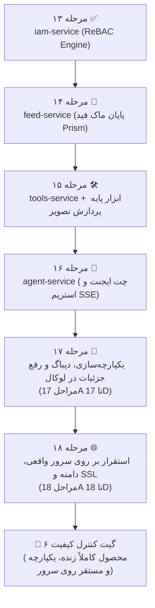

| فیلد / Field | مقدار / Value |
| :--- | :--- |
| **Title (EN)** | Phase 2 Strategic Realignment: Feed, Tools, Agent Chat, Local Polish and Production Server Release |
| **Title (FA)** | بازآرایی استراتژیک فاز ۲: اولویت‌بخشی به فید، ابزارها، ایجنت، رفع جزئیات و استقرار سرور واقعی |
| **ID** | ADR-017 |
| **Category** | `roadmap` |
| **Status** | `Approved` |
| **Owner** | Product Owner & Core Architecture Team / @behroz |
| **Last Updated** | 2026-10-07 |
| **Summary (EN)** | Formally supersedes ADR-014 Section 2.1 and 2.3 regarding Phase 2 culmination and post-Gate 6 progression. Establishes a product-first, zero-mock roadmap: prioritizes feed-service (Stage 14), tools-service & base AI tool (Stage 15), agent-service (Stage 16), iterative local integration, sync & polish (Stage 17A-17D), and production server deployment & release (Stage 18A-18D) to achieve Gate 6. Defers monetization, billing, subscriptions, promos, and notifications to Phase 3 (Stages 19-21), and community/affiliate ecosystem to Phase 4 (Stages 22-24). |
| **Summary (FA)** | جایگزینی رسمی بخش‌های ۲.۱ و ۲.۳ از سند ADR-014 در خصوص توالی مراحل فاز ۲ و مراحل پس از Gate 6. تثبیت رویکرد محصول‌محور و بدون‌ماک در نقشه راه: اولویت‌بخشی قطعی به سرویس فید (مرحله ۱۴)، سرویس ابزارها و اولین ابزار پایه هوش مصنوعی (مرحله ۱۵)، سرویس چت ایجنت (مرحله ۱۶)، یکپارچه‌سازی، دیباگ و رفع جزئیات لوکال (مراحل 17A تا 17D) و استقرار روی سرور واقعی پروداکشن با دامنه و SSL (مراحل 18A تا 18D) جهت فتح Gate 6. تعویق سیستم‌های مالی، اشتراک، درگاه‌ها، پرومو و اعلان‌ها به فاز ۳ (مراحل ۱۹ تا ۲۱) و جامعه کاربری و افیلیت به فاز ۴ (مراحل ۲۲ تا ۲۴). |
| **Tags** | `roadmap`, `phase2`, `feed-service`, `tools-service`, `agent-service`, `server-deployment`, `gate6`, `supersedes-adr014` |

---

# ADR-017: بازآرایی استراتژیک فاز ۲: اولویت‌بخشی به فید، ابزارها، ایجنت، رفع جزئیات و استقرار سرور واقعی

> **وضعیت حاکمیتی (Governance Status):**  
> این سند مصوب و لازم‌الاجرا است و **بخش‌های ۲.۱ و ۲.۳ از سند [ADR-014](./ADR-014-roadmap-reprioritization-core-identity-and-client-integration.md)** را در خصوص توالی مراحل فاز ۲ و تعویق ماژول‌ها رسماً **جایگزین و نسخ (Supersede)** می‌کند. پیرو قانون ۱ از سند [AGENTS.md](../../AGENTS.md)، تمامی اسناد فنی و نقشه راه باید با این سند همگام باشند.

---

## ۱. زمینه و چرایی تصمیم (Context & Rationale)

در سند قبلی [ADR-014](./ADR-014-roadmap-reprioritization-core-identity-and-client-integration.md)، پس از استقرار سرویس هویت Kratos (مرحله ۱۱)، تولید OpenAPI و کلاینت استودیو (مرحله ۱۲) و موتور مجوزها IAM (مرحله ۱۳)، گیت کنترل کیفیت ۶ به عنوان پایان فاز ۲ در نظر گرفته شده بود و بلافاصله مراحل ۱۴ تا ۱۶ به سرویس‌های مالی و اعلان‌ها (`billing-service`, `promo-engine`, `notification-service`) اختصاص یافته بود.

با این حال، ارزیابی دقیق فنی، محصولی و تجربه کاربری در تاریخ ۷ اکتبر ۲۰۲۶ نشان داد که این ترتیب دارای تناقض و مخاطره مهندسی است:
1. **عدم تکمیل هسته زنده محصول (Core Product Loops Incomplete):** در استودیو هنوز ۳ ماژول کلیدی متکی بر کانتینرهای ماک Prism هستند:
   - فید عمومی و دیسکاوری (`lemmo-mock-feed`)
   - رجیستری ابزارها و اجرای نودهای پردازش (`lemmo-mock-tools`)
   - چت و گفتگو با ایجنت هوش مصنوعی (`lemmo-mock-chat`)
   پیاده‌سازی درگاه پرداخت و سیستم اشتراک پیش از آنکه کاربر بتواند در استودیو فید را ببیند، ابزار اجرا کند و با ایجنت گفتگو نماید، فاقد ارزش عملیاتی است.
2. **ضرورت آزمون ۱۰۰٪ زنده بدون ماک (Zero-Mock Invariant):** برای بسته شدن فاز ۲، تمام استاب‌ها و ماک‌های Prism باید از شبکه خارج شده و سرویس‌های واقعی Go جایگزین شوند.
3. **تفکیک الزامی دیباگ لوکال از استقرار سرور:** اتصال کامل فرانت‌اند React 19 به میکروسرویس‌های توزیع‌شده با چالش‌های ظریف هیدریشن، استریم SSE، کوکی‌های کراس-پورت و کانتکست سشن همراه است. گنجاندن این رفع باگ‌ها همزمان با عملیات استقرار زیرساختی سرور در یک مرحله، ریسک بالایی دارد و باید به دو مرحله مستقل و چندگامی تفکیک گردد.

---

## ۲. تصمیمات مصوب (Decisions)

### ۲.۱. توالی بازتعریف‌شده مراحل فاز ۲ و تثبیت Gate 6

توالی مراحل فاز ۲ به شرح زیر بازآرایی و تصویب می‌شود:

---

### ۲.۲. شرح تفصیلی مراحل مصوب فاز ۲

#### مرحله ۱۴: میکروسرویس زنده فید (`feed-service`)
- **هدف:** حذف کانتینر ماک `lemmo-mock-feed` و جایگزینی با میکروسرویس واقعی Go.
- **دامنه:** پایگاه‌داده مستقل `lemmo_feed` در PostgreSQL، لایه کشینگ در Redis (الگوی Cache-Aside با TTL)، پشتیبانی از فید عمومی، بنرهای اسلایدر (`featured`) و ابزارهای سریع (`quick_tools`) بر اساس قرارداد `contracts/openapi/feed/v1/openapi.yaml`.

#### مرحله ۱۵: رجیستری ابزارها و اولین ابزار پایه هوش مصنوعی (`tools-service` & Base Tool)
- **هدف:** حذف کانتینر ماک `lemmo-mock-tools` و فعال‌سازی کاتالوگ ابزارها به همراه اجرای زنده حداقل یک ابزار پایه پردازش تصویر (مانند Remove Background یا Upscaling).
- **دامنه:** پیاده‌سازی سرویس بر پایه قرارداد `contracts/openapi/tools/v1/openapi.yaml`، اتصال اندپوینت اجرا به `job-service` و `image-service`، ذخیره در MinIO/S3 و تسویه اعتبار در `quota-service`.

#### مرحله ۱۶: سرویس گفتگوی هوشمند ایجنت استودیو (`agent-service`)
- **هدف:** حذف کانتینر ماک `lemmo-mock-chat` و پیاده‌سازی سرویس زنده مدیریت گفتگو و اجرای جریان‌های ایجنت.
- **دامنه:** ذخیره‌سازی تاریخچه رشته‌ها و پیام‌ها در دیتابیس `lemmo_agent`، انتخاب مدل از طریق `model-router-service`، استریم بلادرنگ پاسخ‌ها با SSE بر پایه قرارداد `contracts/openapi/chat/v1/openapi.yaml`.

#### مرحله ۱۷: اتصال کامل، دیباگ، رفع جزییات و همگام‌سازی در محیط لوکال (`Local E2E Integration, Sync & Polish`)
- **هدف:** رفع تمامی ناسازگاری‌ها، رفتارهای پیش‌بینی‌نشده هیدریشن، استریم SSE و کش میان کلاینت استودیو (`app/`) و سرویس‌های Go در محیط لوکال پیش از ورود به سرور.
- **زیرمراحل تفکیکی:**
  - **17A:** همگام‌سازی هویت، نشست‌ها و ماشین حالت ۶‌گانه استودیو با داده‌های زنده Kratos و `context-service`.
  - **17B:** رفع خطاهای پایپ‌لاین بوم، حل تعارضات Optimistic Locking و تضمین عدم بافرینگ استریم‌های SSE (`jobs.subscribe`).
  - **17C:** تثبیت چت ایجنت، اجرای ابزار پایه و اعتبارسنجی دقیق تسویه سهمیه‌ها در `quota-service`.
  - **17D:** اجرای آزمون‌های رگرسیون کامل E2E و فریز پایداری محیط لوکال.

#### مرحله ۱۸: استقرار بر روی سرور واقعی پروداکشن، دامنه، SSL و انتشار زنده (`Production Server Deployment & Release`)
- **هدف:** استقرار پایدار استک کامل در سرور عملیاتی واقعی با دسترسی عمومی اینترنتی.
- **زیرمراحل تفکیکی:**
  - **18A:** هاردنینگ سیستم‌عامل سرور، فایروال، و معماری Compose پروداکشن با والوم‌های دائم.
  - **18B:** تنظیم اینگرس لبه، پیکربندی ساب‌دامنه‌ها (`app.`, `auth.`, `api.`) و صدور خودکار گواهی‌های SSL/TLS با Let's Encrypt.
  - **18C:** تزریق امن سکرت‌های پروداکشن طبق سند [DOC-ARCH-009](../configuration-and-secrets.md) با رفتار Fail-Fast.
  - **18D:** آزمون‌های سلامت زنده روی اینترنت واقعی (Smoke Tests)، تایید پایداری مانیتورینگ، و دستیابی رسمی به **Gate 6** (پایان فاز ۲).

---

### ۲.۳. انتقال سیستم‌های مالی و اعلان‌ها به فاز ۳ و ۴

توالی فازهای ۳ و ۴ پیرو این بازآرایی به شرح زیر اصلاح می‌گردد:

* **فاز ۳: صورت‌حساب، مانیتایزیشن و سیستم اعلان‌ها (Commercialization):**
  - **مرحله ۱۹:** سرویس اشتراک و درگاه‌های پرداخت (`billing-service`)
  - **مرحله ۲۰:** موتور کوپن و کمپین‌های تبلیغاتی (`promo-engine`)
  - **مرحله ۲۱:** سرویس جامع اعلان‌ها (`notification-service` با Novu)
  - **گیت کنترل کیفیت ۷ (Gate 7):** سیستم پرداخت، اشتراک و اعلان‌های زنده.
* **فاز ۴: شبکه اجتماعی، همیاری و اکوسیستم (Community & Ecosystem):**
  - **مرحله ۲۲:** سرویس جامع کامیونیتی (`community-service`)
  - **مرحله ۲۳:** پلتفرم بازاریابی و همکاری در فروش (`affiliate-service`)
  - **مرحله ۲۴ به بعد:** قابلیت‌های تکمیلی سازمانی (CRDT Collaboration، نسخه‌بندی بوم‌ها و پلاگین‌ها).
  - **گیت کنترل کیفیت ۸ (Gate 8):** اکوسیستم رشد و جامعه کاربری.

---

## ۳. پیامدها و اثرات (Consequences)

1. **انطباق کامل با تجربه محصول:** پیش از ورود به بحث‌های مالی، کل پلتفرم به صورت یک محصول زنده و قابل استفاده در محیط مرورگر و بر بستر اینترنت واقعی فعال و قابل ارزیابی است.
2. **حذف قطعی ریسک‌های یکپارچگی:** تفکیک مرحله ۱۷ (دیباگ لوکال) از مرحله ۱۸ (استقرار سرور) مانع از سردرگمی میان باگ‌های منطقی برنامه و خطاهای شبکه/زیرساخت سرور می‌گردد.
3. **تطابق کامل اسناد و رفع تعارض:** با تصویب این سند، هرگونه تناقض میان ADR-014، نقشه راه، و تصمیمات باز جاری به صورت بنیادین حل شد.
