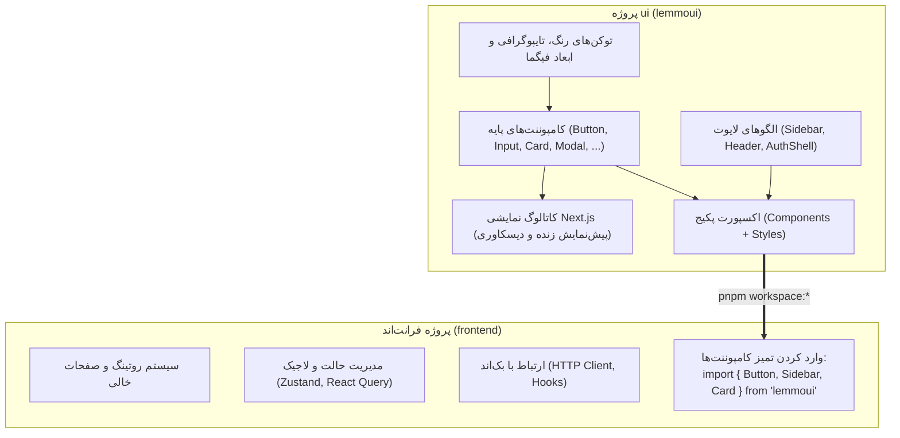

# سند پیشنهادی معماری: استخراج دیزاین سیستم به پکیج `ui` و مصرف در `frontend`

> **تاریخ:** ۱۴ سپتامبر ۲۰۲۶  
> **وضعیت:** در انتظار تایید تیم معماری (Proposed)  
> **هدف:** تبدیل پروژه `ui` (`lemmoui`) به تنها مرجع و پکیج کامپوننت‌های دیزاین سیستم (شبیه به shadcn/ui) و سبک‌سازی کامل پروژه `frontend` جهت مصرف مستقیم از طریق یک پکیج.

---

## ۱. وضعیت‌سنجی دقیق دو پروژه (Current State Audit)

| شاخص | پروژه فرانت‌اند (`frontend`) | پروژه رابط کاربری (`ui` / `lemmoui`) |
| :--- | :--- | :--- |
| **فریم‌ورک / بیلد** | Vite 5 + React Router 6 (SPA) | Next.js 16.3 (Turbopack) |
| **نسخه React** | **React 18.3.1** | **React 19.0.0** |
| **موتور استایل‌دهی** | Vanilla CSS + CSS Modules + متغیرهای خام `--lemmo-*` | **Tailwind CSS v4** + `tw-animate-css` + Shadcn Variables |
| **مجموعه Primitives** | Radix UI Slot (`@radix-ui/react-slot`) | Base UI (`@base-ui/react`) + CVA |
| **کتابخانه آیکون‌ها** | `synthline` (`synthline/react`) | `lucide-react` + آیکون‌های وکتور اختصاصی Lemmo |
| **فونت‌ها** | IRANSansX (فارسی)، Morabba، Oddval، Satoshi | فونت‌های پیش‌فرض + امکان یکپارچه‌سازی فونت‌های سازمانی |
| **نقش فعلی** | اپلیکیشن محصول (داشبورد، روتینگ، منطق تجاری) | شوکیس و آرشیو کامپوننت‌ها (کاتالوگ، مستندات دیسکاوری) |

---

## ۲. چالش‌های فنی و نقاط ناسازگاری (Key Technical Gaps)

پیش از انتقال کدها، ۳ تضاد فنی باید شفاف و تعیین تکلیف شوند:

### ۱. ناسازگاری نسخه React (React 18 vs React 19)
- پروژه `frontend` بر پایه React 18 و کتابخانه‌های وابسته به آن است، در حالی که `ui` با React 19 راه‌اندازی شده است.
- **راهکار پیشنهادی**: ارتقای `frontend` به **React 19** (رویکرد مدرن‌تر و حذف خطاهای هم‌پوشانی وابستگی‌ها) یا اطمینان از خروجی بیلد کامپوننت‌های `ui` به شکل React 18-compatible.

### ۲. استراتژی استایل‌ها (Tailwind v4 در برابر CSS Modules فرانت)
- در حال حاضر `frontend` از CSS Modules و متغیرهای نام‌گذاری شده با پیشوند `--lemmo-*` استفاده می‌کند، اما `ui` با Tailwind v4 و متغیرهای Shadcn (`bg-background`, `text-foreground`, `bg-primary`) کار می‌کند.
- **راهکار پیشنهادی**: 
  - پکیج `ui` فایل استایل کامپایل‌شده‌ی نهایی خود را (`@lemmo/ui/styles.css`) اکسپورت کند.
  - فرانت‌اند صرفاً این فایل استایل را یک‌بار در روت برنامه (`main.tsx` یا `App.tsx`) ایمپورت می‌کند و دیگر نیازی به نوشتن کلاس‌ها یا ماژول‌های CSS تکراری نخواهد داشت.

### ۳. نحوه اتصال و انتشار پکیج (Package Distribution)
- چگونه `frontend` پکیج `ui` را ببیند؟
- **راهکار پیشنهادی (Monorepo Workspace)**: 
  ایجاد فایل `pnpm-workspace.yaml` در روت اصلی مخزن (`/home/behroz/Documents/Git/lemmo`):
  ```yaml
  packages:
    - 'frontend'
    - 'ui'
  ```
  با این کار، داخل `frontend/package.json` صرفاً می‌نویسیم:
  ```json
  "dependencies": {
    "lemmoui": "workspace:*"
  }
  ```
  بدون نیاز به Publish در npm، هر کامپوننتی که در `ui` اضافه یا ادیت شود، بلافاصله و با تایپ‌چک کامل در `frontend` در دسترس خواهد بود.

---

## ۳. معماری هدف: تفکیک وظایف (Target Architecture)



### مزایای این معماری:
1. **فرانت‌اند ۱۰۰٪ تمیز**: هیچ فایل CSS اضافی، هیچ ماژول دابلیکیت شده و هیچ استایل پراکنده‌ای در فرانت وجود نخواهد داشت.
2. **پشتیبانی از الگوی Shadcn**: توسعه‌دهنده یا طراح می‌تواند در `ui` کامپوننت‌ها را ببیند، شخصی‌سازی کند و همانجا با فایرفاکس و فیگما مطابقت دهد.
3. **سرعت توسعه بسیار بالا**: افزودن یک دکمه یا کارت جدید تنها در `ui` صورت می‌گیرد و در کل فرانت فقط ایمپورت می‌شود.

---

## ۴. نقشه راه گام‌به‌گام پیاده‌سازی (Action Plan)

### گام اول: پیکربندی روت به عنوان PNPM Workspace
1. ایجاد فایل `pnpm-workspace.yaml` در روت `/home/behroz/Documents/Git/lemmo`.
2. افزودن پروژه‌های `frontend` و `ui` به ورک‌اسپیس.

### گام دوم: آماده‌سازی ساختار اکسپورت در `ui`
1. تنظیم `package.json` پروژه `ui` جهت اکسپورت کامپوننت‌ها و استایل‌ها:
   ```json
   {
     "name": "lemmoui",
     "main": "./components/index.ts",
     "types": "./components/index.ts",
     "exports": {
       ".": "./components/index.ts",
       "./styles.css": "./app/globals.css"
     }
   }
   ```
2. ایجاد فایل `ui/components/index.ts` برای اکسپورت تمام کامپوننت‌های آماده (دکمه، آیکون‌ها، هدر، کارت، و...).

### گام سوم: انتقال استایل‌ها و توکن‌های اختصاصی Figma به `ui`
1. نگاشت پالت رنگ‌های فیگما (`Brandcolor`, `Neutral Palette`, `#D1FE17`) به توکن‌های CSS در `ui/app/globals.css`.
2. افزودن فونت‌های سازمانی فارسی و انگلیسی (`IRANSansX`, `Satoshi`) به پکیج `ui`.

### گام چهارم: ایجاد کامپوننت‌های متناظر با فریم‌های فیگما در `ui`
1. پیاده‌سازی کامپوننت‌های پایه:
   - `Button`, `Input`, `Dialog`, `Card`, `Badge`, `Tabs`, `Dropdown`
2. پیاده‌سازی کامپوننت‌های کلان لایوت:
   - `AppSidebar`, `AppHeader`, `AuthCard`
3. ساخت پیش‌نمایش در صفحات دیسکاوری `ui` جهت بررسی و مطابقت تصویری با فیگما.

### گام پنجم: اتصال به فرانت‌اند و سبک‌سازی کدهای موجود
1. نصب پکیج در فرانت‌اند: `pnpm add lemmoui@workspace:*` در دایرکتوری `frontend`.
2. ایمپورت استایل اصلی `lemmoui/styles.css` در روت فرانت.
3. پاکسازی فایل‌های ماژول CSS قدیمی و پوشه `src/design-system` که حالا دیگر در پکیج `ui` قرار دارند.
4. جایگزینی کامپوننت‌ها در صفحات فرانت‌اند:
   ```tsx
   import { Button, AppShell, Sidebar } from 'lemmoui';
   ```

### گام ششم: اجرای اعتبارسنجی نهایی
- اجرای `pnpm build`، تست‌های واحد `vitest` و تایپ‌چک در هر دو پروژه جهت تضمین عدم بروز رگرسیون.
