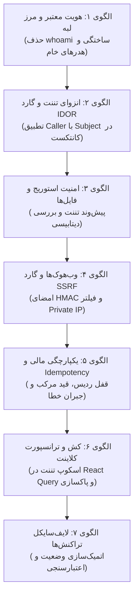

| فیلد / Field | مقدار / Value |
| :--- | :--- |
| **Title (EN)** | Zero-Trust Secure System Design & Engineering Standards |
| **Title (FA)** | استانداردهای سیستم‌دیزاین امنیتی و مهندسی معماری بدون‌اعتماد (Zero-Trust) |
| **ID** | DOC-ARCH-011 |
| **Category** | `architecture` |
| **Status** | `Approved` |
| **Owner** | Core Architecture & Security Engineering Team / @security |
| **Last Updated** | 2026-10-06 |
| **Summary (EN)** | Authoritative system design and secure coding standards codifying concrete architecture patterns to prevent platform vulnerabilities (IDOR, identity spoofing, tenant bleed, financial race conditions, SSRF, cache leaks). Mandates non-negotiable invariants for backend, edge, RPC, data persistence, and frontend client integration. |
| **Summary (FA)** | سند مرجع و حاکمیتی استانداردهای سیستم‌دیزاین امنیتی و الگوهای الزامی کدنویسی پلتفرم جهت جلوگیری پیش‌دستانه از آسیب‌پذیری‌ها (IDOR، جعل هویت، نشت تننت، مسابقات همزمانی مالی، SSRF، نشت کش). شامل اصول بدون‌اغماض برای بک‌اند، لبه، ارتباطات RPC، پایگاه داده و کلاینت استودیو. |
| **Tags** | `security`, `system-design`, `zero-trust`, `idor`, `architecture`, `standards`, `anti-patterns`, `guidelines`, `styleguide` |

---

# استانداردهای سیستم‌دیزاین امنیتی و مهندسی معماری بدون‌اعتماد (DOC-ARCH-011)

> **اصل بنیادین سیستم‌دیزاین امنیتی (Zero-Trust Architecture Invariant):**  
> در سراسر اکوسیستم پلتفرم **Lemmo**، هیچ کامپوننت، سرویس یا پایگاه داده‌ای مجاز نیست به شبکه داخلی، فرانت‌اند، هدرهای کلاینتی یا فرضیات ضمنی اعتماد کند. تمامی تصمیمات امنیتی و ایزولاسیون باید **پیش از نگارش اولین خط کد در مرحله طراحی معماری (System Design Phase)** لحاظ شده و در قراردادهای Proto، مدل‌های دامنه و کدهای ترانسپورت به صورت الگوهای ایزوله و تغییرناپذیر تعبیه شوند.

---

## ۱. هدف و دامنه کاربرد

این سند به عنوان **مرجع ارشد امنیت معماری پلتفرم** تدوین شده است تا از تکرار مجدد ۲۵ آسیب‌پذیری شناسایی‌شده در ممیزی‌های امنیتی ([DOC-ARCH-010](./security-audit-and-remediation.md)) در توسعه سرویس‌های فعلی و میکروسرویس‌های آینده (نظیر `iam-service`, `billing-service`, `notification-service`, `community-service`) جلوگیری کند.

تمامی راهنماهای استایل ([DOC-BE-004](../03-backend/style-guide.md))، اصول فرانت‌اند ([DOC-FE-002](../02-frontend/workspace-decisions.md)) و فرآیندهای بازبینی کد (PR Reviews) موظف به ارجاع و انطباق کامل با الگوهای این سند هستند.

---

## ۲. هفت الگوی الزامی سیستم‌دیزاین امنیتی (Architectural Invariants)



---

### الگوی ۱: احراز هویت معتبر در لبه و مرزهای RPC (SEC-01, SEC-03, SEC-09)

#### قانون معماری:
1. **منع مطلق هدرهای هویتی خام:** هیچ سرویسی حق ندارد هدرهایی نظیر `X-User-ID`، `X-Workspace-ID` یا `X-User-Roles` را مستقیماً از ورودی کلاینت بپذیرد.
2. **اعتبارسنجی رمزنگاری نامتقارن (RS256):** درگاه ورود لبه (Kong Gateway) موظف است امضای دیجیتال توکن‌های JWT صادرشده توسط Oathkeeper را با کلید عمومی JWKS و تاریخ انقضا (`exp`) به صورت بدون‌اغماض اعتبارسنجی کند.
3. **حذف whoami شبیه‌سازی‌شده:** استعلام هویت سشن در لایه BFF منحصراً از طریق فراخوانی رسمی به Kratos Admin API صورت می‌گیرد.
4. **استقرار اجباری Auth Interceptor در gRPC:** تمامی سرورهای gRPC در محیط عملیاتی موظف به ثبت `UnaryServerAuthInterceptor` و `StreamServerAuthInterceptor` هستند. هرگونه ارجاع به `MockAuth` در محیط غیرتوسعه اکیداً ممنوع است.
5. **منع جعل سیاست‌های دسترسی:** پلاگین‌های گیت‌وی حق ندارند سیاست ورک‌اسپیس (`x-lemmo-workspace-policy`) را از هدر کلاینت بخوانند؛ سیاست منحصراً از تگ‌های رسمی روت‌ها استخراج می‌شود و هدرهای تزریقی کلاینت حذف می‌شوند.

#### الگو در کد Go:
```go
// core/middleware/auth.go
func UnaryServerAuthInterceptor() grpc.UnaryServerInterceptor {
    return func(ctx context.Context, req any, info *grpc.UnaryServerInfo, handler grpc.UnaryHandler) (any, error) {
        md, ok := metadata.FromIncomingContext(ctx)
        if !ok {
            return nil, status.Error(codes.Unauthenticated, "missing request metadata")
        }
        
        // هویت صرفاً از متادیتای امضاشده لایه اینگرس استخراج می‌شود
        userID := getFirstMetadata(md, "x-user-id")
        if userID == "" {
            return nil, status.Error(codes.Unauthenticated, "unauthenticated request")
        }
        
        authCtx := ContextWithPrincipal(ctx, Principal{
            UserID:      userID,
            WorkspaceID: getFirstMetadata(md, "x-workspace-id"),
            Roles:       parseRoles(getFirstMetadata(md, "x-user-roles")),
        })
        return handler(authCtx, req)
    }
}
```

---

### الگوی ۲: انزوای چندمستأجری و گارد ضدنفوذ IDOR (SEC-02, SEC-04, SEC-12)

#### قانون معماری:
1. **اصل تطابق حتمی Caller با Subject:** هیچ متد سرویسی نباید شناسه هدف (`targetUserID` یا `workspaceID`) را صرفاً از پارامتر URL یا فیلد درخواست بخواند بدون اینکه آن را با هویت احرازشده در کانتکست (`Principal.UserID`) تطبیق دهد.
2. **بررسی نقش ادمین:** دسترسی به منابع کاربر دیگر تنها در صورتی مجاز است که کاربر دارای نقش سیستمی صریح `SYSTEM_ADMIN` در کانتکست باشد.
3. **ممنوعیت CallerID خالی:** اگر فیلد `CallerID` یا کانتکست خالی باشد، درخواست بلافاصله با خطای `codes.Unauthenticated` متوقف می‌شود (`Fail-Closed`).
4. **منع پذیرش شناسه دعوت‌کننده یا نقش از بدنه:** در عملیات دعوت عضو، شناسه `inviterUserID` الزاماً از کانتکست خوانده می‌شود نه از بدنه ورودی.
5. **اعتبارسنجی مقادیر مجاز نقش‌ها:** نقش‌های ارسال‌شده در هدر باید با لیست سفید رسمی سیستم (Enum نقش‌ها) تطبیق داده شوند.

#### الگو در لایه اپلیکیشن:
```go
// services/user-service/internal/app/service.go
func (s *UserService) UpdateProfile(ctx context.Context, targetUserID string, req UpdateProfileRequest) error {
    principal, ok := middleware.PrincipalFromContext(ctx)
    if !ok || principal.UserID == "" {
        return status.Error(codes.Unauthenticated, "unauthenticated caller")
    }
    
    // گارد محافظتی IDOR: کاربر فقط حق ویرایش پروفایل خود را دارد مگر اینکه ادمین کل باشد
    if principal.UserID != targetUserID && !principal.HasRole("admin") {
        return status.Error(codes.PermissionDenied, "access denied to target user profile")
    }
    
    return s.repo.UpdateProfile(ctx, targetUserID, req)
}
```

---

### الگوی ۳: امنیت استوریج و اشیاء چندمستأجری (SEC-05, SEC-16)

#### قانون معماری:
1. **ساختار پیش‌وند کلیدهای تننت:** تمامی کلیدهای اشیاء ذخیره‌شده در MinIO/S3 باید با الگوی یکتای مستاجر آغاز شوند:
   ```text
   tenants/{workspaceID}/{category}/{assetID}.{ext}
   ```
2. **اعتبارسنجی دوگانه قبل از صدور Presigned URL:**
   - کنترل پیش‌وند کلید با شناسه مستاجر احرازشده در کانتکست.
   - استعلام وجود رکورد و بررسی تطابق مالکیت در جدول `stored_assets` دیتابیس (هم در صدور لینک دانلود و هم در آپلود).
3. **استعلام مستقل اندازه فایل از متادیتا:** در زمان تایید آپلود (`ConfirmUpload`)، اندازه فایل نباید از فیلد اعلامی کاربر خوانده شود، بلکه باید با فراخوانی متد `StatObject` مستقیماً از S3 استعلام گردد.
4. **خصوصی بودن باکت‌ها (Private Buckets):** تمامی باکت‌های رسانه به صورت پیش‌فرض خصوصی بوده و دسترسی به فایل‌ها منحصراً از طریق Presigned URL با زمان انقضای محدود (حداکثر ۱۵ دقیقه) مجاز است.

#### الگو در کد Go:
```go
// services/storage-service/internal/app/service.go
func (s *StorageService) SignUploadURL(ctx context.Context, objectKey string) (string, error) {
    principal := middleware.MustGetPrincipal(ctx)
    expectedPrefix := fmt.Sprintf("tenants/%s/", principal.WorkspaceID)
    
    // گارد انزوای تننت در مسیر نوشتن
    if !strings.HasPrefix(objectKey, expectedPrefix) {
        return "", status.Error(codes.PermissionDenied, "cannot sign upload URL outside tenant scope")
    }
    
    return s.s3Client.PresignPutObject(ctx, objectKey, 15*time.Minute)
}
```

---

### الگوی ۴: امنیت وب‌هوک‌ها، کلاینت‌های دانلود و گارد SSRF (SEC-07, SEC-21)

#### قانون معماری:
1. **اجباری بودن امضای HMAC-SHA256:** وب‌هوک‌های بازگشتی از ارائه‌دهندگان ابری موظف به داشتن هدر امضا هستند. وب‌هوک فاقد امضا بلافاصله با HTTP 401 رد می‌شود.
2. **توقف فوری در غیاب سکرت (Fail-Fast):** سرویس موظف است در صورتی که متغیر محیطی سکرت وب‌هوک خالی باشد، در ثانیه اول بوت متوقف شود (`os.Exit(1)`).
3. **گارد ضدنفوذ SSRF بر روی کلاینت‌های دانلود:**
   - اجرای DNS Resolution پیش از اتصال.
   - مسدودسازی آدرس‌های IP محلی و خصوصی (`127.0.0.0/8`, `10.0.0.0/8`, `172.16.0.0/12`, `192.168.0.0/16`, `169.254.169.254/32`).
   - غیرفعال‌سازی دنبال کردن ریدایرکت‌های خودکار به شبکه‌های داخلی.
4. **سقف مصرف حافظه با `MaxBytesReader`:** پردازش بدنه وب‌هوک و فایل‌های ورودی باید با `http.MaxBytesReader` محدود شود و از `io.ReadAll` بدون سقف خودداری گردد.

#### الگو در کلاینت HTTP امن Go:
```go
// core/security/safe_http_client.go
func NewSSRFSafeHTTPClient(timeout time.Duration) *http.Client {
    dialer := &net.Dialer{Timeout: timeout}
    return &http.Client{
        Timeout: timeout,
        Transport: &http.Transport{
            DialContext: func(ctx context.Context, network, addr string) (net.Conn, error) {
                host, port, _ := net.SplitHostPort(addr)
                ips, err := net.LookupIP(host)
                if err != nil {
                    return nil, err
                }
                for _, ip := range ips {
                    if isPrivateOrLoopbackIP(ip) {
                        return nil, fmt.Errorf("SSRF protection: destination %s is blocked", ip)
                    }
                }
                return dialer.DialContext(ctx, network, net.JoinHostPort(ips[0].String(), port))
            },
        },
        CheckRedirect: func(req *http.Request, via []*http.Request) error {
            return http.ErrUseLastResponse // ممانعت از ریدایرکت خودکار
        },
    }
}
```

---

### الگوی ۵: یکپارچگی دفترکل مالی، همزمانی و Idempotency (SEC-14, SEC-15)

#### قانون معماری:
1. **اسکوپ‌بندی کلیدهای Idempotency به تننت:** کلید قفل و بررسی تکرار در ردیس منحصراً با پیش‌وند ورک‌اسپیس ساخته می‌شود:
   ```text
   lemmo:idempotency:{workspace_id}:{operation}:{idempotency_key}
   ```
2. **بررسی هش بدنه عملیات (Payload Hash Comparison):** هش SHA-256 پارامترها ذخیره شده و در صورت ارسال مجدد همان کلید با پارامترهای متفاوت، خطای `409 Conflict` بازگردانده می‌شود.
3. **الزام کنترل نتیجه بولی قفل ردیس:**
   ```go
   acquired, err := redisLock.Acquire(ctx, lockKey)
   if err != nil || !acquired {
       return nil, status.Error(codes.Aborted, "concurrent operation in progress")
   }
   ```
4. **قیدهای یکتایی مرکب در پایگاه داده:** قیدهای دیتابیسی باید به صورت مرکب با شناسه تننت تعریف شوند:
   ```sql
   ALTER TABLE idempotency_records 
   ADD CONSTRAINT unique_workspace_idempotency_key UNIQUE (workspace_id, idempotency_key);
   ```
5. **الگوی تراکنش جبرانی پایدار (Compensating Void):** اگر کسر از دفترکل مالی موفق بود اما ذخیره در دیتابیس محلی شکست خورد، بلافاصله دستور Void/Refund به لجر ارسال شده و وضعیت شکست در جدول `outbox_compensation_failures` ذخیره می‌شود.
6. **کنترل مالکیت کیف‌پول:** کسر یا رزرو اعتبار صرفاً از کیف‌پول متعلق به همان ورک‌اسپیس احرازشده مجاز است.

---

### الگوی ۶: ایزولاسیون کش و ترانسپورت در کلاینت و استودیو (SEC-23, SEC-24, SEC-25)

#### قانون معماری:
1. **اسکوپ‌بندی تمام کلیدهای React Query به ورک‌اسپیس:** هیچ هوک کوئری نباید از کلید بدون شناسه فضای کاری استفاده کند:
   ```typescript
   // ضد الگو (ممنوع):
   const { data } = useQuery({ queryKey: ['projects'], ... });

   // الگوی مصوب معماری:
   const { data } = useQuery({ 
     queryKey: ['workspace', activeWorkspaceId, 'projects'], 
     ... 
   });
   ```
2. **پاکسازی قطعی کش در تعویض فضای کاری (`switchWorkspace`):**
   - فراخوانی `queryClient.cancelQueries()`.
   - فراخوانی `queryClient.clear()` یا ابطال کوئری‌های فضای قبلی.
   - فراخوانی اکشن `reset()` در تمامی استورهای ماژولار Zustand.
3. **کنترل نهایی نسل نشست پس از دریافت بدنه JSON:** در ترانسپورت کلاینت (`transport.ts`)، فیلد `sessionGenerationId` باید قبل و بعد از `await response.json()` مطابقت داشته باشد؛ در صورت مغایرت، پاسخ منسوخ دور انداخته می‌شود.
4. **منع فوروارد هدرهای دورزننده گیت‌وی:** هدر `X-Workspace-Policy` نباید از کلاینت به سمت سرور ارسال شود.

---

### الگوی ۷: اتمیک‌سازی چرخه حیات تراکنش‌ها و دعوت‌نامه‌ها (SEC-13)

#### قانون معماری:
1. **پذیرش انحصاری وضعیت `PENDING`:** هیچ رکوردی با وضعیت‌های `ACCEPTED`، `REJECTED` یا `EXPIRED` مجاز به پردازش مجدد نیست.
2. **تراکنش اتمیک پایگاه داده:** تغییر وضعیت دعوت‌نامه و درج رکورد عضویت در جدول اعضا باید درون یک تراکنش اتمیک (`tx.BeginTx`) انجام شود.
3. **تطبیق هویت کلیم‌شده با ایمیل دعوت‌نامه:** ایمیل کاربر احرازشده در کانتکست باید عیناً با ایمیل ثبت‌شده در رکورد دعوت‌نامه مطابقت داشته باشد.

---

## ۳. چک‌لیست سیستم‌دیزاین پیش از کدنویسی (Pre-Coding Design Checklist)

هر مهندس نرم‌افزار در پلتفرم Lemmo موظف است پیش از نگارش کد یا باز کردن Pull Request برای هر سرویس جدید، این چک‌لیست را بررسی و تکمیل نماید:

- [ ] **Ingress & Auth:** آیا سرویس مجهز به gRPC Server Interceptor است و از پذیرش هدرهای خامی که از کلاینت می‌آیند خودداری می‌کند؟
- [ ] **IDOR Protection:** آیا تمام متدها و روت‌های خواندن/نوشتن شناسه کاربر یا تننت را با کانتکست احرازشده تطبیق می‌دهند؟
- [ ] **Storage Multi-Tenancy:** آیا تمام مسیرهای فایل کلید `tenants/{tenantID}/*` دارند و قبل از صدور URL مالکیت دیتابیسی بررسی می‌شود؟
- [ ] **Webhooks & SSRF:** آیا کلاینت دانلود مجهز به گارد فیلتر IP خصوصی است و وب‌هوک دارای امضای HMAC با سکرت اجباری است؟
- [ ] **Financial & Concurrency:** آیا کلیدهای ردیس و دیتابیس به صورت مرکب با شناسه تننت اسکوپ شده‌اند و تراکنش جبرانی (Compensating Void) پیش‌بینی شده است؟
- [ ] **Client State & Cache:** آیا کلیدهای کوئری کلاینت به ورک‌اسپیس اسکوپ شده‌اند و در سوییچ ورک‌اسپیس کش پاکسازی می‌شود؟
- [ ] **Fail-Fast:** آیا تمام سکرت‌ها و متغیرهای حساس در غیاب مقدار باعث توقف فوری سرویس می‌شوند؟
