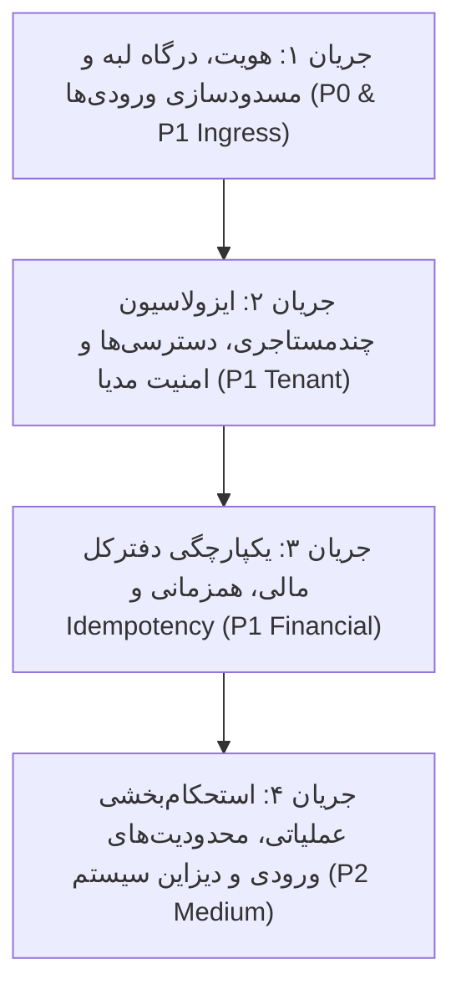

| فیلد / Field | مقدار / Value |
| :--- | :--- |
| **Title (EN)** | Platform Security Audit, Threat Catalog & Systematic Hardening Roadmap |
| **Title (FA)** | ممیزی امنیتی پلتفرم، کاتالوگ تهدیدات و برنامه جامع مقاوم‌سازی |
| **ID** | DOC-ARCH-010 |
| **Category** | `architecture` |
| **Status** | `Active` |
| **Owner** | Security, Core Architecture & DevOps Team / @behroz |
| **Last Updated** | 2026-10-03 |
| **Summary (EN)** | Exhaustive catalog and remediation blueprint for 22 platform security findings (2 P0, 13 P1, 7 P2) identified in the October 2026 security audit. Organizes vulnerabilities into four targeted hardening workstreams: Edge Ingress & Identity, Multi-Tenant Authorization & Assets, Financial Ledger Concurrency & Idempotency, and Operational Defense. |
| **Summary (FA)** | کاتالوگ تفصیلی و نقشه راه رفع ۲۲ یافته ممیزی امنیتی پلتفرم (۲ مورد P0، ۱۳ مورد P1 و ۷ مورد P2) شناسایی‌شده در ممیزی اکتبر ۲۰۲۶. سازماندهی آسیب‌پذیری‌ها در ۴ جریان کاری مقاوم‌سازی: درگاه لبه و هویت، ایزولاسیون و دسترسی چندمستاجری، همزمانی و دفترکل مالی، و دفاع عملیاتی. |
| **Tags** | `security`, `audit`, `vulnerabilities`, `hardening`, `idor`, `gateway`, `kratos`, `multi-tenancy`, `idempotency` |

---

# ممیزی امنیتی پلتفرم، کاتالوگ تهدیدات و برنامه جامع مقاوم‌سازی (DOC-ARCH-010)

## ۱. خلاصه مدیریتی و ارزیابی ریسک کلان

بر اساس گزارش رسمی ممیزی امنیتی بخش‌های فعال پلتفرم Lemmo مورخ ۲۰۲۶-۱۰-۰۳، نسخه فعلی پلتفرم **پیش از اعمال اصلاحات امنیتی بنیادین، برای ارائه عمومی با داده‌های واقعی آماده نیست**.

علت اصلی این وضعیت، وجود شکاف میان قراردادهای مصوب معماری (ADR-013, ADR-015, ADR-016) و پیاده‌سازی واقعی آن‌ها در کدهای موجود است. برخی مسیرها هنوز دارای رفتارهای شبیه‌سازی‌شده (Mock/Stub) دوره توسعه هستند که به اشتباه در Entrypointها و استک Compose فعال باقی مانده‌اند. همچنین جداسازی مستاجران (Tenants) صرفاً در سطح کوئری‌های SQL اعمال شده، در حالی که در لایه‌های بالاتر (API Gateway و gRPC)، هویت و شناسه تننت بدون اعتبارسنجی مستقل از ورودی کلاینت پذیرفته می‌شوند.

### ماتریس اولویت‌بندی یافته‌ها:
مجموعاً **۲۲ گروه یافته امنیتی** در سامانه شناسایی و دسته‌بندی شده است:
- **۲ مورد بحرانی (P0):** امکان جعل مستقیم هویت در مرز API و آسیب‌پذیری بحرانی IDOR در دسترسی به پروفایل کاربران.
- **۱۳ مورد با اولویت بالا (P1):** فقدان احراز هویت در gRPC، دورزدن RBAC ورک‌اسپیس با شناسه خالی، جعل امضای فایل‌های S3، افشای کلیدهای محرمانه پراویدرها، SSRF در ورکر تصویر، ابطال جعلی سشن، رفتار Fail-Open در گیت‌وی، عمومی بودن باکت‌های S3، باز بودن پورت‌های دیتابیس روی هاست، جعل نقش در داده‌های مرجع، مصرف ناقص دعوت‌نامه‌ها، و باگ‌های همزمانی در رزرو مالی.
- **۷ مورد با اولویت متوسط (P2):** دورزدن محدودیت حجم فایل، Open Redirect در صفحه ورود، کش نامعتبر توکن MCP، کرش ترانسپورت HTTP در MCP، نشت مقادیر حساس در لاگ Oathkeeper، تخصیص نامحدود رم در وب‌هوک تصویر، و القای کانتکست کاذب در قطعی سرور.

---

## ۲. چهار جریان کاری مقاوم‌سازی (Hardening Workstreams)

به منظور رفع هوشمندانه، اصولی و بدون شکست پلتفرم، کلیه ۲۲ یافته در ۴ فاز مهندسی مشخص گروه‌بندی شده‌اند:

---

## ۳. کاتالوگ تفصیلی یافته‌ها و مشخصات فنی رفع (Technical Threat Catalog)

### جریان ۱: امنیت هویت، درگاه لبه و پالایش ورودی‌ها (Ingress & Identity Hardening)

#### SEC-01 — [P0] جعل هویت در مرز API (Spoofable Identity in Whoami & Gateway)
* **ریشه فنی:** اندپوینت محلی `whoami` در `context-service` مقدار کوکی خام را به `userID:email` تبدیل کرده و حتی در غیاب کانتکست، وضعیت `active: true` صادر می‌کند. در `auth-service` اندپوینت `verify` کوکی سشن را با اتصال دستی دو رشته می‌سازد نه از Kratos. در درگاه Kong، پلاگین `lemmo-access-enforcer` صرفاً توکن JWT را Decode می‌کند بدون اینکه امضای دیجیتال، کلید عمومی، الگوریتم یا انقضای آن را با JWKS اعتبارسنجی کند.
* **اثر مخرب:** امکان جعل هویت هر کاربری با تزریق یک کوکی دست‌ساز یا ارسال هدر `X-User-ID`.
* **راهکار معماری:**
  1. جایگزینی `whoami` شبیه‌سازی‌شده با احراز هویت واقعی نشست از طریق Kratos Admin API.
  2. فعال‌سازی اعتبارسنجی رمزنگاری نامتقارن (RS256) با پلاگین بومی `jwt` در Kong بر روی کلید عمومی JWKS صادرشده توسط Oathkeeper.
  3. پالایش و حذف قطعی هدرهای `X-User-ID` و `X-Workspace-*` در لایه لبه قبل از رسیدن به سرویس‌ها.

#### SEC-02 — [P0] آسیب‌پذیری IDOR در پروفایل کاربران (`user-service`)
* **ریشه فنی:** در `user-service/internal/adapters/http/router.go`، مسیرهای `/profile`, `/preferences`, `/risk` شناسه `userID` را مستقیماً از پارامتر URL خوانده و متد سرویس را بدون مقایسه با کاربر احرازشده در هدر/کانتکست یا بررسی دسترسی Admin فراخوانی می‌کنند.
* **اثر مخرب:** هر کاربری با داشتن UUID سایر کاربران می‌تواند نام، تنظیمات و اطلاعات شخصی آن‌ها را بخواند یا ویرایش کند.
* **راهکار معماری:**
  1. اعمال میدل‌ور احراز هویت روی روت‌های HTTP سرویس کاربر.
  2. الزام انطباق `requestedUserID == context.CallerUserID` مگر اینکه کالر دارای نقش سیستمی یا ادمین پلتفرم باشد.
  3. تفکیک کامل DTO پاسخ‌های عمومی کاربر از مدل‌های حساس داخلی (مانند `user_risk_logs`).

#### SEC-08 — [P1] خروج غیرواقعی از حساب و مسدودسازی کاربر دیگر (`auth-service`)
* **ریشه فنی:** اندپوینت `/api/v1/auth/logout` شناسه کاربر را از بدنه یا هدر درخواست می‌گیرد و برچسب زمانی را در ردیس می‌نویسد، بدون اینکه ارتباطی با نشست فعال کالر داشته باشد و بدون اینکه نشست را در Ory Kratos ابطال کند.
* **اثر مخرب:** یک کاربر می‌تواند با ارسال شناسه کاربر دیگر در بدنه درخواست لاگ‌اوت، سشن او را مختل کند. همچنین سشن اصلی Kratos همچنان در سرور زنده می‌ماند.
* **راهکار معماری:**
  1. استخراج شناسه کاربر در خروج منحصراً از سشن تاییدشده کالر (نه از بدنه درخواست).
  2. فراخوانی API رسمی ابطال سشن کراتوس (`kratosClient.RevokeSession`).
  3. ثبت برچسب زمانی خروج در ردیس با TTL بیست دقیقه‌ای.

#### SEC-09 — [P1] رفتار Fail-Open در پلاگین کنترل دسترسی گیت‌وی (`lemmo-access-enforcer`)
* **ریشه فنی:** در `handler.lua`، در صورت قطع اتصال ردیس یا بروز ارور در پایپ‌لاین، خطا لاگ شده و درخواست عبور داده می‌شود (`return`). همچنین فال‌بک عمومی به `PERSONAL` بدون توجه به الزامی بودن ورک‌اسپیس انجام می‌شود.
* **اثر مخرب:** در زمان اختلال ردیس، تمامی مکانیزم‌های مسدودسازی کاربر معلق، لاگ‌اوت و تطابق نسخه عضویت از کار می‌افتند.
* **راهکار معماری (اجرای کامل ADR-016):**
  1. رفتار Fail-Closed قطعی: در غیاب کلید نسخه عضویت در ردیس یا قطعی ردیس، بازگرداندن خطای ۴۰۳ یا ۵۰۳.
  2. مسدودسازی درخواست‌های فاقد هدر در روت‌های `required` با وضعیت ۴۰۰/۴۰۳.

#### SEC-10 — [P1] عمومی بودن باکت‌های ذخیره‌سازی MinIO (`dev.yml`)
* **ریشه فنی:** فایل Compose دستور `mc anonymous set public myminio/lemmo-artifacts` و `lemmo-assets` را اجرا می‌کند.
* **اثر مخرب:** تمامی فایل‌های تولیدشده توسط هوش مصنوعی، پرامپت‌ها و تصاویر کاربران بدون نیاز به احراز هویت یا URL امضاشده توسط عموم قابل دانلود هستند.
* **راهکار معماری:**
  1. حذف دستور `mc anonymous set public` از کانتینر init داکر.
  2. بازگرداندن باکت‌ها به وضعیت پیش‌فرض خصوصی (`private`) و الزام دانلود انحصاری از طریق Presigned URL با TTL مشخص.

#### SEC-11 — [P1] انتشار مستقیم پورت‌های حساس دیتابیس روی هاست
* **ریشه فنی:** پورت‌های ۵۴۳۲ (PostgreSQL)، ۶۳۷۹ (Redis)، ۹۰۰۰/۹۰۰۱ (MinIO)، ۵۶۷۲/۱۵۶۷۲ (RabbitMQ)، ۴۴۳۳/۴۴۳۴ (Kratos) و ۸۰۲۵ (Mailpit) به صورت عمومی روی `0.0.0.0` هاست بایند شده‌اند.
* **اثر مخرب:** دسترسی مستقیم از بیرون به دیتابیس‌ها و سرویس‌های داخلی بدون عبور از فیلترهای گیت‌وی لبه.
* **راهکار معماری:**
  1. محدودسازی نگاشت پورت‌ها در Compose منحصراً به لوپ‌بک محلی (`127.0.0.1:port:port`).
  2. در محیط استیجینگ و سرور اصلی، عدم انتشار پورت‌های زیرساختی و نگهداری آن‌ها صرفاً داخل شبکه ایزوله داکر (`lemmo-backend`).

---

### جریان ۲: ایزولاسیون چندمستاجری و کنترل دسترسی سرویس‌ها (Multi-Tenancy & RPC)

#### SEC-03 — [P1] عدم احراز هویت سرویس-به-سرویس در gRPC و فال‌بک‌های Mock
* **ریشه فنی:** سرورهای gRPC در `workspace-service`، `quota-service`، `project-service` و ... فاقد Auth Interceptor هستند و در صورت نبود کانتکست، به صورت خودکار به هویت تستی ادمین (`MockAuth`) فال‌بک می‌کنند. هندلرها شناسه تننت ارسالی در پیام RPC را بر کانتکست ترجیح می‌دهند.
* **اثر مخرب:** هر کلاینتی در شبکه داخلی می‌تواند با معرفی خود به عنوان یک تننت دلخواه، منابع آن تننت را بخواند یا دستکاری کند.
* **راهکار معماری:**
  1. حذف کامل فال‌بک‌های ادمین/مالک تستی در محیط غیرتوسعه.
  2. پیاده‌سازی gRPC Server Interceptor جهت استخراج و تایید متادیتای هویت (`X-User-ID`, `X-Workspace-ID`).
  3. اعتبارسنجی تطابق تننت بدنه درخواست با تننت احرازشده در کانتکست.

#### SEC-04 — [P1] دورزدن مجوزهای ورک‌اسپیس با شناسه خالی (`workspace-service`)
* **ریشه فنی:** در متدهای `DeleteWorkspace` و `InviteMember`، اگر مقدار `callerID` خالی باشد، شرط بررسی مجوز دور زده می‌شود (`if callerID != ""`). همچنین آداپتور `LocalMembershipAdapter` به هدر `X-Mock-Roles` ارسالی اعتماد می‌کند.
* **اثر مخرب:** امکان حذف سازمان یا دعوت عضو با دسترسی ادمین از طریق ارسال فیلد خالی.
* **راهکار معماری:**
  1. ممنوعیت کالر خالی: اگر `callerID == ""` باشد، بازگرداندن خطای قطعی `401 Unauthorized` یا `400 Bad Request`.
  2. حذف پردازش `X-Mock-Roles` در حالت‌های عملیاتی و استعلام انحصاری نقش‌ها از دیتابیس عضویت‌ها.

#### SEC-05 — [P1] جعل مالکیت در امضای لینک‌های آپلود/دانلود (`storage-service`)
* **ریشه فنی:** متدهای `BatchSignAssetURLs` و `SignAssetURL` صرفاً با گرفتن `object_key` خام، URL دانلود امضا می‌کنند بدون اینکه در دیتابیس تطبیق دهند که آیا این شیء متعلق به تننت درخواست‌دهنده است یا خیر.
* **اثر مخرب:** کاربر تننت A با حدس زدن کلید فایل تننت B (`tenants/tenantB/assets/...`) می‌تواند لینک دانلود یا آپلود آن را از سرور دریافت کند.
* **راهکار معماری:**
  1. الزام انطباق پیش‌وند کلید فایل با شناسه تننت کالر (`tenants/{tenantID}/*`).
  2. استعلام رکورد فایل از جدول `stored_assets` و رد درخواست در صورت عدم تطابق مالکیت تننت.

#### SEC-06 — [P1] افشای کلیدهای API پراویدرها در خروجی مسیریابی (`model-router-service`)
* **ریشه فنی:** تابع `RouteModel` در پاسخ خود هدرهای تطبیق‌یافته (`AdaptedHeaders`) را برمی‌گرداند که شامل مقدار هدر `Authorization: Bearer <API_KEY>` است. همچنین ثبت `ProviderInstance` بدون کنترل دسترسی انجام می‌شود.
* **اثر مخرب:** نشت مستقیم کلیدهای مالی و دسترسی OpenAI / Fal.ai / Replicate به سرویس‌ها یا لاگ‌های پایین‌دست.
* **راهکار معماری:**
  1. حذف هدرهای احراز هویت بالادست از پاسخ‌های خروجی gRPC و تزریق آن‌ها صرفاً در لحظه ارسال فیزیکی به پراویدر توسط خود ورکر.
  2. تعریف Allowlist رسمی برای نام سکرت‌های مجاز محیطی.

#### SEC-07 — [P1] دورزدن امضای وب‌هوک و آسیب‌پذیری SSRF در ورکر تصویر (`image-service`)
* **ریشه فنی:** در `image-service`، اگر هدر امضای وب‌هوک ارسال نشود، بررسی امضا نادیده گرفته می‌شود. سپس آدرس دانلود تصویر موجود در بدنه وب‌هوک بدون هیچ فیلتری به کلاینت HTTP داده می‌شود تا فایل را دانلود کند.
* **اثر مخرب:** جعل نتیجه تسک‌های هوش مصنوعی با ارسال وب‌هوک بدون امضا، و ایجاد درخواست‌های جعلی شبکه به آدرس‌های داخلی، لوپ‌بک (`127.0.0.1`) یا متادیتای ابری (SSRF).
* **راهکار معماری:**
  1. اجباری بودن هدر امضای HMAC روی وب‌هوک‌ها و رد قطعی درخواست‌های فاقد امضا.
  2. پیاده‌سازی گارد SSRF روی کلاینت دانلود آرتیفکت: فیلتر کردن رنج‌های IP خصوصی (`10.0.0.0/8`, `172.16.0.0/12`, `192.168.0.0/16`, `127.0.0.0/8`, `169.254.169.254`)، بررسی IP پس از رزولوشن DNS، و منع ریدایرکت به مقاصد محلی.

#### SEC-12 — [P1] دستکاری داده‌های مرجع سراسری با نقش جعلی (`reference-data-registry`)
* **ریشه فنی:** هندلر HTTP مقادیر `actor` و `role` را از بدنه/هدر ورودی خوانده و به سرویس ارسال می‌کند و سرویس صرفاً پر بودن رشته را بررسی می‌کند.
* **اثر مخرب:** جعل نقش ادمین و تغییر لیست دامنه‌های ایمیل یکبارمصرف یا هندل‌های رزروشده.
* **راهکار معماری:** استخراج نقش و هویت صرفاً از توکن امنیتی تاییدشده گیت‌وی (`X-User-ID`, `X-User-Roles`).

#### SEC-13 — [P1] چرخه حیات ناقص و پذیرش دعوت‌نامه‌های ردشده (`workspace-service`)
* **ریشه فنی:** متد `AcceptInvitation` وضعیت `rejected` را رد نمی‌کند و آن را می‌پذیرد. همچنین ساخت عضویت و به‌روزرسانی وضعیت دعوت‌نامه در یک تراکنش اتمیک انجام نمی‌شود.
* **اثر مخرب:** امکان فعال‌سازی مجدد دعوت‌نامه‌های ردشده و اضافه شدن عضو غیرمجاز در صورت بروز مسابقه همزمانی (Race Condition).
* **راهکار معماری:**
  1. پذیرش انحصاری دعوت‌نامه‌های با وضعیت `PENDING`.
  2. اجرای تراکنش اتمیک DB: ثبت عضویت در `workspace_memberships` و تغییر وضعیت به `ACCEPTED` در یک Transaction واحد.
  3. تطبیق ایمیل دعوت‌شده با ایمیل کلیم‌شده کاربر فعلی.

---

### جریان ۳: همزمانی، دفترکل مالی و Idempotency (Financial Integrity)

#### SEC-14 — [P1] اشتراک سراسری کلیدهای Idempotency مالی میان مستاجران (`quota-service`)
* **ریشه فنی:** بررسی کلید یکتایی در `CheckAndReserveQuota` صرفاً بر روی خود رشته `idempotency_key` انجام می‌شود بدون اینکه شناسه `workspace_id` یا هش بدنه تراکنش در کلید ردیس/دیتابیس قید شود.
* **اثر مخرب:** تداخل کلیدهای انتخابی یا حدس زده‌شده می‌تواند باعث مشاهده اطلاعات مالی و رزرو اعتبار یک مستاجر توسط مستاجر دیگر شود.
* **راهکار معماری:**
  1. مقیدسازی کلید یکتایی به محدوده مستاجر: `lemmo:idempotency:{workspace_id}:{operation}:{key}`.
  2. ثبت هش SHA-256 بدنه تراکنش و بازگرداندن خطای `409 Conflict` در صورت یکسان بودن کلید اما تفاوت در پارامترها.

#### SEC-15 — [P1] عدم جبران شکست دیتابیس در رزرو اعتبار و تبدیل مقادیر منفی
* **ریشه فنی:** اگر در `quota-service` کسر از لجر انجام شود اما ذخیره رکورد در دیتابیس PostgreSQL شکست بخورد، خطا صرفاً لاگ شده و به کاربر پاسخ موفق داده می‌شود. همچنین مقادیر منفی برای اعتبار بدون ولیدیشن به `uint64` کست می‌شوند.
* **اثر مخرب:** انحراف موجودی دفترکل مالی با رکوردهای محلی دیتابیس، و ریسک محاسبات سرریز عدد صحیح (Integer Overflow).
* **راهکار معماری:**
  1. الگوی تراکنش جبرانی (Compensating Transaction): در صورت شکست ذخیره‌سازی در دیتابیس، فوراً دستور Void/Refund به موتور دفترکل مالی ارسال شود.
  2. اعتبارسنجی اکید ورودی‌های عددی: منع مقادیر منفی یا صفر برای اعتبارات قبل از ورود به لایه محاسبات.

---

### جریان ۴: استحکام‌بخشی عملیاتی، محدودیت‌های ورودی و دفاع عمومی (Operational Polish)

#### SEC-16 — [P2] اعتماد به اندازه اعلامی در آپلود فایل (`storage-service`)
* **اصلاح:** در متد `ConfirmUpload`، اندازه واقعی فایل منحصراً از متادیتای آبجکت ذخیره‌شده در MinIO استعلام شود و مقدار ارسالی کلاینت نادیده گرفته شود.

#### SEC-17 — [P2] آسیب‌پذیری Open Redirect در پارامتر `return_to` (`auth/`)
* **اصلاح:** اعتبارسنجی پارامتر `return_to` در سرور و کلاینت: مقصد باید منحصراً یک مسیر نسبی (`/path`) با پیش‌وند مجاز باشد و از پروتکل‌های خارجی، دامنه‌های ناشناس، یا طرح‌های `javascript:` جلوگیری شود.

#### SEC-18 و SEC-19 — [P2] چرخه حیات و ترانسپورت سرور MCP (`dotdive/mcp`)
* **اصلاح:** پیاده‌سازی ابطال کش توکن با نسخه فایل کانفیگ و جلوگیری از ثبت مجدد ابزارها روی نمونه سراسری سرور در درخواست‌های بعدی HTTP.

#### SEC-20 — [P2] ایمن‌سازی لاگ‌ها و کوکی‌ها (Hardening Oathkeeper & Cookies)
* **اصلاح:** غیرفعال‌سازی `leak_sensitive_values` در کانفیگ Oathkeeper، حذف لاگ‌های حاوی توکن، و تنظیم فلگ‌های `Secure; HttpOnly; SameSite=Lax` روی تمامی کوکی‌های احراز هویت.

#### SEC-21 — [P2] محدودیت حافظه در پردازش وب‌هوک و تصاویر (`image-service`)
* **اصلاح:** جایگزینی `io.ReadAll` با `http.MaxBytesReader` با سقف مشخص (مثلاً ۱۰ مگابایت) و استریم مستقیم تصویر به دیسک/MinIO جهت ممانعت از حملات DoS مبتنی بر فرسایش حافظه (OOM).

#### SEC-22 — [P2] تفکیک خطای زیرساخت در کانتکست (`context-service`)
* **اصلاح:** اجرای کامل مصوبه ADR-016؛ بازگرداندن خطای ۵۰۳ در زمان قطعی دیتابیس و منع بازگرداندن سهمیه‌ها یا لیست اعضای پیش‌فرض و جعلی.

---

## ۴. برنامه یکپارچه‌سازی و اولویت‌بندی در نقشه راه (Roadmap Integration)

برای جلوگیری از غافلگیری و اطمینان از سلامت محصول در زمان اتصال استودیو:

1. **گام فوری (Phase S1 — پیش‌نیاز گذر از Stage 12A):**
   - رفع کامل آسیب‌پذیری‌های P0 و P1 ورودی و هویت (SEC-01, SEC-02, SEC-08, SEC-09, SEC-10, SEC-11, SEC-22).
   - بدون این اصلاحات، اتصال کلاینت در استیج ۱۲B بر روی یک درگاه ناامن و شبیه‌سازی‌شده انجام خواهد شد.
2. **گام میانی (Phase S2 & S3 — پیش‌نیاز بسته شدن Stage 13 و عبور از Gate 6):**
   - اصلاح ایزولاسیون تننت و احراز هویت RPCها (SEC-03 تا SEC-07، SEC-12 تا SEC-15).
   - گیت کنترل کیفیت ۶ (Gate 6) منوط به پاس شدن کامل آزمون‌های نفوذ و انطباق این بخش‌ها خواهد بود.
3. **گام تکمیلی (Phase S4 — پیش‌نیاز فاز ۳ تجاری‌سازی):**
   - بهینه‌سازی‌های سقف حافظه، Open Redirect و ممیزی بسته‌های نرم‌افزاری (SEC-16 تا SEC-21).
