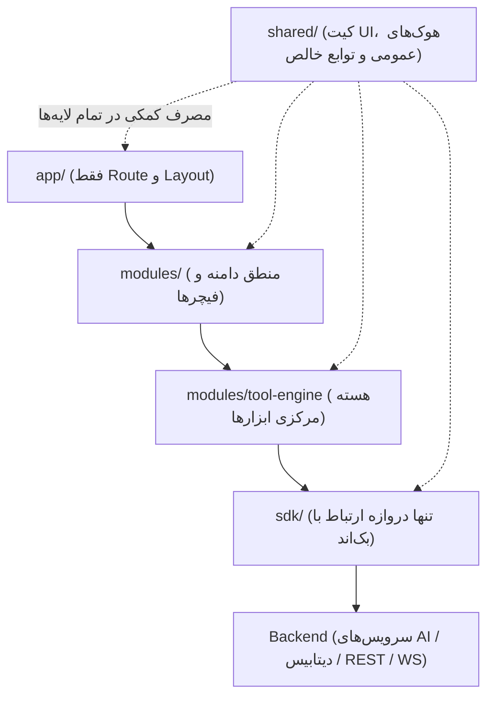

| فیلد / Field | مقدار / Value |
| :--- | :--- |
| **Title (EN)** | Workspace Frontend Architecture — Next.js |
| **Title (FA)** | معماری فرانت‌اند Workspace — Next.js |
| **ID** | DOC-FE-001 |
| **Category** | `frontend` |
| **Status** | `Active` |
| **Owner** | Frontend Team |
| **Last Updated** | 2026-09-16 |
| **Summary (EN)** | Finalized dependency rules, directory structure, and modular boundaries for the Lemmo Next.js workspace. |
| **Summary (FA)** | قوانین وابستگی، ساختار تفکیک پوشه‌ها و مرزهای ماژولار برنامه کاربردی لیمو با هدف تاب‌آوری حداکثری در برابر تغییر. |
| **Tags** | `frontend`, `nextjs`, `architecture`, `workspace`, `tool-engine`, `sdk` |

---

# معماری فرانت‌اند Workspace — Next.js

> **وضعیت سند:** نسخه نهایی و قفل‌شده (Approved & Locked).  
> **هدف کلیدی:** افزودن ابزار جدید، ایجاد سطوح نمایش متفاوت (چت، کانواس)، یا تغییر در بک‌اند نباید به هیچ عنوان این معماری را بشکند.

---

## ۱. اصول ثابت و قوانین وابستگی (Dependency Rules)

جهت وابستگی‌ها در پروژه همواره **یک‌طرفه و رو به پایین** است و هیچ‌گونه وابستگی چرخه‌ای یا پرش از لایه‌ها مجاز نیست:



### قوانین اساسی:
1. **`app/` فقط مسیر و layout است:** هیچ‌گونه منطق دامنه (Domain Logic) یا فراخوانی مستقیم API در این لایه مجاز نیست.
2. **`modules/tool-engine` تنها منبع حقیقت برای هر ابزار است:** ماژول‌های `chat` و `canvas` هر دو صرفاً مصرف‌کننده‌ی این لایه هستند و مالک منطق داخلی ابزارها نمی‌باشند.
3. **`sdk/` تنها نقطه‌ی تماس با بک‌اند است:** استفاده از هرگونه `fetch` یا `axios` در بخش‌های دیگر پروژه اکیداً ممنوع است.
4. **`shared/` هیچ دانشی از دامنه ندارد:** این پوشه فاقد دانش در مورد چت، کانواس یا ابزارهاست و صرفاً شامل کامپوننت‌های UI پایه، تایپ‌های عمومی و توابع کمکی است.

---

## ۲. ساختار تفصیلی پوشه‌ها (Directory Structure)

```
src/
├── app/                                  # Next.js App Router — فقط route و layout
│   ├── (workspace)/                      # گروه مسیر اصلی (نیاز به auth)
│   │   ├── layout.tsx                    # لایوت مشترک: سایدبار، هدر، نوار وضعیت Job
│   │   ├── chat/
│   │   │   ├── page.tsx                  # صفحه پیش‌فرض چت
│   │   │   └── [threadId]/page.tsx       # یک ترد مشخص
│   │   ├── canvas/
│   │   │   └── [boardId]/page.tsx        # یک بورد کانواس مشخص
│   │   ├── gallery/page.tsx              # گالری نمونه‌ها
│   │   ├── assets/page.tsx               # فایل‌های ذخیره/تولیدشده کاربر
│   │   ├── settings/
│   │   │   ├── page.tsx                  # تنظیمات حساب
│   │   │   └── billing/page.tsx          # پلن و توکن — مقصد ریدایرکت هنگام خطا
│   │   ├── loading.tsx
│   │   └── error.tsx
│   └── (auth)/                           # مسیرهای احراز هویت (در صورت نیاز داخل همین اپ)
│       ├── login/page.tsx
│       └── layout.tsx
│
├── modules/                              # منطق دامنه — مستقل از route، قابل تست جدا
│   │
│   ├── tool-engine/                      # هسته پلاگین ابزارها (مشترک بین چت و کانواس)
│   │   ├── registry/
│   │   │   ├── tool-registry.ts          # لود، کش و جستجوی manifest هر ابزار
│   │   │   └── types.ts                  # ToolManifest, ToolInput, ToolOutput
│   │   ├── schema-renderer/
│   │   │   ├── FieldRenderer.tsx         # نگاشت نوع فیلد schema به کامپوننت UI
│   │   │   └── fields/                   # ImageField.tsx, SliderField.tsx, TextField.tsx ...
│   │   ├── job-manager/
│   │   │   ├── job-store.ts              # store وضعیت job (pending/processing/done/error)
│   │   │   └── useJobSubscription.ts     # اتصال WebSocket/SSE برای وضعیت لحظه‌ای
│   │   └── plugin-loader/
│   │       └── loadCustomPlugin.ts       # فاز بعدی: لود پلاگین کدنویسی‌شده (sandbox شده)
│   │
│   ├── chat/
│   │   ├── components/
│   │   │   ├── ChatWindow.tsx
│   │   │   ├── MessageBubble.tsx
│   │   │   └── CommandAutocomplete.tsx   # پیشنهاد کامند هنگام تایپ "/"
│   │   ├── command-parser/
│   │   │   └── parseCommand.ts           # تشخیص /remove-bg و نگاشت به tool-engine
│   │   └── hooks/
│   │       └── useChatThread.ts
│   │
│   ├── canvas/
│   │   ├── components/
│   │   │   ├── CanvasBoard.tsx           # سطح اصلی کانواس (React Flow یا مشابه)
│   │   │   ├── ToolNode.tsx              # نود عمومی — از همان schema ابزار ساخته می‌شود
│   │   │   └── NodeDiscoveryMenu.tsx     # منوی کشف/افزودن ابزار به کانواس
│   │   ├── edges/
│   │   │   └── typedConnection.ts        # قانون اتصال سوکت‌ها بر اساس نوع (image→image)
│   │   └── hooks/
│   │       └── useCanvasGraph.ts
│   │
│   ├── gallery/
│   │   ├── components/GalleryGrid.tsx
│   │   └── hooks/useGalleryItems.ts      # TanStack Query روی sdk.gallery.list
│   │
│   ├── assets/
│   │   ├── components/AssetGrid.tsx
│   │   └── hooks/useAssets.ts
│   │
│   └── billing/
│   │   ├── components/PlanCard.tsx
│   │   └── hooks/useTokenBalance.ts
│   │
├── sdk/                                   # تنها دروازه ارتباط با بک‌اند
│   ├── client.ts                          # پیکربندی پایه، هدر auth
│   ├── generated/                         # کد auto-generate از OpenAPI/tRPC (لمس دستی ممنوع)
│   ├── tools.ts                           # sdk.tools.removeBg(), sdk.tools.upscale() ...
│   ├── chat.ts
│   ├── assets.ts
│   ├── gallery.ts
│   ├── billing.ts
│   └── interceptors/
│       └── tokenErrorInterceptor.ts      # گرفتن خطای INSUFFICIENT_TOKENS و اطلاع سراسری
│
├── shared/                                # عمومی، بدون دانش دامنه
│   ├── ui/                                # دکمه، اینپوت، مودال (design system)
│   ├── hooks/                             # useDebounce, useMediaQuery ...
│   ├── lib/                               # توابع خالص کمکی (formatDate, cn ...)
│   └── types/                             # تایپ‌های مشترک کل پروژه
│
└── stores/                                # state سراسری غیر از job-manager (در صورت نیاز)
    └── uiStore.ts                         # مثلاً وضعیت سایدبار، تم
```

---

## ۳. دلایل تاب‌آوری این معماری در برابر تغییر (Resilience)

این تفکیک دقیق لایه‌ها مزایای مهندسی زیر را تضمین می‌کند:

- **افزودن ابزار جدید:** فقط نیازمند یک مدخل جدید در `tool-registry` و یک فایل manifest است، بدون نیاز به دست‌زدن به کدهای `chat` یا `canvas`.
- **تغییر سرویس بک‌اند:** در صورتی که ارائه‌دهنده سرویس هوش مصنوعی عوض شود یا پروتکل بک‌اند از REST به GraphQL تغییر یابد، فقط پوشه `sdk/generated` و توابع فایل‌های `sdk/*.ts` به‌روزرسانی می‌شوند؛ هیچ کامپوننت یا ماژولی در فرانت‌اند دستکاری نمی‌شود.
- **افزودن سطح نمایش جدید (Surface):** برای اضافه کردن اپ موبایل یا ویجت تعبیه‌شده (Embeddable Widget)، تنها یک مصرف‌کننده جدید برای `tool-engine` توسعه داده می‌شود و منطق اجرای ابزارها تکرار نخواهد شد.
- **تغییر هویت و دیزاین بصری:** تغییرات بصری در سطح `shared/ui` محدود می‌ماند و هیچ وابستگی به منطق بیزینس ماژول‌ها نخواهد داشت.

---

## ۴. اسناد مرتبط
- [تصمیمات کلیدی معماری و سیستم پلاگین ابزارها (DOC-FE-002)](./workspace-decisions.md)
- [راهنمای جامع مستندات فرانت‌اند](./README.md)
- [قوانین مرزهای کد و راهنمای ایجنت‌ها (DOC-ARCH-001)](../architecture/AGENTS.md)
- [نمای کلی ماژول‌های دامنه برنامه (DOC-MOD-000)](../modules/README.md)
