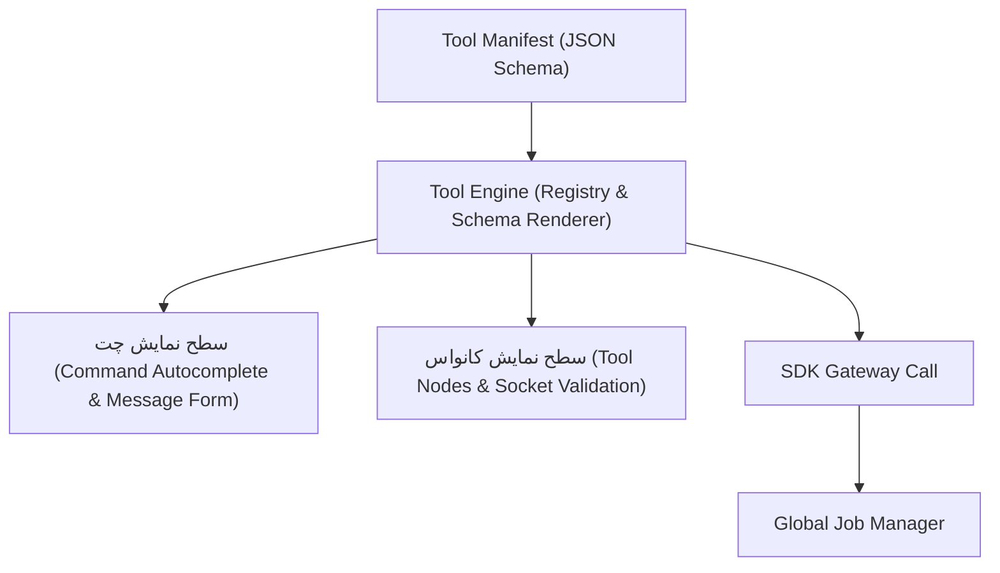
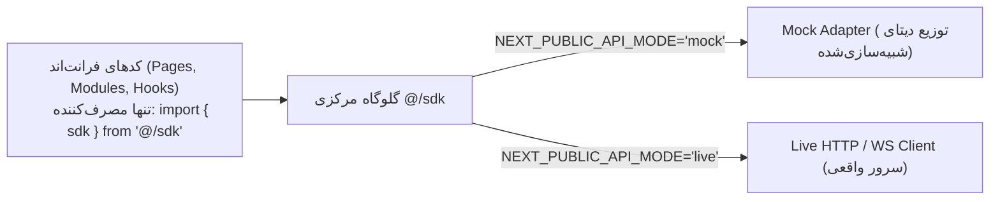

| فیلد / Field | مقدار / Value |
| :--- | :--- |
| **Title (EN)** | Workspace Architectural Decisions: Plugin System, SDK Gateway & Job Manager |
| **Title (FA)** | تصمیمات کلیدی معماری Workspace: سیستم ابزار پلاگین‌محور، لایه SDK و مدیریت Job |
| **ID** | DOC-FE-002 |
| **Category** | `frontend` |
| **Status** | `Active` |
| **Owner** | Frontend Team |
| **Last Updated** | 2026-09-16 |
| **Summary (EN)** | Detailed architectural decisions for the Lemmo Workspace covering schema-driven tool plugins, central SDK gateway, and global AI job management. |
| **Summary (FA)** | تشریح سه تصمیم بنیادین معماری برنامه لیمو شامل ساختار پلاگین‌محور ابزارها، درگاه یکپارچه SDK با رهگیری خطا و مدیریت وضعیت پردازش‌های غیرهمگام هوش مصنوعی. |
| **Tags** | `frontend`, `architecture`, `plugin-system`, `schema-driven`, `sdk`, `job-manager`, `ai` |

---

# تصمیمات کلیدی معماری Workspace (برنامه کاربردی)

با تفکیک کامل پروژه‌های لندینگ و مستندات، تمرکز اصلی این سند بر معماری فنی و مهندسی **برنامه کاربردی (Workspace)** استوار است.

سه تصمیم کلیدی، شالوده این معماری را تشکیل می‌دهند:
1. سیستم ابزار باید **پلاگین‌محور (Plugin-based)** باشد.
2. ارتباط با بک‌اند باید منحصراً از **یک گیت‌وی واحد (SDK)** عبور کند.
3. چت و کانواس دو **سطح نمایش متفاوت (Surfaces)** برای یک منطق ابزار مشترک هستند، نه دو پیاده‌سازی مستقل.

---

## ۱. سیستم ابزار — قلب معماری (Plugin Architecture)

> **قاعده اساسی:** چت و کانواس نباید هر کدام منطق و کدنویسی جداگانه‌ای برای هر ابزار داشته باشند؛ بلکه هر دو سطح باید از یک منبع واحد به نام **مانیفست ابزار (Tool Manifest)** تغذیه شوند.



### مقایسه دو رویکرد پلاگین و راهکار ترکیبی

| رویکرد | توضیح | مزایا | چالش‌ها / معایب |
| :--- | :--- | :--- | :--- |
| **Schema-driven** (مانند فرم‌ساز) | ابزار صرفاً یک JSON Schema (نوع ورودی‌ها: تصویر، متن، عدد، اسلایدر و ...) ارسال می‌کند و UI به صورت خودکار از روی آن رندر می‌شود. | افزودن ابزار جدید = فقط یک فایل JSON، بدون نیاز به بیلد یا دیپلوی مجدد فرانت‌اند. | برای رابط‌های کاربری بسیار خاص و سفارشی محدودیت دارد. |
| **Code Plugin** (مانند پلاگین فیگما) | کد واقعی مستقل (با Module Federation یا Dynamic Import) بارگذاری شده و کنترل کامل بر UI را در دست دارد. | انعطاف‌پذیری ۱۰۰٪ و بستری ایده‌آل برای توسعه‌دهندگان ثالث (Third-party). | پیچیدگی بالا، نیاز به محیط ایزوله امنیتی (Sandbox/Iframe)، پایپ‌لاین دیپلوی جداگانه. |

**استراتژی اجرایی لیمو:**
شروع با رویکرد **Schema-driven به عنوان مسیر پیش‌فرض** برای اکثر ابزارهای هوش مصنوعی (به دلیل الگوی مشخص «چند ورودی مشخص $\rightarrow$ یک خروجی پردازش‌شده»). این الگو مشابه پلتفرم‌های موفق نظیر **ComfyUI** (نودهای سفارشی با اسکیما) است. ساختار برای فازهای بعدی به گونه‌ای طراحی شده که قابلیت ارتقا به Code Plugin را دارا باشد.

### نمونه ساختار مانیفست ابزار (Tool Manifest Specification)

```json
{
  "id": "remove-bg",
  "command": "/remove-bg",
  "displayName": "حذف بک‌گراند",
  "surfaces": ["chat", "canvas"],
  "renderer": "schema",
  "inputs": [
    { "name": "image", "type": "image", "required": true }
  ],
  "outputs": [
    { "name": "image", "type": "image" }
  ],
  "endpoint": "tools.removeBg"
}
```

با این ساختار استاندارد:
- پارسر کامند در چت (`/remove-bg`) فرم ورودی را می‌شناسد.
- نودهای گراف در کانواس ورودی و خروجی را استخراج کرده و **اتصال معتبر سوکت‌ها** (فقط اتصال `image` به `image`) را بدون کدنویسی مازاد اعتبارسنجی می‌کنند.

---

## ۲. لایه SDK — تک‌نقطه ارتباط با بک‌اند

فرانت‌اند هیچ‌گونه دانشی پیرامون آدرس مستقیم اندپوینت‌ها، پورت‌ها یا جزئیات پیاده‌سازی سرور نخواهد داشت:

- **پکیج متمرکز `@/sdk`:** صرفاً توابع کاملاً تایپ‌شده (Type-safe) را اکسپورت می‌کند:
  ```typescript
  await sdk.tools.removeBg(input);
  await sdk.chat.sendMessage(threadId, payload);
  await sdk.assets.list({ filter: 'image' });
  ```
- **تولید خودکار کد (Code Generation):** کدهای ارتباطی مستقیماً از OpenAPI یا tRPC با ابزارهایی نظیر `openapi-typescript` یا `orval` تولید می‌شوند (`sdk/generated/`) و دستکاری دستی آن‌ها ممنوع است.
- **عدم پراکندگی کدهای شبکه:** هیچ فراخوانی `fetch` یا `axios` در کامپوننت‌های فرانت‌اند مجاز نیست؛ تمامی درخواست‌ها از SDK عبور می‌کنند.
- **مسئولیت‌های لایه SDK:** مدیریت احراز هویت (Auth Headers)، مکانیزم Retry هوشمند، نرمال‌سازی خطاها و مدیریت استریم‌های لحظه‌ای (WebSocket / Server-Sent Events).
- **مدیریت خطای توکن و اعتبارات (Token/Plan Interceptor):**
  یک رهگیر سراسری در کلاینت SDK هنگام مواجهه با خطای `INSUFFICIENT_TOKENS`، پیامی به سیستم هدایت ارسال کرده و کاربر را به مسیر `/settings/billing` هدایت می‌کند. بدین ترتیب هیچ‌کدام از ابزارها و ماژول‌ها درگیر منطق مالی و اعتبارسنجی توکن نمی‌شوند.

### ۲.۱. سیاست مهاجرت تک‌نقطه‌ای از Mock به API واقعی (Zero-Leakage Mock Architecture)

> **قانون طلایی عدم نشت (Zero-Leakage Rule):**  
> هیچ صفحه، کامپوننت یا ماژولی در فرانت‌اند نباید هیچ‌گونه اطلاعی از وجود داده‌های مصنوعی (Mock) داشته باشد. هیچ کدی در برنامه مجاز به ایمپورت مستقیم از پوشه‌های ساختگی یا mock نیست.

تمامی کامپوننت‌ها منحصراً توابع تایپ‌شده را از `@/sdk` فراخوانی می‌کنند (`sdk.tools.generateImage(...)`). اینترفیس این توابع (`SdkClient`) چه در حالت داده‌های ساختگی و چه در حالت اتصال به سرور واقعی **دقیقاً یکسان** است:



**مزایای این استاندارد معماری:**
1. **کوچ با یک تغییر (Single-Switch Migration):** مهاجرت از فاز توسعه فرانت‌اند (Mock) به فاز اتصال سرور (Live API) تنها با تغییر یک متغیر محیطی (`NEXT_PUBLIC_API_MODE="live"`) در فایل `.env` یا تغییر یک خط کد در اکسپورت `src/sdk/index.ts` امکان‌پذیر است.
2. **هزینه تغییر صفر:** حتی یک خط از کدهای صفحات، هوک‌ها، و فرم‌های تولیدشده با اسکیما نیازی به بازنویسی یا ریفکتور نخواهد داشت.
3. **پایداری تست‌ها:** تست‌های رابط کاربری و عملکردی در آینده نیز می‌توانند با سوئیچ به حالت `mock` بدون نیاز به روشن بودن سرور بک‌اند اجرا شوند.

---

## ۳. مدیریت وضعیت پردازش‌های ابری (AI Job Manager)

با توجه به ماهیت غیرهمگام (Asynchronous) و زمان‌بر بودن پردازش‌های تولید تصویر و ویدیو در مدل‌های هوش مصنوعی، مدیریت وضعیت به صورت متمرکز پیاده‌سازی می‌شود:

- **استور سراسری وضعیت Job:** یک استور سبک (Zustand) که وضعیت تمامی درخواست‌های در حال پردازش را نگه می‌دارد:
  $$\text{pending} \longrightarrow \text{processing} \longrightarrow \text{done} \mid \text{error}$$
- **ارتباط چندگانه بدون کوپلینگ:** چت، کانواس و کتابخانه Assets همگی صرفاً با گوش‌دادن به `jobId` در این استور به‌روز می‌شوند. به عنوان مثال، ابزاری که از داخل کانواس اجرا می‌شود، خروجی نهایی‌اش مستقیماً و همزمان در گالری Assets قابل نمایش است بدون اینکه کانواس نیازی به برقراری ارتباط مستقیم با Assets داشته باشد.
- **مدیریت کش سرور:** برای داده‌های پایدار سمت سرور (گالری عمومی، لیست فایل‌ها، اطلاعات اکانت)، از **TanStack Query** استفاده می‌شود تا چرخه‌های کش، Invalidation خودکار و Re-fetching به بهترین شکل ممکن انجام شوند.

---

## ۴. جمع‌بندی تصمیم‌های کلیدی

```
┌────────────────────────────────────────────────────────────────────────┐
│                        خلاصه تصمیمات معماری Workspace                  │
├────────────────────────────────────────────────────────────────────────┤
│ 1. ابزارها = مانیفست Schema-driven (با امکان توسعه Code-plugin)        │
│ 2. یک منبع حقیقت ابزار، دو سطح مصرف‌کننده (Chat + Canvas)             │
│ 3. لایه SDK تنها دروازه ارتباط با بک‌اند (تایپ‌شده و بدون fetch پراکنده)│
│ 4. Job Manager سراسری جهت همگام‌سازی بلادرنگ خروجی‌های AI            │
│ 5. مدیریت و رهگیری خطای توکن در سطح SDK Interceptor                    │
└────────────────────────────────────────────────────────────────────────┘
```

---

## ۵. اسناد مرتبط
- [معماری فرانت‌اند Workspace — ساختار پوشه‌ها و قوانین وابستگی (DOC-FE-001)](./workspace-architecture.md)
- [نمایه و راهنمای فرانت‌اند مهندسی](./index.md)
- [سند مدل معماری سیستم و قوانین ایجنت‌ها](../01-architecture/AGENTS.md)
