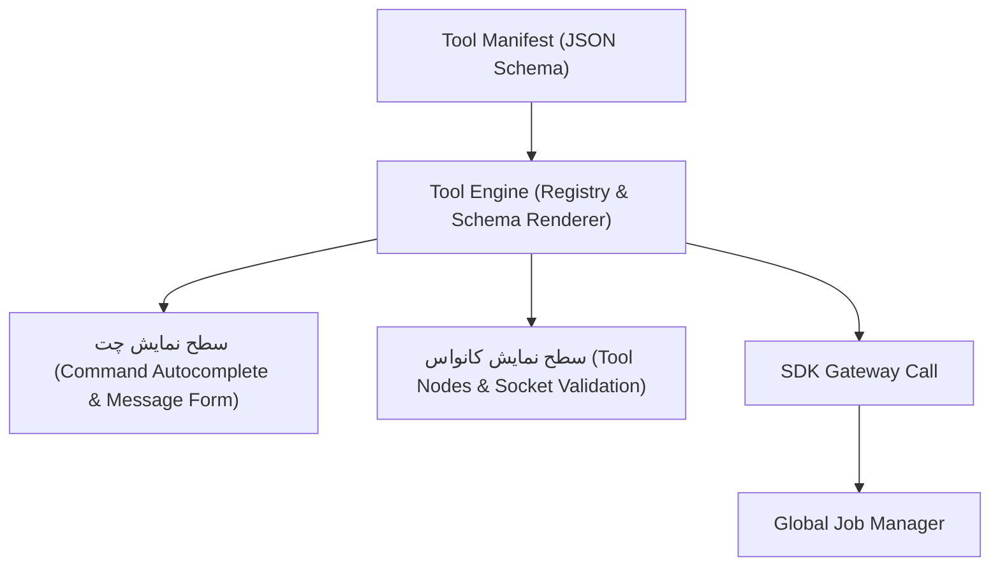
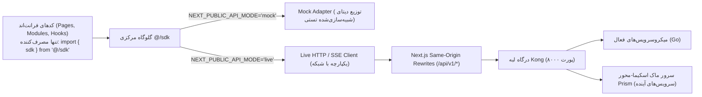

| فیلد / Field | مقدار / Value |
| :--- | :--- |
| **Title (EN)** | Workspace Architectural Decisions: Plugin System, SDK Gateway & Job Manager |
| **Title (FA)** | تصمیمات کلیدی معماری Workspace: سیستم ابزار پلاگین‌محور، لایه SDK و مدیریت Job |
| **ID** | DOC-FE-002 |
| **Category** | `frontend` |
| **Status** | `Active` |
| **Owner** | Frontend Team |
| **Last Updated** | 2026-09-16 |
| **Summary (EN)** | Detailed architectural decisions for the Lemmo Workspace covering schema-driven tool plugins, central SDK gateway, and global AI job management. |
| **Summary (FA)** | تشریح سه تصمیم بنیادین معماری برنامه لیمو شامل ساختار پلاگین‌محور ابزارها، درگاه یکپارچه SDK با رهگیری خطا و مدیریت وضعیت پردازش‌های غیرهمگام هوش مصنوعی. |
| **Tags** | `frontend`, `architecture`, `plugin-system`, `schema-driven`, `sdk`, `job-manager`, `ai` |

---

# تصمیمات کلیدی معماری Workspace (برنامه کاربردی)

با تفکیک کامل پروژه‌های لندینگ و مستندات، تمرکز اصلی این سند بر معماری فنی و مهندسی **برنامه کاربردی (Workspace)** استوار است.

سه تصمیم کلیدی، شالوده این معماری را تشکیل می‌دهند:
1. سیستم ابزار باید **پلاگین‌محور (Plugin-based)** باشد.
2. ارتباط با بک‌اند باید منحصراً از **یک گیت‌وی واحد (SDK)** عبور کند.
3. چت و کانواس دو **سطح نمایش متفاوت (Surfaces)** برای یک منطق ابزار مشترک هستند، نه دو پیاده‌سازی مستقل.

---

## ۱. سیستم ابزار — قلب معماری (Plugin Architecture)

> **قاعده اساسی:** چت و کانواس نباید هر کدام منطق و کدنویسی جداگانه‌ای برای هر ابزار داشته باشند؛ بلکه هر دو سطح باید از یک منبع واحد به نام **مانیفست ابزار (Tool Manifest)** تغذیه شوند.


```mermaid
flowchart TD
    TM["Tool Manifest (JSON Schema)"] --> Engine["Tool Engine (Registry & Schema Renderer)"]
    Engine --> SurfaceChat["سطح نمایش چت (Command Autocomplete & Message Form)"]
    Engine --> SurfaceCanvas["سطح نمایش کانواس (Tool Nodes & Socket Validation)"]
    Engine --> SDK["SDK Gateway Call"]
    SDK --> JobManager["Global Job Manager"]
```

### مقایسه دو رویکرد پلاگین و راهکار ترکیبی

| رویکرد | توضیح | مزایا | چالش‌ها / معایب |
| :--- | :--- | :--- | :--- |
| **Schema-driven** (مانند فرم‌ساز) | ابزار صرفاً یک JSON Schema (نوع ورودی‌ها: تصویر، متن، عدد، اسلایدر و ...) ارسال می‌کند و UI به صورت خودکار از روی آن رندر می‌شود. | افزودن ابزار جدید = فقط یک فایل JSON، بدون نیاز به بیلد یا دیپلوی مجدد فرانت‌اند. | برای رابط‌های کاربری بسیار خاص و سفارشی محدودیت دارد. |
| **Code Plugin** (مانند پلاگین فیگما) | کد واقعی مستقل (با Module Federation یا Dynamic Import) بارگذاری شده و کنترل کامل بر UI را در دست دارد. | انعطاف‌پذیری ۱۰۰٪ و بستری ایده‌آل برای توسعه‌دهندگان ثالث (Third-party). | پیچیدگی بالا، نیاز به محیط ایزوله امنیتی (Sandbox/Iframe)، پایپ‌لاین دیپلوی جداگانه. |

**استراتژی اجرایی لیمو:**
شروع با رویکرد **Schema-driven به عنوان مسیر پیش‌فرض** برای اکثر ابزارهای هوش مصنوعی (به دلیل الگوی مشخص «چند ورودی مشخص $\rightarrow$ یک خروجی پردازش‌شده»). این الگو مشابه پلتفرم‌های موفق نظیر **ComfyUI** (نودهای سفارشی با اسکیما) است. ساختار برای فازهای بعدی به گونه‌ای طراحی شده که قابلیت ارتقا به Code Plugin را دارا باشد.

### نمونه ساختار مانیفست ابزار (Tool Manifest Specification)

```json
{
  "id": "remove-bg",
  "command": "/remove-bg",
  "displayName": "حذف بک‌گراند",
  "surfaces": ["chat", "canvas"],
  "renderer": "schema",
  "inputs": [
    { "name": "image", "type": "image", "required": true }
  ],
  "outputs": [
    { "name": "image", "type": "image" }
  ],
  "endpoint": "tools.removeBg"
}
```

با این ساختار استاندارد:
- پارسر کامند در چت (`/remove-bg`) فرم ورودی را می‌شناسد.
- نودهای گراف در کانواس ورودی و خروجی را استخراج کرده و **اتصال معتبر سوکت‌ها** (فقط اتصال `image` به `image`) را بدون کدنویسی مازاد اعتبارسنجی می‌کنند.

---

## ۲. لایه SDK — تک‌نقطه ارتباط با بک‌اند

فرانت‌اند هیچ‌گونه دانشی پیرامون آدرس مستقیم اندپوینت‌ها، پورت‌ها یا جزئیات پیاده‌سازی سرور نخواهد داشت:

- **پکیج متمرکز `@/sdk`:** صرفاً توابع کاملاً تایپ‌شده (Type-safe) را اکسپورت می‌کند:
  ```typescript
  await sdk.tools.removeBg(input);
  await sdk.chat.sendMessage(threadId, payload);
  await sdk.assets.list({ filter: 'image' });
  ```
- **تولید خودکار کد (Code Generation):** کدهای ارتباطی مستقیماً از OpenAPI یا tRPC با ابزارهایی نظیر `openapi-typescript` یا `orval` تولید می‌شوند (`sdk/generated/`) و دستکاری دستی آن‌ها ممنوع است.
- **عدم پراکندگی کدهای شبکه:** هیچ فراخوانی `fetch` یا `axios` در کامپوننت‌های فرانت‌اند مجاز نیست؛ تمامی درخواست‌ها از SDK عبور می‌کنند.
- **مسئولیت‌های لایه SDK:** مدیریت احراز هویت (Auth Headers)، مکانیزم Retry هوشمند، نرمال‌سازی خطاها و مدیریت استریم‌های لحظه‌ای (WebSocket / Server-Sent Events).
- **مدیریت خطای توکن و اعتبارات (Token/Plan Interceptor):**
  یک رهگیر سراسری در کلاینت SDK هنگام مواجهه با خطای `INSUFFICIENT_TOKENS`، پیامی به سیستم هدایت ارسال کرده و کاربر را به مسیر `/settings/billing` هدایت می‌کند. بدین ترتیب هیچ‌کدام از ابزارها و ماژول‌ها درگیر منطق مالی و اعتبارسنجی توکن نمی‌شوند.

### ۲.۱. سیاست مهاجرت تک‌نقطه‌ای از Mock به API واقعی (Zero-Leakage Mock Architecture)

> **قانون طلایی عدم نشت (Zero-Leakage Rule):**  
> هیچ صفحه، کامپوننت یا ماژولی در فرانت‌اند نباید هیچ‌گونه اطلاعی از وجود داده‌های مصنوعی (Mock) داشته باشد. هیچ کدی در برنامه مجاز به ایمپورت مستقیم از پوشه‌های ساختگی یا mock نیست.

تمامی کامپوننت‌ها منحصراً توابع تایپ‌شده را از `@/sdk` فراخوانی می‌کنند (`sdk.projects.list(...)`). اینترفیس این توابع (`SdkClient`) چه در حالت داده‌های ساختگی و چه در حالت اتصال به سرور واقعی **دقیقاً یکسان** است:


```mermaid
flowchart LR
    AppCode["کدهای فرانت‌اند (Pages, Modules, Hooks)
    تنها مصرف‌کننده: import { sdk } from '@/sdk'"] --> Gateway["گلوگاه مرکزی @/sdk"]
    
    Gateway -->|NEXT_PUBLIC_API_MODE='mock'| MockAdapter["Mock Adapter (توزیع دیتای شبیه‌سازی‌شده تستی)"]
    Gateway -->|NEXT_PUBLIC_API_MODE='live'| LiveAdapter["Live HTTP / SSE Client (یکپارچه با شبکه)"]
    LiveAdapter --> NextProxy["Next.js Same-Origin Rewrites (/api/v1/*)"]
    NextProxy --> EdgeGateway["درگاه لبه Kong (پورت ۸۰۰۰)"]
    EdgeGateway --> RealServices["میکروسرویس‌های فعال (Go)"]
    EdgeGateway --> PrismMock["سرور ماک اسکیما-محور Prism (سرویس‌های آینده)"]
```

**مزایای این استاندارد معماری:**
1. **کوچ با یک تغییر (Single-Switch Migration):** مهاجرت از فاز توسعه فرانت‌اند (Mock) به فاز اتصال سرور (Live API) تنها با تغییر یک متغیر محیطی (`NEXT_PUBLIC_API_MODE="live"`) در فایل `.env` یا تغییر یک خط کد در اکسپورت `src/sdk/index.ts` امکان‌پذیر است.
2. **استراتژی صفر-ماک در کلاینت (Zero-Mock in Frontend — مصوب OQ-036):** در حالت `live`، کدهای `live-adapter.ts` و کلاینت استودیو دارای یک پیاده‌سازی واحد و بدون انشعاب هستند و همیشه به اندپوینت واقعی درخواست می‌زنند. برای سرویس‌هایی که بک‌اند آن‌ها هنوز آماده نیست (`tools`, `chat`)، سرور ماک **Stoplight Prism** مستقیماً از روی فایل OpenAPI در داکر اجرا شده و گیت‌وی Kong ترافیک را به آن می‌فرستد. کلاینت هیچ کدی برای تشخیص ماک ندارد و تغییر به سرویس واقعی صرفاً یک تغییر upstream در `kong.yml` خواهد بود.
3. **پایداری تست‌ها:** تست‌های رابط کاربری و عملکردی در آینده نیز می‌توانند با سوئیچ به حالت `mock` بدون نیاز به روشن بودن سرور بک‌اند اجرا شوند.

### ۲.۲. معماری کلاینت زنده با Orval پشت مرز پایدار SDK (نتایج OQ-027 و OQ-035)

بر اساس تصمیمات مصوب OQ-027 و OQ-035 و استانداردهای حاکمیتی:
1. **استقلال کامل لایه‌های UI از مولد کلاینت:** اینترفیس `SdkClient` و تایپ‌های عمومی دامنه در `app/src/sdk/types.ts`، قراردادهای مستقل و دائمی فرانت‌اند هستند. هیچ کامپوننت، استور Zustand یا هوک React مجاز به ایمپورت، ارث‌بری یا اکسپورت مجدد کدهای تولیدشده توسط Orval نیست.
2. **محصور بودن کد تولیدی در مرز مشخص:** خروجی ابزار Orval منحصراً در پوشه ایزوله `app/src/sdk/live/generated/` نگهداری می‌شود. ویرایش دستی این فایل‌ها ممنوع بوده و هرگونه دسترسی به آن از خارج از لایه پیاده‌سازی داخلی SDK با قواعد لینت مسدود می‌گردد.
3. **آداپتور زنده به عنوان مرز تطبیق (`live-adapter.ts`):** کلاس یا شیء آداپتور زنده اینترفیس `SdkClient` را با استفاده از کلاینت تولیدشده پیاده‌سازی می‌کند. کلیه تبدیل‌ها (تبدیل مدل شبکه، صفحه‌بندی، تاریخ‌ها، و نرمال‌سازی خطاهای RFC 7807) منحصراً در همین لایه تطبیق داده می‌شوند.
4. **تولید کلاینت Fetch بدون ایجاد هوک‌های React:** Orval صرفاً برای تولید توابع درخواست Fetch خالص استفاده می‌شود (`custom: '@/sdk/live/transport'`). لایه مصرف‌کننده UI منحصراً از TanStack Query و توابع استاندارد SDK استفاده می‌نماید.
5. **مصرف مونو-اسپک با نسخه پین‌شده (OQ-035):** ورودی ابزار Orval در `orval.config.ts` به یک نسخه پین‌شده تغییرناپذیر (Commit SHA یا تگ پایدار) ارجاع می‌دهد تا پایداری و تکرارپذیری بیلد تضمین شود.

### ۲.۳. حاکمیت شبکه، ترانسپورت و ایزولاسیون چهارلایه کش (ADR-016 و OQ-034 تا OQ-038)

بر اساس سند حاکمیتی [ADR-016](../01-architecture/decisions/ADR-016-request-context-governance-and-workspace-policy.md) و مصوبات تکمیلی:
1. **معماری شبکه Same-Origin با پروکسی Next.js (مصوب OQ-034):**
   - در `next.config.ts`، تمامی مسیرهای `/api/v1/:path*` در سمت سرور به درگاه گیت‌وی لبه هدایت می‌شوند (`http://localhost:8000/api/v1/:path*` در محیط محلی و آدرس داخلی کانتینر در پروداکشن).
   - کلیه درخواست‌های مرورگر به صورت کاملاً Same-Origin ارسال شده و هیچ‌گونه چالش ارسال کوکی‌های `HttpOnly` میان پورت‌های مختلف یا تاخیر Preflight نخواهیم داشت.
   - مسیرهای استریم زنده (`/api/v1/jobs/:jobId/events`) موظف به عبور بدون بافرینگ در پروکسی Next.js هستند.
2. **پالایش هدر خام در ترانسپورت (Transport Header Sanitization):** لایه ترانسپورت پایه شبکه در `@/sdk/live/transport.ts` ارسال هرگونه هدر دستی `X-Workspace-ID` توسط کالرها را به صورت قطعی مسدود می‌کند. تنها منبع قانونی هدر، کانتکست تایپ‌شده داخلی استودیو است.
3. **تثبیت کانتکست در چرخه درخواست و ریترای (Context Freezing):** هر فراخوانی SDK دارای اسنپ‌شاتی از کانتکست (`workspaceId` و `sessionGenerationId`) در لحظه آغاز فراخوانی است. در صورت ریترای شبکه یا رفرش توکن، درخواست منحصراً با همان کانتکست اولیه تکرار می‌شود و در صورت خروج کاربر یا تعویض حساب کاربری، ریترای معلق فوراً لغو (Abort) می‌گردد.
4. **ماشین حالت صریح ۶‌گانه کانتکست (`StudioContextProvider`):** کانتکست فرانت‌اند وضعیت‌های راه‌اندازی را با تفکیک قطعی مدیریت می‌کند:
   - `uninitialized` (قبل از آغاز لود)
   - `loading` (در حال فراخوانی کانتکست)
   - `ready` (ورک‌اسپیس تاییدشده و آماده)
   - `no-workspace` (تایید هویت بدون هیچ عضویت)
   - `error` (خطای زیرساخت شبکه با امکان Retry مستقل)
   - `signed-out` (سشن نامعتبر یا لاگ‌اوت)
5. **استقرار در RootLayout و دفاع چهارلایه در برابر نشت کش (مصوب OQ-037):**
   - پرووایدرهای `QueryClientProvider` و `StudioContextProvider` در فایل `app/src/app/layout.tsx` مستقر می‌شوند.
   - لایه ۱: ساخت `QueryClient` داخل state کامپوننت با `useState(() => new QueryClient())` (منع مطلق singleton سطح ماژول).
   - لایه ۲: اجرای قطعی `await queryClient.cancelQueries()` و `queryClient.clear()` در خروج یا تعویض حساب.
   - لایه ۳: اسکوپ‌بندی تمام کلیدهای کش با شناسه کاربر و ورک‌اسپیس (`['user', userId, 'workspace', wsId, ...]`).
   - لایه ۴: بازسازی (Remount) کامل درخت کامپوننت با `key={sessionGenerationId}` در کامپوننت ریشه.
   - **الزام اکشن `reset()` در استورهای Zustand:** تمامی استورهای ماژولار Zustand مرتبط با داده‌های کاربر موظف به پیاده‌سازی متد `reset()` هستند که در زمان خروج یا تغییر نسل سشن فراخوانی می‌شود.
   - خروج با ریدایرکت سخت مرورگر (`window.location.href`) به دامنه `auth.` با پارامتر امن `return_to` صورت می‌گیرد.
6. **تمدید پیش‌دستانه و زمان انقضا در بدنه پاسخ (مصوب OQ-038):**
   - زمان انقضای توکن مستقیماً در بدنه پاسخ JSON اندپوینت‌های `GET /api/v1/me/context` و `POST /api/v1/auth/refresh` در فیلد `session.expires_at` بازگردانده می‌شود (بدون نیاز به کوکی کمکی سوم).
   - نشست Kratos دارای طول عمر ۳۰ روزه (`session.lifespan: 720h`) است و توکن کوتاه‌مدت ۲۰ دقیقه‌ای در ۹۰٪ زمان عمر (دقیقه ۱۸) به صورت بی‌صدا در پس‌زمینه تمدید می‌شود.
   - برای عملیات حساس، نشست ممتاز با سقف ۱۵ دقیقه ارزیابی شده و مودال تایید مجدد هویت (Step-Up Auth) باز خواهد شد.
7. **مودال بومی تایید هویت ممتاز با فلو Kratos JSON (مصوب OQ-041):**
   - در صورت صدور خطای `403 PRIVILEGED_SESSION_REQUIRED` از گیت‌وی لبه، ترانسپورت کلاینت رویداد نمایش مودال تایید مجدد هویت را فعال می‌کند.
   - مودال استودیو بدون ریلود صفحه یا ناوبری مرورگر، درخواست ورود مجدد را با `fetch` و هدر `Accept: application/json` و `?refresh=true` مستقیماً به Kratos ارسال کرده و فرم OTP را نمایش می‌دهد.
   - پس از تایید موفق کد، فیلد `authenticated_at` سشن به‌روزرسانی شده و درخواست اولیه مسدودشده به صورت خودکار Re-send می‌شود.
   - در صورت دریافت خطای نادر `422 browser_location_change_required`، کلاینت ناوبری کامل مرورگر به آدرس ریدایرکت داده‌شده را به عنوان فالبک انجام خواهد داد.
8. **استقرار کانتینری خودمیزبان Node.js در Docker (مصوب OQ-039):**
   - استودیو `app/` منحصراً به صورت کانتینر مستقل Node.js (`output: 'standalone'`) بر روی Docker مستقر می‌شود تا اتصالات طولانی TCP استریم بدون هیچ محدودیت زمان اجرای سرورلس پایدار بمانند.
   - لایه تحویل محتوا موظف به رعایت `X-Accel-Buffering: no` و پیکربندی خاموشی ملایم (Graceful Shutdown) است.

### ۲.۴. اجرای قطعی قانون عدم نشت در ماژول‌های UI، ماک Prism برای Feed و اخراج استاتیک‌ها (Stage 12C)

به منظور تضمین این‌که تمامی بخش‌های تجربه کاربری تحت پوشش کامل خط لوله امنیتی پلتفرم (Kong, Oathkeeper, JWT, Context) قرار گیرند و هیچ فراخوانی مستقیمی به داده‌های محلی صورت نپذیرد:
1. **مهاجرت ۱۰۰٪ کامپوننت‌های رابط کاربری به `@/sdk`:**
   - کلیه کامپوننت‌های صفحات بوم (`CanvasManager`, `CanvasWorkspaceEditor`) و ابزارها (`ToolsManager`) بازنویسی می‌شوند تا منحصراً داده‌ها را از طریق متدهای تایپ‌شده `sdk.projects.list()`، `sdk.projects.create()` و `sdk.tools.list()` با هوک‌های استیت سروری (TanStack Query) دریافت و مدیریت کنند.
   - کلیه فایل‌های ماک محلی (`mockCanvasProjects.ts`، `mockTools.ts`، `mockAgentData.ts`) به طور کامل حذف می‌گردند.
2. **الگوی شبیه‌سازی Prism برای ماژول فید (`feed`):**
   - هیچ استثنایی در قانون Zero-Leakage مجاز نیست. ماژول فید نیز دارای قرارداد استاندارد OpenAPI (`contracts/openapi/feed/v1/openapi.yaml`) شده و کانتینر سبک `lemmo-mock-feed` با ایمیج `stoplight/prism:5` در داکر پاسخ‌های آن را با تاخیر شبکه واقعی تولید می‌کند.
   - ماژول‌های UI فید (`MasonryFeed` و غرفه ابزارهای سریع) منحصراً متد تایپ‌شده `sdk.feed.list()` را از گلوگاه SDK صدا می‌زنند.
3. **اخراج کامل تصاویر از باندل کلاینت (`Asset Eviction`):**
   - کلیه تصاویر آزمایشی `.webp` موجود در `app/public/images/feed/` از مخزن و بیلد فرانت‌اند حذف می‌شوند تا از تحمیل حجم به کاربران واقعی جلوگیری شود. تصاویر یا از باکت‌های S3/MinIO سرو شده یا از URLهای ریموت امن لود می‌گردند.
4. **گارد سیستمی در ESLint و CI:**
   - افزودن رول بازدارنده در ESLint جهت مسدودسازی قطعی هرگونه `import` حاوی الگوهای `*mock*` یا `*mockData*` در تمامی ماژول‌های `src/modules/` و `src/app/`؛ هرگونه تخطی باعث توقف فوری بیلد خواهد شد.

### ۲.۵. استانداردهای سیستم‌دیزاین امنیتی کلاینت و انزوای چندمستأجری (Zero-Trust Client Invariants per DOC-ARCH-011)

به منظور تضمین انزوای کامل داده‌های تننت‌ها و مصونیت در برابر نشت اطلاعات در مرورگر:
1. **اسکوپ‌بندی اجباری تمام کلیدهای کوئری با شناسه ورک‌اسپیس (SEC-23):**
   - هیچ هوک `useQuery` حق استفاده از کلید عمومی مانند `['projects']` یا `['assets']` را ندارد.
   - ساختار استاندارد: `['workspace', activeWorkspaceId, '<domain>', ...]` الزامی است تا تعویض ورک‌اسپیس هرگز داده‌های حافظه پنهان فضای دیگر را به اشتباه نمایش ندهد.
2. **چرخه پاکسازی قطعی کش در تغییر ورک‌اسپیس (`switchWorkspace`):**
   - با تعویض فضای کاری، فرانت‌اند موظف است بلافاصله کوئری‌های معلق را با `queryClient.cancelQueries()` متوقف کرده، کش مربوطه را پاک (`clear()`) یا ابطال کند، و متد `reset()` را در تمامی استورهای Zustand اجرا نماید.
3. **اعتبارسنجی نهایی نشست پس از خواندن بدنه پاسخ (SEC-24):**
   - ترانسپورت شبکه موظف است پس از اتمام خواندن بدنه JSON، شناسه نسل نشست (`sessionGenerationId`) را مجدداً تطبیق دهد تا از تحویل داده‌های پاسخ به کاربر بعدی در زمان خروج سریع جلوگیری شود.
4. **منع فوروارد هدرهای دست‌ساز گیت‌وی (SEC-25):**
   - هدرهای سیاست گیت‌وی (`X-Workspace-Policy`) نباید توسط کلاینت به سمت سرور ارسال شوند تا از هرگونه دورزدن لایه‌های دسترسی ممانعت به عمل آید.

---

## ۳. مدیریت وضعیت پردازش‌های ابری و استریم لحظه‌ای (AI Job Manager & SSE Streaming)

با توجه به ماهیت غیرهمگام (Asynchronous) و زمان‌بر بودن پردازش‌های تولید تصویر و ویدیو در مدل‌های هوش مصنوعی، مدیریت وضعیت و دریافت رویدادها به صورت متمرکز و بهینه‌سازی‌شده پیاده‌سازی می‌شود:

- **استور سراسری وضعیت Job:** یک استور سبک (Zustand) که وضعیت تمامی درخواست‌های در حال پردازش را نگه می‌دارد:
  $$\text{pending} \longrightarrow \text{processing} \longrightarrow \text{done} \mid \text{error} \mid \text{uncertain}$$
- **استریم زنده پیشرفت با Server-Sent Events (`jobs.subscribe`):**
  - کلاینت استودیو برای شنود تغییرات وضعیت و درصد پیشرفت نودها از متد `sdk.jobs.subscribe(jobId, onEvent)` استفاده می‌کند.
  - این متد به دلیل ممنوعیت Polling، با شیء استاندارد `EventSource` به اندپوینت بدون بافرینگ `/api/v1/jobs/{jobId}/events` در گیت‌وی متصل شده و آرگومان `{ withCredentials: true }` را جهت ارسال خودکار کوکی `lemmo_jwt` فعال می‌نماید.
  - با توجه به محدودیت بومی `EventSource` در ارسال هدرهای کاستوم، هیچ هدر `X-Workspace-ID` ارسال نمی‌شود؛ احراز هویت و مجوز دسترسی به جاب در سمت سرور مستقیماً از روی رکورد دیتابیسی خود جاب توسط `job-service` ارزیابی می‌گردد.
  - **پروتکل رویداد پایانی و بستن اتصال:** سرور پس از اتمام جاب یک فریم رویداد پایانی با نام `event: job.terminal` همراه با شیء کامل جاب ارسال کرده و خود سرور اتصال را می‌بندد. متد `subscribe()` با دریافت این رویداد، وضعیت نهایی را تحویل داده و به صورت خودکار `eventSource.close()` و cleanup را فراخوانی می‌کند تا از Reconnect بیهوده مرورگر جلوگیری شود.
  - **مدیریت چرخه حیات اتصال:** با هرگونه تغییر در نشست کاربری (`sessionGenerationId`) یا تغییر ورک‌اسپیس فعال به ورک‌اسپیسی غیر از مالک جاب، SDK موظف است فوراً تابع cleanup اتصال را فراخوانی کرده و استریم را ببندد.
- **مدیریت کش سرور:** برای داده‌های پایدار سمت سرور (گالری عمومی، لیست فایل‌ها، اطلاعات اکانت)، از **TanStack Query** استفاده می‌شود تا چرخه‌های کش، Invalidation خودکار و Re-fetching به بهترین شکل ممکن انجام شوند.

---

## ۴. جمع‌بندی تصمیم‌های کلیدی

```
┌────────────────────────────────────────────────────────────────────────┐
│                        خلاصه تصمیمات معماری Workspace                  │
├────────────────────────────────────────────────────────────────────────┤
│ 1. ابزارها = مانیفست Schema-driven (با امکان توسعه Code-plugin)        │
│ 2. یک منبع حقیقت ابزار، دو سطح مصرف‌کننده (Chat + Canvas)             │
│ 3. لایه SDK تنها دروازه ارتباط با بک‌اند (تایپ‌شده و بدون fetch پراکنده)│
│ 4. Job Manager سراسری جهت همگام‌سازی بلادرنگ خروجی‌های AI            │
│ 5. مدیریت و رهگیری خطای توکن در سطح SDK Interceptor                    │
└────────────────────────────────────────────────────────────────────────┘
```

---

## ۵. اسناد مرتبط
- [معماری فرانت‌اند Workspace — ساختار پوشه‌ها و قوانین وابستگی (DOC-FE-001)](./workspace-architecture.md)
- [استانداردهای سیستم‌دیزاین امنیتی و مهندسی معماری بدون‌اعتماد (DOC-ARCH-011)](../01-architecture/secure-system-design.md)
- [نمایه و راهنمای فرانت‌اند مهندسی](./index.md)
- [سند مدل معماری سیستم و قوانین ایجنت‌ها](../01-architecture/AGENTS.md)
