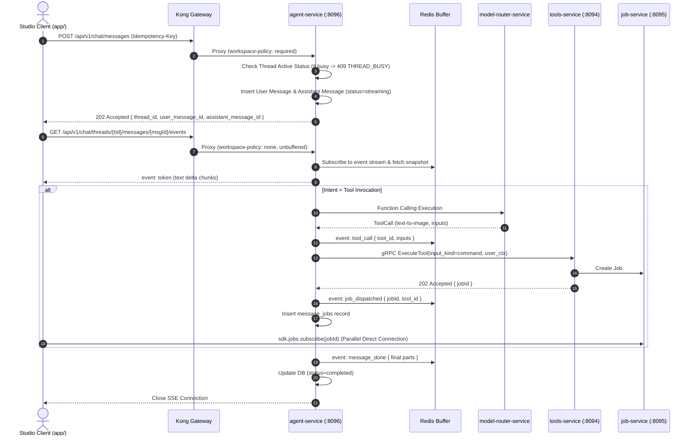

| فیلد / Field | مقدار / Value |
| :--- | :--- |
| **Title (EN)** | Studio Agent Chat Service & Streaming Pipeline Specification |
| **Title (FA)** | مشخصات فنی سرویس چت ایجنت استودیو و پایپ‌لاین استریم |
| **ID** | DOC-BE-012 |
| **Category** | `backend` |
| **Status** | `Approved` |
| **Owner** | تیم پلتفرم بک‌اند / @behroz |
| **Last Updated** | 2026-10-09 |
| **Summary (EN)** | Authoritative specification for Stage 16B following ADR-020: Defines agent-service Clean Architecture (DualServer HTTP 8096 + gRPC 50066, lemmo_agent DB), workspace/user-isolated immutable threads (404 on access mismatch, private to author), decoupled message lifecycle (POST /messages returning 202 Accepted, GET /messages/{id}/events per-message SSE stream with Last-Event-ID and THREAD_BUSY protection), typed parts schema with message_jobs mapping, client-driven job status observation via sdk.jobs.subscribe, deterministic containerized LLM emulator (lemmo-mock-llm) in dev/test with fail-fast in production, dual Kong routing, and decommission of lemmo-mock-chat. |
| **Summary (FA)** | سند منبع واحد حقیقت (SSOT) مرحله 16B پیرو مصوبه ADR-020: کدگذاری معماری تمیز سرویس agent-service (دوال‌سرور پورت HTTP 8096 و gRPC 50066، دیتابیس lemmo_agent)، رشته‌های تغییرناپذیر اسکوپ‌شده به کاربر و ورک‌اسپیس (خطای ۴۰۴ در عدم تطابق، حریم خصوصی مطلق پرامپت‌ها)، چرخه حیات تفکیک‌شده پیام (ارسال با ۲۰۲ و استریم مجزای هر پیام با رویدادهای تایپ‌دار، Last-Event-ID و خطای THREAD_BUSY)، ساختار parts تایپ‌دار با جدول message_jobs، اتصال مستقیم کلاینت به استریم جاب‌ها، شبیه‌ساز قطعی LLM در dev/test (کانتینر lemmo-mock-llm) با منع قطعی در پروداکشن، تفکیک دو روت چت در Kong و حذف کامل lemmo-mock-chat. |
| **Tags** | `doc-be-012`, `agent-service`, `adr-020`, `chat`, `sse`, `model-router`, `stage16b` |

---

## ۱. معرفی و اهداف معمارانه (Overview & Objectives)

این سند پیرو مصوبات رسمی **[ADR-020](../01-architecture/decisions/ADR-020-studio-agent-chat-service-architecture.md)**، پاسخ‌های مصوب سوالات معماری OQ-056 تا OQ-060 و تصمیمات کلان قبلی (ADR-016، ADR-018، ADR-019) تدوین شده و به عنوان **منبع واحد حقیقت (SSOT)** برای پیاده‌سازی مهندسی مرحله 16B عمل می‌کند.

### اهداف اصلی مرحله 16B:
1. **استقرار مایکروسرویس `agent-service`:** راه‌اندازی با معماری تمیز (Clean Architecture) در Go بر بستر سرور دوگانه (`core/bootstrap.DualServer`) بر پورت‌های HTTP `8096` و gRPC `50066`.
2. **پایگاه داده اختصاصی `lemmo_agent`:** نگهداری رشته‌ها و پیام‌ها با ایزولاسیون کامل حریم خصوصی کاربر و ورک‌اسپیس.
3. **تفکیک چرخه حیات پیام و پروتکل استریم SSE:** تفکیک ارسال پیام (`POST /messages` با پاسخ `202 Accepted`) از استریم بلادرنگ رویدادها (`GET .../messages/{id}/events`).
4. **پایپ‌لاین قطعی شبیه‌ساز مدل زبانی (`lemmo-mock-llm`):** کانتینر ایزوله برای محیط‌های تست محلی و CI، با ممنوعیت کامل منطق جعلی در کدهای پروداکشن.
5. **اتصال کلاینت استودیو و حذف ماک چت:** حذف ۱۰۰٪ کانتینر ماک `lemmo-mock-chat` و اتصال کامپوننت `AgentChatView.tsx` به سرویس زنده.

---

## ۲. مشخصات مایکروسرویس چت ایجنت (`agent-service`)

### ۲.۱. توپولوژی و پورت‌ها
- **نام کانتینر:** `lemmo-svc-agent`
- **پورت HTTP:** `8096` (سرویس‌دهی روت‌های REST و SSE چت به Kong Gateway)
- **پورت gRPC:** `50066` (رجیستری ارتباطات داخلی سرویس مش)
- **پایگاه داده اختصاصی:** PostgreSQL `lemmo_agent`
- **کش و بافر رویدادها:** Redis مشترک با پیشوند کلید `lemmo:chat:events:{message_id}`

### ۲.۲. پایگاه داده `lemmo_agent` (اسکیما DDL)

```sql
-- 000001_init_agent_schema.up.sql

CREATE TABLE IF NOT EXISTS chat_threads (
    id VARCHAR(64) PRIMARY KEY,
    workspace_id VARCHAR(64) NOT NULL,
    user_id VARCHAR(64) NOT NULL,
    title VARCHAR(255) NOT NULL DEFAULT 'New Conversation',
    active_message_id VARCHAR(64),
    created_at TIMESTAMPTZ NOT NULL DEFAULT NOW(),
    updated_at TIMESTAMPTZ NOT NULL DEFAULT NOW(),
    deleted_at TIMESTAMPTZ
);

CREATE INDEX IF NOT EXISTS idx_chat_threads_ws_user ON chat_threads(workspace_id, user_id) WHERE deleted_at IS NULL;

CREATE TABLE IF NOT EXISTS chat_messages (
    id VARCHAR(64) PRIMARY KEY,
    thread_id VARCHAR(64) NOT NULL REFERENCES chat_threads(id) ON DELETE CASCADE,
    workspace_id VARCHAR(64) NOT NULL,
    user_id VARCHAR(64) NOT NULL,
    role VARCHAR(32) NOT NULL, -- 'user', 'assistant', 'system'
    status VARCHAR(32) NOT NULL DEFAULT 'completed', -- 'pending', 'streaming', 'awaiting_confirmation', 'completed', 'failed', 'cancelled'
    sequence_number BIGINT NOT NULL,
    content TEXT NOT NULL DEFAULT '',
    parts JSONB NOT NULL DEFAULT '[]'::jsonb, -- typed blocks: text, tool_call, job_ref, asset_ref
    input_kind VARCHAR(32) NOT NULL DEFAULT 'natural_language', -- 'structured', 'command', 'natural_language'
    expected_cost INT,
    error_reason VARCHAR(64),
    idempotency_key VARCHAR(128),
    created_at TIMESTAMPTZ NOT NULL DEFAULT NOW(),
    updated_at TIMESTAMPTZ NOT NULL DEFAULT NOW()
);

CREATE UNIQUE INDEX IF NOT EXISTS idx_chat_messages_idemp ON chat_messages(workspace_id, user_id, idempotency_key) WHERE idempotency_key IS NOT NULL;
CREATE INDEX IF NOT EXISTS idx_chat_messages_thread_seq ON chat_messages(thread_id, sequence_number ASC);

CREATE TABLE IF NOT EXISTS message_jobs (
    message_id VARCHAR(64) NOT NULL REFERENCES chat_messages(id) ON DELETE CASCADE,
    job_id VARCHAR(64) NOT NULL,
    tool_id VARCHAR(64) NOT NULL,
    tool_version INT NOT NULL DEFAULT 1,
    created_at TIMESTAMPTZ NOT NULL DEFAULT NOW(),
    PRIMARY KEY (message_id, job_id)
);

CREATE INDEX IF NOT EXISTS idx_message_jobs_job ON message_jobs(job_id);
```

---

## ۳. چرخه حیات پیام و جریان استریم بلادرنگ (Message & SSE Pipeline)



---

## ۴. روت‌های Kong Gateway و حذف کانتینر ماک

```yaml
# پیکربندی روت‌های Kong
services:
  - name: agent-service
    url: http://lemmo-svc-agent:8096
    routes:
      - name: chat-events-route
        paths:
          - ~/api/v1/chat/threads/[^/]+/messages/[^/]+/events$
        tags:
          - "workspace-policy:none"
        strip_path: false
        response_buffering: false
        request_buffering: false

      - name: chat-standard-route
        paths:
          - /api/v1/chat
        tags:
          - "workspace-policy:required"
        strip_path: false
```

- **کانتینر `lemmo-mock-chat`:** پس از تایید تست‌های انطباق و آزمون‌های لایو، به طور کامل از `infra/compose/dev.yml` حذف می‌شود.
