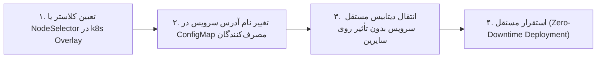

| فیلد / Field | مقدار / Value |
| :--- | :--- |
| **Title (EN)** | Backend Microservices Monorepo Architecture |
| **Title (FA)** | معماری مونوریپوی میکروسرویس‌های بک‌اند Lemmo |
| **ID** | DOC-BE-001 |
| **Category** | `backend` |
| **Status** | `Approved` |
| **Owner** | Backend & Platform Team |
| **Last Updated** | 2026-09-26 |
| **Summary (EN)** | Canonical architecture of lemmo-api monorepo: directory layout, service independence, core libraries, infra, and scaling. |
| **Summary (FA)** | معماری رسمی مونوریپوی بک‌اند لمو به سبک nons-api: ساختار پوشه‌ها، استقلال سرویس‌ها، قراردادها و زیرساخت. |
| **Tags** | `backend`, `architecture`, `monorepo`, `microservices`, `infrastructure` |

---

# معماری مونوریپوی میکروسرویس‌های بک‌اند (`lemmo-api`)

این سند معماری مرجع، ساختار مونوریپوی بک‌اند و زیرساخت پلتفرم **Lemmo** را تبیین می‌کند. این معماری از تجارب موفق و الگوی اثبات‌شده در **`nons-api`** الهام گرفته شده و برای نیازمندی‌های پردازش تصویر، گراف نودها، جریان‌های هوش مصنوعی و چندمستأجری بهینه‌سازی گردیده است.

---

## ۱. رویکرد معماری: تفکیک مستقل سرویس‌ها (`services/`)

در تحلیل ساختار بک‌اند، دو الگوی اصلی ارزیابی شد:

| شاخص مقایسه | ساختار کتابخانه‌ای (`apps/domains/platform`) | ساختار انتخابی Lemmo (`services/`) |
| :--- | :--- | :--- |
| **مرز هر سرویس** | کتابخانه داخلی؛ تصمیم درباره فرآیند اجرایی به کامپوزیشن موکول می‌شود | **یک سرویس مستقل با استقرار (Deployment) و چرخه حیات مستقل** |
| **سادگی درک** | نیازمند درک لایه انتزاعی ترکیب دامنه و سرور | **بسیار شفاف: یک پوشه = یک سرویس = یک ایمیج و استقرار کانتینری** |
| **انتقال به سرور/کلاستر دیگر** | تغییر در کدهای راه‌انداز و وابستگی‌ها | **ساده: تغییر مانیفست k8s (نگاشت گره‌ها و overlayها)** |
| **ایزولاسیون پردازش AI** | پیچیدگی در جداسازی مصرف CPU از GPU | **ایزولاسیون کامل: سرویس‌های سنگین روی گره‌های GPU اختصاصی مستقر می‌شوند** |
| **ریسک اجرایی** | خطای یک کتابخانه کل سرور را تحت تأثیر قرار می‌دهد | **خطای یک سرویس ایزوله مانع کار سایر بخش‌های مستقل سیستم می‌شود** |

> **قاعده حاکم:**  
> ساختار `services/` مبنای توسعه بک‌اند است. برای مدیریت هزینه و تمرکز تیمی، پوشه تمام سرویس‌ها در نقشه اولیه معماری رزرو می‌شود، اما صرفاً سرویس‌های «فاز ۱» پیاده‌سازی و مستقر می‌گردند. سایر سرویس‌ها با یک فایل شناسنامه `service.md` رزرو می‌شوند.

---

## ۲. درخت ساختار مخزن بک‌اند (`lemmo-api`)

```text
lemmo-api/                      ← ریشه مونوریپوی بک‌اند (مخزن api.git)
│
├── contracts/                  ← قراردادها و اینترفیس‌های منبع حقیقت (SSOT)
│   ├── platform/               ← تعاریف مشترک با پلتفرم (Envelope, Errors, Permissions)
│   ├── lemmo/                  ← مشخصات Proto سرویس‌ها و رویدادهای اختصاصی Lemmo
│   └── schemas/                ← تعاریف JSON Schema (گراف نودها، مانیفست پلاگین، ورودی/خروجی)
│
├── core/                       ← هسته مشترک Go (بوت‌استرپ، لاگینگ، میدل‌ور، Idempotency، Health)
│   ├── bootstrap/              ← راه‌اندازی سرور gRPC و HTTP
│   ├── config/                 ← بارگذاری تنظیمات و متغیرهای محیطی
│   ├── middleware/             ← رهگیری لاگ، خطاها و متریک‌ها
│   ├── outbox/                 ← الگوی Transactional Outbox برای ارسال مطمئن رویدادها
│   └── idempotency/            ← کلیدهای یکتا جهت جلوگیری از اجرای تکراری
│
├── packages/                   ← بایندینگ‌های تولیدشده و کتابخانه‌های اشتراکی کلاینت
│   ├── contracts/              ← بایندینگ‌های تایپ‌اسکریپت برای خطاها و دسترسی‌ها
│   ├── events/                 ← بایندینگ‌های تایپ‌اسکریپت برای Envelope و رویدادها
│   ├── logging/                ← استاندارد و قراردادهای لاگینگ
│   ├── plugin-sdk/             ← SDK توسعه پلاگین‌های اکوسیستم
│   └── embed-sdk/              ← SDK سبک کلاینت جهت اجرای ورک‌فلو در سایت مشتریان
│
├── services/                   ← سرویس‌های مستقل تجاری (هر پوشه = یک سرویس)
│   ├── project-service/        ← مدیریت JSON پروژه و گراف نودها
│   ├── workspace-service/      ← تیم‌ها، فضاهای کاری و عضویت
│   ├── orchestrator-service/   ← هدایت و اجرای ترتیبی گراف پردازش
│   ├── job-service/            ← صف پردازش‌های سنگین هوش مصنوعی و رهگیری وضعیت
│   ├── model-router-service/   ← مسیریابی درخواست‌ها به ارائه‌دهندگان بهینه AI
│   ├── image-service/          ← پردازش و تبدیل تخصصی تصویر
│   ├── usage-service/          ← ثبت دقیق میزان مصرف واقعی منابع
│   └── quota-service/          ← اعتبارسنجی سقف و رزرو اعتبار کاربر
│
├── plugins/                    ← پلاگین‌های رسمی توسعه‌یافته (Virtual-Tryon, Store, ...)
│
└── infra/                      ← پیکربندی‌های استقرار و زیرساخت
    ├── gateway/                ← درگاه معکوس (Reverse Proxy) و مسیریابی ترافیک بیرونی
    ├── k8s/                    ← مانیفست‌های کوبرنتیز
    │   ├── base/               ← تعاریف عمومی Deployment و Service
    │   ├── overlays/           ← تنظیمات مجزای dev / staging / prod
    │   ├── configmaps/         ← متغیرهای محیطی استقرار
    │   └── secrets/            ← ارجاعات امن به Vault (هیچ کلید واقعی در گیت نیست)
    ├── messaging/              ← تنظیمات بروکر پیام و صف‌های توزیع‌شده (RabbitMQ / Kafka)
    └── observability/          ← تنظیمات OpenTelemetry، پرومتئوس و لاگ‌های متمرکز
```

---

## ۳. قواعد حاکمیتی و مرزهای ایزولاسیون کد (`rule.md`)

برای تضمین استقلال معماری و پایداری بلندمدت، قوانین زیر بر کل کدهای بک‌اند حاکم است:

1. **ممنوعیت وارد کردن کد داخلی سرویس دیگر:**  
   هیچ سرویسی حق ندارد پکیج‌های پوشه `internal/` یا لایه‌های داخلی سرویس دیگری را `import` کند. تعامل میان سرویس‌ها منحصراً از طریق قراردادهای رسمی در پوشه `contracts/` و بایندینگ‌های کامپایل‌شده صورت می‌پذیرد.
2. **استقلال کامل پایگاه داده (Data Ownership):**  
   هر سرویس مالک انحصاری پایگاه داده و اسکیماهای خودش است. دسترسی مستقیم، دستورات SQL مشترک، یا `JOIN` متقاطع میان جداول سرویس‌های مختلف اکیداً ممنوع است.
3. **ارتباطات بلادرنگ در برابر ناهمگام:**  
   - ارتباطات بلادرنگ و وابسته به پاسخ آنی: فقط از طریق پروتکل **gRPC** (یا HTTP REST با تبدیل مستقیم) مطابق قراردادهای Proto.
   - ارتباطات پس‌زمینه و اعلان تغییرات: صرفاً از طریق **انتشار رویدادها (Events)** داخل Envelope استاندارد روی صف پیام.
4. **جداسازی وظایف سنگین هوش مصنوعی:**  
   هیچ پردازش سنگین تولید محتوا یا استنتاج مدل (Inference) نباید درون حلقه درخواست-پاسخ HTTP/gRPC انجام شود. این وظایف منحصراً باید از طریق ثبت کار در **`job-service`** و پردازش در صف ناهمگام مدیریت گردند.
5. **ثبت مصرف برگشت‌پذیر و یکتا (Idempotent):**  
   ثبت مصرف منابع در `usage-service` باید همیشه همراه با شناسه یکتای درخواست (`idempotency_key`) باشد تا در صورت تلاش مجدد (Retry)، هزینه تکراری ثبت نشود.
6. **عدم ذخیره رازها در گیت:**  
   کلیدهای خصوصی، توکن‌های دسترسی و اطلاعات حساس نباید در فایل‌های مخزن ثبت شوند. پیکربندی‌ها از طریق متغیرهای سیستمی و Secret Manager کلاستر بارگذاری می‌گردند.

---

## ۴. مهاجرت سرویس‌ها به سرورها و گره‌های مجزا با کمترین هزینه

به دلیل تفکیک زودهنگام سرویس‌ها بر اساس قراردادها، انتقال هر سرویس به سرور یا کلاستر دیگر به ساده‌ترین شکل ممکن انجام می‌شود:



- **عدم وابستگی به IP/دامنه ثابت:** آدرس‌ها هرگز هاردکد نمی‌شوند و از Config تزریق می‌گردند.
- **تفکیک محاسباتی (Compute Split):** سرویس‌های معمولی روی گره‌های ارزان CPU مستقر می‌شوند، در حالی که `image-service` و `video-service` مستقیماً روی سرورهای دارای کارت‌های GPU اختصاصی هدایت می‌گردند.
