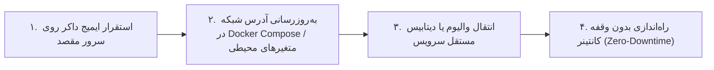

| فیلد / Field | مقدار / Value |
| :--- | :--- |
| **Title (EN)** | Backend Microservices Monorepo Architecture |
| **Title (FA)** | معماری مونوریپوی میکروسرویس‌های بک‌اند Lemmo |
| **ID** | DOC-BE-001 |
| **Category** | `backend` |
| **Status** | `Approved` |
| **Owner** | Backend & Platform Team |
| **Last Updated** | 2026-09-30 |
| **Summary (EN)** | Canonical architecture of lemmo-api monorepo: directory layout, service independence, service-owned deployment, role-based naming (ADR-009), core libraries, infra, and scaling. |
| **Summary (FA)** | معماری رسمی مونوریپوی بک‌اند لمو به سبک nons-api: ساختار پوشه‌ها، استقلال سرویس‌ها، استقرار مستقل سرویس‌ها (ADR-009)، نام‌گذاری نقش‌محور، قراردادها و زیرساخت. |
| **Tags** | `backend`, `architecture`, `monorepo`, `microservices`, `infrastructure`, `adr-009`, `financial-ledger` |

---

# معماری مونوریپوی میکروسرویس‌های بک‌اند (`lemmo-api`)

> ⚠️ **وضعیت پیاده‌سازی در کد (`api/`):**  
> وضعیت معماری این سند `Approved` است و بر پایه تصمیمات مصوب [ADR-004](../01-architecture/decisions/adr-004-backend-microservices.md)، [ADR-007](../01-architecture/decisions/ADR-007-backend-contracts-and-tooling-standards.md)، [ADR-008](../01-architecture/decisions/ADR-008-internal-tooling-and-versioning-governance.md) و [ADR-009](../01-architecture/decisions/ADR-009-service-owned-deployment-and-financial-ledger.md) تدوین شده است. در حال حاضر فونداسیون اولیه شامل قراردادهای متمرکز خطا و نودها در `contracts/`، پکیج‌های `core/middleware`، پوشه متمرکز ابزارهای داخلی در `tools/`، اسکلت لایه‌ای کلیه سرویس‌های فاز ۱ در مخزن `api/` مستقر شده‌اند و توسعه منطق تجاری مطابق نقشه راه ([DOC-BE-005](./roadmap.md)) با الگوی استقرار مستقل هر سرویس ادامه می‌یابد.

این سند معماری مرجع، ساختار مونوریپوی بک‌اند و زیرساخت پلتفرم **Lemmo** را تبیین می‌کند. این معماری از تجارب موفق و الگوی اثبات‌شده در **`nons-api`** الهام گرفته شده و برای نیازمندی‌های پردازش تصویر، گراف نودها، جریان‌های هوش مصنوعی و چندمستأجری بهینه‌سازی گردیده است.

---

## ۱. رویکرد معماری: تفکیک مستقل سرویس‌ها (`services/`)

در تحلیل ساختار بک‌اند، دو الگوی اصلی ارزیابی شد:

| شاخص مقایسه | ساختار کتابخانه‌ای (`apps/domains/platform`) | ساختار انتخابی Lemmo (`services/`) |
| :--- | :--- | :--- |
| **مرز هر سرویس** | کتابخانه داخلی؛ تصمیم درباره فرآیند اجرایی به کامپوزیشن موکول می‌شود | **یک سرویس مستقل با استقرار (Deployment) و چرخه حیات مستقل** |
| **سادگی درک** | نیازمند درک لایه انتزاعی ترکیب دامنه و سرور | **بسیار شفاف: یک پوشه = یک سرویس = یک ایمیج و استقرار کانتینری** |
| **انتقال به سرور دیگر** | تغییر در کدهای راه‌انداز و وابستگی‌ها | **بسیار ساده: اجرای کانتینر داکر سرویس روی سرور مقصد و تنظیم متغیرهای Compose** |
| **ایزولاسیون پردازش AI** | پیچیدگی در جداسازی مصرف CPU از GPU | **ایزولاسیون کامل: سرویس‌های سنگین روی گره‌های GPU اختصاصی مستقر می‌شوند** |
| **ریسک اجرایی** | خطای یک کتابخانه کل سرور را تحت تأثیر قرار می‌دهد | **خطای یک سرویس ایزوله مانع کار سایر بخش‌های مستقل سیستم می‌شود** |

> **قاعده حاکم:**  
> ساختار `services/` مبنای توسعه بک‌اند است. برای مدیریت هزینه و تمرکز تیمی، پوشه تمام سرویس‌ها در نقشه اولیه معماری رزرو می‌شود، اما صرفاً سرویس‌های «فاز ۱» پیاده‌سازی و مستقر می‌گردند. ایجاد ساختار تمیز لایه‌ای هر سرویس و شناسنامه `service.md` به صورت خودکار توسط باینری رسمی اسکافولدر Go در `tools/lemmo-cli` (مصوب در [ADR-007](../01-architecture/decisions/ADR-007-backend-contracts-and-tooling-standards.md) و [ADR-008](../01-architecture/decisions/ADR-008-internal-tooling-and-versioning-governance.md)) تولید می‌شود.

---

## ۲. الگوی استقرار مستقل هر سرویس و نام‌گذاری نقش‌محور (ADR-009)

بر اساس تصمیم مصوب [ADR-009](../01-architecture/decisions/ADR-009-service-owned-deployment-and-financial-ledger.md)، معماری استقرار و نام‌گذاری اجزای زیرساختی از سرویس `quota-service` به بعد، دستخوش ارتقای اساسی شده و از سه قاعده حاکمیتی زیر تبعیت می‌کند:

### ۲.۱. قاعده استقرار مستقل هر سرویس (Service-Owned Deployment)
الگوی قدیمی تجمیع متمرکز کلیه سرویس‌ها و زیرساخت‌ها در `infra/compose/dev.yml` از این نقطه متوقف می‌شود.
- **قاعده:** از سرویس `quota-service` به بعد، هر سرویس جدید **مالک کامل زیرساخت اختصاصی خودش** است. کد سرویس، فایل‌های پیکربندی (`config/`)، مانیفست‌های داکر، والیوم‌های اختصاصی، هلت‌چک‌ها و تعاریف استقرار همگی در پوشه استقرار اختصاصی همان سرویس (`services/<name>/deploy/`) قرار می‌گیرند:
  ```text
  services/<service-name>/
  ├── deploy/
  │   ├── compose.yaml
  │   └── config/
  │       └── <service-name>.yaml
  ```
- **نقش Compose ریشه:** فایل کامپوز ریشه پروژه (`infra/compose/dev.yml`) صرفاً نقش ارکستراسیون و Composition سطح بالا را دارد و از طریق دستور بومی `include:` فایل‌های استقرار سرویس‌ها را وارد استک می‌کند:
  ```yaml
  include:
    - ../../services/quota-service/deploy/compose.yaml
  ```
- **حداقل نسخه ابزار:** استفاده از قابلیت استاندارد `include:` نیازمند **`Docker Compose >= 2.20.0`** در تمامی محیط‌های توسعه محلی، سرورهای تست و پایپ‌لاین‌های CI است.

### ۲.۲. قاعده تفکیک زیرساخت اختصاصی از زیرساخت مشترک (Dedicated vs. Shared Infrastructure Boundary)
معیار معماری برای جداسازی محل تعریف زیرساخت، **«مصرف واقعی و معماری‌شده توسط چند سرویس مستقل»** است (صرفاً امکان استفاده در آینده ملاک اشتراک نیست):
1. **زیرساخت اختصاصی (Dedicated):** اگر یک زیرساخت برای اجرای یک سرویس واحد ضروری است و سرویس دیگری مصرف‌کننده مستقیم آن نیست، تعریف آن منحصراً درون پوشه `deploy/` همان سرویس قرار می‌گیرد (مانند موتور دفترکل مالی برای `quota-service`).
2. **زیرساخت مشترک واقعی (Shared):** اگر زیرساختی واقعاً توسط چندین سرویس مستقل مصرف شود، تعریف آن در سطح ریشه (`infra/compose/dev.yml`) باقی می‌ماند (مانند نمونه‌های مشترک فعلی PostgreSQL، RabbitMQ و MinIO).
3. **عدم بازنویسی گذشته (No Retroactive Migration):** سرویس‌ها و زیرساخت‌های موجود قبل از Stage 8 دست‌نخورده باقی می‌مانند و این الگو به معنی مایگریشن قهقرایی سرویس‌های قبلی نیست. دیتابیس منطقی `lemmo_quota` نیز در نمونه مشترک Postgres اجرا می‌شود اما مالکیت دیتابیسی آن با `quota-service` است.

### ۲.۳. قاعده نام‌گذاری نقش‌محور، نه ابزارمحور (Role-Based Naming, NOT Tool Name)
نام‌گذاری تمامی اجزای زیرساختی (سرویس در compose، فیلد `container_name`، نام پوشه‌ها، کلیدهای کانفیگ، پیشوند متغیرهای محیطی، نام والیوم‌ها و عناوین مستندات) باید منحصراً بر مبنای **نقش معماری (Role)** انجام شود، نه نام ابزار یا محصولی که فعلاً آن نقش را بر عهده دارد.
- **علت معماری:** ممانعت از جفت‌شدگی (Tight Coupling) به ابزارهای بیرونی. در صورت تعویض ابزار در آینده، هیچ نیازی به مایگریشن نام سرویس، متغیرها، والیوم‌ها یا تغییر کدها نخواهد بود؛ صرفاً پیاده‌سازی زیرین عوض می‌شود.
- **نمونه‌های ممنوع:** `tigerbeetle`، `lemmo-infra-tigerbeetle`، `TIGERBEETLE_PORT`، `tigerbeetle-data`.
- **نمونه‌های مجاز و مصوب:** `financial-ledger`، `lemmo-svc-financial-ledger`، `FINANCIAL_LEDGER_PORT`، `financial-ledger-data`.
- **استثنای مجاز:** نام واقعی ابزار فقط و فقط در فیلد `image:` مجاز است؛ مانند:
  ```yaml
  image: ghcr.io/tigerbeetle/tigerbeetle:0.16.27
  ```

### ۲.۴. نمونه مرجع و عملیاتی: سرویس سهمیه و دفترکل مالی (`quota-service` & `financial-ledger`)
برای درک ملموس این سه قاعده، پیاده‌سازی سرویس سهمیه به عنوان الگو تعریف شده است:
1. **پوشه استقرار اختصاصی:** تعاریف در `services/quota-service/deploy/compose.yaml` و کانفیگ‌ها در `services/quota-service/deploy/config/quota-service.yaml`.
2. **نقش معماری دفترکل:** زیرساخت لجر با نام نقشی `financial-ledger`، کانتینر `lemmo-svc-financial-ledger` و والیوم `financial-ledger-data`.
3. **تجرید در سطح کد (`FinancialLedgerPort`):** لایه دامنه سرویس Go هیچ وابستگی به پکیج‌های ابزار خاص ندارد و از طریق اینترفیس انتزاعی `FinancialLedgerPort` تعامل می‌کند.
4. **پیکربندی پویا و منع هاردکد:** پورت اتصال لجر و مدت‌زمان تایم‌اوت رزرو دوفازی (`reservation_timeout`) نباید مقدار ثابت (`const`) در کد باشند؛ این مقادیر از فایل کانفیگ و متغیرهای محیطی خوانده می‌شوند (با پیش‌فرض ۳۰۰ ثانیه برای تایم‌اوت).

---

## ۳. درخت ساختار مخزن بک‌اند (`lemmo-api`)

```text
lemmo-api/                      ← ریشه مونوریپوی بک‌اند (مخزن api.git)
│
├── contracts/                  ← قراردادها و اینترفیس‌های منبع حقیقت (SSOT)
│   ├── platform/               ← تعاریف مشترک پلتفرم (Envelope, Errors, Permissions)
│   ├── lemmo/v1/               ← مشخصات Proto نسخه‌بندی‌شده (Node, Project, Workflow, Events)
│   └── schemas/                ← تعاریف JSON Schema (طرح توپولوژی گراف، مانیفست پلاگین)
│
├── core/                       ← هسته مشترک Go (بوت‌استرپ، لاگینگ، میدل‌ور، Idempotency، Outbox)
│   ├── bootstrap/              ← راه‌اندازی استاندارد سرور gRPC و HTTP با Graceful Shutdown
│   ├── config/                 ← بارگذاری سازگار تنظیمات از .env و متغیرهای محیطی
│   ├── middleware/             ← تزریق Trace ID، ریکاوری از پنیک و MockAuthMiddleware توسعه
│   ├── outbox/                 ← الگوی Transactional Outbox برای ارسال مطمئن رویدادها
│   └── idempotency/            ← کلیدهای یکتا جهت جلوگیری از اجرای تکراری
│
├── packages/                   ← خروجی‌های تولیدشده برای مصرف‌کننده بیرونی (فرانت‌اند)
│   └── ts-sdk/                 ← پکیج npm نسخه‌بندی‌شده کلاینت: @lemmo/sdk
│
├── tools/                      ← تک‌محل رسمی ابزارها، اسکریپت‌ها و برنامه‌های Codegen (ADR-008)
│   ├── lemmo-cli/              ← ابزار رسمی اسکافولد سرویس‌های جدید (حل نهایی OQ-009)
│   ├── errgen/                 ← تولید خودکار کاتالوگ خطاها (Proto → core + @lemmo/sdk)
│   ├── nodegen/                ← تولید خودکار قرارداد نودها (node.proto → @lemmo/sdk)
│   ├── sdk-release/            ← اسکریپت و ابزار انتشار نسخه‌بندی packages/ts-sdk
│   └── ci/                     ← اسکریپت‌های کمکی CI، لینت و بیلد چندماژوله
│
├── services/                   ← سرویس‌های مستقل تجاری و پلتفرمی (هر پوشه = یک سرویس لایه‌ای با cmd اختصاصی)
│   ├── auth-service/           ← احراز هویت، ثبت‌نام و مدیریت نشست‌ها (Ory Kratos)
│   ├── iam-service/            ← موتور مجوزها، ماتریس دسترسی و نقش‌ها (Ory Keto)
│   ├── user-service/           ← پروفایل، اطلاعات هویتی و تنظیمات کاربری
│   ├── token-service/          ← صدور توکن‌های OAuth2/OIDC و API Keyها (Ory Hydra)
│   ├── notification-service/   ← اعلان‌های سیستمی و وب‌سوکت بلادرنگ
│   ├── storage-service/        ← انتزاع فضای ذخیره‌سازی S3/MinIO و لینک‌های امضاشده
│   ├── node-registry-service/  ← رجیستری و قرارداد نودهای بوم (Protobuf)
│   ├── project-service/        ← مدیریت JSON پروژه و گراف نودها
│   ├── workspace-service/      ← تیم‌ها، فضاهای کاری، عضویت و حاکمیت سازمان (gRPC: 50060, HTTP: 8089)
│   │   └── deploy/             ← استقرار مستقل سرویس و پیکربندی اختصاصی (ADR-009 / ADR-010)
│   │       ├── compose.yaml    ← تعریف کانتینر سرویس lemmo-svc-workspace
│   │       └── config/         ← تنظیمات اختصاصی استقرار سرویس
│   ├── orchestrator-service/   ← هدایت و اجرای ترتیبی گراف (اینترفیس QuotaChecker)
│   ├── job-service/            ← صف پردازش‌های سنگین هوش مصنوعی و رهگیری وضعیت
│   ├── model-router-service/   ← مسیریابی درخواست‌ها به ارائه‌دهندگان بهینه AI
│   ├── image-service/          ← پردازش و تبدیل تخصصی تصویر (gRPC: 50057, HTTP: 8082)
│   ├── quota-service/          ← اعتبارسنجی سقف و رزرو اعتبار کاربر (gRPC: 50058, HTTP: 8087)
│   │   └── deploy/             ← استقرار مستقل سرویس و زیرساخت اختصاصی (ADR-009)
│   │       ├── compose.yaml    ← تعریف زیرساخت اختصاصی (financial-ledger)
│   │       └── config/         ← تنظیمات اختصاصی استقرار سرویس
│   └── usage-service/          ← ثبت دقیق میزان مصرف واقعی منابع (gRPC: 50059, HTTP: 8088)
│
├── plugins/                    ← پلاگین‌های رسمی توسعه‌یافته (Virtual-Tryon, Store, ...)
│
└── infra/                      ← پیکربندی‌های استقرار و زیرساخت مشترک (Compose)
    ├── docker-compose.yml      ← استک اصلی ارکستراسیون سرویس‌ها، پایگاه داده و بروکرها
    ├── compose/                ← تنظیمات محیط‌های مختلف داکر (dev / staging / prod با include سرویس‌ها)
    ├── gateway/                ← کانتینر درگاه معکوس (Reverse Proxy / Nginx / Envoy) و مسیریابی
    ├── messaging/              ← پیکربندی کانتینر بروکر پیام (RabbitMQ / Kafka)
    └── observability/          ← تنظیمات کانتینرهای OpenTelemetry، پرومتئوس و لاگ‌های متمرکز
```

---

## ۴. قواعد حاکمیتی و مرزهای ایزولاسیون کد (`AGENTS.md`)

برای تضمین استقلال معماری و پایداری بلندمدت، قوانین زیر بر کل کدهای بک‌اند حاکم است:

1. **ممنوعیت وارد کردن کد داخلی سرویس دیگر:**  
   هیچ سرویسی حق ندارد پکیج‌های پوشه `internal/` یا لایه‌های داخلی سرویس دیگری را `import` کند. تعامل میان سرویس‌ها منحصراً از طریق قراردادهای رسمی در پوشه `contracts/` و بایندینگ‌های کامپایل‌شده صورت می‌پذیرد.
2. **استقلال کامل پایگاه داده (Data Ownership):**  
   هر سرویس مالک انحصاری پایگاه داده و اسکیماهای خودش است. دسترسی مستقیم، دستورات SQL مشترک، یا `JOIN` متقاطع میان جداول سرویس‌های مختلف اکیداً ممنوع است.
3. **ارتباطات بلادرنگ در برابر ناهمگام:**  
   - ارتباطات بلادرنگ و وابسته به پاسخ آنی: فقط از طریق پروتکل **gRPC** (یا HTTP REST با تبدیل مستقیم) مطابق قراردادهای Proto.
   - ارتباطات پس‌زمینه و اعلان تغییرات: صرفاً از طریق **انتشار رویدادها (Events)** داخل Envelope استاندارد روی صف پیام.
4. **جداسازی وظایف سنگین هوش مصنوعی:**  
   هیچ پردازش سنگین تولید محتوا یا استنتاج مدل (Inference) نباید درون حلقه درخواست-پاسخ HTTP/gRPC انجام شود. این وظایف منحصراً باید از طریق ثبت کار در **`job-service`** و پردازش در صف ناهمگام مدیریت گردند.
5. **ثبت مصرف برگشت‌پذیر و یکتا (Idempotent):**  
   ثبت مصرف منابع در `usage-service` باید همیشه همراه با شناسه یکتای درخواست (`idempotency_key`) باشد تا در صورت تلاش مجدد (Retry)، هزینه تکراری ثبت نشود.
6. **عدم ذخیره رازها در گیت:**  
   کلیدهای خصوصی، توکن‌های دسترسی و اطلاعات حساس نباید در فایل‌های مخزن ثبت شوند. پیکربندی‌ها از طریق متغیرهای محیطی سیستم، فایل‌های `.env` امن و Secret Manager در کانتینرهای داکر بارگذاری می‌گردند.
7. **کاتالوگ متمرکز خطا و نگاشت ران‌تایم (AIP-193):**  
   تمامی خطاهای پلتفرم در `contracts/platform/errors.proto` تعریف شده و در ران‌تایم به فیلد `reason` در `google.rpc.ErrorInfo` نگاشت می‌شوند. فرانت‌اند بایندینگ‌ها را از `@/sdk/errors.ts` دریافت کرده و بومی‌سازی پیام خطا منحصراً بر عهده فرانت‌اند است.
8. **قرارداد انحصاری نودها و پورت‌ها با Protobuf:**  
   قرارداد نودها و پورت‌ها منحصراً در `contracts/lemmo/v1/node.proto` تعریف می‌شود (استفاده از JSON Schema برای مشخصات پورت‌ها منسوخ شده است). فرانت‌اند ملزم است تایپ‌های مربوطه را از پکیج `@/sdk` دریافت کند.
9. **الزام استقرار مستقل هر سرویس جدید (ADR-009):**  
   از `quota-service` به بعد، هر سرویس جدید باید دایرکتوری `deploy/` اختصاصی خود را داشته باشد و زیرساخت‌های انحصاری را درون آن تعریف کند. فایل‌های کامپوز ریشه صرفاً از دستور `include:` استفاده می‌نمایند.
10. **نام‌گذاری نقش‌محور زیرساخت‌ها (ADR-009):**  
   نام‌گذاری سرویس‌ها، کانتینرها، والیوم‌ها، کانفیگ‌ها و متغیرهای محیطی جدید باید بازتاب‌دهنده نقش معماری باشند (مثلاً `financial-ledger`)؛ استفاده از نام تجاری ابزارها (نظیر `tigerbeetle`) در این لایه‌ها اکیداً ممنوع بوده و نام ابزار فقط در تگ `image:` مجاز است.
11. **مدل چندمستأجری و وضعیت Provisioning کیف‌پول (ADR-010):**  
   فضاهای کاری در `workspace-service` مرز انحصاری تننت‌ها و صورت‌حساب هستند. ساخت کیف‌پول سازمانی به صورت آسنکرون و با وضعیت `provisioning` انجام می‌شود و تا فعال شدن کامل والت، اجرای گراف‌ها مسدود است. سیاست رفتار در برابر کیف‌پول خالی با ستون `on_wallet_empty` (مقادیر `block` یا `member_fallback`) تعیین می‌شود. انقضای دعوت‌نامه‌ها باید کاملاً پیکربندی‌پذیر باشد.

---

## ۵. مهاجرت سرویس‌ها به سرورهای مجزا با کمترین هزینه (مبتنی بر Docker)

به دلیل تفکیک زودهنگام سرویس‌ها و کانتینرسازی کامل با داکر، انتقال هر سرویس به هاست یا سرور دیگر به ساده‌ترین شکل ممکن انجام می‌شود:


```mermaid
flowchart LR
    A["۱. استقرار ایمیج داکر روی سرور مقصد"] --> B["۲. به‌روزرسانی آدرس شبکه در Docker Compose / متغیرهای محیطی"]
    B --> C["۳. انتقال والیوم یا دیتابیس مستقل سرویس"]
    C --> D["۴. راه‌اندازی بدون وقفه کانتینر (Zero-Downtime)"]
```

- **محیط کاملاً کانتینری (Docker-Centric):** تمام اجزا، دیتابیس‌ها و سرویس‌ها دارای `Dockerfile` چندمرحله‌ای استاندارد بوده و با `docker compose` اجرا و مدیریت می‌شوند.
- **عدم وابستگی به IP/دامنه ثابت:** نام کانتینرها در شبکه داکر (Docker Network DNS) نقش سرویس دیسکاوری را ایفا می‌کند و هیچ آدرسی هاردکد نمی‌شود.
- **تفکیک محاسباتی سخت‌افزاری (CPU vs GPU):** کانتینرهای معمولی روی سرورهای استاندارد CPU اجرا می‌شوند، در حالی که کانتینر `image-service` روی هاست داکر مجهز به کارت‌های گرافیکی با تخصیص مستقیم پردازنده گرافیکی (`NVIDIA Container Toolkit` / `deploy.resources.reservations.devices`) راه‌اندازی می‌گردد.
