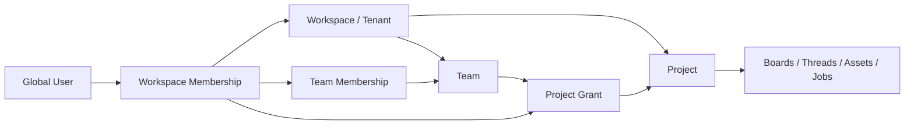

| فیلد / Field | مقدار / Value |
| :--- | :--- |
| **Title (EN)** | Identity, Tenant and Project Authorization |
| **Title (FA)** | هویت، عضویت و مجوزهای پروژه و تیم |
| **ID** | DOC-BE-004 |
| **Category** | `backend` |
| **Status** | `Draft` |
| **Owner** | Backend & Platform Team |
| **Last Updated** | 2026-09-23 |
| **Summary (EN)** | Resource-scoped RBAC and relationship rules, invitations, revocation, delegated access and authorization acceptance tests. |
| **Summary (FA)** | هویت، عضویت و مجوزهای پروژه و تیم؛ حاصل ممیزی کد و تحلیل معماری، برای بررسی تیم. |
| **Tags** | `auth`, `rbac`, `relationships`, `tenant`, `invitations` |

---

# هویت، عضویت و مجوزهای پروژه و تیم

## ۱. مدل پیشنهادی و تفکیک مسئولیت

احراز هویت می‌گوید درخواست‌کننده کیست؛ Authorization می‌گوید روی کدام منبع چه کاری می‌تواند انجام دهد؛ Entitlement قابلیت خریداری‌شده Workspace است؛ Budget/Quota سقف مصرف است. هیچ‌کدام جای دیگری را نمی‌گیرد: Editor بدون اعتبار نمی‌تواند Job جدید اجرا کند؛ پرداخت پلن Enterprise به Viewer حق ویرایش نمی‌دهد.

این بازنگری پیش‌نویس DOC-BE-004، RBAC صرفاً Workspaceمحور قبلی را به **RBAC در scope + روابط عضویت/منبع + شروط policy** تکمیل می‌کند. مقادیر role در UI فعلی شواهد طراحی‌اند، نه authorization پیاده‌شده. schema-driven و SDK واحد [DOC-FE-002](../frontend/workspace-decisions.md) حفظ می‌شوند.

## ۲. tenant و روابط



- Workspace مالک داده و حساب billing است. سازنده محتوا `createdBy` است؛ خروج او نباید محتوای تیم یا ledger را حذف کند.
- Team متعلق به یک Workspace است؛ nesting تیم‌ها در v1 پشتیبانی نمی‌شود. عضویت چندتیمی مجاز است.
- Project متعلق به یک Workspace است؛ grant به user یا team همان Workspace محدود است. جابه‌جایی بین tenantها در v1 ممنوع؛ export/import کنترل‌شده مسیر جایگزین است.
- Workspace membership نوع `member` یا `guest` دارد. مهمان پروژه‌ای از فهرست پروژه‌ها، اعضا و billing عمومی Workspace محروم است و فقط به پروژه grantشده دسترسی دارد.
- پیشنهاد پایه: پروژه `restricted` است و دسترسی محتوا از grant مستقیم یا تیم می‌آید؛ Workspace admin/owner فقط به دلیل مدیریت سازمان، reader همه پروژه‌ها نیست. recovery دسترسی با عملیات صریح auditشده و policy سازمان انجام می‌شود. تصمیم حساس محصول در D03 ثبت شده است.
- حالت `workspace_shared` در صورت نیاز، رابطه واضح برای اعضای فعال غیرمهمان و سقف role دارد؛ به‌صورت پیش‌فرض فعال نیست.
- نقش در Workspace سقف اختیارات project برای اعضای عادی را مشخص می‌کند: Viewer حداکثر project viewer، Editor تا project maintainer در پروژه‌ای که این grant را دارد، Admin/Owner تا project maintainer. Guest هیچ role اداری Workspace ندارد و سقفش در دعوت project معین می‌شود.

### الگوریتم پیشنهادی تصمیم

```text
allow = identity_active
    AND credential_active
    AND tenant_matches_resource
    AND active_workspace_membership
    AND resource_lifecycle_allows_action
    AND action_in_scope_role_ceiling
    AND action_in_effective_project_grants
    AND credential_and_plugin_scopes_allow
    AND workspace_policy_allows
```

قید grant پروژه برای عملیات workspace administration کاربرد ندارد؛ آن‌ها از Workspace role بررسی می‌شوند. Entitlement، بودجه و quota برای عملیات هزینه‌دار **بعد از مجوز** در سرویس مالک مصرف کنترل می‌شوند. policy محدودکننده و ban/suspend همیشه بر grant اجازه مقدم است. نبود grant یعنی deny. grantهای مثبت مستقیم و تیم union می‌شوند، سپس با سقف‌ها intersect می‌شوند؛ deny اختصاصی منبع و inheritance چندلایه در v1 اضافه نمی‌شود.

حذف grant مستقیم لزوماً دسترسی از Team را حذف نمی‌کند؛ UI باید مسیرهای دسترسی مؤثر را نشان دهد. حذف عضویت Workspace همه مسیرها را قطع می‌کند. «حذف دسترسی از پروژه» با وجود مسیر Team نباید موفقیت کاذب اعلام کند: در v1 یا grant تیم از پروژه حذف می‌شود (برای همه اعضا)، یا فرد از تیم خارج می‌شود (روی سایر پروژه‌های تیم هم مؤثر)، یا Workspace membership فرد لغو می‌شود. exclusion شخصی از یک Team grant قابلیت جدا برای آینده است؛ UI دامنه اثر انتخاب را نشان دهد.

## ۳. ماتریس نقش‌ها

### نقش Workspace — فقط مدیریت tenant

| عملیات | Owner | Admin | Editor | Viewer | Guest |
| :--- | :---: | :---: | :---: | :---: | :---: |
| تنظیمات عمومی Workspace | بله | بله | خیر | خیر | خیر |
| ایجاد Project | بله | بله | بله، با quota | خیر | خیر |
| دعوت عضو عادی/مدیریت Team | بله | بله، فقط تا Editor | خیر | خیر | خیر |
| اعطای/حذف نقش Admin | بله | خیر | خیر | خیر | خیر |
| انتقال Owner / حذف Workspace | بله، step-up | خیر | خیر | خیر | خیر |
| billing.manage / خرید / مشاهده صورتحساب | بله | خیر؛ نیازمند grant مالی صریح | خیر | خیر | خیر |
| مشاهده بودجه مصرف پروژه مجاز | با grant پروژه | با grant پروژه | با grant پروژه | فقط اگر policy اجازه دهد | خیر پیش‌فرض |
| نصب افزونه و اجازه capability | بله | بله در policy | خیر | خیر | خیر |
| ساخت service account و key | بله | بله با scope محدود | خیر پیش‌فرض | خیر | خیر |
| خواندن محتوای Project restricted | فقط با grant | فقط با grant | فقط با grant | فقط با grant | فقط با grant |

Owner/admin سازمان نقش محتوایی خودکار نیست. اگر محصول به دسترسی سراسری Owner نیاز دارد، D03 باید پیش از rollout تعیین شود؛ طراحی بالا default محافظه‌کارانه مشخص است، نه ادعای توافق محصول.

### نقش Project — بعد از اعمال سقف Workspace و credential

| عملیات | Maintainer | Editor | Viewer |
| :--- | :---: | :---: | :---: |
| project.read، board/thread/asset/job.read | بله | بله | بله |
| board.write، thread.write، asset.upload | بله | بله | خیر |
| job.execute / workflow.execute | بله، با budget | بله، با budget | خیر |
| job.cancel | همه اجراهای پروژه | اجرای خودش | خیر |
| asset.delete | همه فایل‌های پروژه با قاعده retention | فایل خودش در صورت نبود hold/reference ممنوع | خیر |
| project.members.manage | بله تا سقف خود و policy Workspace | خیر | خیر |
| project.archive/delete | بله با حفاظت آخرین maintainer | خیر | خیر |
| publications.create / shares.create | بله با policy | خیر پیش‌فرض؛ grant جدا لازم | خیر |
| plugin.use | نسخه نصب‌شده و capability مجاز | همان | فقط قابلیت read/local مجاز |
| asset.download | بله با policy | بله با policy | بله با policy |

«اجازه دیدن» به معنی امکان جلوگیری فنی از screenshot نیست. محدودیت download از دریافت نسخه اصلی جلوگیری می‌کند، نه کپی‌ناپذیرکردن محتوا.

نام‌های پایه برای قرارداد: `workspace.update`, `workspace.members.manage`, `workspace.ownership.transfer`, `teams.manage`, `projects.create`, `projects.read`, `projects.members.manage`, `boards.read`, `boards.write`, `threads.read`, `threads.write`, `assets.read`, `assets.upload`, `assets.delete`, `assets.download`, `jobs.read`, `jobs.execute`, `jobs.cancel`, `plugins.install`, `plugins.use`, `publications.create`, `shares.create`, `billing.read`, `billing.manage`, `api_keys.manage`, `audit.read`. این فهرست باید در source قرارداد version شود؛ افزودن string دلخواه runtime مجوز ایجاد نمی‌کند.

## ۴. دعوت و مدیریت اعضا

### دعوت کاربر به پروژه

1. inviter با `projects.members.manage` احراز شود؛ project/workspace، نقش مقصد و سقف خودش بررسی شوند. دعوت Owner از فرم معمولی مجاز نیست.
2. دعوت دارای `scopeType`, `scopeId`, `workspaceId`, `normalizedEmail`, `role`, `invitedBy`, `expiresAt`, `tokenHash`, `status` ساخته شود. پیشنهاد TTL هفت روز است؛ محصول می‌تواند تغییر دهد.
3. raw token پرآنتروپی فقط به کانال تحویل برود؛ در DB hash و در outbox فقط reference یا payload رمز‌شده کوتاه‌عمر قرار گیرد. token در audit/log/analytics نباشد.
4. Notification با outbox ارسال می‌کند. failure ارسال وضعیت تحویل را تغییر می‌دهد، عضویت نمی‌سازد. resend دعوت جاری را rotate و لینک پیشین را باطل می‌کند.
5. پذیرش نیازمند session با ایمیل **تأییدشده و مطابق دعوت** است. لینک قابل انتقال به هویت دیگر نیست. همسان‌سازی ایمیل طبق IdP؛ حذف خودسرانه نقطه/plus-address ممنوع.
6. در یک تراکنش Access: pending بودن و expiry، ظرفیت عضو، مجوز فعلی inviter و lifecycle پروژه دوباره بررسی؛ membership موجود reuse یا guest ایجاد؛ grant نوشته؛ دعوت accepted و token مصرف شود.
7. unique constraint مانع دو membership/grant تکراری شود. پذیرش مجدد توسط همان هویت می‌تواند نتیجه قبلی برگرداند؛ توسط دیگری deny. دعوت withdrawn/expired پاسخ روشن می‌دهد.
8. افزایش accessVersion و audit/outbox در همان commit. notification «پذیرفته شد» پس از commit ارسال شود.

وضعیت‌ها: `pending → accepted | declined | revoked | expired`. دعوت با membership یکی نیست؛ شخص ثبت‌نام‌نکرده userId ندارد. سهمیه seats هنگام پذیرش اتمیک اعمال می‌شود؛ رزرو seat برای pending invite پیشنهاد پایه نیست. پرداخت اشتراک وابسته به تعداد seats تصمیم D08 است.

### دعوت تیم موجود

Team ابتدا در Workspace میزبان تعریف می‌شود؛ maintainer پروژه با حق اشتراک، grant به teamId می‌دهد. کاربران فعال تیم دسترسی مؤثر می‌گیرند؛ عضو تازه تیم آن را به ارث می‌برد. اشتراک یک Team متعلق به Workspace دیگر در v1 مجاز نیست؛ برای پیمانکار از guest invitation استفاده شود. معنای تیم قابل‌حمل میان سازمان‌ها D02 و خارج از baseline است.

### انتقال و حذف

انتقال مالکیت Workspace یک عملیات step-up با پذیرش گیرنده و audit است. حفظ حداقل یک Owner و یک maintainer فعال پروژه با lock/transaction بررسی شود؛ دو حذف همزمان نباید هر دو موفق شوند. حذف هویت کاربر ابتدا دسترسی/کلیدهای شخصی را revoke می‌کند؛ محتوای Workspace و ledger نگه داشته می‌شوند و attribution بر اساس retention ناشناس‌سازی می‌شود. service account متعلق به Workspace به خروج سازنده شخصی وابسته نیست و مالک اداری جدید لازم دارد. حفاظت آخرین Owner/Maintainer برای انتقال و حذف عادی است؛ ban امنیتی نباید برای حفظ این invariant مسدود شود. در تعلیق اضطراری یا از دست‌رفتن آخرین maintainer به‌واسطه تغییر Team، پروژه به حالت restricted recovery می‌رود و مسیر بازیابی auditشده لازم است؛ دسترسی کاربر تعلیق‌شده حفظ نمی‌شود.

## ۵. Authorization service و enforcement

Access در طرح اولیه membership/relationship/policy را در PostgreSQL خودش مدیریت می‌کند؛ الگوریتم RBAC + direct/team relation محدود و تست‌پذیر است. موتور policy عمومی یا زبان دلخواه کاربران ساخته نمی‌شود. OpenFGA گزینه توسعه برای inheritance/اشتراک پیچیده است، نه dependency اجباری اولیه؛ مدل relation و tenant context با [مستند رسمی OpenFGA](https://openfga.dev/docs/modeling/organization-context-authorization) قابل مقایسه است. اگر انتخاب شود باید یک منبع authoritative و راه‌حل write consistency مشخص داشته باشد؛ dual-write بی‌برنامه به DB و graph store ممنوع است.

سرویس دامنه **PEP** است؛ Access **PDP**. PEP metadata واقعی منبع را از DB خودش می‌گیرد و tenant/project را با request تطبیق می‌دهد؛ به projectId ارسالی کلاینت اعتماد نمی‌کند. endpoint داخلی بررسی فقط توسط workload مجاز قابل فراخوانی است:

```json
{
  "subject": {"type": "user", "id": "usr_example"},
  "action": "jobs.execute",
  "resource": {"type": "project", "id": "prj_example", "workspaceId": "ws_example"},
  "credentialId": "cred_example",
  "context": {"pluginInstallationId": "ins_example"}
}
```

پاسخ: `allowed`, `decisionId`, `reasonCode`, `accessVersion`, `policyVersion`. اطلاعات داخلی policy به کاربر غیرمجاز افشا نشود. check مربوط به شیء ناشناخته/خارج scope معمولاً در API دامنه به 404 تبدیل می‌شود؛ کاربر عضو ولی فاقد حق عملیاتی 403 می‌گیرد.

برای list/search/count/exports: قبل از pagination دامنه مجاز محدود شود؛ فیلتر UI یا فیلترکردن فقط بعد از limit کافی نیست. Access API برای فهرست projectIdهای مجاز یا batch check ارائه کند؛ حجم بالا با projection نسخه‌دار **به‌عنوان candidate** و check تازه پیش از تحویل کنترل شود. مقدار count و cursor نیز نباید حجم محتوای غیرمجاز را فاش کند. bulk operation هر resource را بررسی می‌کند. اصول deny-by-default و بررسی هر درخواست با [راهنمای OWASP](https://cheatsheetseries.owasp.org/cheatsheets/Authorization_Cheat_Sheet.html) همسو است.

## ۶. ابطال، کش و درخواست در حال اجرا

baseline: تصمیم allow حساس از cache مثبت خوانده نمی‌شود؛ DB authoritative Access روی primary یا consistency تضمین‌شده بررسی می‌شود. پس از commit حذف عضو، **بررسی جدید** باید deny شود. grant/policy + افزایش accessVersion + audit/outbox در یک تراکنش ثبت می‌شوند؛ خرابی Redis دسترسی حذف‌شده را برنمی‌گرداند. deny cache کوتاه ممکن است ورود جدید را کمی به تأخیر اندازد؛ correctness را دور نمی‌زند.

- Access unavailable: داده خصوصی/execute/download جدید fail closed با 503 retryable، نه 403 دائمی. public feed تأییدشده مستقل می‌ماند.
- عملیات قبل از revoke ممکن است in-flight باشد؛ revoke وعده بازگرداندن اثر گذشته ندارد. worker قبل از dispatch مجوز تازه می‌گیرد؛ نتیجه اجرا به پروژه تعلق دارد و تحویل به کاربر حذف‌شده ممنوع است.
- اگر لغو فوری همه کارهای in-flight الزام محصول باشد، cancellation fence و acknowledgement همه workerها لازم است و Provider ممکن است توقف را نپذیرد؛ هزینه واقعی طبق D09 محاسبه شود.
- Realtime قبل از تحویل payload خصوصی check/batch-check تازه می‌کند؛ heartbeat عضویت و رویداد revoke اتصال را می‌بندند. هدف disconnect زیر پنج ثانیه است، اما اجازه ارسال payload با permission قدیمی حتی پیش از disconnect وجود ندارد.
- URL امضاشده‌ای که قبلاً صادر شده تا TTL ممکن است کار کند. برای محرمانگی سخت، دانلود از proxy با بررسی هر درخواست و termination stream لازم است؛ baseline URL کوتاه‌عمر حداکثر ۶۰ ثانیه و ثبت محدودیت در D10.
- کش permission در SDK فقط برای UI است. query cache با `(workspaceId, projectId, principalId)` جدا، روی logout/switch/revoke پاک و درخواست‌های قدیمی cancel شوند.

اگر بعداً positive cache لازم شد، مدل freshness/version و حداکثر تأخیر ابطال پیش از استفاده تصویب شود. JWT نقش قدیمی authoritative نیست؛ `role` در claim فقط hint نمایشی است.

## ۷. هویت، نشست و API Key

پیشنهاد Identity: Kratos برای هویت/نشست با Identity Edge و UI موجود `auth/`. login code یا magic link و providerهای OAuth باید با امکانات نسخه و تنظیمات واقعی IdP آزمایش شوند؛ وجود دکمه Apple/Microsoft اثبات integration نیست. حفاظت MFA/password/recovery از IdP گرفته شود؛ رمز موازی داخل DB پروفایل ذخیره نشود. ورود password در محصول فعلی قطعی نیست؛ صفحه Account آن را نشان می‌دهد ولی AuthCard جریان ایمیل جادویی دارد.

وب: session cookie دارای HttpOnly/Secure و scope محدود، CSRF روی mutation، allowlist origin و redirect؛ پیشنهاد facade/BFF هم‌مبدأ برای API مرورگر تا session در JS ذخیره نشود. سرویس‌های داخلی workload credential مستقل دارند. logout نشست و streamهای مربوط را باطل می‌کند.

Hydra در صورت OAuth برای third-party/public client و consent اضافه شود؛ نشست Kratos به‌خودی‌خود access token OAuth نیست. token با issuer/audience/expiry و JWKS معتبر بررسی می‌شود؛ امضای JWT به معنی مجازبودن resource نیست. [مرجع تفکیک scope و permission در Ory](https://www.ory.com/docs/oauth2-oidc/overview/oauth2-concepts).

API key: secret تصادفی امن، hash، prefix و نمایش یک‌باره؛ scopeهای صریح مثل `jobs:execute` و `assets:read`، workspace و project allowlist، expiry، سقف مصرف و `revokedAt`. عنوان «Full Access» در UI باید به مجموعه محدود و قابل مشاهده تبدیل شود؛ هرگز مجوز بیشتر از principal ایجادکننده نمی‌دهد. user key پس از خروج/تعلیق کاربر از Workspace بی‌اثر است؛ service principal فقط grant مخصوص خودش را دارد. کلید برای iframe/browser افزونه ثالث توزیع نمی‌شود.

## ۸. اشتراک عمومی، سیاست داده و پشتیبانی

`publicLinks=anyone` فقط اجازه ساخت لینک است، هیچ محتوایی خودکار public نمی‌شود. share link منبع، scope read-only، expiry و hash توکن دارد؛ JWT عمومی Workspace نیست. revoked link دیگر URL تازه صادر نمی‌کند؛ محدودیت URLهای قبلی طبق بخش ۶. انتشار feed یک snapshot جدا با انتخاب صریح prompt/author/media است؛ revoke publication cache/CDN را نیز purge می‌کند و نسخه خصوصی را عمومی نمی‌کند.

`modelTrainingOptOut=true` فقط boolean ذخیره‌شده نیست: Catalog/Executor باید provider/model سازگار با policy را انتخاب کند؛ نبود تضمین Provider یعنی رد اجرا با `PROVIDER_POLICY_UNSUPPORTED`. retention تاریخچه، فایل فعال پروژه، فایل عمومی و سوابق مالی یک سیاست حذف یکسان ندارند.

پشتیبانی سراسری حق implicit خواندن tenantها ندارد. دسترسی اضطراری نیازمند نقش جدا، دلیل، TTL، step-up، audit و سازوکار اطلاع به مشتری مطابق سیاست محصول است؛ این قابلیت از role Owner مشتری تفکیک می‌شود.

## ۹. تست‌های پذیرش اجباری

| سناریو | نتیجه مورد انتظار |
| :--- | :--- |
| Editor پروژه A شناسه Asset در B را جایگزین کند | 404؛ بدون metadata یا signed URL |
| کاربر عضو Workspace ولی بدون grant پروژه | project/thread/job/event در list و count دیده نشود |
| Viewer با دستکاری client role اجرا کند | 403؛ هیچ hold یا Provider call ایجاد نشود |
| Admin بخواهد خودش Owner یا billing manager شود | رد؛ escalation صرفاً با اختیار صریح Owner |
| حذف grant مستقیم با grant تیمی باقی‌مانده | access همچنان از تیم؛ UI علت را نمایش دهد |
| حذف Workspace membership با JWT هنوز معتبر | بررسی جدید deny؛ stream payload جدید ندارد |
| Redis یا Access قطع شود | اولی DB fallback، دومی 503 برای عملیات خصوصی؛ fail-open ممنوع |
| دو پذیرش دعوت همزمان / دو حذف آخرین Owner | یک اثر عضویت؛ invariant آخرین Owner حفظ |
| ایمیل دعوت با هویت واردشده متفاوت | پذیرش رد و بدون ایجاد عضویت |
| guest پروژه A درخواست لیست اعضای Workspace دهد | deny؛ اعضای پروژه فقط طبق permission مربوط |
| key محدود A یا plugin محدود asset X به B/Y دسترسی بخواهد | deny حتی اگر کاربر اصلی دسترسی داشته باشد |
| کاربر حذف‌شده منتظر نتیجه Job باشد | هزینه واقعی تعیین تکلیف؛ خروجی فقط اعضای مجاز پروژه |
| چند tab با workspace متفاوت | cache و SSE هیچ داده‌ای را بین scopeها جابه‌جا نکند |

[مدل داده](./data-model.md)، [قرارداد API](./api-contracts.md) و D01–D10 در [دفتر تصمیم‌ها](./decision-register.md) مکمل این سند هستند.
