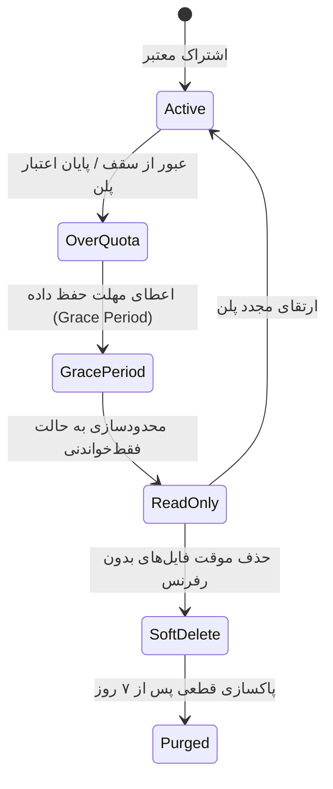
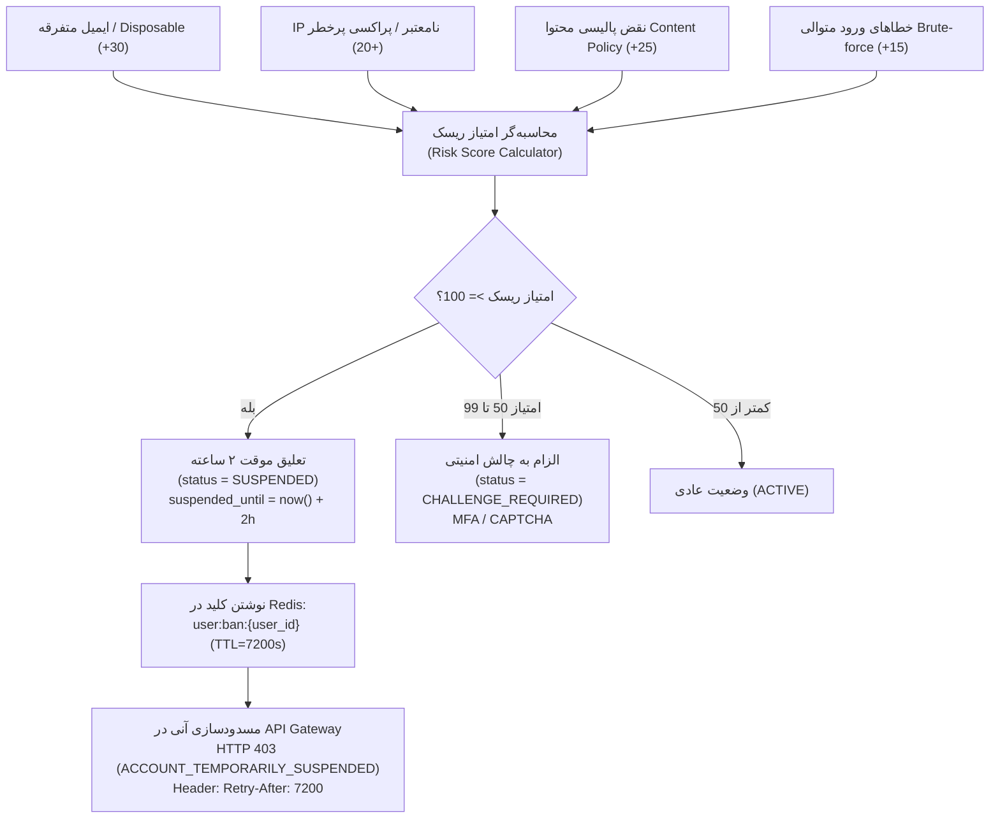

| فیلد / Field | مقدار / Value |
| :--- | :--- |
| **Title (EN)** | Entitlements, Storage Quotas, Retention & Access Governance |
| **Title (FA)** | مدیریت دسترسی‌ها، سهمیه‌ها، دوره نگهداری فایل‌ها و حاکمیت سهمیه تیمی |
| **ID** | DOC-BE-008 |
| **Category** | `backend` |
| **Status** | `Approved` |
| **Owner** | Backend, Platform & Security Team |
| **Last Updated** | 2026-10-01 |
| **Summary (EN)** | Authoritative specification for IAM Entitlement Grants, machine-readable plan matrix, storage quotas, retention policies, over-quota lifecycle, team credit pooling, gateway rate limiting, and promo/referral governance per ADR-011. |
| **Summary (FA)** | مشخصات مرجع مدل اعطای دسترسی IAM (Entitlement Grants)، ماتریس ماشین‌خوان پلن‌ها، سهمیه فضا، دوره نگهداری، چرخه اور-کوتا، تسهیم کردیت در تیم، ریت‌لیمیتینگ گیت‌وی و حاکمیت پرومو و رفرال مصوب ADR-011. |
| **Tags** | `backend`, `entitlements`, `iam`, `quotas`, `retention`, `team-sharing`, `rate-limiting`, `promo`, `referral` |

---

# مدیریت دسترسی‌ها، سهمیه‌ها، دوره نگهداری و حاکمیت سازمانی (Entitlements & Quotas)

> **اصل بنیادین جداسازی سهمیه از پلن (Grant Abstraction Invariant):**  
> سهمیه‌ها و اختیارات کاربری به صورت مستقیم و سخت به پلن اشتراک متصل نمی‌شوند؛ بلکه از طریق مدل **اعطای امتیاز (Entitlement Grant)** در لایه IAM مدیریت می‌گردند. سهمیه مؤثر کاربر حاصل‌جمع جبری کلیه Grantهای معتبر و فعال وی (پلن، افزونه‌ها، هدایا و ارتقاهای موقت) است.

---

## ۱. مدل داده اعطای امتیاز (Entitlement Grant Model - C3.4)

هرگونه سهمیه فضا، کردیت، تعداد پروژه یا همزمانی جاب در قالب ساختار استاندارد زیر صادر می‌شود:

| فیلد | نوع داده | توضیح |
|---|---|---|
| `grant_id` | `string` (ULID) | شناسه یکتای امتیاز |
| `subject_type` | `enum` | نوع دارنده: `USER`، `WORKSPACE` |
| `subject_id` | `string` | شناسه کاربر یا فضای کاری |
| `resource` | `string` | منبع هدف: `storage_bytes`، `credits`، `active_projects`، `concurrency` |
| `amount` | `int64` | مقدار تخصیص‌یافته (مثلاً ۵۰ گیگابایت به بایت) |
| `source` | `enum` | خاستگاه امتیاز: `PLAN`، `ADDON`، `MANUAL`، `PROMO`، `REFERRAL` |
| `valid_from` | `timestamp` | زمان آغاز اعتبار |
| `valid_until`| `timestamp` | زمان انقضای امتیاز |
| `status` | `enum` | وضعیت: `ACTIVE`، `EXPIRED`، `REVOKED` |

---

## ۲. ماتریس ماشین‌خوان پلن‌ها و قابلیت‌ها (Entitlements Matrix - D2.2)

تعاریف پیش‌فرض پلن‌ها در یک سند ماشین‌خوان (YAML/Proto) به عنوان منبع حقیقت مشترک برای فرانت‌اند، گیت‌وی و میکروسرویس‌ها نگهداری می‌شود:

```yaml
plans:
  free:
    display_name: "رایگان"
    default_grants:
      storage_bytes: 5368709120       # 5 GB
      concurrency: 1
      active_projects: 3
    features:
      design_mode: true
      export_resolution_max: "1080p"
      allow_custom_byo: false

  pro:
    display_name: "حرفه‌ای"
    default_grants:
      storage_bytes: 107374182400     # 100 GB
      concurrency: 4
      active_projects: -1             # نامحدود
    features:
      design_mode: true
      export_resolution_max: "4K"
      allow_custom_byo: true

  team:
    display_name: "سازمانی / تیم"
    default_grants:
      storage_bytes: 1073741824000    # 1 TB
      concurrency: 16
      active_projects: -1
    features:
      team_pooling: true
      audit_logs: true
      dedicated_egress: true
```

---

## ۳. سیاست دوره نگهداری، سقف فضا و چرخه Over-Quota (C3.4 & D2.5)

برای جلوگیری از انباشت بی‌رویه فایل‌ها و محافظت همزمان از داده‌های کاربران:



### قواعد چرخه عمر فایل‌ها و پروژه‌ها:
1. **وضعیت Over-Quota (مازاد مصرف):** با پایان اعتبار پلن، کاربر وارد وضعیت اضافه مصرف می‌شود. در این حالت:
   - مشاهده، دانلود فایل‌ها، حذف و Duplicate مجاز است.
   - آپلود فایل جدید و اجرای تولیدات هوش مصنوعی جدید مسدود می‌گردد.
2. **عدم حذف ناگهانی:** داده‌های کاربران هرگز بلافاصله حذف نمی‌شوند. یک دوره مهلت (Grace Period - پیش‌فرض ۳۰ روز) همراه با اعلان‌های شمارش معکوس به کاربر اعطا می‌شود تا پروژه‌های فعال خود را انتخاب کند.
3. **فایل‌های رفرنس‌دار در برابر رهاشده:** مدیاهایی که به نودهای یک پروژه زنده متصل هستند هرگز حذف نمی‌شوند. فایل‌های خروجی رهاشده (بدون رفرنس به هیچ پروژه‌ای) در پلن رایگان پس از ۳۰ روز به مرحله Soft-Delete (۷ روزه) و سپس Purge می‌روند.
4. **ذخیره‌سازی سرد (Cold Storage):** فایل‌های پروژه‌های بدون فعالیت بیش از ۳۰ روز به باکت‌های آرشیو با هزینه کمتر منتقل می‌شوند.
5. **هشدارهای زودهنگام:** سیستم در ظرفیت‌های ۸۰٪ و ۹۵٪ اعلان هشدار را به کاربر و مدیر سازمان ارسال می‌کند.

---

## ۴. سیاست تسهیم و مدیریت کردیت در تیم (Team Credit Sharing - D2.6)

مدیران سازمان برای مدیریت مصرف اعضای تیم دو ابزار در اختیار دارند:
1. **استخر مشترک با سقف فردی (Pooled Quota with Member Cap):**  
   تمامی اعضا از استخر اعتباری سازمان استفاده می‌کنند اما ادمین می‌تواند برای هر عضو سقف ماهانه تعیین کند. رسیدن به ۸۰٪ سقف با اخطار همراه بوده و عبور از ۱۰۰٪ به توقف سخت (Hard Stop) منجر می‌شود.
2. **تخصیص مستقیم (Direct Member Allocation):**  
   انتقال مستقیم بخش مشخصی از کردیت سازمان به کیف‌پول عضو به عنوان تنخواه مستقل، که در دفترکل با نوع `GRANT` یا `ADJUST` ثبت می‌گردد.

---

## ۵. معماری ریت‌لیمیتینگ گیت‌وی با پروفایل‌های IAM (Rate Limiting - E4.2)

1. **تفکیک منبع تصمیم‌گیری از اجرا:**  
   - **مرجع پروفایل:** سرویس IAM مشخص‌کننده `RateLimitProfile` هر کاربر، کلید API یا سازمان است.
   - **مجری ریت‌لیمیت:** گیت‌وی ورودی (Envoy / Gateway) با استفاده از اسکریپت Token Bucket یا Sliding Window در Redis محدودیت را اعمال می‌کند و برای هر درخواست با IAM تماس نمی‌گیرد (پروفایل‌ها کش می‌شوند).
2. **سیاست‌های اعمالی:**
   - درخواست‌های ناشناس: بر مبنای IP.
   - درخواست‌های احرازشده: بر مبنای `user_id`، `workspace_id` و `api_key_id`.
   - وزن‌دهی به اندپوینت‌ها: فراخوانی‌های سنگین تولید و رندر وزن بالاتری در مصرف توکن ریت‌لیمیت دارند.
   - هدرهای استاندارد: ارسال همیشگی هدرهای استاندارد `RateLimit-Limit`، `RateLimit-Remaining` و `Retry-After`.

---

## ۶. ماتریس نقش‌های کاربری، دامنه‌های فضاهای کاری و تجرید IAM (مصوب ADR-010)

### ۱. ماتریس نقش‌ها و اختیارات سازمانی (`Workspace Roles`)
| نقش | اختیارات و مجوزها | سطح دسترسی مالی و والت |
|---|---|---|
| **`owner`** | مالک کامل سازمان؛ حذف فضا، تغییر مالک، تغییر سیاست مالی، تنظیمات پیشرفته | دسترسی کامل به شارژ والت و تغییر سیاست پرداخت |
| **`admin`** | دعوت اعضا، لغو عضویت، مدیریت نقش‌ها، تعیین سقف اعتبار ماهانه، تغییر تنظیمات | مشاهده وضعیت والت و مدیریت سقف بودجه اعضا |
| **`editor`** | ایجاد، ویرایش و حذف پروژه‌ها و بوم‌ها، اجرای گراف نودها، تولید محتوا | مصرف از اعتبار سازمان یا والت شخصی طبق پالیسی |
| **`runner`** | اجرای گراف روی پروژه‌های موجود و مشاهده خروجی‌ها بدون حق ویرایش ساختار بوم | مصرف از اعتبار سازمان طبق سهمیه تعیین‌شده |
| **`viewer`** | مشاهده بوم، پروژه‌ها و دانلود خروجی‌های نهایی بدون حق ویرایش یا اجرای گراف | فاقد دسترسی مصرف اعتبار |

### ۲. سیاست رفتار هنگام اتمام اعتبار سازمان (`on_wallet_empty`)
در جدول `workspaces`، ستون رسمی `on_wallet_empty` رفتار سیستم را در زمان خالی بودن کیف‌پول سازمان تعیین می‌کند:
1. **`block` (پیش‌فرض امنیتی):** هرگونه درخواست اجرای کار توسط اعضا با خطای صریح `WORKSPACE_WALLET_EMPTY` بلافاصله مسدود می‌شود.
2. **`member_fallback` (اختیاری و مشروط):** در صورت صفر شدن اعتبار سازمان، سیستم به کیف‌پول شخصی عضو مراجعه می‌کند. این حالت صرفاً در صورتی فعال می‌شود که هم مدیر سازمان آن را مجاز کرده باشد و هم عضو رضایت صریح خود را در `member_fallback_consents` ثبت کرده باشد.

### ۳. الگوی تجرید دسترسی با اینترفیس انتزاعی (`PermissionManager`)
برای جداسازی کامل منطق دامنه `workspace-service` از زیرساخت‌های متغیر IAM:
- **`ports.PermissionManager`:** اینترفیس ارزیابی و انتساب نقش‌ها در لایه پورت‌ها.
- **`LocalMembershipAdapter`:** آداپتور پیش‌فرض محلی که مستقیماً جداول `workspace_memberships` را در دیتابیس `lemmo_workspace` بررسی می‌کند و با هدرهای توسعه `X-Mock-Roles` یکپارچه است.
- **`KetoPermissionAdapter`:** آداپتور متصل به کانتینر Ory Keto که در صورت تنظیم متغیر `KETO_ENDPOINT` روابط ReBAC را در Keto همگام می‌نماید.

---

## ۷. حاکمیت کدهای هدیه و امتیازهای معرفی (Promo & Referral Governance - مصوب ADR-011)

### ۱. تفکیک معماری شارژ اعتبار از تخفیف سبد خرید
1. **اعتبار توکنی (Token Grant):** از طریق `quota-service` مستقیماً به شکل یک سطل (Bucket) با `source = PROMO` یا `source = REFERRAL` با تاریخ انقضای صریح به کیف‌پول کاربر یا سازمان واریز می‌شود. این سطل‌ها طبق الگوریتم FEFO در اولویت مصرف قرار می‌گیرند.
2. **تخفیف اشتراک (Checkout Plan Discount):** از طریق `billing-service` در مرحله نهایی خرید اشتراک اعمال شده و درصد یا مبلغ کسرشده را در فاکتور رسمی ثبت می‌نماید.

### ۲. قوانین منع انباشت و رفتارهای ضدتقلب
- **قانون تک‌بار مصرف (Single-Use per Account):** هر کد تبلیغاتی یا بن هدیه صرفاً یک‌بار توسط هر شناسه کاربری (`user_id`) قابل اعمال است.
- **منع انباشت (Non-Stackable Policy):** اعمال همزمان دو کد تخفیف روی یک تراکنش خرید اشتراک غیرمجاز است.
- **تشخیص هویت تکراری (Anti-Sybil):** کدهای هدیه ثبت‌نام و معرفی کاربر (P2P Referral) بر اساس تطابق اثرانگشت دستگاه، شماره تلفن وریفای‌شده و IP جهت پیشگیری از ساخت اکانت‌های جعلی مانیتور می‌شوند.

---

## ۸. موتور حاکمیت قوانین، امتیازدهی ریسک و تعلیق موقت حساب (Abuse, Risk Scoring & Temporary Ban)

برای محافظت از منابع پردازشی هوش مصنوعی و مقابله با رفتارهای مخرب، سیستم امنیت و انطباق پلتفرم از سازوکار امتیازدهی ریسک و تعلیق پویا بهره می‌گیرد:



### ۱. ماتریس متغیرهای امتیاز ریسک (`risk_score`)
امتیاز ریسک کاربر در بازه ۰ تا ۱۰۰ محاسبه شده و بر اساس رخدادهای زیر به‌روزرسانی می‌شود:
| رخداد رفتاری یا امنیتی | وزن ریسک | منبع تشخیص | اقدام اصلاحی یا کاهنده |
|---|---|---|---|
| دامنه‌های ایمیل موقت / یک‌بارمصرف (Disposable Burner) | +۳۰ امتیاز | `auth-service` / Kratos | تغییر ایمیل به دامنه معتبر |
| آدرس IP مشکوک، خروجی Tor یا دیتا سنتر غیرمعمول | +۲۰ امتیاز | `infra/gateway` | ورود موفق با اثرانگشت دستگاه شناخته‌شده |
| نقض قوانین محتوای هوش مصنوعی (`CONTENT_POLICY_VIOLATION_PROVIDER`) | +۲۵ امتیاز | `image-service` / `orchestrator-service` | گذشت دوره سرد شدن (Cool-down) ۲۴ ساعته |
| تلاش‌های ناموفق مکرر ورود یا خطاهای پیاپی توکن | +۱۵ امتیاز | `auth-service` / گیت‌وی | احراز موفق دو‌مرحله‌ای (MFA) |

### ۲. سطوح پاسخ خودکار سیستم (Automated Response Tiers)
1. **سطح سبز (امتیاز ۰ تا ۴۹ - `ACTIVE`):** وضعیت عادی کاربری بدون هیچ محدودیت.
2. **سطح زرد (امتیاز ۵۰ تا ۹۹ - `CHALLENGE_REQUIRED`):** ادامه دسترسی مشروط به اثبات هویت است. درخواست‌های بعدی توسط گیت‌وی با کد وضعیت ۴۰۱ یا ۴۰۳ مشروط متوقف شده و کاربر ملزم به حل چالش CAPTCHA/Turnstile یا ورود کد یکبارمصرف دومرحله‌ای (Step-Up Authentication) می‌گردد.
3. **سطح قرمز (امتیاز ۱۰۰ - `SUSPENDED`):** 
   - کاربر وارد وضعیت تعلیق موقت (پیش‌فرض ۲ ساعت) می‌شود.
   - ستون `suspended_until` در دیتابیس با زمان آینده (UTC) مهر زمانی می‌خورد.
   - کلید تحریم با زمان انقضای منطبق (`user:ban:{user_id}`) در Redis نوشته می‌شود تا گیت‌وی بدون فشار به دیتابیس، کلیه درخواست‌های آینده کلاینت را در لبه شبکه با پاسخ ۴۰۳ و هدر `Retry-After: 7200` مسدود کند.
   - با سپری شدن ۲ ساعت و انقضای کلید، وضعیت کاربر به صورت خودکار به `ACTIVE` بازگشته و امتیاز ریسک به مقدار پایه (۵۰) تنزل می‌یابد.


