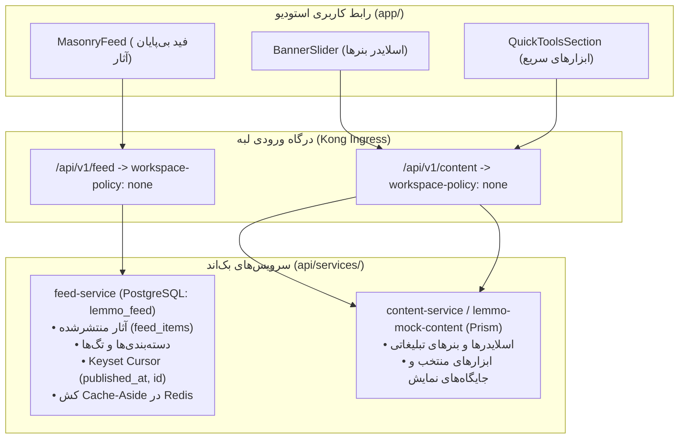

| فیلد / Field | مقدار / Value |
| :--- | :--- |
| **Title (EN)** | Feed Service & Platform Content Architecture, OpenAPI Contracts & Dual-Port Specification |
| **Title (FA)** | معماری میکروسرویس فید، قراردادهای محتوای پلتفرم و مشخصات سرور دوگانه |
| **ID** | DOC-BE-010 |
| **Category** | `backend` |
| **Status** | `Approved` |
| **Owner** | Core Architecture & Platform Team / @platform |
| **Last Updated** | 2026-10-07 |
| **Summary (EN)** | Authoritative specification for Stage 14: Establishes clean architectural boundaries between Feed Service (generative artworks, tags, keyset pagination, Redis cache-aside) and Platform Content (banners, featured slides, showcase tools). Mandates workspace-policy: none, explicit 5-state authentication handling, opaque (published_at, id) cursor tokens, core/bootstrap DualServer lifecycle (coordinated gRPC + HTTP), and two-phase delivery (Stage 14A contracts & core bootstrap, Stage 14B feed service implementation). |
| **Summary (FA)** | سند مرجع و مشخصات معماری مرحله ۱۴: تفکیک مرزهای معماری پاک میان سرویس فید (آثار هنری، تگ‌ها، صفحه‌بندی Keyset، کش ردیس) و محتوای پلتفرم (بنرها، اسلایدها، ابزارهای منتخب). الزام سیاست workspace-policy: none، رفتار ۵‌گانه هویت، نشانگرهای غیرشفاف (published_at, id)، چرخه حیات سرور دوگانه در core/bootstrap و اجرای دو فازی (مرحله 14A قراردادها، هسته و ماک محتوا؛ مرحله 14B پیاده‌سازی سرویس فید). |
| **Tags** | `backend`, `feed-service`, `content-service`, `keyset-pagination`, `dual-server`, `core-bootstrap`, `spec`, `stage14` |

---

# DOC-BE-010: معماری میکروسرویس فید، قراردادهای محتوای پلتفرم و مشخصات سرور دوگانه

> **مرجعیت حاکمیتی (Governance Authority):**  
> این سند پیرو مصوبات [ADR-017](../01-architecture/decisions/ADR-017-phase2-realignment-feed-tools-agent-server-deployment.md) و تصمیمات مصوب OQ-042 تا OQ-049 تدوین شده و **منبع واحد حقیقت (SSOT)** برای معماری، اسکیما دیتابیس، قراردادهای ارتباطی و زیرساخت سرویس فید و محتوای پلتفرم در پلتفرم Lemmo است.

---

## ۱. اهداف و تفکیک مرزهای دامنه (Domain Boundaries)

طبق تصمیم مصوب OQ-042 و OQ-047، مسئولیت‌های بصری لندینگ استودیو به دو دامنه مستقل تفکیک می‌گردد:



### ۱.۱. مرز مسئولیت `feed-service`
1. مالکیت کامل کلیه آثار هنری منتشرشده، عنوان و پرامپت دوزبانه (EN/FA)، مشخصات مدل، نسبت تصویر، ابعاد، و شمارنده‌های عمومی (Likes, Views).
2. پایگاه‌داده اختصاصی `lemmo_feed` در PostgreSQL (شامل جدول `feed_items`).
3. ارائه خروجی با صفحه‌بندی قطعی Keyset Cursor مبتنی بر `(published_at, id)` با فیلدهای الزامی `items`, `next_cursor`, `has_more`.
4. کشینگ لبه Cache-Aside در Redis با TTL شصت ثانیه‌ای و ابطال نسخه‌محور.

### ۱.۲. مرز مسئولیت `content-service` (در فاز ۲ با ماک استاندارد Prism)
1. مالکیت بنرهای متحرک بالای صفحه، اسلایدهای معرفی قابلیت‌ها، و کارت‌های ابزارهای پرکاربرد (`quick_tools`).
2. تعریف قرارداد در `contracts/openapi/content/v1/openapi.yaml` و استقرار کانتینر سبک `lemmo-mock-content` با `stoplight/prism:5`.
3. استقلال کامل از فید؛ اختلال یا تغییر در بنرها هرگز دریافت و نمایش فید آثار را متوقف نمی‌سازد.

---

## ۲. مشخصات قراردادهای OpenAPI و سیاست‌های دسترسی

### ۲.۱. قرارداد اصلاح‌شده فید (`contracts/openapi/feed/v1/openapi.yaml`)
- **سیاست ورک‌اسپیس:** `x-lemmo-workspace-policy: none` (هیچ هدر ورک‌اسپیسی پردازش نمی‌شود و گیت‌وی هدر `X-Workspace-ID` را حذف می‌کند).
- **احراز هویت:** اختیاری (Optional)؛ دسترسی ناشناس مجاز است اما در صورت ارسال توکن، اعتبار آن باید بررسی شود.
- **مسیر فهرست فید:** `GET /api/v1/feed`
  - **پارامترهای ورودی:**
    - `category` (اختیاری، string): فیلتر بر اساس دسته‌بندی (`all`, `photoreal`, `stylized`, `architecture`, `concept`).
    - `limit` (اختیاری، integer، پیش‌فرض ۲۰، حداکثر ۵۰).
    - `cursor` (اختیاری، string): نشانگر غیرشفاف Base64 شامل زمان انتشار و شناسه اثر.
    - *ارسال پارامتر `page` ممنوع بوده و با خطای ۴۰۰ مواجه می‌شود.*
  - **بدنه پاسخ موفق (200 OK):**
    ```json
    {
      "items": [
        {
          "id": "feed-1",
          "title": "Neon Solarpunk Metropolis",
          "titleFa": "کلان‌شهر نئونی سولارپانک",
          "prompt": "Futuristic solarpunk city with towering biophilic mushroom architecture",
          "image": "https://storage.lemmo.cloud/public/feed/solarpunk.webp",
          "author": "Elena Rostova",
          "authorHandle": "elena_r",
          "avatar": "https://storage.lemmo.cloud/public/avatars/elena.webp",
          "category": "photoreal",
          "aspectRatio": "16:9",
          "width": 1920,
          "height": 1080,
          "likes": 3890,
          "views": 14200,
          "model": "Flux Dev",
          "publishedAt": "2026-10-01T12:00:00Z"
        }
      ],
      "next_cursor": "eyJwdWJsaXNoZWRfYXQiOiIyMDI2LTEwLTAxVDEyOjAwOjAwWiIsImlkIjoiZmVlZC0xIn0=",
      "has_more": true
    }
    ```
    *نکته حاکمیتی:* فیلدهای `next_cursor` (از نوع `string | null`) و `has_more` (از نوع `boolean`) الزامی هستند.

### ۲.۲. رفتار ۵‌گانه کانتکست هویت در سرویس فید (OQ-045)
1. **بدون اعتبارنامه:** تحویل فید عمومی به عنوان کاربر مهمان (Guest).
2. **با توکن/نشست معتبر:** تحویل فید عمومی همراه با ثبت کانتکست هویت امن (`X-User-ID` از گیت‌وی).
3. **با توکن منقضی یا نامعتبر:** بازگرداندن پاسخ صریح ۴۰۱ (منع تبدیل خاموش به مهمان).
4. **کاربر معلق:** بازگرداندن خطای ۴۰۳ بر اساس خط‌مشی تعلیق.
5. **خطای زیرساخت هویت:** بازگرداندن خطای ۵۰۳ جهت تلاش مجدد کلاینت (Fail-Closed).

---

## ۳. معماری پایگاه‌داده و مایگریشن‌ها (`lemmo_feed`)

### ۳.۱. جدول آثار فید (`feed_items`)
```sql
CREATE TABLE feed_items (
    id VARCHAR(64) PRIMARY KEY,
    title VARCHAR(255) NOT NULL,
    title_fa VARCHAR(255) NOT NULL,
    prompt TEXT NOT NULL,
    prompt_fa TEXT,
    image_url TEXT NOT NULL,
    thumbnail_url TEXT,
    author_name VARCHAR(128) NOT NULL,
    author_handle VARCHAR(64) NOT NULL,
    avatar_url TEXT,
    category VARCHAR(64) NOT NULL DEFAULT 'all',
    aspect_ratio VARCHAR(16) NOT NULL DEFAULT '1:1',
    width INTEGER NOT NULL DEFAULT 1024,
    height INTEGER NOT NULL DEFAULT 1024,
    likes_count INTEGER NOT NULL DEFAULT 0,
    views_count INTEGER NOT NULL DEFAULT 0,
    model_name VARCHAR(128) NOT NULL,
    is_published BOOLEAN NOT NULL DEFAULT TRUE,
    published_at TIMESTAMPTZ NOT NULL DEFAULT NOW(),
    created_at TIMESTAMPTZ NOT NULL DEFAULT NOW(),
    updated_at TIMESTAMPTZ NOT NULL DEFAULT NOW()
);

-- ایندکس کامپوزیت کارآمد برای Keyset Pagination
CREATE INDEX idx_feed_items_category_keyset 
ON feed_items (category, published_at DESC, id DESC) 
WHERE is_published = TRUE;

CREATE INDEX idx_feed_items_all_keyset 
ON feed_items (published_at DESC, id DESC) 
WHERE is_published = TRUE;
```

---

## ۴. استراتژی کشینگ در Redis (OQ-043)

1. **الگوی Cache-Aside با Singleflight:**
   درخواست‌های خواندن ابتدا Redis را با کلید `lemmo:feed:v1:cat:{category}:c:{cursor_hash}:l:{limit}` بررسی می‌کنند. در صورت Miss شدن، از ابزار `singleflight.Group` در Go استفاده می‌شود تا تنها یک کوئری به دیتابیس زده شود و مانع هجوم همزمان به PostgreSQL گردد.
2. **مدت زمان ماندگاری (TTL):**  
   TTL پیش‌فرض ۶۰ ثانیه به همراه Jitter تصادفی بین ۰ تا ۱۵ ثانیه.
3. **ابطال مبتنی بر نسخه (Versioned Invalidation):**  
   کلید نسخه全局 `lemmo:feed:version` نگهداری می‌شود. با هر درج، تغییر یا لغو انتشار، این نسخه افزایش یافته و کلیدهای قبلی بدون نیاز به دستور پرهزینه `SCAN` به مرور توسط TTL منقضی می‌شوند.

---

## ۵. ارتقای هسته مشترک به سرور دوگانه (`core/bootstrap` — OQ-046 و OQ-049)

کتابخانه `api/core/bootstrap` باید با ساختار استاندارد `DualServer` تکمیل شود:
1. **لیسنر و پورت‌های دوگانه:** مدیریت همزمان لیسنر gRPC (پورت داخلی مثلاً `50064`) و وب‌سرور HTTP/REST (پورت خارجی مثلاً `8093`).
2. **رفتار قطعی در خطا (All-or-Nothing):** سرویس زمانی Healthy اعلام می‌شود که هر دو پورت با موفقیت بایند شوند. در صورت شکست راه‌اندازی یکی از سرورها، پروسه با خروج غیرصفر (`os.Exit(1)`) متوقف می‌شود (منع حالت نیمه‌فعال).
3. **خاموشی کنترل‌شده هماهنگ (Coordinated Graceful Shutdown):** دریافت سیگنال‌های `SIGINT`/`SIGTERM` موجب متوقف‌سازی همزمان دریافت ترافیک جدید در هر دو پورت و اعطای مهلت تخلیه (Drain Deadline مثلاً ۱۰ ثانیه) به درخواست‌های جاری می‌گردد.

---

## ۶. تفکیک مراحل اجرایی (Phased Rollout)

پیرو تصمیمات OQ-047 تا OQ-049، مرحله ۱۴ دقیقاً به دو گام متوالی تفکیک می‌شود:

### مرحله 14A: پیش‌اقدام زیرساختی، قراردادها و ماک محتوا
1. تکمیل قابلیت `DualServer` در `core/bootstrap/` و پوشش تست‌های چرخه حیات.
2. تدوین `contracts/openapi/content/v1/openapi.yaml` و استقرار کانتینر `lemmo-mock-content` در Compose و Kong.
3. اصلاح `contracts/openapi/feed/v1/openapi.yaml` (سیاست `none`، فیلدهای `next_cursor` و `has_more`، حذف بنرها).
4. تولید مجدد کلاینت Orval و هدایت `BannerSlider` و `QuickToolsSection` به `@/sdk.content`.

### مرحله 14B: پیاده‌سازی و استقرار زنده `feed-service`
1. پیاده‌سازی سرویس در `services/feed-service/` با معماری Clean Architecture در Go.
2. مایگریشن‌های دیتابیس `lemmo_feed` و بارگذاری رکوردهای اولیه باکیفیت بالا.
3. کشینگ Redis و منطق صفحه‌بندی Keyset با `(published_at, id)`.
4. حذف کانتینر `lemmo-mock-feed`، اتصال گیت‌وی به سرویس زنده و قبولی آزمون‌های E2E.
