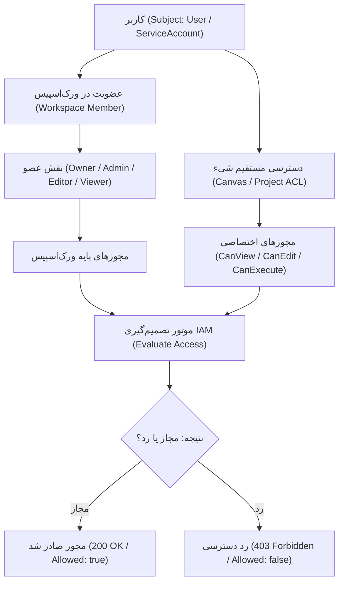
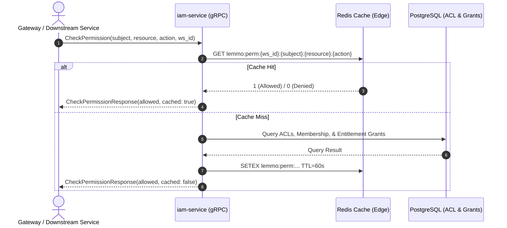

| فیلد / Field | مقدار / Value |
| :--- | :--- |
| **Title (EN)** | IAM Service Architecture & Fine-Grained Access Control Specification |
| **Title (FA)** | معماری میکروسرویس IAM، مدل دسترسی‌های دانه‌ریز و مشخصات قراردادها (استیج ۱۳) |
| **ID** | DOC-BE-009 |
| **Category** | `backend` |
| **Status** | `Approved` |
| **Owner** | Backend, Platform & Security Team |
| **Last Updated** | 2026-10-07 |
| **Summary (EN)** | Authoritative specification for Stage 13 iam-service: Fine-Grained Authorization (ReBAC/ACL), Canvas ACLs, Entitlement Grants, high-throughput Redis caching, gRPC protobuf contracts, zero-trust invariants, and regression testing standards. |
| **Summary (FA)** | مشخصات مرجع میکروسرویس iam-service در استیج ۱۳: معماری کنترل دسترسی دانه‌ریز (ReBAC/ACL)، مجوزهای بوم و نودها، مدل اعطای سهمیه و امتیازات، کشینگ پرسرعت ردیس، قراردادهای gRPC، الزامات زیرو-تراست و استانداردهای تست رگرسیون. |
| **Tags** | `backend`, `iam`, `rbac`, `rebac`, `acl`, `entitlements`, `stage13`, `security`, `zero-trust` |

---

# معماری میکروسرویس IAM و کنترل دسترسی‌های دانه‌ریز (`iam-service`) — استیج ۱۳

> **هدف و جایگاه معماری (Mission & Architecture Role):**  
> سرویس `iam-service` به عنوان مرجع واحد و رسمی تصمیم‌گیری دسترسی (PDP - Policy Decision Point) در پلتفرم Lemmo عمل می‌کند. این سرویس مسئولیت ارزیابی بلادرنگ مجوزهای دسترسی به بوم‌ها، پروژه‌ها، ورک‌اسپیس‌ها و ابزارها (Fine-Grained ReBAC/ACL) و همچنین مدیریت چرخه حیات اعطای امتیازات و سهمیه‌ها (Entitlement Grants per [DOC-BE-008](./entitlements-and-iam.md)) را بر عهده دارد.

---

## ۱. اصول تغییرناپذیر سیستم‌دیزاین و امنیت (Zero-Trust Invariants)

در طراحی و پیاده‌سازی `iam-service`، رعایت اصول زیر طبق [DOC-ARCH-011](../01-architecture/secure-system-design.md) و [DOC-BE-004](./style-guide.md) **الزامی و غیرقابل مذاکره** است:

1. **انزوای کامل چندمستأجری (Tenant Boundary Enforcement):** تمام کوئری‌ها و رکوردهای ACL و Grant در دیتابیس باید مقید به `workspace_id` باشند. هیچ مجوزی بدون تعلق صریح به یک ورک‌اسپیس قابل ثبت یا خواندن نیست.
2. **پالایش و اعتبارسنجی هویتی در لبه (Never Trust Client Headers):** `iam-service` هرگز شناسه کاربر، نقش‌ها یا ورک‌اسپیس را از هدرهای خام دریافت نمی‌کند؛ هویت منحصراً از توکن اعتبارسنجی‌شده در کنگ یا متادیتای gRPC استخراج می‌گردد.
3. **انتشار اجباری متادیتا در تماس‌های داخلی (RPC Metadata Propagation):** در صورتی که `iam-service` سرویس دیگری را فراخوانی کند، استفاده از `middleware.PropagateAuthMetadata(ctx)` اجباری است.
4. **رفتار Fail-Closed در اعطای دسترسی:** در صورت بروز هرگونه خطای دیتابیس، قطعی Redis یا ابهام در پالیسی، پاسخ پیش‌فرض سیستم قطعی و بدون‌اغماض: **عدم دسترسی (`Allowed: false` / `codes.PermissionDenied`)** است.
5. **جلوگیری از نقطه شکست تکی (High Throughput & Anti-SPOF):** برای جلوگیری از افت کارایی گیت‌وی و سایر سرویس‌ها در بررسی مکرر دسترسی‌ها، معماری کش دو سطحی (Local LRU + Redis Distributed Cache) با الگوی Cache-Aside مستقر می‌شود.

---

## ۲. مدل دسترسی و ماتریس مجوزهای بوم (Canvas & Resource ACLs)

مدل دسترسی ترکیبی از **نقش‌های مبتنی بر رابطه (ReBAC)** و **لیست کنترل دسترسی شیء (Object-Level ACL)** است:



### ماتریس مجوزهای پایه به تفکیک منابع:

| منبع (Resource) | اقدام (Action) | حداقل سطح مجاز | ارزیابی اضافی |
|---|---|---|---|
| `workspace` | `manage_members` | `OWNER`, `ADMIN` | بررسی عدم امکان حذف آخرین مالک |
| `workspace` | `view_billing` | `OWNER`, `ADMIN` | انزوای دسترسی مالی |
| `project` / `canvas` | `read` | `VIEWER` یا ACL مستقیم | بررسی عمومی بودن پروژه در Showcase |
| `project` / `canvas` | `write` / `update` | `EDITOR` یا ACL مستقیم | بررسی قفل ویرایش همزمان |
| `project` / `canvas` | `execute_workflow` | `EDITOR` یا Grant سهمیه | بررسی مانده کردیت فعال |
| `node` / `custom_tool` | `execute` | `MEMBER` | بررسی BYO Key یا پلن فعال |

---

## ۳. معماری کشینگ پرسرعت مجوزها (Redis Cache-Aside Architecture)

برای تضمین زمان پاسخ زیر ۵ میلی‌ثانیه در گیت‌وی و سرویس‌ها:



### استراتژی ابطال کش (Cache Invalidation Invariants):
1. **تغییر نقش یا خروج عضو از ورک‌اسپیس:** ارسال دستور `DEL lemmo:perm:{ws_id}:{subject}:*` در ردیس.
2. **تغییر ACL پروژه:** ابطال کش‌های مرتبط با همان پروژه.
3. **زمان انقضای امنیتی (TTL):** حداکثر TTL کلیدهای تصمیم دسترسی در Redis معادل **۶۰ ثانیه** است تا حتی در غیاب رخداد ابطال، تاخیر همگام‌سازی بیش از ۱ دقیقه نشود.

---

## ۴. قراردادهای پروتوباف و اینترفیس gRPC (`iam.proto`)

قرارداد مرجع در فایل `contracts/lemmo/v1/iam.proto` مستقر می‌گردد:

```protobuf
syntax = "proto3";

package lemmo.v1;

option go_package = "github.com/lemmo-lab/api/contracts/lemmo/v1;lemmov1";

service IAMService {
  // بررسی تکی دسترسی (پرسرعت)
  rpc CheckPermission(CheckPermissionRequest) returns (CheckPermissionResponse);

  // بررسی دسته‌ای دسترسی‌ها برای بهینه‌سازی رندرهای فرانت‌اند و گیت‌وی
  rpc BatchCheckPermissions(BatchCheckPermissionsRequest) returns (BatchCheckPermissionsResponse);

  // ثبت یا به‌روزرسانی دسترسی مستقیم روی شیء (Canvas ACL)
  rpc SetResourceAccess(SetResourceAccessRequest) returns (SetResourceAccessResponse);

  // حذف دسترسی مستقیم کاربر از روی شیء
  rpc RevokeResourceAccess(RevokeResourceAccessRequest) returns (RevokeResourceAccessResponse);

  // استعلام سهمیه‌ها و اعطای امتیازات فعال کاربر/ورک‌اسپیس (Entitlement Grants per DOC-BE-008)
  rpc ListActiveGrants(ListActiveGrantsRequest) returns (ListActiveGrantsResponse);

  // صدور اعطای امتیاز جدید (توسط ادمین یا سیستم صدور پلن)
  rpc IssueEntitlementGrant(IssueEntitlementGrantRequest) returns (IssueEntitlementGrantResponse);
}

message CheckPermissionRequest {
  string subject_id = 1;
  string workspace_id = 2;
  string resource_type = 3; // "project", "workspace", "tool"
  string resource_id = 4;
  string action = 5;        // "read", "write", "execute", "admin"
}

message CheckPermissionResponse {
  bool allowed = 1;
  string reason = 2;
  bool is_cached = 3;
}

message BatchCheckPermissionsRequest {
  string subject_id = 1;
  string workspace_id = 2;
  repeated ResourceAction items = 3;
}

message ResourceAction {
  string resource_type = 1;
  string resource_id = 2;
  string action = 3;
}

message BatchCheckPermissionsResponse {
  map<string, bool> results = 1; // کلید: "resource_type:resource_id:action"
}

message SetResourceAccessRequest {
  string workspace_id = 1;
  string resource_type = 2;
  string resource_id = 3;
  string subject_id = 4;
  string role = 5; // "viewer", "editor", "admin"
}

message SetResourceAccessResponse {
  bool success = 1;
}

message RevokeResourceAccessRequest {
  string workspace_id = 1;
  string resource_type = 2;
  string resource_id = 3;
  string subject_id = 4;
}

message RevokeResourceAccessResponse {
  bool success = 1;
}

message ListActiveGrantsRequest {
  string workspace_id = 1;
  string subject_id = 2;
}

message EntitlementGrant {
  string grant_id = 1;
  string subject_type = 2;
  string subject_id = 3;
  string resource = 4;
  int64 amount = 5;
  string source = 6;
  int64 valid_from_unix = 7;
  int64 valid_until_unix = 8;
  string status = 9;
}

message ListActiveGrantsResponse {
  repeated EntitlementGrant grants = 1;
}

message IssueEntitlementGrantRequest {
  string workspace_id = 1;
  string subject_id = 2;
  string subject_type = 3;
  string resource = 4;
  int64 amount = 5;
  string source = 6;
  int64 duration_seconds = 7;
}

message IssueEntitlementGrantResponse {
  EntitlementGrant grant = 1;
}
```

---

## ۵. اسکیما دیتابیس و مایگریشن‌های اولیه (`migrations/`)

مایگریشن‌های دیتابیس در `services/iam-service/migrations/` با رعایت قیدهای یکتایی مرکب مقید به ورک‌اسپیس مستقر می‌شوند:

### `000001_create_iam_schema.up.sql`
```sql
-- جدول دسترسی‌های مستقیم شیء (Resource ACLs)
CREATE TABLE IF NOT EXISTS resource_acls (
    id VARCHAR(64) PRIMARY KEY,
    workspace_id VARCHAR(64) NOT NULL,
    resource_type VARCHAR(32) NOT NULL,
    resource_id VARCHAR(64) NOT NULL,
    subject_id VARCHAR(64) NOT NULL,
    role VARCHAR(32) NOT NULL,
    created_at TIMESTAMPTZ NOT NULL DEFAULT NOW(),
    updated_at TIMESTAMPTZ NOT NULL DEFAULT NOW(),
    CONSTRAINT uq_resource_subject UNIQUE (workspace_id, resource_type, resource_id, subject_id)
);

CREATE INDEX IF NOT EXISTS idx_resource_acls_lookup 
ON resource_acls(workspace_id, subject_id, resource_type, resource_id);

-- جدول اعطای امتیازات (Entitlement Grants per DOC-BE-008)
CREATE TABLE IF NOT EXISTS entitlement_grants (
    grant_id VARCHAR(64) PRIMARY KEY,
    workspace_id VARCHAR(64) NOT NULL,
    subject_type VARCHAR(32) NOT NULL,
    subject_id VARCHAR(64) NOT NULL,
    resource VARCHAR(64) NOT NULL,
    amount BIGINT NOT NULL,
    source VARCHAR(32) NOT NULL,
    valid_from TIMESTAMPTZ NOT NULL DEFAULT NOW(),
    valid_until TIMESTAMPTZ NOT NULL,
    status VARCHAR(32) NOT NULL DEFAULT 'ACTIVE',
    created_at TIMESTAMPTZ NOT NULL DEFAULT NOW(),
    updated_at TIMESTAMPTZ NOT NULL DEFAULT NOW()
);

CREATE INDEX IF NOT EXISTS idx_entitlement_grants_active 
ON entitlement_grants(workspace_id, subject_id, resource, status) 
WHERE status = 'ACTIVE';
```

---

## ۶. گیت‌های پذیرش امنیتی پیش از اتمام استیج ۱۳ (Security Quality Gates)

پیاده‌سازی استیج ۱۳ تنها در صورتی مجاز به ادغام در `main` خواهد بود که کلیه آزمون‌های زیر در تست سوییت آن پاس شوند:

1. **[Gate-1] ثبت اینترسپتورهای احراز هویت:** ثبت قطعی `middleware.UnaryServerAuthInterceptor()` روی سرور gRPC.
2. **[Gate-2] ایزولاسیون تننت:** تایید رد دسترسی با خطای `codes.PermissionDenied` زمانی که کاربری از ورک‌اسپیس A قصد استعلام یا تخصیص ACL در ورک‌اسپیس B را داشته باشد.
3. **[Gate-3] آزمون رفتار Fail-Closed:** شبیه‌سازی قطعی دیتابیس یا ردیس و اثبات اینکه متد `CheckPermission` دسترسی را بلاک می‌کند (`Allowed: false`).
4. **[Gate-4] ابطال صحیح کش ردیس:** تایید اینکه پس از فراخوانی `RevokeResourceAccess`، کلید ردیس متناظر حذف شده و نتیجه استعلام بلافاصله منعکس می‌شود.
5. **[Gate-5] تست‌های رگرسیون ۴ گانه:** پیاده‌سازی آزمون‌های خودکار طبق استاندارد بخش ۹.۵ سند [DOC-BE-004](./style-guide.md).
