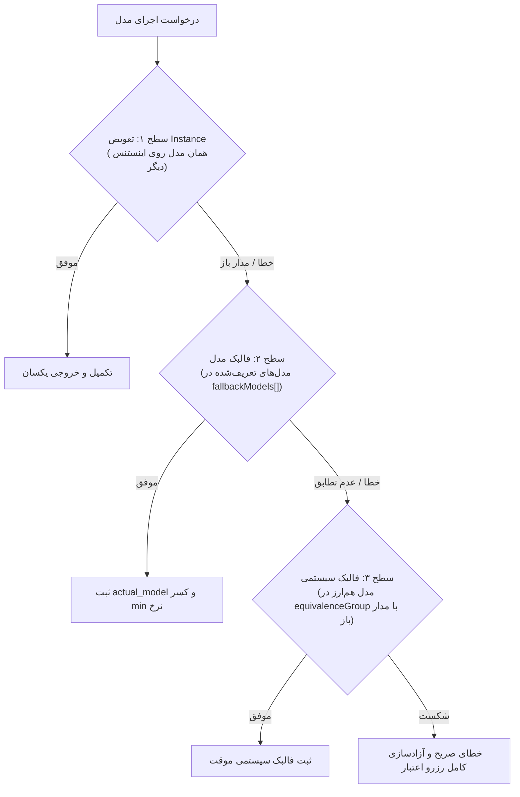
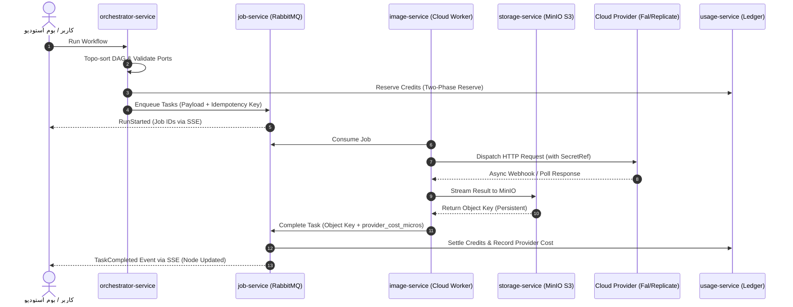

| فیلد / Field | مقدار / Value |
| :--- | :--- |
| **Title (EN)** | Multi-Provider Model Routing, Media Pipelines & Execution Architecture |
| **Title (FA)** | معماری مسیریابی مدل‌های چندپراویدری، پایپ‌لاین تولید مدیا و جریان اجرا |
| **ID** | DOC-BE-006 |
| **Category** | `backend` |
| **Status** | `Approved` |
| **Owner** | Backend & Platform Team |
| **Last Updated** | 2026-09-28 |
| **Summary (EN)** | Comprehensive architecture for cloud model routing, 4-layer provider registry, generic REST adapters, 3-level fallback, token bucket rate limiting, and async media pipeline. |
| **Summary (FA)** | معماری جامع نحوه اتصال نودها به مدل‌ها و پراویدرهای ۱۰۰٪ ابری، رجیستری ۴ لایه‌ای، آداپتورهای اعلانی REST، فالبک ۳ سطحی، ریت‌لیمیت توکن‌باکت و پایپ‌لاین ناهمگام مدیا. |
| **Tags** | `backend`, `model-routing`, `image-generation`, `cloud-providers`, `job-service`, `pipeline`, `byo` |

---

# معماری مسیریابی مدل‌های چندپراویدری، پایپ‌لاین تولید مدیا و جریان اجرا

> **اصل بنیادین هوش مصنوعی (100% Cloud Models Invariant):**  
> تمامی مدل‌های هوش مصنوعی در پلتفرم Lemmo به صورت **ابری (Cloud-Only)** هستند. هیچ مدل آفلاین یا خودمیزبان روی سرورهای ملکی اجرا نمی‌شود. ورکرهای مدیا صرفاً کلاینت‌های غیرهمگام Go برای ارتباط با API ارائه‌دهندگان ابری (مانند Fal.ai، Replicate، OpenAI و غیره) و استریم داده‌ها به فضای ذخیره‌سازی MinIO/S3 هستند.

---

## ۱. مدل چهارلایه‌ای رجیستری پراویدرها (Provider Registry Architecture)

برای به حداقل رساندن کدنویسی هنگام افزودن پراویدر یا مدل جدید و امکان اتصال کلیدهای اختصاصی کاربران (BYO)، رجیستری پراویدرها به ۴ لایه تفکیک شده است:

```
┌─────────────────────────────────────────────────────────────┐
│ 1. Provider (تعریف کلی، Modality، نگاشت I/O، نوع Auth)       │
└──────────────────────────────┬──────────────────────────────┘
                               │ ۱ به N
┌──────────────────────────────▼──────────────────────────────┐
│ 2. ProviderInstance (Base URL، secret_ref، سقف، Priority)   │
└──────────────────────────────┬──────────────────────────────┘
                               │ ۱ به N
┌──────────────────────────────▼──────────────────────────────┐
│ 3. Model (شناسه، قابلیت‌ها، Tier قیمت، fallbackModels[])     │
└──────────────────────────────┬──────────────────────────────┘
                               │ عضویت
┌──────────────────────────────▼──────────────────────────────┐
│ 4. RoutingGroup (گروه اینستنس‌های یک مدل با Circuit Breaker) │
└─────────────────────────────────────────────────────────────┘
```

1. **لایه Provider (تعریف عمومی):** مشخصات نام، پروتکل (`generic_rest` یا `custom_code`)، نگاشت ورودی/خروجی و روش دریافت نتیجه (sync، polling یا webhook). این لایه فاقد هرگونه Secret است.
2. **لایه ProviderInstance (نمونه عملیاتی):** اتصال به یک حساب خاص با `secret_ref` (ارجاع امن به SecretStore)، سقف‌های نرخ مصرف، اولویت و دامنه دسترسی (`platform`, `workspace`, `user`).
3. **لایه Model (کاتالوگ مدل‌ها):** شناسه یکتا، قابلیت‌ها، اسکیما پارامترها، نرخ پایه در Rate Card و آرایه مدل‌های فالبک (`fallbackModels[]`).
4. **لایه RoutingGroup (مسیریابی و سلامت):** توزیع بار، بررسی وضعیت سلامت (Health Check) و قطع‌کننده مدار (Circuit Breaker).

### ۱.۱. آداپتور اعلانی بدون کد (Generic REST Adapter)
افزودن پراویدرهای سازگار با استاندارد REST تنها با درج یک فایل کانفیگ اعلانی (JSON/YAML) در رجیستری و بدون کامپایل یا تغییر در کد سرویس صورت می‌گیرد. تنها پراویدرهای با پروتکل‌های نامتعارف نیازمند پیاده‌سازی کلاس `ProviderAdapter` در زبان Go هستند.

### ۱.۲. سیاست پراویدرهای اختصاصی کاربر (BYO Provider Policy)
- کاربران می‌توانند کلید اختصاصی خود را در قالب یک `ProviderInstance` با دامنه `user` یا `workspace` تعریف کنند.
- **کارمزد پلتفرم (`byo_fee`):** برای جبران هزینه صف، ارکستراسیون، پهنای باند و نگهداری فایل‌ها در S3، کارمزد ثابت مصوب در Rate Card به صورت کردیت کسر می‌شود.
- **کسر فقط روی اجرای موفق:** در صورت خطای کلید کاربر، کارمزدی اخذ نمی‌شود.
- **ممنوعیت فالبک بی‌صدا:** فالبک خودکار از کلید شخصی BYO به حساب پلتفرم ممنوع است مگر با تایید صریح کاربر.

---

## ۲. ریت‌لیمیتینگ خروجی و کنترل سهمیه پلتفرم (Rate Limiting)

برای جلوگیری از مسدود شدن حساب پلتفرم یا خطای ۴۲۹ نزد پراویدرها:
1. **الگوریتم Token Bucket در Redis:** بر روی کلید هر `provider_instance` با استفاده از اسکریپت اتمیک Lua پیاده‌سازی می‌شود. سقف‌ها مستقیماً در کانفیگ اینستنس تعریف می‌شوند و مستقل از پلن کاربر هستند.
2. **صف‌بندی عادلانه (Fair Queuing):** در صورت رسیدن به سقف یا دریافت هدر `Retry-After` از پراویدر، درخواست‌ها در صف نگه داشته شده و بر اساس صف عادلانه مجدداً ارسال می‌شوند تا هیچ کاربری صف سایرین را مسدود نکند.

---

## ۳. سلسله‌مراتب فالبک سه‌سطحی (3-Level Fallback Strategy)

فالبک در لمو یک قانون صلب نیست، بلکه کاملاً کانفیگ‌محور و شفاف است:



### قواعد حاکم بر فالبک:
1. **تطابق دقیق قابلیت‌ها:** فالبک تنها به مدلی با Modality یکسان (مثلاً تصویر به تصویر) و قابلیت تبدیل پارامترها مجاز است.
2. **شفافیت کامل در لجر:** در صورت فالبک سطوح ۲ و ۳، هر دو مقدار `requested_model` و `actual_model` در فرانت‌اند و در رکورد Ledger ثبت می‌شوند.
3. **محاسبه عادلانه کردیت:** نرخ کسر اعتبار برابر با فرمول `min(tier درخواستی، tier واقعی)` است تا کاربر بابت فالبک سیستمی متضرر نشود.

---

## ۴. چرخه حیات و نحوه مدیریت پردازش مدیاها

فرآیند پردازش مدیا کاملاً ناهمگام و رویدادمحور است:



---

## ۵. ماندگاری لینک‌ها و متد تمدید امضا (Presigned URLs & Re-signing)

- **ذخیره انحصاری Object Key:** در پایگاه‌داده پروژه و متادیتای نودها صرفاً کلید شیء (`object_key`) و شناسه Asset نگهداری می‌شود و لینک‌های موقت هرگز در دیتابیس ذخیره نمی‌گردند.
- **تولید دسته‌ای لینک در زمان خواندن:** در زمان فراخوانی پروژه، لینک‌های دانلود با TTL کوتاه‌مدت (پیش‌فرض ۱۵ دقیقه) به صورت Batch تولید می‌شوند.
- **تمدید لینک در خطای ۴۰۳:** کلاینت در مواجهه با انقضای لینک، یک‌بار اندپوینت `POST /assets/{id}/sign` را جهت دریافت لینک تازه فراخوانی می‌کند. دسترسی کاربر به پروژه پیش از صدور امضای مجدد در لایه گیت‌وی بررسی می‌شود.
