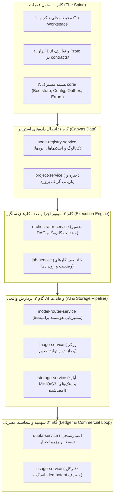

| فیلد / Field | مقدار / Value |
| :--- | :--- |
| **Title (EN)** | Backend Implementation Roadmap & Execution Plan |
| **Title (FA)** | نقشه راه و برنامه اجرایی توسعه بک‌اند Lemmo |
| **ID** | DOC-BE-005 |
| **Category** | `backend` |
| **Status** | `Approved` |
| **Owner** | Backend & Platform Team |
| **Last Updated** | 2026-09-26 |
| **Summary (EN)** | Pragmatic step-by-step roadmap for developing lemmo-api: foundational scaffolding, contracts, MVP critical path, and milestone gates. |
| **Summary (FA)** | نقشه راه گام‌به‌گام و عملیاتی توسعه بک‌اند Lemmo: اولویت‌بندی از فونداسیون، قراردادها تا مسیر حیاتی MVP و سناریوهای اتصال به فرانت‌اند. |
| **Tags** | `backend`, `roadmap`, `execution-plan`, `milestones`, `architecture` |

---

# نقشه راه و برنامه اجرایی توسعه بک‌اند (`lemmo-api`)

> ⚠️ **وضعیت پیاده‌سازی در کد (`api/`):**  
> این سند، نقشه راه اجرایی مصوب (`Status: Approved`) برای توسعه فازبندی‌شده مخزن `api/` است. در حال حاضر **هیچ‌یک از گام‌های اجرایی این نقشه راه در کد پیاده‌سازی نشده است (در حال حاضر ۰ سرویس در مخزن api وجود دارد)**. کلیه تصمیمات معماری پیش‌نیاز رسماً در [ADR-007](../01-architecture/decisions/ADR-007-backend-contracts-and-tooling-standards.md) به تصویب قطعی رسیده و پروژه آماده آغاز گام ۰ است.

این سند راهنمای عملیاتی و گام‌به‌گام برای شروع و پیشبرد مهندسی مخزن بک‌اند **Lemmo** است. هدف این نقشه راه، جلوگیری از توسعه پراکنده و زودهنگام سرویس‌های جانبی و تمرکز بر ایجاد **ستون فقرات مشترک (The Spine)** و **مسیر حیاتی MVP (The Critical Path)** است تا فرانت‌اند استودیو بتواند در سریع‌ترین زمان ممکن از داده‌های Mock به بک‌اند واقعی متصل شود.

---

## ۱. تحلیل نقطه شروع: از کجا و چرا باید شروع کنیم؟

### خطای رایج در پروژه‌های میکروسرویس
آغاز هم‌زمان نوشتن کد برای ۱۰ تا ۱۵ سرویس مختلف یا شروع از منطق تجاری یک سرویس خاص (مثل ساخت پروژه) بدون آماده‌سازی قراردادها، موجب ناهماهنگی انواع داده، کدهای تکراری برای هندل خطا و لاگ، و بازنویسی‌های مکرر می‌شود.

### رویکرد پیشنهادی: «قرارداد-محور» و «ستون‌فقرات اول» (Contract-First & Spine-First)
توسعه بک‌اند باید در ۳ فاز اصلی و ۵ گام اجرایی کلیدی صورت گیرد:

---

## ۲. گام‌های اجرایی فاز ۱ (مسیر بحرانی MVP)

### گام ۰: راه‌اندازی زیرساخت، قراردادها و هسته مشترک (هفته ۱)
> **هدف:** هر سرویسی که در آینده نوشته می‌شود، یک استاندارد واحد برای بوت‌استرپ، تنظیمات، خطاها و لاگ‌ها داشته باشد.

1. **محیط توسعه محلی (`infra/docker-compose.yml`):**
   - راه‌اندازی کانتینرهای PostgreSQL (با چند دیتابیس مجزا برای هر سرویس)، Redis، RabbitMQ و MinIO.
2. **پیکربندی قراردادها و کامپایل کد (`contracts/`):**
   - تنظیم `buf.yaml` و `buf.gen.yaml` برای تولید خودکار کدهای Go و TypeScript.
    - ثبت ساختار `EventEnvelope` و رجیستری متمرکز کدهای خطای `ErrorReason` در `contracts/platform/errors.proto` (مصوب طبق [ADR-007](../../01-architecture/decisions/ADR-007-backend-contracts-and-tooling-standards.md)).
3. **پیاده‌سازی پکیج‌های پایه در `core/` و ابزارها:**
   - `core/config`: بارگذاری سازگار از `.env` و متغیرهای محیطی.
   - `core/bootstrap`: هلپر استارت سرور gRPC و HTTP همراه با Graceful Shutdown.
   - `core/middleware`: تزریق Trace ID، ریکاوری از پنیک، لاگ ساختاریافته JSON و میدل‌ور موک احراز هویت برای محیط توسعه (`MockAuthMiddleware` با هدرهای `X-Mock-User-ID` و `X-Mock-Roles`، مصوب طبق [ADR-007](../../01-architecture/decisions/ADR-007-backend-contracts-and-tooling-standards.md)).
   - `core/outbox`: الگوی Transactional Outbox برای انتشار مطمئن پیام‌ها روی RabbitMQ.
   - پیاده‌سازی ابزار استاندارد CLI در `cmd/lemmo-cli` (`go run ./cmd/lemmo-cli service <name>`) برای اسکافولدینگ خودکار ساختار تمیز سرویس‌ها (مصوب طبق [ADR-007](../../01-architecture/decisions/ADR-007-backend-contracts-and-tooling-standards.md)).

---

### گام ۱: اتصال استودیوی طراحی به بک‌اند (هفته ۲)
> **هدف:** فرانت‌اند بتواند پروژه‌های واقعی با گراف نودها را ذخیره، لود و ویرایش کند (`NEXT_PUBLIC_API_MODE=live`).

1. **پیاده‌سازی `node-registry-service`:**
   - ارائه لیست انواع نودهای معتبر (نود متن، تولید تصویر، تغییر مقیاس، ترکیب و ...).
   - اعتبارسنجی پورت‌های ورودی و خروجی با فرمت یکپارچه Protobuf در `contracts/lemmo/v1/node.proto` و تولید خودکار تایپ‌ها برای `@/sdk` (مصوب طبق [ADR-007](../../01-architecture/decisions/ADR-007-backend-contracts-and-tooling-standards.md)).
2. **پیاده‌سازی `project-service`:**
   - جداول پایگاه‌داده: `projects`, `canvases`, `nodes`, `edges`.
   - ایجاد APIهای gRPC/REST برای CRUD پروژه، خواندن گراف و ذخیره جابجایی نودها.
3. **تست دروازه تحویل ۱ (Milestone Gate 1) — گذار از Mock به Kratos واقعی:**
   - فراخوانی موفق از سمت کلاینت استودیو (`app/`) برای ایجاد یک سند جدید و ذخیره در PostgreSQL با حالت `NEXT_PUBLIC_API_MODE=live`.
   - **گذار احراز هویت:** در این دروازه تحویل، احراز هویت استودیو از `MockAuthMiddleware` به نشست‌های واقعی Kratos (`auth-service`) متصل شده و کوکی‌های نشست کاربر اعتبارسنجی می‌شوند.

---

### گام ۲: موتور اجرا و صف کارهای ناهمگام (هفته ۳)
> **هدف:** گراف ساخته‌شده توسط کاربر اعتبارسنجی شده و کارهای سنگین درون صف قرار گیرند.

1. **پیاده‌سازی `orchestrator-service`:**
   - الگوریتم Topological Sort جهت تشخیص وابستگی‌ها و چرخه‌ها (Cycles) در گراف نودها.
   - طراحی و تعبیه اینترفیس Preflight Check سهمیه پیش از اجرا (`QuotaChecker` مصوب طبق [ADR-007](../../01-architecture/decisions/ADR-007-backend-contracts-and-tooling-standards.md) که ابتدا به صورت No-op/Stub کار می‌کند).
   - ارسال دستور اجرای نودهای آماده به صف `job-service`.
2. **پیاده‌سازی `job-service`:**
   - ثبت کارها در وضعیت‌های `QUEUED`, `RUNNING`, `COMPLETED`, `FAILED`.
   - مدیریت صف‌های RabbitMQ همراه با قابلیت Retry نمایی (Exponential Backoff).
   - ارائه وب‌سوکت یا رویداد SSE برای اعلام درصد پیشرفت کار به فرانت‌اند.
3. **تست دروازه تحویل ۲ (Milestone Gate 2):**
   - کاربر روی دکمه "Run" در بوم کلیک می‌کند؛ گراف پردازش شده و وضعیت صف در UI لحظه‌ای تغییر می‌کند.

---

### گام ۳: لایه استنتاج هوش مصنوعی و ذخیره‌سازی فایل (هفته ۴)
> **هدف:** تولید واقعی تصویر و ذخیره در آبجکت‌استوریج.

1. **پیاده‌سازی ورکر `image-service`:**
   - گوش دادن به صف‌های `job-service` برای درخواست‌های تولید و ویرایش تصویر.
   - اتصال به موتور بیرونی یا استاب مدل‌های AI (مانند Fal.ai / OpenAI DALL-E / لوکال ComfyUI).
2. **پیاده‌سازی `storage-service`:**
   - آپلود فایل خروجی رندر روی MinIO/S3.
   - تولید URL با انقضا یا CDN برای نمایش تصویر تولیدشده در کارت خروجی بوم استودیو.
3. **تست دروازه تحویل ۳ (Milestone Gate 3):**
   - اجرای کامل یک ورک‌فلو: از پرامپت ورودی تا دانلود و نمایش تصویر تولیدشده نهایی در فرانت‌اند.

---

### گام ۴: سهمیه و محاسبه اتمیک مصرف (هفته ۵)
> **هدف:** جلوگیری از سوءاستفاده، اطمینان از اعتبار کافی و تکمیل حلقه تجاری سیستم.

1. **پیاده‌سازی `quota-service`:**
   - اتصال به اینترفیس `QuotaChecker` در `orchestrator-service` (مصوب طبق [ADR-007](../../01-architecture/decisions/ADR-007-backend-contracts-and-tooling-standards.md)) و جایگزینی Stub با سرویس واقعی gRPC.
   - پیش از آغاز رندر در `orchestrator-service`، سقف اعتبار کاربر استعلام و رزرو موقت می‌شود.
2. **پیاده‌سازی `usage-service`:**
   - پس از پایان موفق هر مرحله، میزان دقیق توکن و منابع مصرف‌شده به شکل اتمیک و با کلید Idempotency ثبت می‌شود.
3. **تست دروازه تحویل ۴ (Milestone Gate 4 — MVP Sign-off):**
   - در صورت اتمام اعتبار، اجرای ورک‌فلو بلافاصله متوقف می‌شود. گزارش دقیق مصرف در داشبورد ثبت می‌گردد.

---

## ۳. ماتریس فازهای ۲ و ۳ (توسعه افقی)

پس از رسیدن به نقطه عطف فاز ۱ (MVP کامل)، توسعه افقی سیستم به ترتیب اولویت‌های تجاری زیر انجام می‌شود:

| فاز | سرویس‌های هدف | قابلیت تحویلی به محصول |
| :--- | :--- | :--- |
| **فاز ۲** | `workspace-service`, `collaboration-service`, `version-service` | فضاهای کاری شرکتی، چندکاربره هم‌زمان روی یک بوم (Real-time Canvas)، و بازگردانی نسخه‌های قبلی پروژه |
| **فاز ۲.۵** | `video-service`, `media-service` | پشتیبانی از نودهای تولید ویدیوی هوش مصنوعی و فشرده‌سازی مدیا |
| **فاز ۲.۸** | `subscription-service`, `billing-service` | درگاه‌های پرداخت، پلن‌های ماهانه و فاکتور رسمی |
| **فاز ۳** | `publish-service`, `plugin-registry-service`, `plugin-runtime-service` | امکان اکسپورت ورک‌فلو به عنوان API بیرونی و اجرای ایمن افزونه‌های توسعه‌دهندگان مستقل |

---

## ۴. چک‌لیست پذیرش و گیت‌های کیفیت (Quality Gates)

برای هر سرویسی که در این نقشه راه پیاده‌سازی می‌شود، رعایت شرایط زیر الزامی است:
- [ ] وجود فایل شناسنامه `service.md` شامل جدول مسئولیت‌ها، APIها و رویدادهای تولیدی/مصرفی.
- [ ] تست‌های واحد (Unit Tests) برای لایه `domain` و `app` با پوشش حداقل ۷۰٪.
- [ ] فایل مایگریشن مجزا (`migrations/*.sql`) با تست موفق Up و Down.
- [ ] انطباق ۱۰۰٪ با `golangci-lint` بدون هیچ خطای نادیده‌گرفته‌شده.
- [ ] فایل `Dockerfile` چندمرحله‌ای برای بیلد سبک و بهینه.
- [ ] رعایت قرارداد خطای AIP-193 و لاگ‌های ساختاریافته به زبان انگلیسی.

---

## ۵. اقدامات عملیاتی اسپرینت نخست (Immediate Sprint 1 Backlog)

برای آغاز کار روی مخزن بک‌اند، تسک‌های زیر به عنوان بسته کاری نخست پیشنهاد می‌شوند:

1. **Setup Go Workspace:** ایجاد ساختار ریشه با `go.work` یا ماژول‌های متصل در مخزن `api`.
2. **Contracts Setup:** ایجاد پوشه `contracts/` و کانفیگ فایل‌های `buf.yaml` و اسکریپت کامپایل Proto.
3. **Docker Compose Dev Stack:** ایجاد `infra/docker-compose.yml` حاوی Postgres، Redis و RabbitMQ.
4. **Core Bootstrap & Middleware:** پیاده‌سازی پکیج‌های پایه `core/bootstrap`، `core/config` و `core/middleware`.
5. **Node Registry Stub:** تعریف اولین Proto سرویس `node-registry-service` و تست فراخوانی gRPC.
