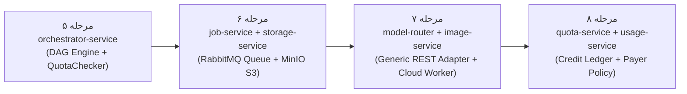

| فیلد / Field | مقدار / Value |
| :--- | :--- |
| **Title (EN)** | Backend Phased Roadmap, Milestone Gates & Service Execution Plan |
| **Title (FA)** | نقشه راه پیاده‌سازی گام‌به‌گام بک‌اند، گیت‌های کیفیت و برنامه اجرایی سرویس‌ها |
| **ID** | DOC-BE-005 |
| **Category** | `backend` |
| **Status** | `Approved` |
| **Owner** | Backend Team / @platform |
| **Last Updated** | 2026-09-28 |
| **Summary (EN)** | Authoritative backend roadmap defining Phase 1 MVP services (10 services), reordered stages 5-8, milestone quality gates (Gate 0-4), and MVP hooks. |
| **Summary (FA)** | نقشه راه مرجع پیاده‌سازی بک‌اند شامل ۱۰ سرویس فاز ۱ (MVP)، ترتیب اصلاح‌شده مراحل ۵ تا ۸، گیت‌های کنترل کیفیت (Gate 0 تا 4) و قلاب‌های توسعه‌پذیری MVP. |
| **Tags** | `backend`, `roadmap`, `milestones`, `architecture`, `services`, `mvp` |

---

# نقشه راه پیاده‌سازی گام‌به‌گام بک‌اند (Backend Roadmap & Quality Gates)

> **اصل بنیادین حاکمیت معماری (Governance Invariant):**  
> این سند، منبع واحد حقیقت (SSOT) برای گام‌های اجرایی، توالی تحویل سرویس‌ها و گیت‌های کنترل کیفیت در مخزن `api/` است. تمامی مراحل پیاده‌سازی باید دقیقاً با استانداردهای قراردادهای Proto ([DOC-BE-003](./contracts.md))، اصول کدنویسی Go Clean Architecture ([DOC-BE-004](./style-guide.md)) و خط مشی رسانه‌ها ([DOC-BE-006](./media-and-model-pipeline.md)) همگام باشند.

---

## ۱. کاتالوگ رسمی ۱۰ سرویس فاز ۱ (Phase 1 MVP Scope)

فاز ۱ پلتفرم Lemmo منحصراً شامل ۱۰ میکروسرویس زیر است. کلیه سرویس‌های دیگر (`version`, `subscription`, `plugin-runtime`, `chat`, `audit`, `notification`) مربوط به فازهای ۲، ۲.۵ و ۳ هستند:

| # | سرویس | مسئولیت و دامنه | وضعیت پیاده‌سازی |
|---|---|---|---|
| ۱ | `project-service` | ذخیره و مدیریت پروژه‌های بوم، قفل همزمانی (Optimistic Locking)، نگهداری داده‌های JSONB دیزاین و ورک‌فلو | ✅ پیاده‌شده و تست‌شده (Stage 3) |
| ۲ | `node-registry-service` | رجیستری مرکزی انواع نودها و ابزارها، پورت‌های پویا (`var:`, `lora:`, `control:`) و کاتالوگ داخلی | ✅ پیاده‌شده و تست‌شده (Stage 4) |
| ۳ | `orchestrator-service` | موتور ارزیابی و اجرای گراف‌های DAG، مرتب‌سازی توپولوژیک، ولیدیشن اتصالات و رزرو اعتبار با `QuotaChecker` | 📋 در دست اجرا (Stage 5) |
| ۴ | `job-service` | مدیریت صف‌های اجرایی ناهمگام، استیت ماشین وضعیت‌های جاب و انتشار رویدادها در RabbitMQ | 📋 برنامه‌ریزی‌شده (Stage 6) |
| ۵ | `storage-service` | مدیریت باکت‌های S3 در MinIO، دریافت امن مدیا از ورکرها، صدور Presigned URLs و متد تمدید امضا | 📋 برنامه‌ریزی‌شده (Stage 6) |
| ۶ | `model-router-service` | رجیستری ۴ لایه‌ای پراویدرها، مسیریابی هوشمند، فالبک ۳ سطحی، Token Bucket در Redis و circuit breaker | 📋 برنامه‌ریزی‌شده (Stage 7) |
| ۷ | `image-service` | ورکر ناهمگام سبک ابری جهت فراخوانی APIهای Fal/Replicate/OpenAI، پولینگ/وبهوک و آپلود به S3 | 📋 برنامه‌ریزی‌شده (Stage 7) |
| ۸ | `quota-service` | مدیریت سهمیه‌ها و اعتبارسنجی حق اجرا (Entitlement)، رزرو دوسفره اعتبار و مسدودسازی کیف‌پول خالی | 📋 برنامه‌ریزی‌شده (Stage 8) |
| ۹ | `usage-service` | سیستم دفترکل تغییرناپذیر (Credit Ledger) با مدل Bucket، ردیابی هزینه‌های دلاری پراویدر و محاسبه حاشیه سود | 📋 برنامه‌ریزی‌شده (Stage 8) |
| ۱۰ | `workspace-service` | مدیریت ورک‌اسپیس‌ها، تننت‌ها، نقش‌های کاربری پروژه و تنظیم سیاست‌های پرداخت‌کننده (Payer Policy) | 📋 برنامه‌ریزی‌شده (پایان فاز ۱) |

---

## ۲. توالی مهندسی مراحل ۵ تا ۸ (Execution Stages)

به منظور جلوگیری از بن‌بست‌های وابستگی (به‌ویژه نیاز حیاتی ورکر تصویر به فضای ذخیره‌سازی S3 پیش از تولید اولین تصویر)، توالی مراحل به شرح زیر تثبیت شده است:


```mermaid
flowchart LR
    S5["مرحله ۵<br>orchestrator-service<br>(DAG Engine + QuotaChecker)"] --> S6["مرحله ۶<br>job-service + storage-service<br>(RabbitMQ Queue + MinIO S3)"]
    S6 --> S7["مرحله ۷<br>model-router + image-service<br>(Generic REST Adapter + Cloud Worker)"]
    S7 --> S8["مرحله ۸<br>quota-service + usage-service<br>(Credit Ledger + Payer Policy)"]
```

### مرحله ۵: موتور ارکستراسیون گراف (`orchestrator-service`)
- **دامنه:**
  - پیاده‌سازی معماری Clean Architecture در `services/orchestrator-service/`.
  - اعتبارسنجی گراف و کشف دورها با الگوریتم Kahn (Topological Sorting).
  - پیاده‌سازی اینترفیس `QuotaChecker` جهت بررسی اولیه سهمیه پیش از ثبت جاب.
  - پشتیبانی از پورت‌های پویا (`dynamic_prefix`) و تطبیق نوع داده‌ها (Type Coercion Allowlist).
  - تولید تسک‌های اجرایی نودها و ارسال به `job-service`.

### مرحله ۶: مدیریت جاب‌ها و ذخیره‌سازی اشیاء (`job-service` + `storage-service`)
- **دامنه:**
  - **job-service:** استیت ماشین وضعیت‌های جاب (`PENDING`, `QUEUED`, `RUNNING`, `SUCCEEDED`, `FAILED`, `CANCELLED`)، توزیع در صف‌های RabbitMQ و استریم رویدادهای پیشرفت لحظه‌ای با SSE.
  - **storage-service:** راه‌اندازی کلاینت MinIO، اندپوینت آپلود، تولید Presigned URLs برای دانلود امن (TTL ۱۵ دقیقه) و اندپوینت تمدید امضا (`POST /assets/{id}/sign`) در خطای ۴۰۳.

### مرحله ۷: مسیریابی ابری و ورکر تصویر (`model-router-service` + `image-service`)
- **دامنه:**
  - **model-router-service:** کاتالوگ مدل‌ها، رجیستری ۴ لایه‌ای (Provider, ProviderInstance, Model, RoutingGroup)، آداپتور عمومی اعلانی (Generic REST Adapter) بدون نیاز به کد برای پراویدرهای استاندارد، الگوریتم توکن‌باکت در Redis برای ریت‌لیمیت حساب پلتفرم، و فالبک ۳ سطحی (Instance -> Model -> Equivalence Group).
  - **image-service:** ورکر کلاینت ابری مستقل برای فراخوانی APIهای ابری (Fal.ai, Replicate)، شنود وب‌هوک با امضای HMAC یا Fallback به Polling در محیط محلی، دانلود خروجی و آپلود به `storage-service`.

### مرحله ۸: اقتصاد و دفترکل کردیت (`quota-service` + `usage-service`)
- **دامنه:**
  - سیستم دفترکل تغییرناپذیر کردیت (Append-Only Credit Ledger) با مدل Bucket و تاریخ انقضا (`expires_at`).
  - الگوی دو فازی Reserve و Settle با بازگشت وجه در صورت شکست (Compensating Transaction).
  - سیاست پرداخت‌کننده (Payer Policy) بر اساس ورک‌اسپیس محل پروژه (`member_pays`, `workspace_pays`, `hybrid`).
  - توقف قطعی با خطای `WORKSPACE_WALLET_EMPTY` در صورت خالی بودن کیف‌پول سازمان و مدیریت حالت opt-in عضو.
  - اعمال کارمزد پلتفرم روی پراویدرهای کاستوم کاربر (`byo_fee`).
  - ردیابی هزینه دلاری پراویدرها (`provider_cost_micros`) و محاسبه حاشیه سود پلتفرم.

---

## ۳. پنج قلاب حیاتی توسعه‌پذیری (Mandatory MVP Hooks)

برای ممانعت از بازنویسی‌های پرهزینه در فازهای ۲ و ۳، این ۵ قلاب در کدهای فاز ۱ الزامی هستند:
1. **مدل Bucket و `expires_at` در لجر:** مانده کیف‌پول به صورت مجموع Bucketهای فعال با تاریخ انقضا مدل می‌شود تا خرید بسته‌ها (E2.3)، تنزل پلن (D2.5) و تسهیم سازمانی (D2.6) بدون تغییر اسکیما کار کند.
2. **فیلد `actor_type` در لجر و گیت‌وی:** پشتیبانی از مقادیر `user`، `api_key` و `system` از روز اول جهت اتصال تمیز کلیدهای API توسعه‌دهندگان (E3.3).
3. **انتشار رویداد `provider.call.completed`:** ثبت هزینه هر فراخوانی پراویدر از روز اول جهت ایجاد داده‌های تاریخی و تحلیل دقیق حاشیه سود در فاز ۲ (E1.5).
4. **نگاشت خطای Content Policy و مرحله no-op:** نگاشت کدهای خطای پالیسی پراویدرها به `CONTENT_POLICY_VIOLATION` همراه با استیج no-op در پایپ‌لاین، تا کاربر سردرگم نشود و کردیت آزاد گردد (C4.2).
5. **حداقل بک‌آپ به عنوان شرط انتشار MVP (E4.6):** اجرای Dump روزانه یا WAL برای Postgres و فعال‌سازی Versioning در MinIO به همراه یک سناریوی موفق Restore پیش از انتشار عمومی.

---

## ۴. گیت‌های کنترل کیفیت تحویل (Milestone Quality Gates)

```
[Gate 0: اسکلت Day 0] ✅ بسته شد
       │
       ▼
[Gate 1: پایداری پروژه و اعتبارسنجی MockAuth] ✅ بسته شد
       │
       ▼
[Gate 2: ارکستراسیون گراف و تفکیک تسک‌ها] 📋 (پایان مرحله ۵)
       │
       ▼
[Gate 3: ایجاد صف جاب، ذخیره شیء و تولید تصویر نهایی] 📋 (پایان مرحله ۷)
       │
       ▼
[Gate 4: چرخه کامل مالی، لجر اتمیک و آماده‌سازی انتشار MVP] 📋 (پایان فاز ۱)
```

- **معیار پذیرش Gate 2 (پایان مرحله ۵):**  
  ارسال گراف معتبر به `orchestrator-service`، مرتب‌سازی توپولوژیک موفق، رد گراف‌های دارای دور با خطای `CYCLIC_DEPENDENCY`، بررسی سهمیه با اینترفیس `QuotaChecker`، تفکیک تسک‌ها و پوشش تست بالای ۸۰٪.
- **معیار پذیرش Gate 3 (پایان مرحله ۷):**  
  ارسال جاب به صف RabbitMQ، فراخوانی موفق API ابری تستی، آپلود تصویر تولیدشده در MinIO از طریق `storage-service`، بازگشت Presigned URL معتبر و نمایش فایل نهایی در فرانت‌اند.
- **معیار پذیرش Gate 4 (پایان مرحله ۸):**  
  اجرای چرخه کامل رزرو و تسویه کردیت، ثبت دقیق ورودی در جدول تغییرناپذیر Ledger، مسدودسازی اجرا در صورت خالی بودن کیف‌پول، کسر کارمزد BYO، ثبت رویدادهای `provider.call.completed` و راه‌اندازی اسکریپت بک‌آپ پایگاه داده.
