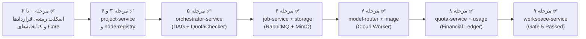
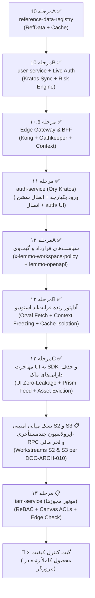

| فیلد / Field | مقدار / Value |
| :--- | :--- |
| **Title (EN)** | Unified Backend Phased Roadmap, Milestone Gates & Service Execution Plan |
| **Title (FA)** | نقشه راه جامع پیاده‌سازی گام‌به‌گام بک‌اند، گیت‌های کیفیت و برنامه اجرایی سرویس‌ها |
| **ID** | DOC-BE-005 |
| **Category** | `backend` |
| **Status** | `Approved` |
| **Owner** | Core Architecture & Backend Team / @platform |
| **Last Updated** | 2026-10-06 |
| **Summary (EN)** | Canonical, unified backend and platform engineering roadmap: consolidates granular Phase 0 skeleton, Phase 1 MVP services (Stages 1-9, closed Gates 0-5), Phase 2 Live Identity, Gateway & Studio SDK Integration (Stages 10A, 10B, 10.5, 11, completed Stage 12A/12B/12C), intermediate security hardening workstream (S2/S3 per DOC-ARCH-010), Stage 13 IAM, Phase 3 Commercialization (Stages 14-16), and Phase 4 Ecosystem (Stages 17-19) with explicit quality gates and development conventions. |
| **Summary (FA)** | نقشه راه جامع، یگانه و مرجع مهندسی پلتفرم و بک‌اند لِمو: تجمیع گام‌های مهندسی اسکلت فاز ۰، ۱۰ سرویس فاز ۱ (مراحل ۱ تا ۹، بسته‌شدن گیت‌های ۰ تا ۵)، فاز ۲ هویت زنده، درگاه لبه و اتصال SDK استودیو (مراحل 10A، 10B، 10.5، 11 و تکمیل قطعی مراحل 12A، 12B و 12C)، تسک میانی مقاوم‌سازی امنیتی چندمستأجری و مالی (جریان‌های S2 و S3 مصوب DOC-ARCH-010)، مرحله ۱۳ سرویس دسترسی‌ها (iam-service)، فاز ۳ تجاری‌سازی (مراحل ۱۴ تا ۱۶)، و فاز ۴ اکوسیستم به همراه گیت‌های کنترل کیفیت و چک‌لیست‌های انطباق. |
| **Tags** | `backend`, `roadmap`, `milestones`, `architecture`, `services`, `mvp`, `phase2`, `phase3`, `ssot` |

---

# نقشه راه جامع پیاده‌سازی گام‌به‌گام بک‌اند (Unified Backend Roadmap & Quality Gates)

> **اصل بنیادین حاکمیت معماری (Governance & SSOT Invariant):**  
> این سند، **تنها منبع واحد حقیقت (Sole Source of Truth)** برای تمامی گام‌های اجرایی، توالی تحویل سرویس‌ها، چک‌لیست‌های گام‌به‌گام مهندسی و گیت‌های کنترل کیفیت پلتفرم Lemmo است. هیچ فایل نقشه راه موازی در ریشه مخزن یا سایر دایرکتوری‌ها معتبر نبوده و تمامی ارجاعات باید منحصراً به این سند ارجاع داده شوند. تمامی مراحل پیاده‌سازی باید دقیقاً با قراردادهای Proto ([DOC-BE-003](./contracts.md))، اصول کدنویسی Go Clean Architecture ([DOC-BE-004](./style-guide.md))، خط‌مشی محرمانگی و کانفیگ ([DOC-ARCH-009](../01-architecture/configuration-and-secrets.md)) و تصمیمات مصوب معماری ([ADR-001 تا ADR-016](../01-architecture/decisions/)) همگام باشند.

---

## ۱. کاتالوگ رسمی ۱۰ سرویس فاز ۱ (Phase 1 MVP Scope — تکمیل‌شده ✅)

فاز ۱ پلتفرم Lemmo منحصراً شامل ۱۰ میکروسرویس زیر بود که همگی با موفقیت پیاده‌سازی، کانتینریزه و در آزمون سرتاسری ۹ مرحله‌ای Gate 5 تایید شدند:

| # | سرویس | مسئولیت و دامنه | وضعیت پیاده‌سازی |
|---|---|---|---|
| ۱ | `project-service` | ذخیره و مدیریت پروژه‌های بوم، قفل همزمانی (Optimistic Locking)، نگهداری داده‌های JSONB دیزاین و ورک‌فلو | ✅ پیاده‌شده و تست‌شده (Stage 3) |
| ۲ | `node-registry-service` | رجیستری مرکزی انواع نودها و ابزارها، پورت‌های پویا (`var:`, `lora:`, `control:`) و کاتالوگ داخلی | ✅ پیاده‌شده و تست‌شده (Stage 4) |
| ۳ | `orchestrator-service` | موتور ارزیابی و اجرای گراف‌های DAG، مرتب‌سازی توپولوژیک، ولیدیشن اتصالات و رزرو اعتبار با `QuotaChecker` | ✅ پیاده‌شده و تست‌شده (Stage 5) |
| ۴ | `job-service` | مدیریت صف‌های اجرایی ناهمگام، استیت ماشین وضعیت‌های جاب و انتشار رویدادها در RabbitMQ | ✅ پیاده‌شده و تست‌شده (Stage 6) |
| ۵ | `storage-service` | مدیریت باکت‌های S3 در MinIO، دریافت امن مدیا از ورکرها، صدور Presigned URLs و متد تمدید امضا | ✅ پیاده‌شده و تست‌شده (Stage 6) |
| ۶ | `model-router-service` | رجیستری ۴ لایه‌ای پراویدرها، مسیریابی هوشمند، فالبک ۳ سطحی، Token Bucket در Redis و circuit breaker | ✅ پیاده‌شده و تست‌شده (Stage 7) |
| ۷ | `image-service` | ورکر ناهمگام سبک ابری جهت فراخوانی APIهای Fal/Replicate/OpenAI، پولینگ/وبهوک و آپلود به S3 | ✅ پیاده‌شده و تست‌شده (Stage 7) |
| ۸ | `quota-service` | مدیریت سهمیه‌ها و اعتبارسنجی حق اجرا (Entitlement)، رزرو دوسفره اعتبار و مسدودسازی کیف‌پول خالی | ✅ پیاده‌شده و تست‌شده (Stage 8) |
| ۹ | `usage-service` | سیستم دفترکل تغییرناپذیر (Credit Ledger) با مدل Bucket، ردیابی هزینه‌های دلاری پراویدر و محاسبه حاشیه سود | ✅ پیاده‌شده و تست‌شده (Stage 8) |
| ۱۰ | `workspace-service` | مدیریت ورک‌اسپیس‌ها، تننت‌ها، نقش‌های کاربری پروژه و تنظیم سیاست‌های پرداخت‌کننده (Payer Policy) | ✅ پیاده‌شده و تست‌شده (Stage 9 — پایان فاز ۱) |

---

## ۲. توالی مهندسی مراحل فاز ۱ (Execution Progression Stages 0 to 9)


```mermaid
flowchart LR
    S0["مرحله ۰ تا ۲ ✅<br>اسکلت ریشه، قراردادها<br>و کتابخانه‌های Core"] --> S3["مرحله ۳ و ۴ ✅<br>project-service<br>و node-registry"]
    S3 --> S5["مرحله ۵ ✅<br>orchestrator-service<br>(DAG + QuotaChecker)"]
    S5 --> S6["مرحله ۶ ✅<br>job-service + storage<br>(RabbitMQ + MinIO)"]
    S6 --> S7["مرحله ۷ ✅<br>model-router + image<br>(Cloud Worker)"]
    S7 --> S8["مرحله ۸ ✅<br>quota-service + usage<br>(Financial Ledger)"]
    S8 --> S9["مرحله ۹ ✅<br>workspace-service<br>(Gate 5 Passed)"]
```

### خلاصه دستاوردهای بسته فاز ۱:
- **مرحله ۰ (Day 0 Skeleton):** پیکربندی `go.work`، لینتر استوار `.golangci.yml`، ابزار پروتوباف `buf`، پکیج‌های پایه‌ای `core/{bootstrap, config, middleware, outbox, idempotency}`.
- **مرحله ۱ و ۲ (Contracts & SDK):** پروتکل‌های باینری در `contracts/`، تولید کلاینت تایپ‌اسکریپت `@lemmo/sdk` و ابزار اسکافولدینگ `tools/lemmo-cli`.
- **مرحله ۳ (Project Service):** مدیریت پروژه، انبارش گراف بوم در JSONB، قفل آپتیمیستیک با نسخه، و ثبت رویدادهای ایجاد/تغییر.
- **مرحله ۴ (Node Registry Service):** کاتالوگ بومی و حافظه‌محور نودها، حل پورت‌های پویا (`var:`, `lora:`, `control:`) و بذر اولیه‌سازی نودها.
- **مرحله ۵ (Orchestrator Service):** موتور مرتب‌سازی توپولوژیک Kahn، کشف دورها، زمان‌بندی موازی استیج‌ها و ادغام اینترفیس `QuotaChecker`.
- **مرحله ۶ (Job & Storage Services):** صف‌های اولویت‌دار RabbitMQ، صف مرده DLQ، استریم SSE، کلاینت MinIO، باکت‌های ایزوله، و صدور لینک‌های موقت ۱۵ دقیقه‌ای با اندپوینت تجدید امضا.
- **مرحله ۷ (Model Router & Cloud Image Worker):** رجیستری ۴ لایه‌ای پراویدرها، توکن باکت ریت‌لیمیتینگ، فالبک ۳ سطحی، و ورکر مستقل بدون وابستگی به GPU محلی با وب‌هوک HMAC.
- **مرحله ۸ (Quota & Usage Services):** دفترکل تغییرناپذیر ۱۹ فیلدی، ادغام موتور `financial-ledger` (ADR-009)، سیاست‌های Payer Policy، الگوی دو فازی Reserve/Settle و مسدودسازی `WORKSPACE_WALLET_EMPTY`.
- **مرحله ۹ (Workspace Service & Gate 5):** تفکیک سازمان‌ها و مستاجران، چرخه حیات امن دعوت‌نامه‌ها، ستون صریح `on_wallet_empty`، پاس شدن کامل سوئیت آزمون ۹ مرحله‌ای E2E در `tests/e2e/phase1_gate5_test.go`.

---

## ۳. پنج قلاب حیاتی توسعه‌پذیری (Mandatory MVP Hooks — تکمیل‌شده ✅)

1. **مدل Bucket و `expires_at` در لجر:** ✅ پیاده‌سازی کامل سطل‌ها و کسر با الگوریتم FEFO در `quota-service` و `usage-service`. قلاب مستقیم برای جذب کدهای تخفیف و رفرال بدون تغییر اسکیما.
2. **فیلد `actor_type` در لجر و گیت‌وی:** ✅ پشتیبانی از مقادیر `USER`، `API_KEY` و `SYSTEM` در اسکیما ۱۹ فیلدی دفترکل.
3. **انتشار رویداد `provider.call.completed`:** ✅ ثبت هزینه هر فراخوانی پراویدر ابری به میکرو‌دلار (`provider_cost_micros`).
4. **نگاشت خطای Content Policy و مرحله no-op:** ✅ نگاشت کدهای خطای پالیسی به `CONTENT_POLICY_VIOLATION_PROVIDER` و آزادسازی آنی اعتبار رزرو‌شده.
5. **حداقل بک‌آپ به عنوان شرط انتشار MVP (E4.6):** ✅ اسکریپت پشتیبان‌گیری استاندارد `tools/backup/db_backup.sh` برای هر ۱۲ پایگاه داده با سوییچ اعتبارسنجی `--verify`.

---

## ۴. چک‌لیست گام‌به‌گام مهندسی فازهای ۰ و ۱ (Granular Implementation Checklists)

### 4.1 Phase 0 — Day 0 Skeleton & Core Framework
- [x] **0.1 ایجاد فایل‌های پیکربندی ریشه:**
  - [x] ایجاد `api/go.work` با دایرکتیو تمام زیرماژول‌ها
  - [x] ایجاد `api/.golangci.yml` (govet, staticcheck, gosec, gocyclo:15)
  - [x] ایجاد `api/buf.yaml` و `api/buf.gen.yaml` برای تولید کد Go و TS
  - [x] ایجاد `api/Makefile` با تارگت‌های اصلی build, lint, test, proto
- [x] **0.2 ساختار متمرکز قراردادها (`contracts/`):**
  - [x] قراردادهای پلتفرم: `envelope.proto`, `errors.proto` (AIP-193), `permissions.proto`, `registry.proto`
  - [x] قراردادهای دامنه Lemmo: `node.proto`, `project.proto`, `workflow.proto`, `usage.proto`, `events.proto`
  - [x] اسکیمای JSON گراف پروژه: `contracts/schemas/project-graph.json`
- [x] **0.3 ساختار پکیج‌های مشترک (`core/`):**
  - [x] پیاده‌سازی `core/config`: لودر امن YAML با اعتبارسنجی Fail-Fast و منع فال‌بک سکرت‌ها (DOC-ARCH-009)
  - [x] پیاده‌سازی `core/bootstrap`: سرور استاندارد gRPC و HTTP با Graceful Shutdown
  - [x] پیاده‌سازی `core/middleware`: تزریق TraceID (OpenTelemetry)، ریکاوری پنیک، و MockAuthMiddleware
  - [x] پیاده‌سازی `core/outbox`: الگوی Outbox تراکنشی پایگاه داده
  - [x] پیاده‌سازی `core/idempotency`: کلیدهای idempotency در Redis
- [x] **0.4 و 0.5 ابزارها و پکیج‌های SDK:**
  - [x] ابزار اسکافولدینگ مایکروسرویس‌ها: `tools/lemmo-cli`
  - [x] ساخت پکیج کلاینت تایپ‌اسکریپت: `packages/ts-sdk` (@lemmo/sdk)
- [x] **0.8 تا 0.11 زیرساخت داکر و پروتوباف:**
  - [x] کامپایل قراردادها با `buf build` و `buf generate`
  - [x] شبکه و استک پایه داکر (`infra/compose/dev.yml`) شامل PostgreSQL, Redis, RabbitMQ, MinIO با Healthcheck

### 4.2 Phase 1 — Detailed Service Implementation Checklist
- [x] **1.1 اسکلت و تنظیمات اختصاصی هر سرویس:** ایجاد Clean Architecture برای ۱۰ سرویس فاز ۱ همراه با `service.md`, `go.mod`, `Dockerfile`.
- [x] **1.2 مایگریشن‌های پایگاه داده:** اسکریپت‌های متوالی `000001_*.up.sql` و `.down.sql` بدون کلید خارجی بین‌سرویسی.
- [x] **1.4.1 node-registry-service:** اینتیتی نودها، پورت‌های ورودی/خروجی، کش داخلی، هندلرهای gRPC و تست‌های انطباق پورت.
- [x] **1.4.2 project-service:** اینتیتی پروژه، نگهداری دیتای گراف در JSONB، قفل آپتیمیستیک با ورژن، و نگاشت خطاهای AIP-193.
- [x] **1.4.3 orchestrator-service:** مرتب‌سازی توپولوژیک Kahn، باکت‌بندی استیج‌های موازی، کشف دورها، و ادغام `QuotaChecker`.
- [x] **1.4.4 job-service:** ماشین حالت وضعیت جاب‌ها، صف‌های اولویت‌دار ۱ تا ۱۰، صف خطای DLQ، و برودکستر پیشرفت SSE.
- [x] **1.4.5 model-router-service:** رجیستری ۴ لایه‌ای، آداپتور عمومی اعلانی JSON، فالبک ۳ سطحی، و توکن‌باکت ردیس با اسکریپت اتمیک Lua.
- [x] **1.4.6 image-service:** ورکر کلاینت ابری Fal/Replicate، اعتبارسنجی وب‌هوک HMAC، استریم خروجی به MinIO و ثبت در `job-service`.
- [x] **1.4.7 quota-service:** مدیریت کیف‌پول‌ها، الگوی ۲ فازی رزرو و تسویه، اتصال به `financial-ledger` و اعمال Payer Policy.
- [x] **1.4.8 usage-service:** دفترکل تغییرناپذیر ۱۹ فیلدی، مصرف‌کننده رویدادهای RabbitMQ و رهگیری سود ناخالص پلتفرم.
- [x] **1.4.9 workspace-service:** مدیریت فضاهای کاری `PERSONAL` و `TEAM`، لایف‌سایکل دعوت‌نامه‌ها، اتصال با `quota-service` و پاس شدن Gate 5.

---

## ۵. فاز ۲: هویت زنده، درگاه لبه، ابزارسازی و کلاینت استودیو (Phase 2 Roadmap)

فاز ۲ بر فعال‌سازی هسته زنده هویت، استقرار درگاه ورودی لبه، خودکارسازی قراردادهای OpenAPI 3.1، اتصال کلاینت زنده استودیو (`app/`) و استقرار موتور کنترل دسترسی‌ها (`iam-service`) تمرکز دارد:


```mermaid
flowchart TD
    S10A["مرحله 10A ✅<br>reference-data-registry<br>(RefData + Cache)"] --> S10B["مرحله 10B ✅<br>user-service + Live Auth<br>(Kratos Sync + Risk Engine)"]
    S10B --> S105["مرحله ۱۰.۵ ✅<br>Edge Gateway & BFF<br>(Kong + Oathkeeper + Context)"]
    S105 --> S11["مرحله ۱۱ ✅<br>auth-service (Ory Kratos)<br>(ورود یکپارچه + ابطال سشن + اتصال auth/ UI)"]
    S11 --> S12A["مرحله ۱۲A ✅<br>سیاست‌های قرارداد و گیت‌وی<br>(x-lemmo-workspace-policy + lemmo-openapi)"]
    S12A --> S12B["مرحله ۱۲B ✅<br>آداپتور زنده فرانت‌اند استودیو<br>(Orval Fetch + Context Freezing + Cache Isolation)"]
    S12B --> S12C["مرحله ۱۲C ✅<br>مهاجرت UI به SDK و حذف دارایی‌های ماک<br>(UI Zero-Leakage + Prism Feed + Asset Eviction)"]
    S12C --> S_SEC["تسک میانی امنیتی S2 و S3 📋<br>ایزولاسیون چندمستأجری، RPC و لجر مالی<br>(Workstreams S2 & S3 per DOC-ARCH-010)"]
    S_SEC --> S13["مرحله ۱۳ 📋<br>iam-service (موتور مجوزها)<br>(ReBAC + Canvas ACLs + Edge Check)"]
    S13 --> Gate6["🏁 گیت کنترل کیفیت ۶<br>(محصول کاملاً زنده در مرورگر)"]
```

### مرحله 10A: رجیستری داده‌های مرجع مشترک (`reference-data-registry` — ADR-012) ✅
- **وضعیت:** تکمیل و اعتبارسنجی کامل در تاریخ ۲۰۲۶-۱۰-۰۱.
- **دامنه:** سرویس اختصاصی روی پورت gRPC `50061` و HTTP `8090`؛ پایگاه داده `lemmo_refdata`؛ انتشار رویداد `reference_data.dataset.updated.v1` روی RabbitMQ؛ کلاینت کش دو سطحی (رم + دیسک) با مقاومت در برابر قطع شبکه؛ آزمون لایو ۸ مرحله‌ای `reference_data_live_test.go` پاس شد.

### مرحله 10B: سرویس کاربران و موتور ریسک (`user-service` + Live Auth) ✅
- **وضعیت:** تکمیل و اعتبارسنجی کامل در تاریخ ۲۰۲۶-۱۰-۰۲.
- **دامنه:** وب‌هوک Post-Registration ایمن کراتوس (`POST /internal/v1/users/sync-kratos`)؛ تفکیک `id` از `handle`؛ فیلد `preferences`؛ موتور محاسبه امتیاز ریسک `user_risk_logs` با تعلیق خودکار در Redis؛ ایجاد کد رفرال Base32.

### مرحله ۱۰.۵: استقرار درگاه لبه، پروکسی هویت و کانتکست (ADR-013) ✅
- **وضعیت:** تکمیل و اعتبارسنجی کامل در آزمون‌های زنده `gateway_ingress_live_test.go` در تاریخ ۲۰۲۶-۱۰-۰۲.
- **دامنه:** Kong Gateway در حالت DB-less؛ پروکسی Ory Oathkeeper برای صدور JWT نامتقارن؛ سرویس BFF کانتکست (`context-service`) روی پورت `8091`؛ پلاگین‌های کاستوم Lua شامل `lemmo-ip-guard`, `lemmo-honeypot-trap`, `lemmo-access-enforcer`.

### مرحله ۱۱: استقرار کامل ورود بدون رمز و لایف‌سایکل سشن (`auth-service` — ADR-014 و ADR-015) ✅
- **وضعیت:** تکمیل و اعتبارسنجی کامل با موفقیت ۱۰۰٪ در آزمون‌های زنده ۹ گانه (`auth_flow_live_test.go`) در تاریخ ۲۰۲۶-۱۰-۰۲.
- **دامنه:** استقرار Ory Kratos و Mailpit در داکر؛ وب‌سرویس `auth-service` با اندپوینت هوشمند `/api/v1/auth/entry` جهت حذف خطای Duplicate Identifier؛ اعتبارسنجی کد ۶ رقمی OTP؛ ابطال آنی نشست در خروج با ثبت برچسب زمانی در Redis و ارزیابی با دستور MGET پلاگین Lua؛ اتصال کامل رابط کاربری `auth/` در Next.js و انتقال خودکار به استودیو بر اساس پارامتر `return_to`.

---

### مرحله ۱۲: ابزار خودکارسازی OpenAPI و اتصال آداپتور زنده استودیو (مصوب ADR-014 و ADR-016)

بر اساس ارزیابی‌های فنی و مصوبه **[ADR-016](../01-architecture/decisions/ADR-016-request-context-governance-and-workspace-policy.md)**، مرحله ۱۲ به دو بخش دقیق تفکیک شده است:

#### مرحله ۱۲A: سیاست‌های قرارداد، تولید OpenAPI و سخت‌سازی گیت‌وی (`contracts/`, `tools/` & Gateway Ingress) ✅
- **وضعیت:** تکمیل و اعتبارسنجی ۱۰۰٪ با موفقیت در تاریخ ۲۰۲۶-۱۰-۰۳.
- **گزارش نهایی و مستندات اجرایی:** [`REPORT_BACKEND_STAGE12A.md`](../../../.task/stage12/REPORT_BACKEND_STAGE12A.md)
1. **منبع حقیقت سیاست‌های ورک‌اسپیس (`x-lemmo-workspace-policy`):** برچسب‌گذاری صریح تمامی اندپوینت‌های سیستم با مقادیر `required`، `optional` و `none` در قراردادهای منبع.
2. **متدولوژی قرارداد-محور (Contract-First OpenAPI 3.1):** نگارش مستقیم تعاریف OpenAPI YAML در `contracts/` به عنوان منبع حقیقت سرویس‌های REST، استفاده از ابزارهای بالغ نظیر `oapi-codegen` و تجمیع مونو-اسپک در `infra/gateway/docs/openapi.yaml`.
3. **اصلاح و سخت‌سازی پلاگین `lemmo-access-enforcer` در گیت‌وی:**
   - لغو فال‌بک عمومی به `PERSONAL` روی روت‌های دامنه‌ای (اصلاحیه بند ۲.۳ در ADR-013).
   - مسدودسازی قطعی درخواست‌های فاقد هدر `X-Workspace-ID` روی مسیرهای `required` با پاسخ ۴۰۰ یا ۴۰۳.
   - محدودسازی انحصاری فال‌بک به مسیرهای `optional`.
   - **رفتار بدون‌اغماض (Fail-Closed) در ردیس:** در صورت نبود کلید `lemmo:membership:version:{workspace_id}:{user_id}` در Redis، درخواست بلافاصله با ۴۰۳ مسدود می‌گردد.
   - اعمال استراتژی Fail-Fast روی خطای اتصال به Redis طبق الزامات DOC-ARCH-009.
4. **بسته مقاوم‌سازی امنیتی لایه اینگرس و هویت (Workstream S1 — مصوب [DOC-ARCH-010](../01-architecture/security-audit-and-remediation.md)):**
   - **SEC-01 (P0):** جایگزینی `whoami` شبیه‌سازی‌شده در `context-service` با احراز هویت سشن رسمی از طریق Kratos Admin API؛ فعال‌سازی اعتبارسنجی رمزنگاری نامتقارن (RS256) JWT با کلید عمومی JWKS در درگاه Kong؛ حذف قطعی هدرهای تزریقی خام `X-User-ID` و `X-Workspace-*` در لایه لبه قبل از رسیدن به سرویس‌ها.
   - **SEC-02 (P0):** رفع آسیب‌پذیری IDOR در روت‌های `/profile`, `/preferences`, `/risk` سرویس `user-service` با الزام انطباق شناسه درخواستی با کاربر احرازشده در کانتکست یا احراز نقش ادمین سیستم.
   - **SEC-08 (P1):** اصلاح لاگ‌اوت در `auth-service` با ابطال واقعی سشن در Kratos، منع دریافت `userID` از بدنه و ثبت برچسب زمانی خروج در ردیس با TTL بیست دقیقه‌ای.
   - **SEC-09 (P1):** اعمال رفتار Fail-Closed روی خطاهای ردیس در پلاگین گیت‌وی و منع عبور خام درخواست‌ها.
   - **SEC-10 (P1):** حذف دستور `mc anonymous set public` از کانتینر init در Compose و بازگرداندن باکت‌های MinIO به وضعیت خصوصی (`private`).
   - **SEC-11 (P1):** محدودسازی بایندینگ پورت‌های حساس (Postgres, Redis, MinIO, RabbitMQ, Kratos, Mailpit) در Compose منحصراً به لوپ‌بک محلی `127.0.0.1` جهت ممانعت از دسترسی عمومی هاست.
   - **SEC-22 (P2):** تفکیک خطای زیرساخت در `context-service` و بازگرداندن خطای صریح ۵۰۳ یا ۵۰۰ به جای کانتکست جعلی یا خالی.
5. **آزمون‌های لایو عبور از مرزها در گیت‌وی:** تدوین سوئیت تست لایو جهت اثبات مسدودسازی روت‌های `required` فاقد هدر و مسدودسازی کاربر غیرعضو در گیت‌وی برای روت‌های واقعی دامنه (مانند `/api/v1/projects`).

#### مرحله ۱۲B: پیاده‌سازی آداپتور زنده، ترانسپورت و ایزولاسیون استودیو (`app/src/sdk/live/`) ✅
- **وضعیت:** تکمیل و اعتبارسنجی ۱۰۰٪ با موفقیت در تاریخ ۲۰۲۶-۱۰-۰۳.
- **گزارش نهایی و مستندات اجرایی:** [`REPORT_FRONTEND_STAGE12B.md`](../../../.task/stage12/REPORT_FRONTEND_STAGE12B.md)
1. **تولید کلاینت Fetch با Orval در مرز محصور از نسخه پین‌شده (مصوب OQ-035):** تولید توابع کلاینت مستقل از هوک‌های React در پوشه ایزوله `app/src/sdk/live/generated/` با استفاده از ارجاع تغییرناپذیر به مونو-اسپک، با محافظت قواعد لینت از عدم دسترسی مستقیم از کدهای UI.
2. **معماری شبکه Same-Origin با پروکسی معکوس Next.js (مصوب OQ-034):**
   - پیکربندی `rewrites` در `next.config.ts` برای هدایت مسیرهای `/api/v1/:path*` به درگاه Kong (`http://localhost:8000` در dev و آدرس کانتینر در prod).
   - ارسال تمامی فراخوانی‌های مرورگر به عنوان Same-Origin (حذف چالش کوکی‌های Cross-Port در لوکال‌هاست، حذف تاخیر Preflight و مصونیت در برابر افزونه‌های مسدودساز).
   - تضمین قطعی عدم بافرینگ در استریم‌های SSE (`/api/v1/jobs/:jobId/events`) با تدوین آزمون اختصاصی.
3. **استراتژی صفر-ماک در کلاینت و کانتینرهای ایزوله ماک Prism در گیت‌وی (مصوب OQ-036 و OQ-040):**
   - پیاده‌سازی تک‌کده و بدون انشعاب در `live-adapter.ts` و کلاینت استودیو؛ فرانت‌اند همواره اندپوینت‌های واقعی را فراخوانی کرده و هیچ کدی برای تشخیص ماک/لایو ندارد.
   - استقرار کانتینرهای ایزوله و سبک با ایمیج رسمی `stoplight/prism:5` در داکر (`lemmo-mock-tools` و `lemmo-mock-chat`) با ماونت قراردادهای مربوطه؛ اتصال Kong به این کانتینرها در شبکه داخلی، با امکان حذف مستقل و مهاجرت نامتقارن به سرویس واقعی بدون اثر بر سایر ماژول‌ها.
4. **سخت‌سازی لایه ترانسپورت شبکه (`@/sdk/live/transport.ts`):**
   - پالایش و حذف قطعی هرگونه تزریق دستی هدر خام `X-Workspace-ID` توسط کالرها.
   - ثبت اسنپ‌شات منجمد کانتکست (Context Freezing شامل `workspaceId` و `sessionGenerationId`) در لحظه فراخوانی و تکرار منحصربه‌فرد همان کانتکست در Retry.
   - لغو خودکار و بلافاصله تلاش‌های مجدد در صورت لاگ‌اوت یا تعویض کاربر.
   - ارسال تمامی درخواست‌ها با `credentials: 'include'` برای مدیریت دو کوکی سشن Kratos و توکن امضاشده `lemmo_jwt` (HttpOnly).
   - تمدید پیش‌دستانه پویا در ۹۰٪ زمان انقضا بر اساس فیلد `session.expires_at` در بدنه پاسخ کانتکست و رفرش (OQ-038).
   - رهگیری خطای `403 PRIVILEGED_SESSION_REQUIRED` و فعال‌سازی مودال تایید مجدد هویت با جریان بومی Kratos JSON (`?refresh=true`) بدون خروج از بوم (OQ-041).
5. **استقرار در RootLayout و دفاع چهارلایه در برابر نشت کش + بازنشانی Zustand (مصوب OQ-037):**
   - استقرار `QueryClientProvider` و `StudioContextProvider` در فایل `app/src/app/layout.tsx`.
   - لایه ۱: ساخت `QueryClient` در state محلی با `useState(() => new QueryClient())` (منع مطلق singleton ماژولار).
   - لایه ۲: اجرای قطعی `queryClient.cancelQueries()` و `queryClient.clear()` در خروج یا تعویض حساب.
   - لایه ۳: اسکوپ‌بندی تمام کلیدهای کش با شناسه کاربر و ورک‌اسپیس (`['user', userId, 'workspace', wsId, ...]`).
   - لایه ۴: بازسازی (Remount) کامل درخت کامپوننت با `key={sessionGenerationId}`.
   - الزام اکشن `reset()` در تمام استورهای ماژولار Zustand و فراخوانی آن در لحظه خروج یا تغییر نسل سشن.
   - خروج با ریدایرکت سخت مرورگر (`window.location.href`) به دامنه `auth.` با پارامتر امن `return_to`.
6. **ماشین حالت ۶‌گانه کانتکست (`StudioContextProvider`):** پیاده‌سازی تفکیک صریح حالت‌های `uninitialized`, `loading`, `ready`, `no-workspace`, `error`, `signed-out` با امکان بازتلاش غیرمخرب شبکه.
7. **استریم پیشرفت جاب‌ها با Server-Sent Events (`jobs.subscribe`):**
   - پیاده‌سازی استریم زنده نودها با `EventSource` با تنظیم `{ withCredentials: true }` بدون ارسال هدر ورک‌اسپیس (اعتبارسنجی سمت سرور در `job-service`).
   - پشتیبانی از پروتکل رویداد پایانی `event: job.terminal`، بستن فعال اتصال و فراخوانی متد cleanup در زمان تغییر سشن یا ورک‌اسپیس.
8. **آزمون‌های لایو استودیو:** تست اعتبارسنجی کلاینت زنده با `NEXT_PUBLIC_API_MODE=live` در محیط واقعی مرورگر.

#### مرحله ۱۲C: مهاجرت کامل ماژول‌های UI، کانتینر ماک Feed در Prism و اخراج استاتیک‌ها (مصوب ADR-016 بند ۲.۲۳) ✅
- **وضعیت:** تکمیل قطعی، اصلاح نهایی و قبولی ۱۰۰٪ آزمون‌ها در تاریخ ۲۰۲۶-۱۰-۰۳ (کامیت `424ef7c`).
- **گزارش نهایی و مستندات اجرایی:** [`REPORT_FRONTEND_STAGE12C_REMEDY.md`](../../../.task/stage12/REPORT_FRONTEND_STAGE12C_REMEDY.md)
1. **اصلاح کسری‌های استیج ۱۲B:**
   - ایزولاسیون کامل تست `live_sse_proxy.test.ts` با راه‌اندازی سرور آزمایشی موقت در حافظه و پاس شدن کامل ۷ آزمون با Vitest.
   - رفع هشدار لینتر React 19 / Next 16 (`react-hooks/set-state-in-effect`) در `StudioContextProvider.tsx`.
2. **مهاجرت ۱۰۰٪ ماژول‌های بوم و ابزارها به گلوگاه `@/sdk`:**
   - بازنویسی کامل `CanvasManager.tsx` و `CanvasWorkspaceEditor.tsx` جهت اتصال مستقیم به متدهای `sdk.projects.list()`، `sdk.projects.create()` و `sdk.projects.get()` به جای آرایه‌های محلی.
   - بازنویسی `ToolsManager.tsx` جهت فراخوانی متد `sdk.tools.list()` (ارتباط مستقیم با ماک Prism ابزارها).
   - مهاجرت ماژول `assets` و چت ایجنت `agent` به SDK و حذف کامل پوشه‌های `data/` از ماژول‌ها.
3. **پایپ‌لاین شبیه‌سازی Prism برای ماژول فید (`feed`):**
   - تدوین قرارداد استاندارد `contracts/openapi/feed/v1/openapi.yaml` و ادغام در مونو-اسپک OpenAPI گیت‌وی.
   - استقرار کانتینر اختصاصی `lemmo-mock-feed` با ایمیج `stoplight/prism:5` در داکر شبکه داخلی (`dev.yml`) و ایجاد روت متناظر در `kong.yml`.
   - بازنویسی کامپوننت‌های فید (`MasonryFeed` و `QuickToolsSection`) جهت مصرف داده از `sdk.feed.list()`.
   - حذف کامل فایل `feedData.ts`.
4. **اخراج کامل دارایی‌های استاتیک از فرانت‌اند (`Asset Eviction`):**
   - حذف کلیه تصاویر آزمایشی از دایرکتوری `app/public/images/feed/` جهت جلوگیری از اتلاف حجم باندل کلاینت.
   - جایگزینی آدرس‌های محلی با URLهای ریموت امن و استوریج.
5. **استقرار گارد خودکار در CI و ESLint:**
   - افزودن قاعده قطعی در ESLint برای ممنوعیت کامل هرگونه `import` حاوی رشته `mock` یا `data/` در تمامی پوشه‌های `src/modules/` و `src/app/`، با نتیجه `0 errors, 0 warnings` در اجرای CI.

---

### تسک میانی مهندسی: برنامه مقاوم‌سازی امنیتی چندمستأجری و مالی (مراحل S2 و S3 — مصوب DOC-ARCH-010) 📋
> **هدف معماری:** اجرای فوری به عنوان یک تسک میانی قبل از ورود به مرحله ۱۳؛ تضمین ایزولاسیون کامل داده‌های چندمستأجری در لایه RPC، ایمنی وب‌هوک‌های رسانه و مصونیت دفترکل مالی از نشت میان تننت‌ها و خطاهای ذخیره‌سازی.  
> **سند تسک اجرایی:** [`TASK_BACKEND_SECURITY_S2_S3.md`](../../../.task/others/TASK_BACKEND_SECURITY_S2_S3.md)  
> **وضعیت:** تسک فعال میانی (پیش‌نیاز قطعی ورود به مرحله ۱۳ و عبور از گیت کنترل کیفیت ۶).

#### جریان کاری S2: ایزولاسیون چندمستاجری، احراز هویت RPC و امنیت مدیا
1. **SEC-03 (P1):** استقرار gRPC Server Interceptor احراز هویت در تمامی سرویس‌های داخلی، حذف دائمی فال‌بک MockAuth، و اعتبارسنجی تطابق تننت درخواست با کانتکست احرازشده.
2. **SEC-04 (P1):** مسدودسازی درخواست‌های با `callerID` خالی در متدهای حساس `workspace-service` با خطای ۴۰۱، و حذف پذیرش هدرهای تستی `X-Mock-Roles`.
3. **SEC-05 (P1):** الزام انطباق پیش‌وند کلید فایل با شناسه تننت (`tenants/{tenantID}/*`) و بررسی رکورد دیتابیس در متدهای `SignAssetURL` و `BatchSignAssetURLs` در `storage-service`.
4. **SEC-06 (P1):** حذف کامل هدرهای احراز هویت پراویدرها (`AdaptedHeaders`) از خروجی‌های RPC در `model-router-service` و تعریف Allowlist رسمی برای سکرت‌های مجاز محیطی.
5. **SEC-07 (P1):** اجباری‌سازی امضای HMAC روی وب‌هوک‌های `image-service` و پیاده‌سازی گارد ضدنفوذ SSRF بر روی کلاینت دانلود تصویر (مسدودسازی رنج‌های IP خصوصی، محلی و متادیتا).
6. **SEC-12 (P1):** پالایش هویت و نقش در `reference-data-registry` منحصراً از توکن امنیتی تاییدشده گیت‌وی (`X-User-Roles`).
7. **SEC-13 (P1):** اتمیک‌سازی پذیرش دعوت‌نامه‌ها در `workspace-service` در یک تراکنش دیتابیس واحد، منع پذیرش وضعیت‌های `rejected` و تطبیق ایمیل کاربر فعلی.

#### جریان کاری S3: همزمانی، دفترکل مالی و Idempotency
1. **SEC-14 (P1):** مقیدسازی دامنه کلیدهای Idempotency در `quota-service` به محدوده مستاجر (`lemmo:idempotency:{workspace_id}:{operation}:{key}`) و اعتبارسنجی هش SHA-256 پارامترها جهت جلوگیری از نشت میان مستاجران.
2. **SEC-15 (P1):** پیاده‌سازی الگوی تراکنش جبرانی (Compensating Transaction) در `quota-service`؛ ارسال خودکار دستور Void به دفترکل مالی در صورت شکست ذخیره‌سازی محلی دیتابیس، و اعتبارسنجی اکید ورودی‌ها برای جلوگیری از تبدیل مقادیر منفی اعتبارات.

---

### مرحله ۱۳: میکروسرویس مدیریت دسترسی‌ها و مجوزهای دانه‌ریز (`iam-service` — مصوب ADR-014) 📋
- **وضعیت:** در نوبت پس از تکمیل تسک میانی امنیتی S2 و S3 (پیش‌نیاز نهایی گیت کنترل کیفیت ۶).
- **دامنه:**
  - استقرار سرویس اختصاصی `services/iam-service/` با معماری Clean Architecture در Go.
  - مدل اعطای امتیازات و سهمیه‌های بوم (Entitlement Grants per DOC-BE-008).
  - ماتریس مجوزهای اسناد و نودها (Canvas ACLs: دسترسی‌های دانه‌ریز به بوم‌های اشتراکی).
  - اینترفیس اعتبارسنجی لبه با کش جهت استعلام پرسرعت پروژه‌ها و ورک‌فلوها.

---

## ۶. فاز ۳: صورت‌حساب، مانیتایزیشن و سیستم اعلان‌ها (Phase 3 Roadmap)

پس از عبور موفقیت‌آمیز از گیت کنترل کیفیت ۶ و تکمیل **جریان مقاوم‌سازی S4 (استحکام‌بخشی عملیاتی و ایمنی لبه)** شامل:
- **SEC-16 (P2):** استعلام اندازه فایل از متادیتای واقعی شیء در S3/MinIO (`storage-service`).
- **SEC-17 (P2):** اعتبارسنجی امن پارامتر `return_to` در فرانت‌اند `auth/` و ممانعت از Open Redirect.
- **SEC-18 و SEC-19 (P2):** ابطال خودکار کش توکن و رفع باگ ترانسپورت سرور MCP در `dotdive/mcp`.
- **SEC-20 (P2):** خاموش کردن `leak_sensitive_values` در Oathkeeper و اعمال فلگ‌های امنیتی روی کوکی‌ها.
- **SEC-21 (P2):** محدودسازی حافظه در پردازش وب‌هوک تصویر با `http.MaxBytesReader` در `image-service`.

زیرساخت‌های درآمدزایی فعال می‌شوند:

- **مرحله ۱۴: سرویس اشتراک و صورت‌حساب (`billing-service`):** موتور پلن‌ها و چرخه‌های اشتراک، درگاه‌های پرداخت چندگانه (ارزی و ریالی)، صدور فاکتور رسمی تجاری در MinIO، و تمدید خودکار دوره‌ای.
- **مرحله ۱۵: موتور کوپن و کمپین‌های تبلیغاتی (`promo-engine`):** مدیریت چرخه‌حیات کدهای تخفیف و پروموشن، اتصال مستقیم به `quota-service` برای شارژ اعتبارات هدیه، و قانون منع انباشت (Non-Stackable).
- **مرحله ۱۶: سرویس جامع اعلان‌ها (`notification-service`):** استقرار سلف‌هاستد موتور منبع‌باز Novu در داکر، اتصال به صف رویدادهای RabbitMQ، و مدیریت صندوق پیام‌های درون‌برنامه‌ای (In-App Inbox Feed) در هدر فرانت‌اند.

---

## ۷. فاز ۴: شبکه اجتماعی، همیاری و اکوسیستم (Phase 4 Roadmap)

- **مرحله ۱۷: سرویس جامع فید و کامیونیتی (`community-service`):** ویترین عمومی (Showcase Gallery)، لایک، کامنت، بوک‌مارک و بازنشر گراف‌ها (Remix).
- **مرحله ۱۸: پلتفرم بازاریابی و همکاری در فروش (`affiliate-service`):** رهگیری کلیک‌های تبلیغاتی ۳۰/۶۰/۹۰ روزه، سیستم کشف تقلب، و دفترکل پرداخت کارمزد بازاریابان (Payout Ledger).
- **مرحله ۱۹ به بعد: قابلیت‌های تکمیلی سازمانی:** تاریخچه نسخه‌های گراف (`version-service`)، همیاری بلادرنگ بوم (`collaboration-service` با CRDT/WebSocket)، سندباکس پلاگین‌ها (`plugin-runtime-service`)، چت تیمی بوم (`chat-service`)، و لاگ‌های ممیزی انطباق (`audit-service`).

---

## ۸. گیت‌های کنترل کیفیت تحویل (Milestone Quality Gates)

```
[Gate 0: اسکلت Day 0 و قراردادها] ✅ بسته شد
       │
       ▼
[Gate 1: پایداری پروژه‌ها و اعتبارسنجی MockAuth] ✅ بسته شد
       │
       ▼
[Gate 2: ارکستراسیون گراف و تفکیک تسک‌ها] ✅ بسته شد (پایان مرحله ۵)
       │
       ▼
[Gate 3: ایجاد صف جاب، ذخیره شیء و تولید تصویر ابری] ✅ بسته شد (پایان مرحله ۷)
       │
       ▼
[Gate 4: چرخه کامل مالی، لجر اتمیک و آماده‌سازی انتشار MVP] ✅ بسته شد (پایان مرحله ۸)
       │
       ▼
[Gate 5: استقرار چندمستأجری، فضاهای کاری و بسته شدن نهایی فاز ۱] ✅ بسته شد (پایان مرحله ۹)
       │
       ▼
[Gate 6: محصول کاملاً زنده در مرورگر — Kratos + Auth UI + Studio SDK + IAM + Security S1-S3] 🎯 مرحله فعال (پایان مرحله ۱۳)
       │
       ▼
[Gate 7: صورت‌حساب، درگاه‌های پرداخت، سیستم پرومو و اعلان‌ها] 📋 در نوبت (پایان مرحله ۱۶)
       │
       ▼
[Gate 8: جامعه کاربری، ویترین عمومی و موتور افیلیت مارکتینگ] 📋 در نوبت (پایان مرحله ۱۸)
```

### معیارهای دقیق پذیرش Gate 6 (پایان مرحله ۱۳ — آزمون ۱۰۰٪ زنده در مرورگر):
1. **ثبت‌نام و ورود زنده:** کاربر در رابط کاربری `auth/` ایمیل خود را وارد کرده، کد OTP را از سرور ایمیل دریافت و با کوکی سشن معتبر لاگین می‌کند.
2. **همگام‌سازی کاربر و ورک‌اسپیس:** وب‌هوک به `user-service` ارسال شده، پروفایل و کد رفرال ایجاد شده و `workspace-service` فضای کاری شخصی اولیه را خودکار می‌سازد.
3. **انتقال به استودیو و تثبیت کانتکست:** کاربر با ریدایرکت خودکار به استودیو (`app/`) منتقل شده؛ استودیو در حالت `live` اندپوینت `GET /api/v1/me/context` را با ماشین حالت ۶‌گانه فراخوانی و وضعیت را بارگذاری می‌کند.
4. **پالایش هدر و انزوای کش:** ترانسپورت کلاینت هرگونه هدر خام را پالایش کرده، کانتکست را در ریترای منجمد نگه می‌دارد، و کش‌های React Query با سوییچ ورک‌اسپیس ایزوله می‌مانند.
5. **اجرای بوم و استریم بلادرنگ:** کاربر یک پروژه ساخته، نودهای هوش مصنوعی را متصل و اجرا می‌کند؛ استریم وضعیت نودها از طریق SSE بدون بافرینگ روی بوم نمایش داده می‌شود.
6. **اعتبارسنجی دسترسی و کسر مالی:** درخواست‌های پروژه توسط `iam-service` و `quota-service` اعتبارسنجی شده و هزینه کسرشده در `usage-service` ثبت می‌گردد.
7. **قراردادهای خودکار:** مونو-اسپک OpenAPI 3.1 با برچسب‌های `x-lemmo-workspace-policy` به صورت خودکار تولید و در دسترس کلاینت‌ها قرار دارد.
8. **انسداد کامل حفره‌های امنیتی (Security Gate — مصوب [DOC-ARCH-010](../01-architecture/security-audit-and-remediation.md)):**
   - اثبات مسدودسازی جعل هویت در گیت‌وی و `whoami` (SEC-01).
   - اعتبارسنجی اکید دسترسی به پروفایل کاربران و ممانعت قطعی از آسیب‌پذیری IDOR (SEC-02).
   - ایزولاسیون کامل باکت‌های ذخیره‌سازی MinIO و عدم انتشار پورت‌های حساس دیتابیس روی هاست (SEC-10, SEC-11).
   - حذف کامل فال‌بک به MockAuth و اعمال احراز هویت در تمامی فراخوانی‌های داخلی gRPC (SEC-03).
   - انزوای کامل کلیدهای Idempotency مالی و تضمین یکپارچگی تراکنش‌های دفترکل مالی (SEC-14, SEC-15).

---

## ۹. قواعد توسعه و چک‌لیست استقرار سرویس جدید (Development Conventions)

### قواعد حاکمیتی کد و مهندسی:
1. **زبان کدنویسی و کامیت‌ها:** کدهای منبع، کامنت‌ها و پیام‌های کامیت (Conventional Commits) منحصراً به زبان انگلیسی نگارش می‌شوند.
2. **فرمت کد Go:** فرمت‌بندی با `gofmt` و `goimports` و رعایت استاندارد `.golangci.yml` (شامل govet, staticcheck, gosec و حداقل پیچیدگی gocyclo: 15).
3. **فرمت قراردادها:** پروتوباف استاندارد با اعتبارسنجی `buf lint` و محافظت در برابر تغییرات مخرب با `buf breaking`.
4. **لایه‌بندی Clean Architecture:** تفکیک قطعی لایه‌های دامنه، اپلیکیشن، پورت‌ها و آداپتورها در پوشه `internal/`.
5. **مدیریت خطاها:** استفاده از استاندارد گوگل `google.rpc.Status` (AIP-193) و کاتالوگ متمرکز `ErrorInfo.reason`.
6. **مایگریشن‌ها:** ابزار `golang-migrate` با شماره‌گذاری متوالی ۶ رقمی به صورت جفت‌های up/down.
7. **کانفیگ و سکرت‌ها:** ممنوعیت مطلق مقادیر ثابت در کد، منع فال‌بک برای کلمات عبور و سکرت‌ها، و خاتمه فوری سرویس (`Fail-Fast`) در غیاب مقادیر حساس (DOC-ARCH-009).
8. **ایزولاسیون دیتابیس:** هر سرویس مالک پایگاه داده و جداول خود است؛ اتصال مستقیم بین سرویس‌ها به دیتابیس یکدیگر یا تعریف کلید خارجی متقاطع اکیداً ممنوع است.

### چک‌لیست استاندارد پیاده‌سازی هر سرویس جدید:
- [ ] اجرای دستور اسکافولد: `go run ./tools/lemmo-cli service <name>`
- [ ] تکمیل شناسنامه سرویس در `services/<name>/service.md` (مسئولیت‌ها، APIها، رویدادها، وابستگی‌ها)
- [ ] تعریف موجودیت‌های دامنه در `internal/domain/` (بدون وابستگی خارجی)
- [ ] پیاده‌سازی موردکاربردها در `internal/app/`
- [ ] تعریف اینترفیس پورت‌ها در `internal/ports/`
- [ ] پیاده‌سازی آداپتورها در `internal/adapters/` (دیتابیس، بروکر، کلاینت‌های خارجی)
- [ ] پیاده‌سازی هندلرهای gRPC در `internal/adapters/grpc/`
- [ ] نگارش مایگریشن‌های دیتابیس در `migrations/` (`000001_*.up/down.sql`)
- [ ] تدوین تست‌های واحد لایه دامنه (`*_test.go`) با زمان اجرای زیر ۵ ثانیه
- [ ] تدوین تست‌های یکپارچگی لایو در `tests/live/` با تگ ساخت `//go:build live`
- [ ] نگارش Dockerfile چندمرحله‌ای (Build + Distroless/Alpine Runtime)
- [ ] استقرار مستقل سرویس در `services/<name>/deploy/compose.yaml` ذیل ADR-009
- [ ] اینسترومنت تریس‌های OpenTelemetry و لاگ‌های ساختاریافته JSON
- [ ] پیاده‌سازی اندپوینت‌های سلامت (`/healthz`) و متریک‌ها (`/metrics`)
- [ ] تدوین `README.md` سرویس با دستورالعمل‌های تست و توسعه محلی

---

## ۱۰. رجیستری بدهی‌های فنی شناخته‌شده (Known Technical Debt Register)

| شناسه | موضوع بدهی فنی | استراتژی موقت فعلی | معیار و زمان استخراج قطعی | سند مرجع |
| :--- | :--- | :--- | :--- | :--- |
| **TD-001** | استخراج ابزارهای مشترک میان‌پروژه‌ای و قراردادها | مصرف مستقیم مونو-اسپک OpenAPI و بایندینگ‌های تایپ‌اسکریپت Proto از مخزن `api/` با نسخه و Commit SHA پین‌شده در Orval. | ظهور سومین ریپوی مصرف‌کننده در اکوسیستم لیمو، یا افزایش نامتعارف هزینه هماهنگی دستی تغییرات؛ استخراج به یک پکیج مستقل و نسخه‌دار در رجیستری خصوصی npm. | OQ-035 / ADR-016 |

