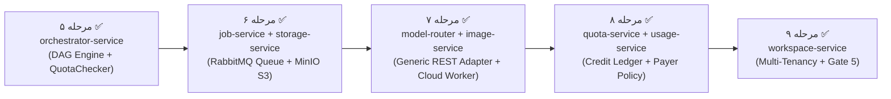
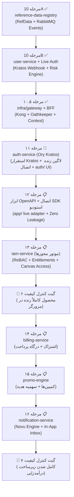

| فیلد / Field | مقدار / Value |
| :--- | :--- |
| **Title (EN)** | Backend Phased Roadmap, Milestone Gates & Service Execution Plan |
| **Title (FA)** | نقشه راه پیاده‌سازی گام‌به‌گام بک‌اند، گیت‌های کیفیت و برنامه اجرایی سرویس‌ها |
| **ID** | DOC-BE-005 |
| **Category** | `backend` |
| **Status** | `Approved` |
| **Owner** | Backend Team / @platform |
| **Last Updated** | 2026-10-01 |
| **Summary (EN)** | Authoritative backend roadmap defining Phase 1 MVP services (Stages 1-9, closed Gate 0-5), Phase 2 Commercialization & Communication (Stages 10-13), and Phase 3 Community & Growth (Stages 14-16) per ADR-011. |
| **Summary (FA)** | نقشه راه مرجع پیاده‌سازی بک‌اند شامل ۱۰ سرویس فاز ۱ (مراحل ۱ تا ۹، گیت‌های بسته شده ۰ تا ۵)، فاز ۲ تجاری‌سازی و ارتباطات (مراحل ۱۰ تا ۱۳) و فاز ۳ شبکه اجتماعی و رشد (مراحل ۱۴ تا ۱۶) مصوب ADR-011. |
| **Tags** | `backend`, `roadmap`, `milestones`, `architecture`, `services`, `mvp`, `phase2`, `phase3` |

---

# نقشه راه پیاده‌سازی گام‌به‌گام بک‌اند (Backend Roadmap & Quality Gates)

> **اصل بنیادین حاکمیت معماری (Governance Invariant):**  
> این سند، منبع واحد حقیقت (SSOT) برای گام‌های اجرایی، توالی تحویل سرویس‌ها و گیت‌های کنترل کیفیت در مخزن `api/` است. تمامی مراحل پیاده‌سازی باید دقیقاً با استانداردهای قراردادهای Proto ([DOC-BE-003](./contracts.md))، اصول کدنویسی Go Clean Architecture ([DOC-BE-004](./style-guide.md))، خط مشی رسانه‌ها ([DOC-BE-006](./media-and-model-pipeline.md)) و تصمیمات معماری مصوب ([ADR-011](../01-architecture/decisions/ADR-011-business-capabilities-and-phase2-roadmap.md)) همگام باشند.

---

## ۱. کاتالوگ رسمی ۱۰ سرویس فاز ۱ (Phase 1 MVP Scope — تکمیل‌شده ✅)

فاز ۱ پلتفرم Lemmo منحصراً شامل ۱۰ میکروسرویس زیر بود که همگی با موفقیت پیاده‌سازی، کانتینریزه و در آزمون سرتاسری ۹ مرحله‌ای Gate 5 تایید شدند:

| # | سرویس | مسئولیت و دامنه | وضعیت پیاده‌سازی |
|---|---|---|---|
| ۱ | `project-service` | ذخیره و مدیریت پروژه‌های بوم، قفل همزمانی (Optimistic Locking)، نگهداری داده‌های JSONB دیزاین و ورک‌فلو | ✅ پیاده‌شده و تست‌شده (Stage 3) |
| ۲ | `node-registry-service` | رجیستری مرکزی انواع نودها و ابزارها، پورت‌های پویا (`var:`, `lora:`, `control:`) و کاتالوگ داخلی | ✅ پیاده‌شده و تست‌شده (Stage 4) |
| ۳ | `orchestrator-service` | موتور ارزیابی و اجرای گراف‌های DAG، مرتب‌سازی توپولوژیک، ولیدیشن اتصالات و رزرو اعتبار با `QuotaChecker` | ✅ پیاده‌شده و تست‌شده (Stage 5) |
| ۴ | `job-service` | مدیریت صف‌های اجرایی ناهمگام، استیت ماشین وضعیت‌های جاب و انتشار رویدادها در RabbitMQ | ✅ پیاده‌شده و تست‌شده (Stage 6) |
| ۵ | `storage-service` | مدیریت باکت‌های S3 در MinIO، دریافت امن مدیا از ورکرها، صدور Presigned URLs و متد تمدید امضا | ✅ پیاده‌شده و تست‌شده (Stage 6) |
| ۶ | `model-router-service` | رجیستری ۴ لایه‌ای پراویدرها، مسیریابی هوشمند، فالبک ۳ سطحی، Token Bucket در Redis و circuit breaker | ✅ پیاده‌شده و تست‌شده (Stage 7) |
| ۷ | `image-service` | ورکر ناهمگام سبک ابری جهت فراخوانی APIهای Fal/Replicate/OpenAI، پولینگ/وبهوک و آپلود به S3 | ✅ پیاده‌شده و تست‌شده (Stage 7) |
| ۸ | `quota-service` | مدیریت سهمیه‌ها و اعتبارسنجی حق اجرا (Entitlement)، رزرو دوسفره اعتبار و مسدودسازی کیف‌پول خالی | ✅ پیاده‌شده و تست‌شده (Stage 8) |
| ۹ | `usage-service` | سیستم دفترکل تغییرناپذیر (Credit Ledger) با مدل Bucket، ردیابی هزینه‌های دلاری پراویدر و محاسبه حاشیه سود | ✅ پیاده‌شده و تست‌شده (Stage 8) |
| ۱۰ | `workspace-service` | مدیریت ورک‌اسپیس‌ها، تننت‌ها، نقش‌های کاربری پروژه و تنظیم سیاست‌های پرداخت‌کننده (Payer Policy) | ✅ پیاده‌شده و تست‌شده (Stage 9 — پایان فاز ۱) |

---

## ۲. توالی مهندسی مراحل ۵ تا ۹ (Execution Stages — Phase 1)

به منظور جلوگیری از بن‌بست‌های وابستگی (به‌ویژه نیاز حیاتی ورکر تصویر به فضای ذخیره‌سازی S3 پیش از تولید اولین تصویر)، توالی مراحل فاز ۱ با موفقیت به پایان رسید:


```mermaid
flowchart LR
    S5["مرحله ۵ ✅<br>orchestrator-service<br>(DAG Engine + QuotaChecker)"] --> S6["مرحله ۶ ✅<br>job-service + storage-service<br>(RabbitMQ Queue + MinIO S3)"]
    S6 --> S7["مرحله ۷ ✅<br>model-router + image-service<br>(Generic REST Adapter + Cloud Worker)"]
    S7 --> S8["مرحله ۸ ✅<br>quota-service + usage-service<br>(Credit Ledger + Payer Policy)"]
    S8 --> S9["مرحله ۹ ✅<br>workspace-service<br>(Multi-Tenancy + Gate 5)"]
```

### مرحله ۵: موتور ارکستراسیون گراف (`orchestrator-service`) ✅
- پیاده‌سازی معماری Clean Architecture در `services/orchestrator-service/`.
- اعتبارسنجی گراف و کشف دورها با الگوریتم Kahn (Topological Sorting).
- پیاده‌سازی اینترفیس `QuotaChecker` جهت بررسی اولیه سهمیه پیش از ثبت جاب.
- پشتیبانی از پورت‌های پویا (`dynamic_prefix`) و تطبیق نوع داده‌ها (Type Coercion Allowlist).
- تولید تسک‌های اجرایی نودها و ارسال به `job-service`.

### مرحله ۶: مدیریت جاب‌ها و ذخیره‌سازی اشیاء (`job-service` + `storage-service`) ✅
- **job-service:** استیت ماشین وضعیت‌های جاب (`PENDING`, `QUEUED`, `RUNNING`, `SUCCEEDED`, `FAILED`, `CANCELLED`)، توزیع در صف‌های RabbitMQ و استریم رویدادهای پیشرفت لحظه‌ای با SSE.
- **storage-service:** راه‌اندازی کلاینت MinIO، اندپوینت آپلود، تولید Presigned URLs برای دانلود امن (TTL ۱۵ دقیقه) و اندپوینت تمدید امضا (`POST /assets/{id}/sign`) در خطای ۴۰۳.

### مرحله ۷: مسیریابی ابری و ورکر تصویر (`model-router-service` + `image-service`) ✅
- **model-router-service:** کاتالوگ مدل‌ها، رجیستری ۴ لایه‌ای (Provider, ProviderInstance, Model, RoutingGroup)، آداپتور عمومی اعلانی (Generic REST Adapter) بدون نیاز به کد برای پراویدرهای استاندارد، الگوریتم توکن‌باکت در Redis برای ریت‌لیمیت حساب پلتفرم، و فالبک ۳ سطحی (Instance -> Model -> Equivalence Group).
- **image-service:** ورکر کلاینت ابری مستقل برای فراخوانی APIهای ابری (Fal.ai, Replicate)، شنود وب‌هوک با امضای HMAC یا Fallback به Polling در محیط محلی، دانلود خروجی و آپلود به `storage-service`.

### مرحله ۸: اقتصاد و دفترکل کردیت (`quota-service` + `usage-service`) ✅
- سیستم دفترکل تغییرناپذیر کردیت (Append-Only Credit Ledger) با مدل Bucket و تاریخ انقضا (`expires_at`).
- الگوی دو فازی Reserve و Settle با بازگشت وجه در صورت شکست (Compensating Transaction) روی موتور `financial-ledger` (ADR-009).
- سیاست پرداخت‌کننده (Payer Policy) بر اساس ورک‌اسپیس محل پروژه (`member_pays`, `workspace_pays`, `hybrid`).
- توقف قطعی با خطای `WORKSPACE_WALLET_EMPTY` در صورت خالی بودن کیف‌پول سازمان و مدیریت حالت opt-in عضو.
- اعمال کارمزد پلتفرم روی پراویدرهای کاستوم کاربر (`byo_fee`).
- ردیابی هزینه دلاری پراویدرها (`provider_cost_micros`) و محاسبه حاشیه سود پلتفرم.

### مرحله ۹: مدیریت فضاهای کاری و سازمان‌ها (`workspace-service`) ✅
- راه‌اندازی سرویس دهم با پورت‌های gRPC `50060` و HTTP `8089` (کانتینر `lemmo-svc-workspace`).
- پایگاه داده اختصاصی `lemmo_workspace` با ۴ جدول: `workspaces` (با ستون رسمی `on_wallet_empty` و وضعیت `provisioning`)، `workspace_memberships`، `workspace_invitations` و `workspace_settings`.
- الگوی تاب‌آوری Provisioning والت در تعامل همگام gRPC با `quota-service` و انتشار رویدادهای `workspace.created` و `workspace.payer_policy_updated` به RabbitMQ.
- تجرید کنترل دسترسی‌ها با اینترفیس انتزاعی `PermissionManager` (آداپتور محلی `LocalMembershipAdapter` با پشتیبانی از `X-Mock-Roles` و آداپتور ریموت `KetoPermissionAdapter`).
- تفکیک کامل رفتار فضاهای کاری شخصی (`PERSONAL`) و سازمانی (`TEAM`).
- چرخه حیات امن دعوت‌نامه‌ها با توکن‌های تصادفی رمزنگاری‌شده، هش SHA-256 و انقضای کانفیگ‌پذیر (`invitation_expiry_duration`).
- استقرار مستقل سرویس در `services/workspace-service/deploy/compose.yaml` ذیل قوانین ADR-009.

---

## ۳. پنج قلاب حیاتی توسعه‌پذیری (Mandatory MVP Hooks)

برای ممانعت از بازنویسی‌های پرهزینه در فازهای ۲ و ۳، این ۵ قلاب در کدهای فاز ۱ پیاده‌سازی و تثبیت شده‌اند:
1. **مدل Bucket و `expires_at` در لجر:** ✅ پیاده‌سازی کامل سطل‌ها و کسر با الگوریتم FEFO در `quota-service` و `usage-service`. قلاب مستقیم برای جذب کدهای تخفیف و رفرال بدون تغییر اسکیما.
2. **فیلد `actor_type` در لجر و گیت‌وی:** ✅ پشتیبانی از مقادیر `USER`، `API_KEY` و `SYSTEM` در اسکیما ۱۹ فیلدی دفترکل.
3. **انتشار رویداد `provider.call.completed`:** ✅ ثبت هزینه هر فراخوانی پراویدر ابری به میکرو‌دلار (`provider_cost_micros`).
4. **نگاشت خطای Content Policy و مرحله no-op:** ✅ نگاشت کدهای خطای پالیسی به `CONTENT_POLICY_VIOLATION_PROVIDER` و آزادسازی آنی اعتبار رزرو‌شده.
5. **حداقل بک‌آپ به عنوان شرط انتشار MVP (E4.6):** ✅ اسکریپت پشتیبان‌گیری استاندارد `tools/backup/db_backup.sh` برای هر ۱۰ پایگاه داده با سوییچ اعتبارسنجی `--verify`.

---

## ۴. فاز ۲: هویت زنده، تجاری‌سازی و ارتباطات (Phase 2 Roadmap — مصوب ADR-011)

فاز ۲ بر تبدیل موتور پایپ‌لاین فاز ۱ به یک پلتفرم زنده و یکپارچه با ورود و ثبت‌نام واقعی کاربر، ابزارسازی OpenAPI، اتصال کامل فرانت‌اند استودیو و موتور کنترل دسترسی‌ها (IAM) تمرکز دارد:


```mermaid
flowchart TD
    S10A["مرحله 10A ✅<br>reference-data-registry<br>(RefData + RabbitMQ Events)"] --> S10B["مرحله 10B ✅<br>user-service + Live Auth<br>(Kratos Webhook + Risk Engine)"]
    S10B --> S105["مرحله ۱۰.۵ ✅<br>infra/gateway + BFF<br>(Kong + Oathkeeper + Context)"]
    S105 --> S11["مرحله ۱۱ 🎯<br>auth-service (Ory Kratos)<br>(استقرار Kratos + لاگین زنده + اتصال auth/ UI)"]
    S11 --> S12["مرحله ۱۲ 📋<br>ابزار OpenAPI + اتصال SDK استودیو<br>(app/ live adapter + Zero Leakage)"]
    S12 --> S13["مرحله ۱۳ 📋<br>iam-service (موتور مجوزها)<br>(ReBAC + Entitlements + Canvas Access)"]
    S13 --> Gate6["🏁 گیت کنترل کیفیت ۶<br>(محصول کاملاً زنده در مرورگر)"]
    Gate6 --> S14["مرحله ۱۴ 📋<br>billing-service<br>(اشتراک + درگاه پرداخت)"]
    S14 --> S15["مرحله ۱۵ 📋<br>promo-engine<br>(کمپین‌ها + سهمیه هدیه)"]
    S15 --> S16["مرحله ۱۶ 📋<br>notification-service<br>(Novu Engine + In-App Inbox)"]
    S16 --> Gate7["🏁 گیت کنترل کیفیت ۷<br>(کامل شدن زیرساخت درآمدزایی)"]
```

### مرحله 10A: رجیستری داده‌های مرجع مشترک (`reference-data-registry` — مصوب ADR-012) ✅
- **وضعیت:** تکمیل و اعتبارسنجی کامل در تاریخ ۲۰۲۶-۱۰-۰۱.
- **دامنه:**
  - استقرار سرویس اختصاصی با پورت‌های gRPC `50061` و HTTP `8090` با معماری Clean Architecture ذیل ADR-009.
  - پایگاه داده اختصاصی `lemmo_refdata` شامل جداول `reference_datasets` و `reference_data_audit_logs`.
  - بذر اولیه داده‌ها: `disposable_emails` و `reserved_handles`.
  - انتشار رویداد سبک `reference_data.dataset.updated.v1` روی تبادل `lemmo.events` در RabbitMQ با Outbox.

### مرحله 10B: سرویس هویت، پروفایل کاربران و موتور ریسک (`user-service` + Live Auth) ✅
- **وضعیت:** تکمیل و اعتبارسنجی کامل در تاریخ ۲۰۲۶-۱۰-۰۲.
- **دامنه:**
  - کش دو سطحی (حافظه + فایل محلی) برای مصرف داده‌های مرجع بدون وابستگی همگام روی مسیر بحرانی.
  - وب‌هوک ایمن Post-Registration کراتوس با استراتژی Fail-Closed (`POST /internal/v1/users/sync-kratos`).
  - جداسازی قطعی شناسه غیرقابل تغییر داخلی (`id` UUID) از نام‌کاربری یکتا و عمومی کاربر (`handle`).
  - نگهداری اولویت‌ها و تنظیمات کاربری در ستون `preferences JSONB` با اعتبارسنجی دامنه.
  - موتور محاسبه امتیاز ریسک، ثبت لاگ‌های حسابرسی `user_risk_logs`، و اعمال خودکار تعلیق موقت ۲ ساعته با رسیدن امتیاز به ۱۰۰ در Redis.
  - قلاب‌های رفرال P2P و ساخت خودکار کد دعوت ۷ کاراکتری Base32.

### مرحله ۱۰.۵: استقرار معماری سه‌لایه درگاه ورودی، پروکسی هویت و کانتکست کلاینت (ADR-013) ✅
- **وضعیت:** تکمیل و اعتبارسنجی کامل با موفقیت ۱۰۰٪ در آزمون‌های زنده ۹ گانه (`gateway_ingress_live_test.go`) در تاریخ ۲۰۲۶-۱۰-۰۲.
- **دامنه:**
  - **لایه ۱ (Edge Gateway / Kong DB-less):** پورت‌های بیرونی `8000` و `8001`؛ ریت‌لیمیتینگ با Redis، اعتبارسنجی بومی JWT با JWKS، هدایت استریم‌های زنده SSE بدون بافرینگ (`response_buffering: false`). پلاگین‌های کاستوم Lua شامل `lemmo-ip-guard`, `lemmo-honeypot-trap`, `lemmo-access-enforcer`.
  - **لایه ۲ (Identity Decision Proxy / Ory Oathkeeper):** استقرار کانتینر `lemmo-identity-proxy`؛ احراز هویت اولیه سشن Kratos با `cookie_session`، تبدیل به JWT کوتاه‌مدت با `id_token` و امضای نامتقارن RS256 کلید اختصاصی `lemmo-key-1`، هیدراتور عضویت‌های ورک‌اسپیس درون JWT، و اعتبارسنجی ورک‌اسپیس فعال.
  - **لایه ۳ (Context Aggregator / `context-service`):** میکروسرویس سیزدهم Go؛ اندپوینت `GET /api/v1/me/context` جهت تجمیع وضعیت کاربر، ورک‌اسپیس فعال، سوییچر ورک‌اسپیس‌ها، سهمیه‌ها و گام‌های آنبوردینگ (UI-only context)، همراه با قفل Single-Flight در `GET /api/v1/auth/refresh`.

---

### مرحله ۱۱: استقرار کامل سرویس هویت و فرآیند زنده ورود/ثبت‌نام (`auth-service` / Live Auth Flow — مصوب ADR-014 و ADR-015) ✅
- **وضعیت:** تکمیل و اعتبارسنجی کامل با موفقیت ۱۰۰٪ در آزمون‌های زنده ۹ گانه (`auth_flow_live_test.go`) در تاریخ ۲۰۲۶-۱۰-۰۲.
- **دامنه:**
  - **استقرار کانتینر Ory Kratos:** استقرار رسمی در استک داکر (`lemmo-svc-kratos` بر پایه `oryd/kratos:v1.3.0`، پورت‌های داخلی `4433`/`4434`)، با دیتابیس اختصاصی `lemmo_kratos` در PostgreSQL، ماژول courier با پشتیبانی از SMTP بدون TLS در محیط لوکال، و اسکیمای مینیمال هویت `identity.schema.json` (صرفاً ایمیل و صفات احراز هویت).
  - **سرور ایمیل توسعه (Mailpit):** استقرار کانتینر `lemmo-infra-mailpit` (`axllent/mailpit`) با پورت‌های `1025` (SMTP) و `8025` (Web UI و REST API) جهت دریافت و استخراج خودکار کدهای عددی ۶ رقمی OTP در تست‌های لایو.
  - **میکروسرویس واسط ورود هوشمند (`services/auth-service`):** پیاده‌سازی سرویس Go روی پورت `8085`؛ اندپوینت یکپارچه `/api/v1/auth/entry` با استعلام قبلی از Kratos Admin API (`identityExistsByEmail`) جهت هدایت خودکار کاربر جدید به ثبت‌نام و کاربر موجود به لاگین (حذف خطای duplicate identifier)، اندپوینت `/api/v1/auth/verify` جهت اعتبارسنجی کد OTP و صدور کوکی نشست `ory_kratos_session`، و اندپوینت `/api/v1/auth/logout` جهت ابطال آنی با ثبت کلید در Redis (`lemmo:user:logout_at:{user_id}`).
  - **پیکربندی گیت‌وی لبه (Kong):** تفکیک مسیرهای عمومی `/auth/kratos/*` (بدون forward-auth) و `/api/v1/auth/*`، پشتیبانی کامل از CORS با `credentials: true`، و ارتقای پلاگین Lua (`lemmo-access-enforcer`) با ارزیابی کلید `logout_at` در قالب دستور یکپارچه `MGET` ردیس.
  - **اتصال وب‌هوک:** اتصال Post-Registration Webhook کراتوس به سرویس `user-service` (`POST /internal/v1/users/sync-kratos`) با هدر امنیتی `X-Kratos-Webhook-Secret` جهت ایجاد آنی رکورد کاربر و کد معرف.
  - **یکپارچه‌سازی رابط کاربری فرانت‌اند ([`auth/`](../../../../auth)):** اتصال کامل کامپوننت `AuthCard.tsx` در Next.js به اندپوینت‌های زنده ورودی و فرم کد ۶ رقمی OTP، حذف تایمرهای ماک، و هدایت خودکار به استودیو بر اساس پارامتر `return_to`.

### مرحله ۱۲: ابزار تولید خودکار OpenAPI و نهایی‌سازی SDK کلاینت استودیو (`tooling & ts-sdk` — مصوب ADR-014) 📋
- **دامنه:**
  - **ابزار تولید خودکار OpenAPI / Swagger:** ساخت اسکریپت و CLI در `tools/` جهت تبدیل خودکار تعاریف Protobuf به مستندات رسمی **OpenAPI 3.1 JSON/YAML** برای تمامی اندپوینت‌های گیت‌وی لبه.
  - **پیاده‌سازی آداپتور زنده فرانت‌اند (`app/src/sdk/live/live-adapter.ts`):** پیاده‌سازی کامل اینترفیس `SdkClient` با استفاده از کلاینت‌های تایپ‌شده Fetch و پکیج `@/sdk`.
  - **فعال‌سازی حالت زنده در استودیو:** تنظیم `NEXT_PUBLIC_API_MODE=live` در محیط استودیو (`app/`) و اتصال بدون درز با حفظ قانون Zero-Leakage (عدم تغییر در کامپوننت‌های بصری UI).
  - **اعتبارسنجی جریان کامل کاری:** تست دریافت کانتکست در لود برنامه، ساخت پروژه، ذخیره نودها و دیاگرام، و استریم زنده وضعیت رندر نودها روی بوم در مرورگر.

### مرحله ۱۳: میکروسرویس مدیریت دسترسی‌ها و مجوزهای دانه‌ریز (`iam-service` — مصوب ADR-014) 📋
- **دامنه:**
  - **استقرار سرویس اختصاصی `services/iam-service/`:** پیاده‌سازی معماری تمیز Go با پورت‌های gRPC و HTTP.
  - **مدل اعطای امتیازات (Entitlement Grants per DOC-BE-008):** مدیریت ساختار امتیازات زمانی و سهمیه‌ای برای منابع بوم، تعداد مجاز پروژه‌ها و سهمیه فایل‌ها.
  - **ماتریس مجوزهای اسناد و نودها (Canvas ACLs):** مدیریت دسترسی‌های دانه‌ریز به پروژه‌ها و بوم‌های اشتراکی خارج از محدوده صرفِ نقش‌های ورک‌اسپیس.
  - **اینترفیس اعتبارسنجی لبه:** استعلام پرسرعت با کش لبه جهت تایید مجوز ویرایش، اجرا، یا مشاهده گراف توسط سایر سرویس‌ها (`project-service`, `orchestrator-service`).

---

## ۵. فاز ۳: صورت‌حساب، مانیتایزیشن و سیستم اعلان‌ها (Phase 3 Roadmap)

پس از اطمینان از عملکرد ۱۰۰٪ زنده و یکپارچه محصول در مرورگر، قابلیت‌های تجاری و مانیتایزیشن فعال می‌گردند:

### مرحله ۱۴: سرویس اشتراک و صورت‌حساب (`billing-service`)
- موتور مدیریت پلن‌ها و چرخه‌های اشتراک (`monthly`, `yearly`).
- درگاه‌های پرداخت چندگانه (ارزی Stripe/NowPayments و ریالی زرین‌پال/زیبال).
- صدور فاکتور رسمی تجاری و ذخیره فایل PDF در `storage-service`.
- اعمال تخفیف‌های سبد خرید (`checkout discount`) و تمدید خودکار دوره‌ای (Dunning).

### مرحله ۱۵: موتور کوپن و کمپین‌های تبلیغاتی (`promo-engine`)
- مدیریت چرخه حیات کدهای پرومو با محدودیت سقف مصرف و سیاست‌های ضدتقلب.
- اتصال مستقیم به `quota-service` برای شارژ مستقیم اعتبارات هدیه در باکت‌های `PROMO`.
- قانون منع انباشت (Non-Stackable Policy) و مصرف تک‌بار به ازای هر کاربر.

### مرحله ۱۶: سرویس جامع اعلان‌ها (`notification-service`)
- استقرار سلف‌هاستد موتور منبع‌باز **Novu** در استک داکر.
- اتصال به صف رویدادهای `lemmo.events` در RabbitMQ (`job.completed`, `wallet.low_balance`, `workspace.invitation`).
- مدیریت صندوق پیام‌های درون‌برنامه‌ای (In-App Inbox Feed) با نشانگرهای `read/unread` در هدر فرانت‌اند.
- یکپارچگی چندکاناله با ارائه‌دهندگان ایمیل و پیامک.

---

## ۶. فاز ۴: شبکه اجتماعی، همیاری و اکوسیستم (Phase 4 Roadmap)

- **مرحله ۱۷: سرویس جامع فید و کامیونیتی (`community-service`):** ویترین عمومی (Showcase Gallery)، لایک، کامنت، بوک‌مارک و بازنشر گراف‌ها (Remix).
- **مرحله ۱۸: پلتفرم بازاریابی و همکاری در فروش (`affiliate-service`):** رهگیری کلیک‌های تبلیغاتی ۳۰/۶۰/۹۰ روزه، سیستم کشف تقلب، و دفترکل پرداخت کارمزد بازاریابان (Payout Ledger).
- **مرحله ۱۹ به بعد: قابلیت‌های تکمیلی سازمانی:** تاریخچه گراف‌ها (`version-service`)، سندباکس پلاگین‌ها (`plugin-runtime-service`)، چت تیمی بوم (`chat-service`) و لاگ ممیزی (`audit-service`).

---

## ۷. گیت‌های کنترل کیفیت تحویل (Milestone Quality Gates)

```
[Gate 0: اسکلت Day 0] ✅ بسته شد
       │
       ▼
[Gate 1: پایداری پروژه و اعتبارسنجی MockAuth] ✅ بسته شد
       │
       ▼
[Gate 2: ارکستراسیون گراف و تفکیک تسک‌ها] ✅ بسته شد (پایان مرحله ۵)
       │
       ▼
[Gate 3: ایجاد صف جاب، ذخیره شیء و تولید تصویر نهایی] ✅ بسته شد (پایان مرحله ۷)
       │
       ▼
[Gate 4: چرخه کامل مالی، لجر اتمیک و آماده‌سازی انتشار MVP] ✅ بسته شد (پایان مرحله ۸)
       │
       ▼
[Gate 5: استقرار چندمستأجری، فضاهای کاری و بسته شدن نهایی فاز ۱] ✅ بسته شد (پایان مرحله ۹)
       │
       ▼
[Gate 6: محصول کاملاً زنده در مرورگر — Kratos + Auth UI + Studio SDK + IAM] 🎯 در نوبت (پایان مرحله ۱۳)
       │
       ▼
[Gate 7: صورت‌حساب، درگاه‌های پرداخت، سیستم پرومو و اعلان‌ها] 📋 در نوبت (پایان مرحله ۱۶)
       │
       ▼
[Gate 8: جامعه کاربری، ویترین عمومی و موتور افیلیت مارکتینگ] 📋 در نوبت (پایان مرحله ۱۸)
```

- **معیار پذیرش Gate 6 (پایان مرحله ۱۳ — تست ۱۰۰٪ زنده در مرورگر):**  
  1. **ثبت‌نام و ورود زنده:** کاربر در رابط کاربری `auth/` ایمیل خود را وارد کرده، کد OTP را از سرور ایمیل دریافت و لاگین موفق می‌کند.
  2. **همگام‌سازی کاربر و ورک‌اسپیس:** وب‌هوک به `user-service` ارسال شده، پروفایل و کد رفرال ایجاد شده و `workspace-service` فضای کاری شخصی اولیه را خودکار می‌سازد.
  3. **انتقال به استودیو و لود کانتکست:** کاربر با کوکی سشن معتبر به استودیو (`app/`) منتقل می‌شود؛ استودیو در حالت `live` اندپوینت `GET /api/v1/me/context` را فراخوانی کرده و استور Zustand را مقداردهی می‌کند.
  4. **اجرای بوم و استریم بلادرنگ:** کاربر یک پروژه ساخته، نودهای هوش مصنوعی را اضافه و اجرا می‌کند؛ استریم وضعیت نودها از طریق SSE به صورت روان در بوم نمایش داده می‌شود.
  5. **اعتبارسنجی دسترسی و کسر مالی:** درخواست‌های پروژه توسط `iam-service` اعتبارسنجی شده و هزینه کسرشده در `usage-service` ثبت می‌گردد.
  6. **قراردادهای خودکار:** فایل‌های OpenAPI برای کلیه سرویس‌ها به صورت خودکار تولید و در دسترس کلاینت‌ها قرار دارند.


