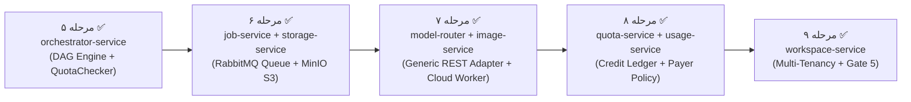
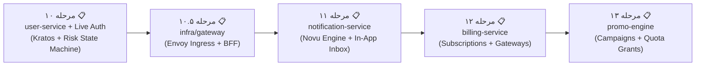
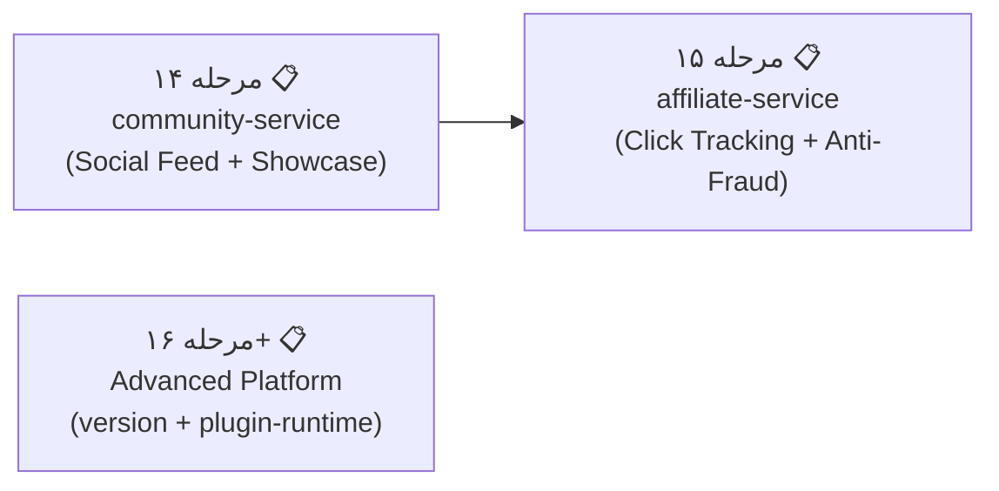

| فیلد / Field | مقدار / Value |
| :--- | :--- |
| **Title (EN)** | Backend Phased Roadmap, Milestone Gates & Service Execution Plan |
| **Title (FA)** | نقشه راه پیاده‌سازی گام‌به‌گام بک‌اند، گیت‌های کیفیت و برنامه اجرایی سرویس‌ها |
| **ID** | DOC-BE-005 |
| **Category** | `backend` |
| **Status** | `Approved` |
| **Owner** | Backend Team / @platform |
| **Last Updated** | 2026-10-01 |
| **Summary (EN)** | Authoritative backend roadmap defining Phase 1 MVP services (Stages 1-9, closed Gate 0-5), Phase 2 Commercialization & Communication (Stages 10-13), and Phase 3 Community & Growth (Stages 14-16) per ADR-011. |
| **Summary (FA)** | نقشه راه مرجع پیاده‌سازی بک‌اند شامل ۱۰ سرویس فاز ۱ (مراحل ۱ تا ۹، گیت‌های بسته شده ۰ تا ۵)، فاز ۲ تجاری‌سازی و ارتباطات (مراحل ۱۰ تا ۱۳) و فاز ۳ شبکه اجتماعی و رشد (مراحل ۱۴ تا ۱۶) مصوب ADR-011. |
| **Tags** | `backend`, `roadmap`, `milestones`, `architecture`, `services`, `mvp`, `phase2`, `phase3` |

---

# نقشه راه پیاده‌سازی گام‌به‌گام بک‌اند (Backend Roadmap & Quality Gates)

> **اصل بنیادین حاکمیت معماری (Governance Invariant):**  
> این سند، منبع واحد حقیقت (SSOT) برای گام‌های اجرایی، توالی تحویل سرویس‌ها و گیت‌های کنترل کیفیت در مخزن `api/` است. تمامی مراحل پیاده‌سازی باید دقیقاً با استانداردهای قراردادهای Proto ([DOC-BE-003](./contracts.md))، اصول کدنویسی Go Clean Architecture ([DOC-BE-004](./style-guide.md))، خط مشی رسانه‌ها ([DOC-BE-006](./media-and-model-pipeline.md)) و تصمیمات معماری مصوب ([ADR-011](../01-architecture/decisions/ADR-011-business-capabilities-and-phase2-roadmap.md)) همگام باشند.

---

## ۱. کاتالوگ رسمی ۱۰ سرویس فاز ۱ (Phase 1 MVP Scope — تکمیل‌شده ✅)

فاز ۱ پلتفرم Lemmo منحصراً شامل ۱۰ میکروسرویس زیر بود که همگی با موفقیت پیاده‌سازی، کانتینریزه و در آزمون سرتاسری ۹ مرحله‌ای Gate 5 تایید شدند:

| # | سرویس | مسئولیت و دامنه | وضعیت پیاده‌سازی |
|---|---|---|---|
| ۱ | `project-service` | ذخیره و مدیریت پروژه‌های بوم، قفل همزمانی (Optimistic Locking)، نگهداری داده‌های JSONB دیزاین و ورک‌فلو | ✅ پیاده‌شده و تست‌شده (Stage 3) |
| ۲ | `node-registry-service` | رجیستری مرکزی انواع نودها و ابزارها، پورت‌های پویا (`var:`, `lora:`, `control:`) و کاتالوگ داخلی | ✅ پیاده‌شده و تست‌شده (Stage 4) |
| ۳ | `orchestrator-service` | موتور ارزیابی و اجرای گراف‌های DAG، مرتب‌سازی توپولوژیک، ولیدیشن اتصالات و رزرو اعتبار با `QuotaChecker` | ✅ پیاده‌شده و تست‌شده (Stage 5) |
| ۴ | `job-service` | مدیریت صف‌های اجرایی ناهمگام، استیت ماشین وضعیت‌های جاب و انتشار رویدادها در RabbitMQ | ✅ پیاده‌شده و تست‌شده (Stage 6) |
| ۵ | `storage-service` | مدیریت باکت‌های S3 در MinIO، دریافت امن مدیا از ورکرها، صدور Presigned URLs و متد تمدید امضا | ✅ پیاده‌شده و تست‌شده (Stage 6) |
| ۶ | `model-router-service` | رجیستری ۴ لایه‌ای پراویدرها، مسیریابی هوشمند، فالبک ۳ سطحی، Token Bucket در Redis و circuit breaker | ✅ پیاده‌شده و تست‌شده (Stage 7) |
| ۷ | `image-service` | ورکر ناهمگام سبک ابری جهت فراخوانی APIهای Fal/Replicate/OpenAI، پولینگ/وبهوک و آپلود به S3 | ✅ پیاده‌شده و تست‌شده (Stage 7) |
| ۸ | `quota-service` | مدیریت سهمیه‌ها و اعتبارسنجی حق اجرا (Entitlement)، رزرو دوسفره اعتبار و مسدودسازی کیف‌پول خالی | ✅ پیاده‌شده و تست‌شده (Stage 8) |
| ۹ | `usage-service` | سیستم دفترکل تغییرناپذیر (Credit Ledger) با مدل Bucket، ردیابی هزینه‌های دلاری پراویدر و محاسبه حاشیه سود | ✅ پیاده‌شده و تست‌شده (Stage 8) |
| ۱۰ | `workspace-service` | مدیریت ورک‌اسپیس‌ها، تننت‌ها، نقش‌های کاربری پروژه و تنظیم سیاست‌های پرداخت‌کننده (Payer Policy) | ✅ پیاده‌شده و تست‌شده (Stage 9 — پایان فاز ۱) |

---

## ۲. توالی مهندسی مراحل ۵ تا ۹ (Execution Stages — Phase 1)

به منظور جلوگیری از بن‌بست‌های وابستگی (به‌ویژه نیاز حیاتی ورکر تصویر به فضای ذخیره‌سازی S3 پیش از تولید اولین تصویر)، توالی مراحل فاز ۱ با موفقیت به پایان رسید:


```mermaid
flowchart LR
    S5["مرحله ۵ ✅<br>orchestrator-service<br>(DAG Engine + QuotaChecker)"] --> S6["مرحله ۶ ✅<br>job-service + storage-service<br>(RabbitMQ Queue + MinIO S3)"]
    S6 --> S7["مرحله ۷ ✅<br>model-router + image-service<br>(Generic REST Adapter + Cloud Worker)"]
    S7 --> S8["مرحله ۸ ✅<br>quota-service + usage-service<br>(Credit Ledger + Payer Policy)"]
    S8 --> S9["مرحله ۹ ✅<br>workspace-service<br>(Multi-Tenancy + Gate 5)"]
```

### مرحله ۵: موتور ارکستراسیون گراف (`orchestrator-service`) ✅
- پیاده‌سازی معماری Clean Architecture در `services/orchestrator-service/`.
- اعتبارسنجی گراف و کشف دورها با الگوریتم Kahn (Topological Sorting).
- پیاده‌سازی اینترفیس `QuotaChecker` جهت بررسی اولیه سهمیه پیش از ثبت جاب.
- پشتیبانی از پورت‌های پویا (`dynamic_prefix`) و تطبیق نوع داده‌ها (Type Coercion Allowlist).
- تولید تسک‌های اجرایی نودها و ارسال به `job-service`.

### مرحله ۶: مدیریت جاب‌ها و ذخیره‌سازی اشیاء (`job-service` + `storage-service`) ✅
- **job-service:** استیت ماشین وضعیت‌های جاب (`PENDING`, `QUEUED`, `RUNNING`, `SUCCEEDED`, `FAILED`, `CANCELLED`)، توزیع در صف‌های RabbitMQ و استریم رویدادهای پیشرفت لحظه‌ای با SSE.
- **storage-service:** راه‌اندازی کلاینت MinIO، اندپوینت آپلود، تولید Presigned URLs برای دانلود امن (TTL ۱۵ دقیقه) و اندپوینت تمدید امضا (`POST /assets/{id}/sign`) در خطای ۴۰۳.

### مرحله ۷: مسیریابی ابری و ورکر تصویر (`model-router-service` + `image-service`) ✅
- **model-router-service:** کاتالوگ مدل‌ها، رجیستری ۴ لایه‌ای (Provider, ProviderInstance, Model, RoutingGroup)، آداپتور عمومی اعلانی (Generic REST Adapter) بدون نیاز به کد برای پراویدرهای استاندارد، الگوریتم توکن‌باکت در Redis برای ریت‌لیمیت حساب پلتفرم، و فالبک ۳ سطحی (Instance -> Model -> Equivalence Group).
- **image-service:** ورکر کلاینت ابری مستقل برای فراخوانی APIهای ابری (Fal.ai, Replicate)، شنود وب‌هوک با امضای HMAC یا Fallback به Polling در محیط محلی، دانلود خروجی و آپلود به `storage-service`.

### مرحله ۸: اقتصاد و دفترکل کردیت (`quota-service` + `usage-service`) ✅
- سیستم دفترکل تغییرناپذیر کردیت (Append-Only Credit Ledger) با مدل Bucket و تاریخ انقضا (`expires_at`).
- الگوی دو فازی Reserve و Settle با بازگشت وجه در صورت شکست (Compensating Transaction) روی موتور `financial-ledger` (ADR-009).
- سیاست پرداخت‌کننده (Payer Policy) بر اساس ورک‌اسپیس محل پروژه (`member_pays`, `workspace_pays`, `hybrid`).
- توقف قطعی با خطای `WORKSPACE_WALLET_EMPTY` در صورت خالی بودن کیف‌پول سازمان و مدیریت حالت opt-in عضو.
- اعمال کارمزد پلتفرم روی پراویدرهای کاستوم کاربر (`byo_fee`).
- ردیابی هزینه دلاری پراویدرها (`provider_cost_micros`) و محاسبه حاشیه سود پلتفرم.

### مرحله ۹: مدیریت فضاهای کاری و سازمان‌ها (`workspace-service`) ✅
- راه‌اندازی سرویس دهم با پورت‌های gRPC `50060` و HTTP `8089` (کانتینر `lemmo-svc-workspace`).
- پایگاه داده اختصاصی `lemmo_workspace` با ۴ جدول: `workspaces` (با ستون رسمی `on_wallet_empty` و وضعیت `provisioning`)، `workspace_memberships`، `workspace_invitations` و `workspace_settings`.
- الگوی تاب‌آوری Provisioning والت در تعامل همگام gRPC با `quota-service` و انتشار رویدادهای `workspace.created` و `workspace.payer_policy_updated` به RabbitMQ.
- تجرید کنترل دسترسی‌ها با اینترفیس انتزاعی `PermissionManager` (آداپتور محلی `LocalMembershipAdapter` با پشتیبانی از `X-Mock-Roles` و آداپتور ریموت `KetoPermissionAdapter`).
- تفکیک کامل رفتار فضاهای کاری شخصی (`PERSONAL`) و سازمانی (`TEAM`).
- چرخه حیات امن دعوت‌نامه‌ها با توکن‌های تصادفی رمزنگاری‌شده، هش SHA-256 و انقضای کانفیگ‌پذیر (`invitation_expiry_duration`).
- استقرار مستقل سرویس در `services/workspace-service/deploy/compose.yaml` ذیل قوانین ADR-009.

---

## ۳. پنج قلاب حیاتی توسعه‌پذیری (Mandatory MVP Hooks)

برای ممانعت از بازنویسی‌های پرهزینه در فازهای ۲ و ۳، این ۵ قلاب در کدهای فاز ۱ پیاده‌سازی و تثبیت شده‌اند:
1. **مدل Bucket و `expires_at` در لجر:** ✅ پیاده‌سازی کامل سطل‌ها و کسر با الگوریتم FEFO در `quota-service` و `usage-service`. قلاب مستقیم برای جذب کدهای تخفیف و رفرال بدون تغییر اسکیما.
2. **فیلد `actor_type` در لجر و گیت‌وی:** ✅ پشتیبانی از مقادیر `USER`، `API_KEY` و `SYSTEM` در اسکیما ۱۹ فیلدی دفترکل.
3. **انتشار رویداد `provider.call.completed`:** ✅ ثبت هزینه هر فراخوانی پراویدر ابری به میکرو‌دلار (`provider_cost_micros`).
4. **نگاشت خطای Content Policy و مرحله no-op:** ✅ نگاشت کدهای خطای پالیسی به `CONTENT_POLICY_VIOLATION_PROVIDER` و آزادسازی آنی اعتبار رزرو‌شده.
5. **حداقل بک‌آپ به عنوان شرط انتشار MVP (E4.6):** ✅ اسکریپت پشتیبان‌گیری استاندارد `tools/backup/db_backup.sh` برای هر ۱۰ پایگاه داده با سوییچ اعتبارسنجی `--verify`.

---

## ۴. فاز ۲: هویت زنده، تجاری‌سازی و ارتباطات (Phase 2 Roadmap — مصوب ADR-011)

فاز ۲ بر تبدیل موتور پایپ‌لاین فاز ۱ به یک پلتفرم تجاری زنده با کاربران واقعی، سیستم صورت‌حساب، کدهای تبلیغاتی و اعلان‌های چندکاناله تمرکز دارد:


```mermaid
flowchart LR
    S10["مرحله ۱۰ 📋<br>user-service + Live Auth<br>(Kratos + Risk State Machine)"] --> S105["مرحله ۱۰.۵ 📋<br>infra/gateway<br>(Envoy Ingress + BFF)"]
    S105 --> S11["مرحله ۱۱ 📋<br>notification-service<br>(Novu Engine + In-App Inbox)"]
    S11 --> S12["مرحله ۱۲ 📋<br>billing-service<br>(Subscriptions + Gateways)"]
    S12 --> S13["مرحله ۱۳ 📋<br>promo-engine<br>(Campaigns + Quota Grants)"]
```

### مرحله ۱۰: سرویس هویت، پروفایل کاربران و موتور ریسک (`user-service` + Live Auth)
- **دامنه:**
  - یکپارچگی زنده با Ory Kratos و جایگزینی کامل `MockAuth` در محیط Production.
  - جداسازی قطعی شناسه غیرقابل تغییر داخلی (`id` UUID) از نام‌کاربری یکتا و عمومی کاربر (`username`/`handle`).
  - نگهداری اولویت‌ها و تنظیمات کاربری (`user_preferences`) شامل قالب، زبان، کانال‌های اعلان و تنظیمات حریم خصوصی.
  - پیاده‌سازی ماشین وضعیت آنبوردینگ (Onboarding State Machine: `REGISTERED` -> `PROFILE_COMPLETED` -> `WORKSPACE_ASSIGNED` -> `READY`).
  - **ماشین وضعیت امنیت و تعلیق حساب:** فیلدهای `status` (مقادیر `ACTIVE`, `SUSPENDED`, `BANNED`, `CHALLENGE_REQUIRED`) و زمان تعلیق موقت `suspended_until` (بر مبنای UTC).
  - **موتور محاسبه امتیاز ریسک و فیلتر ایمیل‌های متفرقه:** پالایش دامنه‌های ایمیل موقت (Disposable Burner)، ثبت وزن‌های ریسک رفتاری (۰ تا ۱۰۰)، و اعمال خودکار تعلیق موقت ۲ ساعته با رسیدن امتیاز به ۱۰۰ و ثبت کلید `user:ban:{user_id}` در Redis.
  - قلاب‌های سیستمی معرفی کاربر (P2P Referral) و ساخت خودکار کد دعوت برای هر کاربر.

### مرحله ۱۰.۵: استقرار درگاه ورودی و اتصال فرانت‌اند (`infra/gateway` + BFF Ingress)
- **دامنه:**
  - استقرار کانتینر درگاه معکوس بر بستر Envoy / Reverse Proxy در `infra/gateway/` روی پورت‌های استاندارد بیرونی `80` و `443`.
  - ممانعت قطعی از دسترسی مستقیم به پورت میکروسرویس‌های داخلی و ایزولاسیون کامل در شبکه خصوصی داکر (`lemmo-network`).
  - اعتبارسنجی نشست‌های Kratos در لبه شبکه و تزریق هدرهای استاندارد (`X-User-ID`, `X-Workspace-ID`, `X-Trace-ID`) به سرویس‌های پایین‌دست.
  - پروکسی معکوس استریم‌های رویدادی زنده (Server-Sent Events در `/api/v1/jobs/{id}/events` و WebSockets).
  - **اجرای بلادرنگ قوانین در لبه شبکه:** استعلام پرسرعت از کلیدهای تعلیق Redis و مسدودسازی آنی کاربران معلق با پاسخ HTTP 403 (`ACCOUNT_TEMPORARILY_SUSPENDED`) و هدر `Retry-After`.
  - اتصال و راه‌اندازی فرانت‌اند استودیو (`app/`) از طریق پکیج `@/sdk` در حالت `NEXT_PUBLIC_API_MODE=live`.

### مرحله ۱۱: سرویس اعلان‌ها و پیام‌رسانی (`notification-service`)
- **دامنه:**
  - استقرار موتور اعلان منبع‌باز Novu به صورت سلف‌هاستد در استک دیپلویمنت.
  - اتصال به تبادل `lemmo.events` در RabbitMQ جهت دریافت رویدادهای سیستمی (`job.completed`, `wallet.low_balance`, `workspace.invitation`).
  - مدیریت صندوق پیام‌های درون‌برنامه‌ای (In-App Inbox Notification Feed) و وضعیت‌های خوانده‌شده (`read/unread`).
  - یکپارچگی چندکاناله با ارائه‌دهندگان ایمیل و پیامک.

### مرحله ۱۲: سرویس اشتراک و صورت‌حساب (`billing-service`)
- **دامنه:**
  - موتور مدیریت پلن‌ها و چرخه‌های اشتراک (`monthly`, `yearly`).
  - درگاه‌های پرداخت چندگانه (ارزی Stripe/NowPayments و ریالی زرین‌پال/زیبال).
  - صدور فاکتور رسمی و ذخیره PDF در `storage-service`.
  - اعمال کدهای تخفیف روی سبد خرید اشتراک (`checkout discount`).
  - تمدید خودکار دوره‌ای و مدیریت تراکنش‌های ناموفق (Dunning).

### مرحله ۱۳: موتور کوپن و کمپین‌های تبلیغاتی (`promo-engine`)
- **دامنه:**
  - مدیریت چرخه حیات کدهای پرومو با محدودیت‌های سقف مصرف، تاریخ UTC و سیاست‌های ضدتقلب.
  - اتصال مستقیم به `quota-service` برای شارژ مستقیم اعتبارات هدیه در باکت‌های `PROMO` با تاریخ انقضا.
  - قانون منع انباشت (Non-Stackable Policy) و مصرف تک‌بار به ازای هر کاربر.

---

## ۵. فاز ۳: شبکه اجتماعی، همیاری و اکوسیستم (Phase 3 Roadmap)

فاز ۳ پلتفرم Lemmo را به یک شبکه اشتراک‌گذاری خلاقانه با اکوسیستم درآمدزایی افیلیت و پلاگین‌ها تبدیل می‌نماید:


```mermaid
flowchart LR
    S14["مرحله ۱۴ 📋<br>community-service<br>(Social Feed + Showcase)"] --> S15["مرحله ۱۵ 📋<br>affiliate-service<br>(Click Tracking + Anti-Fraud)"]
    S16["مرحله ۱۶+ 📋<br>Advanced Platform<br>(version + plugin-runtime)"]
```

### مرحله ۱۴: سرویس جامع فید و کامیونیتی (`community-service`)
- **دامنه:**
  - تجمیع ماژول‌های رسانه، تعاملات، محتوا و ویترین در یک میکروسرویس منسجم Bounded Context.
  - انتشار کارهای خلاقانه کاربران در ویترین عمومی پلتفرم (Showcase Gallery).
  - تعاملات اجتماعی: لایک، کامنت، نشان‌کردن (Bookmark)، دنبال‌کردن کاربران و بازنشر گراف‌ها (Remix).
  - استفاده مستقیم از `storage-service` برای ارائه CDN مدیا و کشینگ فید ترندها در Redis.

### مرحله ۱۵: پلتفرم بازاریابی و همکاری در فروش (`affiliate-service`)
- **دامنه:**
  - رهگیری کلیک‌های تبلیغاتی با کوکی‌های ۳۰/۶۰/۹۰ روزه و الگوریتم انتساب First-Touch / Last-Touch.
  - سیستم پیشرفته کشف تقلب (Anti-Fraud Engine) شامل تشخیص رفتارهای مشکوک و تطابق IP/Fingerprint.
  - دفترکل پرداخت کارمزد بازاریابان (Payout Ledger) با دوره‌های انجماد وجه (Holding Period) جهت جلوگیری از لغو و استرداد.

### مرحله ۱۶ به بعد: قابلیت‌های تکمیلی سازمانی
- سرویس تاریخچه و شاخه‌بندی پروژه‌ها (`version-service`).
- محیط اجرای ایزوله پلاگین‌ها و کاستوم‌نودها (`plugin-runtime-service`).
- چت بلادرنگ بوم و پیام‌رسانی تیمی (`chat-service`).
- حسابرسی و گزارش‌گیری امنیتی سازمانی (`audit-service`).

---

## ۶. گیت‌های کنترل کیفیت تحویل (Milestone Quality Gates)

```
[Gate 0: اسکلت Day 0] ✅ بسته شد
       │
       ▼
[Gate 1: پایداری پروژه و اعتبارسنجی MockAuth] ✅ بسته شد
       │
       ▼
[Gate 2: ارکستراسیون گراف و تفکیک تسک‌ها] ✅ بسته شد (پایان مرحله ۵)
       │
       ▼
[Gate 3: ایجاد صف جاب، ذخیره شیء و تولید تصویر نهایی] ✅ بسته شد (پایان مرحله ۷)
       │
       ▼
[Gate 4: چرخه کامل مالی، لجر اتمیک و آماده‌سازی انتشار MVP] ✅ بسته شد (پایان مرحله ۸)
       │
       ▼
[Gate 5: استقرار چندمستأجری، فضاهای کاری و بسته شدن نهایی فاز ۱] ✅ بسته شد (پایان مرحله ۹)
       │
       ▼
[Gate 6: احراز هویت زنده، آنبوردینگ و سیستم اعلان‌ها] 📋 در نوبت (پایان مرحله ۱۱)
       │
       ▼
[Gate 7: صورت‌حساب، درگاه‌های پرداخت، و سیستم پرومو] 📋 در نوبت (پایان مرحله ۱۳)
       │
       ▼
[Gate 8: جامعه کاربری، ویترین عمومی و موتور افیلیت مارکتینگ] 📋 در نوبت (پایان مرحله ۱۵)
```

- **معیار پذیرش Gate 5 (پایان مرحله ۹ — تست ۹ مرحله‌ای E2E):** ✅ رسماً در تاریخ ۲۰۲۶-۱۰-۰۱ بسته شد.
- **معیار پذیرش Gate 6 (پایان مرحله ۱۱):**  
  1. **احراز هویت زنده و پروفایل کاربر:** احراز هویت واقعی با Kratos، تکمیل پروفایل کاربر و نام‌کاربری عمومی (`handle`)، و ثبت در ماشین وضعیت آنبوردینگ در `user-service`.
  2. **اتصال امن فرانت‌اند و درگاه ورودی:** اتصال موفق کلاینت فرانت‌اند (`app/`) از طریق `@/sdk` در حالت `NEXT_PUBLIC_API_MODE=live` منحصراً به `infra/gateway`، پنهان‌سازی ۱۰۰٪ پورت‌های داخلی، و تزریق موفق کانتکست هویتی (`X-User-ID`, `X-Workspace-ID`).
  3. **آزمون قوانین ضدسوءاستفاده و مسدودسازی موقت:** شبیه‌سازی نقض مکرر پالیسی و رسیدن امتیاز ریسک به ۱۰۰، انتقال کاربر به وضعیت `SUSPENDED` با انقضای ۲ ساعته، ثبت کلید در Redis، و مسدودسازی خودکار درخواست‌های بعدی در لبه شبکه توسط گیت‌وی با خطای HTTP 403 و هدر `Retry-After: 7200`.
  4. **سیستم اعلان‌ها:** دریافت اولین اعلان درون‌برنامه‌ای (In-App Feed) و ایمیلی از طریق موتور Novu به دنبال ساخت موفق پروژه یا رندر تصویر.

- **معیار پذیرش Gate 7 (پایان مرحله ۱۳):**  
  خرید موفق اشتراک تیمی از طریق درگاه با اعمال کد تخفیف در سبد خرید، شارژ آنی سطل پرومو در والت سازمان از طریق کد هدیه توکن، و ثبت دقیق در فاکتورهای `billing-service` و لجر `usage-service`.
- **معیار پذیرش Gate 8 (پایان مرحله ۱۵):**  
  انتشار عمومی تصویر خروجی در ویترین Lemmo، بازنشر و لایک توسط کاربران دیگر، رهگیری لینک اختصاصی افیلیت با کوکی معتبر، و ثبت کمیسیون در دفترکل افیلیت پس از خرید کاربر ارجاع‌شده.

