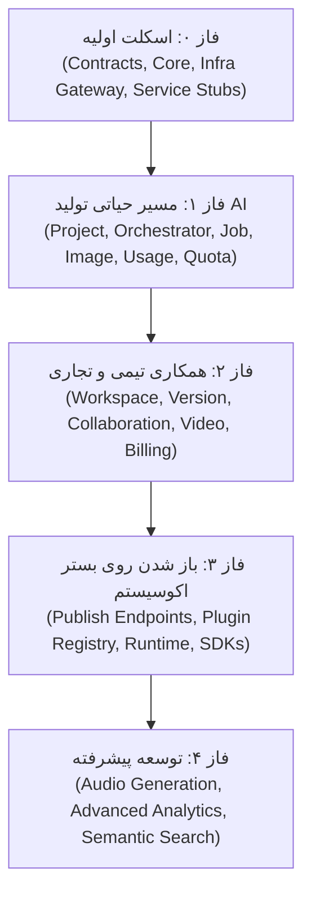

| فیلد / Field | مقدار / Value |
| :--- | :--- |
| **Title (EN)** | Microservices Catalog & Phased Delivery Roadmap |
| **Title (FA)** | شناسنامه میکروسرویس‌ها و نقشه فازبندی تحویل بک‌اند |
| **ID** | DOC-BE-002 |
| **Category** | `backend` |
| **Status** | `Approved` |
| **Owner** | Backend & Platform Team |
| **Last Updated** | 2026-09-26 |
| **Summary (EN)** | Complete breakdown of nons reused services, Lemmo specific microservices, service anatomy, and phased delivery roadmap. |
| **Summary (FA)** | فهرست کامل سرویس‌های اشتراکی، میکروسرویس‌های اختصاصی Lemmo، ساختار داخلی هر سرویس و نقشه فازبندی. |
| **Tags** | `backend`, `services`, `catalog`, `roadmap`, `microservices` |

---

# شناسنامه میکروسرویس‌ها و نقشه فازبندی تحویل (`services/`)

این سند کاتالوگ جامع کلیه سرویس‌های فعال و رزروشده در مونوریپوی بک‌اند (`lemmo-api`) را به همراه ساختار داخلی استاندارد و زمان‌بندی پیاده‌سازی فازها تشریح می‌کند.

---

## ۱. سرویس‌های مشترک و بازاستفاده از پلتفرم Nons

به منظور کاهش چشمگیر زمان توسعه و بهره‌برداری از مؤلفه‌های استاندارد اثبات‌شده، سرویس‌های پایه‌ای هویت و زیرساخت از پلتفرم **nons** با حداقل تغییرات بازاستفاده می‌شوند:

| نام سرویس | نقش و مسئولیت در پلتفرم Lemmo | وضعیت |
| :--- | :--- | :--- |
| **`auth-service` (Ory Kratos)** | مدیریت ثبت‌نام، ورود با کد یکبارمصرف (OTP)، مدیریت نشست‌ها (Session) و SSO | آماده / بازاستفاده |
| **`token-service` (Ory Hydra)** | مدیریت توکن‌های امنیتی OAuth2 و OIDC، اعطای کلیدهای API سازمانی جهت اجرای خارجی ورک‌فلوها | آماده / بازاستفاده |
| **`login-consent-app`** | رابط واسط میان Kratos و Hydra جهت اخذ تاییدیه ورود و دامنه دسترسی کاربران | آماده / بازاستفاده |
| **`IAM` + `keto`** | موتور ماتریس نقش‌ها و مجوزها (مالک، ویرایشگر، بیننده و مجری روی پروژه‌ها) | آماده / بازاستفاده |
| **`user-service`** | نمایه و اطلاعات هویتی کاربر (شماره تلفن، نام نمایشی، وضعیت تایید) | آماده / بازاستفاده |
| **`notification-service`** | ارسال اعلان‌های سیستمی (پایان پردازش تصویر/ویدیو، دعوت به تیم، هشدار پایان اعتبار) | آماده / بازاستفاده |
| **`storage-service`** | مدیریت فایل‌های ورودی کاربر، خروجی‌های تولیدشده، لینک‌های امضاشده (S3/MinIO) و توزیع CDN | آماده / بازاستفاده |

---

## ۲. سرویس‌های اختصاصی اکوسیستم Lemmo

سرویس‌های تجاری زیر به‌طور اختصاصی برای موتور پردازش گراف و تولید هوش مصنوعی Lemmo طراحی شده و در فازهای زمان‌بندی‌شده مستقر می‌شوند:

| نام سرویس | مسئولیت و وظیفه اصلی | فاز تحویل |
| :--- | :--- | :--- |
| **`project-service`** | نگهداری و مدیریت JSON مرجع پروژه‌ها (نودها، اتصالات، متادیتا، کلون رمزشده) | فاز ۱ |
| **`workspace-service`** | مدیریت فضاهای کاری چندمستأجری، تیم‌ها، سطوح دسترسی و دعوت اعضا | فاز ۱ |
| **`orchestrator-service`** | تفسیر گراف جریان کار (DAG Execution) و هدایت ترتیبی نودهای پردازشی | فاز ۱ |
| **`node-registry-service`** | ثبت، اعتبارسنجی اسکیما و قرارداد انواع نودهای ورودی، خروجی و پردازشی | فاز ۱ |
| **`job-service`** | صف‌بندی کارهای سنگین هوش مصنوعی، اولویت‌بندی، تلاش مجدد (Retry) و وضعیت زنده | فاز ۱ |
| **`model-router-service`** | مسیریابی هوشمند پرامپت‌ها به ارائه‌دهندگان مختلف هوش مصنوعی بر اساس هزینه و سرعت | فاز ۱ |
| **`image-service`** | ارتباط با مدل‌های مولد تصویر (Stable Diffusion، ComfyUI و مدل‌های اختصاصی GPU) | فاز ۱ |
| **`usage-service`** | ثبت اتمیک و قطعی میزان مصرف واقعی منابع و محاسبه هزینه‌های مصرف‌شده | فاز ۱ |
| **`quota-service`** | اعتبارسنجی سقف مجاز، سهمیه‌بندی پلن و رزرو اعتبار پیش از شروع اجرای کار | فاز ۱ |
| **`version-service`** | نسخه‌بندی تاریخچه تغییرات گراف پروژه، مقایسه نسخه‌ها (Diff) و بازگردانی | فاز ۲ |
| **`collaboration-service`** | همگام‌سازی لحظه‌ای بوم و نمایش نشانگر اعضای آنلاین از طریق WebSocket | فاز ۲ |
| **`video-service`** | تولید، تغییر فریم و تدوین ویدیو با مدل‌های تولید ویدیوی هوش مصنوعی | فاز ۲ |
| **`media-service`** | بهینه‌سازی مدیا، فشرده‌سازی، تغییر فرمت، تولید بندانگشتی و افزودن واترمارک | فاز ۲ |
| **`prompt-service`** | کتابخانه پرامپت‌ها، قالب‌های مهندسی پرامپت و پیشنهادهای هوشمند | فاز ۲ |
| **`subscription-service`** | پلن‌های ماهانه/سالانه، بسته‌های اعتبار اشتراکی، ارتقا و تنزل بسته‌ها | فاز ۲ |
| **`billing-service`** | صدور فاکتور و درگاه پرداخت آنلاین ریالی و ارزی (اتصال به والت nons) | فاز ۲ |
| **`audit-service`** | ثبت ماندگار و تغییرناپذیر لاگ رخدادهای حساس و تغییرات دسترسی تیم | فاز ۲ |
| **`publish-service`** | انتشار نسخه‌های ثابت ورک‌فلوها به شکل REST Endpoint جهت مصرف خارجی | فاز ۳ |
| **`plugin-registry-service`**| رجیستری مرکزی، اعتبارسنجی مانیفست و فهرست‌نویسی پلاگین‌های رسمی و ثالث | فاز ۳ |
| **`plugin-runtime-service`** | اجرای ایزوله و سندباکس پلاگین‌ها با محدودیت سقف پردازنده و رم | فاز ۳ |
| **`integration-service`** | مدیریت Webhookها و اتصال با پلتفرم‌های بیرونی (Shopify، Discord و ...) | فاز ۳ |
| **`audio-service`** | تولید صوت، گویندگی هوش مصنوعی (TTS) و تولید موسیقی متناسب | فاز ۴ |

---

## ۳. مؤلفه‌هایی که سرویس مستقل نیستند

برخی اجزا نباید به صورت سرویس جداگانه ساخته شوند و جایگاه آن‌ها در پوشه‌های هسته (`core/`) یا زیرساخت (`infra/`) است:
- **Event Bus / Message Broker:** زیرساخت است (`infra/messaging`)، نه سرویس بیزینسی.
- **Observability:** سیستم متریک و تریس در `infra/observability` و میدل‌ورهای `core/` تعبیه می‌شود.
- **Secrets Management:** توسط Vault / External Secrets در سطح زیرساخت مدیریت می‌گردد.
- **Contract Generator:** اسکریپت‌های تبدیل در پوشه `contracts/` قرار دارند، نه یک سرویس اجرایی.
- **Project Clone:** کلون‌های پروژه به عنوان نمای اختصاصی هر عضو در همان `project-service` باقی می‌مانند.

---

## ۴. ساختار داخلی استاندارد هر سرویس

کلیه سرویس‌های موجود در پوشه `services/` ملزم به رعایت ساختار تمیز و لایه‌ای یکسان هستند:

```text
services/<service-name>/
├── cmd/                     ← نقطه ورود برنامه و تابع main (فقط راه‌اندازی و تزریق وابستگی)
├── api/                     ← فایل‌های Proto یا OpenAPI مربوط به همین سرویس
├── internal/                ← منطق محافظت‌شده سرویس (غیرقابل ایمپورت توسط دیگران)
│   ├── domain/              ← موجودیت‌ها (Entities) و قواعد کسب‌وکار خالص (بدون وابستگی)
│   ├── app/                 ← سناریوهای کاربردی (Use Cases) و هماهنگ‌کننده منطق
│   ├── ports/               ← اینترفیس‌های ورودی (API/gRPC) و خروجی (Database/Broker)
│   └── adapters/            ← پیاده‌سازی عینی دیتابیس، کلاینت صف و کالک‌های بیرونی
├── migrations/              ← فایل‌های مایگریشن اختصاصی دیتابیس همین سرویس (000001_...)
├── test/                    ← آزمون‌های یکپارچگی (Integration Tests)
├── Dockerfile               ← دستورالعمل بیلد ایمیج سبک کانتینر
└── service.md               ← شناسنامه مستند سرویس (مسئولیت‌ها، قراردادها و وابستگی‌ها)
```

> **الزام فایل `service.md`:**  
> پیش از نوشتن کدهای هر سرویس، فایل `service.md` باید در ریشه پوشه همان سرویس ایجاد شده و مسئولیت دقیق، رویدادهای تولیدی و جدول تعاملات آن مستند شود.

---

## ۵. نقشه فازبندی پیاده‌سازی و راه‌اندازی (Implementation Roadmap)



### فاز ۰ — استقرار فونداسیون
- پیاده‌سازی قراردادهای پایه در `contracts/platform/` و تنظیمات کامپایل Proto با `buf`.
- توسعه هسته مشترک `core/` (بوت‌استرپ سرور، متغیرهای پیکربندی، لاگر و میدل‌ورها).
- راه‌اندازی درگاه اولیه ورودی `infra/gateway` و ایجاد اسکلت پوشه‌های سرویس‌ها با `service.md`.

### فاز ۱ — مسیر اصلی (MVP ساخت و اجرای یک جریان کار)
- اتصال سرویس‌های هویتی بازاستفاده از nons (`auth`, `token`, `user`, `IAM`).
- پیاده‌سازی زنجیره اصلی: `project-service` ← `node-registry-service` ← `orchestrator-service` ← `job-service` ← `model-router-service` + `image-service` ← `storage-service` ← `quota-service` + `usage-service`.
- نتیجه فاز ۱: کاربر وارد سیستم می‌شود، پروژه‌ای می‌سازد، گراف نودها اجرا شده و تصویر هوش مصنوعی تولید و ذخیره می‌گردد و اعتبار کاربر ثبت می‌شود.

### فاز ۲ — همکاری، تاریخچه و مدل درآمدی
- استقرار `workspace-service` جهت تشکیل تیم و مدیریت دسترسی‌های مشترک.
- پیاده‌سازی `collaboration-service` (همگام‌سازی سوکت) و `version-service` (تاریخچه).
- اضافه شدن `video-service` و `media-service` جهت پردازش ویدیویی.
- استقرار سیستم مالی و سهمیه: `subscription-service` و `billing-service`.

### فاز ۳ — باز شدن به دنیای بیرون و پلاگین‌ها
- استقرار `publish-service` جهت اکسپورت ورک‌فلوها به عنوان وب‌هوک و API قابل فراخوانی.
- راه‌اندازی اکوسیستم پلاگین: `plugin-registry-service` و سندباکس امنیتی `plugin-runtime-service`.
- انتشار بسته‌های بیرونی `plugin-sdk` و `embed-sdk` برای توسعه‌دهندگان مستقل.

### فاز ۴ — قابلیت‌های پیشرفته
- پیاده‌سازی موتور پردازش و تولید صوت (`audio-service`).
- جستجوی پیشرفته برداری روی پروژه‌ها و پایش بلادرنگ هوشمند (Analytics).
