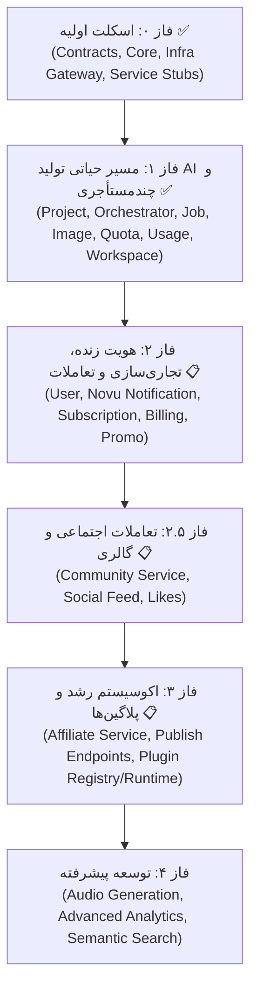

| فیلد / Field | مقدار / Value |
| :--- | :--- |
| **Title (EN)** | Microservices Catalog & Phased Delivery Roadmap |
| **Title (FA)** | شناسنامه میکروسرویس‌ها و نقشه فازبندی تحویل بک‌اند |
| **ID** | DOC-BE-002 |
| **Category** | `backend` |
| **Status** | `Approved` |
| **Owner** | Backend & Platform Team |
| **Last Updated** | 2026-09-30 |
| **Summary (EN)** | Complete breakdown of nons reused services, Lemmo specific microservices, service anatomy, and phased delivery roadmap. |
| **Summary (FA)** | فهرست کامل سرویس‌های اشتراکی، میکروسرویس‌های اختصاصی Lemmo، ساختار داخلی هر سرویس و نقشه فازبندی. |
| **Tags** | `backend`, `services`, `catalog`, `roadmap`, `microservices` |

---

# شناسنامه میکروسرویس‌ها و نقشه فازبندی تحویل (`services/`)

> ⚠️ **وضعیت پیاده‌سازی در کد (`api/`):**  
> وضعیت معماری این سند `Approved` است و بر پایه تصمیمات مصوب [ADR-004](../01-architecture/decisions/adr-004-backend-microservices.md)، [ADR-007](../01-architecture/decisions/ADR-007-backend-contracts-and-tooling-standards.md) و [ADR-009](../01-architecture/decisions/ADR-009-service-owned-deployment-and-financial-ledger.md) تدوین شده است. در راستای متدولوژی **Contract-First & Spine-First**، کلیه ۹ سرویس مسیر حیاتی فاز ۱ با ساختار استاندارد لایه‌ای Clean Architecture، فایل شناسنامه `service.md` و الگوهای مایگریشن در پوشه `services/` اسکافولد شده‌اند. همچنین پیاده‌سازی عملیاتی استاب اینترفیس هسته `QuotaChecker` در `orchestrator-service` و میدل‌ور `MockAuthMiddleware` در پکیج `core/` مستقر گردیده است. تکمیل منطق تجاری داخلی و تست‌های یکپارچگی گام‌به‌گام مطابق نقشه راه ([DOC-BE-005](./roadmap.md)) انجام خواهد شد.

این سند کاتالوگ جامع کلیه سرویس‌های فعال و رزروشده در مونوریپوی بک‌اند (`lemmo-api`) را به همراه ساختار داخلی استاندارد و زمان‌بندی پیاده‌سازی فازها تشریح می‌کند.

---

## ۱. سرویس‌های مشترک و بازاستفاده از پلتفرم Nons

به منظور کاهش چشمگیر زمان توسعه و بهره‌برداری از مؤلفه‌های استاندارد اثبات‌شده، سرویس‌های پایه‌ای هویت و زیرساخت از پلتفرم **nons** با حداقل تغییرات بازاستفاده می‌شوند:

| نام سرویس | نقش و مسئولیت در پلتفرم Lemmo | وضعیت |
| :--- | :--- | :--- |
| **`auth-service` (Ory Kratos)** | مدیریت ثبت‌نام، ورود با کد یکبارمصرف (OTP)، مدیریت نشست‌ها (Session) و SSO | اسکلت `service.md` آماده / بازاستفاده |
| **`iam-service` (Ory Keto)** | موتور ماتریس نقش‌ها و مجوزها (مالک، ویرایشگر، بیننده و مجری روی پروژه‌ها) | اسکلت `service.md` آماده / بازاستفاده |
| **`user-service`** | نمایه و اطلاعات هویتی کاربر (شماره تلفن، نام نمایشی، وضعیت تایید، شناسه عمومی Handle، ترجیحات و ماشین حالت آنبوردینگ طبق ADR-011) | در صف توسعه (فاز ۲ — استیج ۱۰) |
| **`token-service` (Ory Hydra)** | مدیریت توکن‌های امنیتی OAuth2 و OIDC، اعطای کلیدهای API سازمانی جهت اجرای خارجی ورک‌فلوها | اسکلت `service.md` آماده / بازاستفاده |
| **`notification-service`** | ارسال اعلان‌های چندکاناله سیستمی (In-App Inbox، ایمیل، پیامک) با پلتفرم Novu و شنود ایونت‌های RabbitMQ (مصوب ADR-011) | در صف توسعه (فاز ۲ — استیج ۱۱) |
| **`storage-service`** | مدیریت فایل‌های ورودی کاربر، خروجی‌های تولیدشده، لینک‌های امضاشده (S3/MinIO) و توزیع CDN | اسکلت `service.md` آماده / بازاستفاده |
| **`login-consent-app`** | رابط واسط میان Kratos و Hydra جهت اخذ تاییدیه ورود و دامنه دسترسی کاربران | آماده / بازاستفاده |

### مسیر گام‌به‌گام گذار به سیستم احراز هویت واقعی (Kratos Transition Roadmap)
1. **فاز ۰ (ستون فقرات محلی):** توسعه محلی بک‌اند و فرانت‌اند با میدل‌ور موک (`MockAuthMiddleware`) و داده‌های ساختگی انجام می‌شود تا وابستگی به سرویس‌های هویت مانع پیشرفت نشود.
2. **فاز ۱ (Milestone Gate 1 & 2):** با راه‌اندازی `project-service` و `orchestrator-service`، فرانت‌اند با تنظیم `NEXT_PUBLIC_API_MODE=live` مستقیماً به نشست‌های Kratos متصل می‌شود؛ کوکی‌های Session کلاینت از طریق متد `/sessions/whoami` در Kratos اعتبارسنجی شده و شناسه کاربری در کانتکست تزریق می‌گردد.
3. **فاز ۲ و ۳ (Milestone Gate 4 به بعد):** اتصال کلاینت‌های بیرونی و CLI از طریق Ory Hydra (`token-service`) و توکن‌های OAuth2/OIDC پیاده‌سازی می‌گردد.

---

## ۲. سرویس‌های اختصاصی اکوسیستم Lemmo

سرویس‌های تجاری زیر به‌طور اختصاصی برای موتور پردازش گراف و تولید هوش مصنوعی Lemmo طراحی شده و در فازهای زمان‌بندی‌شده مستقر می‌شوند:

| نام سرویس | مسئولیت و وظیفه اصلی | فاز تحویل | وضعیت پیاده‌سازی در مخزن |
| :--- | :--- | :---: | :---: |
| **`project-service`** | نگهداری و مدیریت JSON مرجع پروژه‌ها (نودها، پورت‌های پویا، متادیتا، لایه‌های وکتور Design Mode) | فاز ۱ | پیاده‌سازی لایه‌ای، مایگریشن و gRPC تکمیل شد (`Completed`) |
| **`workspace-service`** | مدیریت فضاهای کاری چندمستأجری، سازمان‌ها، تیم‌ها، سطوح دسترسی، دعوت اعضا و ارتباط با کیف‌پول سازمانی (پورت `50060` gRPC / `8089` HTTP) | فاز ۱ | پیاده‌سازی کامل و بستن گیت ۵ (`Completed - Stage 9`) |
| **`orchestrator-service`** | تفسیر گراف جریان کار (DAG Execution) و هدایت ترتیبی نودها (اینترفیس سهمیه `QuotaChecker` مصوب طبق [ADR-007](../../01-architecture/decisions/ADR-007-backend-contracts-and-tooling-standards.md)) | فاز ۱ | پیاده‌سازی فعال هسته (`Core Stub Active`) |
| **`node-registry-service`** | ثبت و اعتبارسنجی اسکیما و قرارداد نودها و پورت‌های پویا ([DOC-MOD-001](../06-modules/canvas-modes.md) و [ADR-007](../../01-architecture/decisions/ADR-007-backend-contracts-and-tooling-standards.md)) | فاز ۱ | پیاده‌سازی لایه‌ای، مایگریشن و رجیستری داخلی تکمیل شد (`Completed - Stage 4`) |
| **`job-service`** | صف‌بندی کارهای ناهمگام ابری با RabbitMQ، اولویت‌بندی، تلاش مجدد (Retry)، استریم وضعیت با SSE | فاز ۱ | پیاده‌سازی لایه‌ای، صف RabbitMQ و ورکر تکمیل شد (`Completed - Stage 6`) |
| **`storage-service`** | ذخیره‌سازی پایدار در MinIO S3، تولید دسته‌ای Presigned URLs و تمدید امضا در خطای ۴۰۳ | فاز ۱ | پیاده‌سازی لایه‌ای و درایور MinIO تکمیل شد (`Completed - Stage 6`) |
| **`model-router-service`** | رجیستری ۴ لایه‌ای پراویدرها، آداپتورهای اعلانی REST، فالبک ۳ سطحی و ریت‌لیمیت توکن‌باکت در Redis | فاز ۱ | پیاده‌سازی لایه‌ای، کاتالوگ مدل‌ها و آداپتورها تکمیل شد (`Completed - Stage 7`) |
| **`image-service`** | ورکر ناهمگام سبک جهت فراخوانی API پراویدرهای ابری (Fal, Replicate)، شنود وب‌هوک و آپلود به S3 (پورت `50057` gRPC / `8082` HTTP) | فاز ۱ | پیاده‌سازی ورکر ابری و پایپ‌لاین تولید تصویر تکمیل شد (`Completed - Stage 7`) |
| **`quota-service`** | مدیریت سهمیه‌ها، سطل‌های منقضی‌شونده (FEFO)، رزرو دوسفره اعتبار، استقرار مستقل با موتور `financial-ledger` طبق ADR-009 (پورت `50058` gRPC / `8087` HTTP) | فاز ۱ | پیاده‌سازی کامل و بستن گیت ۴ (`Completed - Stage 8`) |
| **`usage-service`** | سیستم دفترکل تغییرناپذیر ۱۹ فیلدی (Credit Ledger)، مصرف ناهمگام از RabbitMQ، ردیابی سود و هزینه ابری (پورت `50059` gRPC / `8088` HTTP) | فاز ۱ | پیاده‌سازی کامل و بستن گیت ۴ (`Completed - Stage 8`) |
| **`subscription-service`** | پلن‌های ماهانه/سالانه، بسته‌های اعتبار اشتراکی، ارتقا و تنزل بسته‌ها | فاز ۲ | در صف توسعه (`Planned - Phase 2`) |
| **`billing-service`** | صدور فاکتور، درگاه پرداخت آنلاین ریالی و ارزی و موتور جامع پرومو کد و تخفیف چک‌اوت طبق ADR-011 | فاز ۲ | در صف توسعه (`Planned - Phase 2`) |
| **`community-service`** | گالری عمومی بوم، فید اجتماعی، سیستم لایک‌ها و بوک‌مارک‌ها و کش محبوب‌ترین‌ها در Redis بر بستر MinIO S3 (مصوب ADR-011) | فاز ۲.۵ | در صف توسعه (`Planned - Phase 2.5`) |
| **`affiliate-service`** | پلتفرم افیلیت مارکتینگ تجاری، رهگیری لینک و کوکی‌های بازاریابی، پنجره انتساب ۳۰/۶۰/۹۰ روزه، کمیسیون و مقابله با تقلب (مصوب ADR-011) | فاز ۳ | در صف توسعه (`Planned - Phase 3`) |
| **`version-service`** | نسخه‌بندی تاریخچه تغییرات گراف پروژه، مقایسه نسخه‌ها (Diff) و بازگردانی | فاز ۲ | در صف توسعه (`Planned - Phase 2`) |
| **`collaboration-service`** | همگام‌سازی لحظه‌ای بوم و نمایش نشانگر اعضای آنلاین از طریق WebSocket | فاز ۲ | در صف توسعه (`Planned - Phase 2`) |
| **`video-service`** | تولید، تغییر فریم و تدوین ویدیو با مدل‌های تولید ویدیوی هوش مصنوعی | فاز ۲ | در صف توسعه (`Planned - Phase 2`) |
| **`media-service`** | بهینه‌سازی مدیا، فشرده‌سازی، تغییر فرمت، تولید بندانگشتی و افزودن واترمارک | فاز ۲ | در صف توسعه (`Planned - Phase 2`) |
| **`prompt-service`** | کتابخانه پرامپت‌ها، قالب‌های مهندسی پرامپت و پیشنهادهای هوشمند | فاز ۲ | در صف توسعه (`Planned - Phase 2`) |
| **`audit-service`** | ثبت ماندگار و تغییرناپذیر لاگ رخدادهای حساس و تغییرات دسترسی تیم | فاز ۲ | در صف توسعه (`Planned - Phase 2`) |
| **`publish-service`** | انتشار نسخه‌های ثابت ورک‌فلوها به شکل REST Endpoint جهت مصرف خارجی | فاز ۳ | در صف توسعه (`Planned - Phase 3`) |
| **`plugin-registry-service`**| رجیستری مرکزی، اعتبارسنجی مانیفست و فهرست‌نویسی پلاگین‌های رسمی و ثالث | فاز ۳ | در صف توسعه (`Planned - Phase 3`) |
| **`plugin-runtime-service`** | اجرای ایزوله و سندباکس پلاگین‌ها با محدودیت سقف پردازنده و رم | فاز ۳ | در صف توسعه (`Planned - Phase 3`) |
| **`integration-service`** | مدیریت Webhookها و اتصال با پلتفرم‌های بیرونی (Shopify، Discord و ...) | فاز ۳ | در صف توسعه (`Planned - Phase 3`) |
| **`audio-service`** | تولید صوت، گویندگی هوش مصنوعی (TTS) و تولید موسیقی متناسب | فاز ۴ | در صف توسعه (`Planned - Phase 4`) |

---

## ۳. مؤلفه‌هایی که سرویس مستقل نیستند و کتابخانه‌های هسته (`core/`)

برخی اجزا نباید به صورت سرویس جداگانه ساخته شوند و جایگاه آن‌ها در پوشه‌های هسته (`core/`) یا زیرساخت (`infra/`) است:
- **Event Bus / Message Broker:** زیرساخت است (`infra/messaging`)، نه سرویس بیزینسی.
- **Observability:** سیستم متریک و تریس در `infra/observability` و میدل‌ورهای `core/` تعبیه می‌شود.
- **Secrets Management:** توسط Vault / External Secrets در سطح زیرساخت مدیریت می‌گردد.
- **Contract Generator:** اسکریپت‌های تبدیل در پوشه `contracts/` قرار دارند، نه یک سرویس اجرایی.
- **Project Clone:** کلون‌های پروژه به عنوان نمای اختصاصی هر عضو در همان `project-service` باقی می‌مانند.

### ۱. مشخصات میدل‌ور موک احراز هویت (`core/middleware/MockAuthMiddleware`)
برای محیط توسعه محلی و تست‌های یکپارچگی مستقل از Ory Kratos:
- **هدرهای ورودی پشتیبانی‌شده:**
  - `X-Mock-User-ID`: شناسه کاربر در کانتکست (در صورت عدم ارسال: مقدار پیش‌فرض `"mock-user-dev"`).
  - `X-Mock-Tenant-ID`: شناسه فضای کاری جاری (پیش‌فرض: `"mock-tenant-default"`).
  - `X-Mock-Roles`: نقش‌های کاربر به صورت کاما-جدا (پیش‌فرض: `"workspace:owner,admin"`).
- **قانون امنیتی غیرفعال‌سازی در پروداکشن:** این میدل‌ور فقط در صورتی اجازه اجرا دارد که متغیر محیطی `LEMMA_ENV=development` یا `APP_ENV=development` باشد. در محیط‌های `production`، بارگذاری یا فراخوانی این میدل‌ور بلافاصله با خطای مهلک (Panic) مانع از بالا آمدن سرویس می‌شود.

### ۲. مشخصات اینترفیس سهمیه در ارکستریتور (`orchestrator-service/domain/QuotaChecker`)
ارکستریتور برای بررسی اعتبار پیش از آغاز اجرای گره‌های سنگین DAG از اینترفیس انتزاعی زیر در لایه Domain خود استفاده می‌کند:

```go
package domain

import "context"

// QuotaChecker checks credit/token sufficiency before DAG execution.
type QuotaChecker interface {
    CheckQuota(ctx context.Context, tenantID string, estimatedCost int64) error
}
```
- **پیاده‌سازی فاز ۰ و ۱:** یک پیاده‌سازی خنثی (`NoopQuotaChecker`) که بدون مسدودسازی اجازه پیشروی می‌دهد.
- **پیاده‌سازی نهایی فاز ۱ (Stage 8):** پیاده‌سازی کلاینت gRPC متصل به `quota-service` جهت رزرو اتمیک اعتبار دوفازی پیش از ثبت جاب‌ها در DAG.

### ۳. تفکیک معماری سرویس‌های مالی (`quota-service` و `usage-service`)
مطابق با [DOC-BE-007](./credit-and-ledger.md) و [ADR-009](../01-architecture/decisions/ADR-009-service-owned-deployment-and-financial-ledger.md)، عملیات مالی و کردیت به دو سطح مکمل تفکیک شده است:
1. **سرویس سهمیه و رزرو اتمیک (`quota-service` — پورت gRPC: `50058` / HTTP: `8087`):**
   - **نقش:** موتور مالی آنلاین (Hot OLTP) متصل به کانتینر مستقل `financial-ledger` (TigerBeetle) با تجرید `FinancialLedgerPort`.
   - **وظایف:** رزرو اعتبارات (Reserve)، تسویه (Settle)، بازگشت وجه (Refund)، ارزیابی الگوریتم سطل‌های منقضی‌شونده (FEFO) در دیتابیس `lemmo_quota`، و اعمال سیاست توقف قطعی سازمان (`WORKSPACE_WALLET_EMPTY`).
   - **استقرار مستقل:** تعاریف داکر و کانفیگ‌ها منحصراً در `services/quota-service/deploy/` قرار دارد و با Compose `include:` به استک متصل می‌شود.
2. **سرویس دفترکل و ثبت مصرف (`usage-service` — پورت gRPC: `50059` / HTTP: `8088`):**
   - **نقش:** دفترکل تحلیلی و بازرسی تغییرناپذیر ۱۹ فیلدی (Cold Historical & Audit Ledger) در دیتابیس PostgreSQL `lemmo_usage`.
   - **ورودی رویدادمحور:** مصرف رویدادهای ناهمگام `CreditLedgerEntryPayload` از صف RabbitMQ (`lemmo.events`) جهت Decouple بودن از خط لوله بوم، همراه با RPC مستقیم `CommitLedgerEntry`.
   - **ردیابی حاشیه سود:** ثبت هزینه ابری در سطح میکرو دلار (`provider_cost_micros`) و گزارش‌گیری مالی.

### ۴. معماری سرویس فضاهای کاری و چندمستأجری (`workspace-service` — مصوب ADR-010)
مطابق با [ADR-010](../01-architecture/decisions/ADR-010-workspace-service-and-phase1-completion.md) و [DOC-BE-008](./entitlements-and-iam.md)، سرویس دهم با مشخصات فنی زیر مستقر می‌گردد:
- **پورت‌ها:** gRPC `50060` / HTTP Gateway `8089` (کانتینر `lemmo-svc-workspace`).
- **پایگاه داده اختصاصی (`lemmo_workspace`):** شامل ۴ جدول رابطه‌ای `workspaces` (با ستون رسمی `on_wallet_empty VARCHAR NOT NULL DEFAULT 'block'`)، `workspace_memberships`، `workspace_invitations` و `workspace_settings`.
- **الگوی تاب‌آوری Provisioning والت:** فضای کاری ابتدا در وضعیت `provisioning` ثبت شده و پس از هماهنگی همگام gRPC با `quota-service` جهت ساخت والت، وضعیت به `active` ارتقا می‌یابد. همزمان رویداد `workspace.created` به صف RabbitMQ منتشر می‌شود. در وضعیت `provisioning` اجرای گراف مسدود است.
- **تجرید دسترسی با آداپتور دوگانه (`PermissionManager`):** جداسازی لایه دامنه از زیرساخت IAM با آداپتور محلی پیش‌فرض (`LocalMembershipAdapter`) و آداپتور ریموت Ory Keto (`KetoPermissionAdapter`).
- **انقضای کانفیگ‌پذیر دعوت‌نامه‌ها:** نگهداری هش SHA-256 و خواندن مدت‌زمان انقضا از کانفیگ `invitation_expiry_duration` (بدون هاردکد constant).

### ۵. معماری قابلیت‌های تجاری، پروموشن و تعاملات اجتماعی (مصوب ADR-011)
مطابق با [ADR-011](../01-architecture/decisions/ADR-011-business-capabilities-and-phase2-roadmap.md)، قابلیت‌های کلیدی کسب‌وکار به شرح زیر در معماری مستقر می‌شوند:
1. **موتور جامع پروموشن و پرومو کد:**  
   - *پرومو کدهای اعتباری (Credit Grants):* شارژ مستقیم توکن در کیف‌پول کاربر از طریق متد `FundWallet` در `quota-service` با ثبت منبع `source = PROMO` و تاریخ انقضا (`expires_at`).
   - *پرومو کدهای تخفیف درگاه (Checkout Discounts):* کسر درصدی یا ثابت در زمان صدور پیش‌فاکتور خرید پلن در `billing-service`.
   - *قواعد کنترلی:* زمان‌بندی UTC، سقف کل مصرف، سقف هر کاربر، حداقل مبلغ سفارش و عدم امکان ترکیب با سایر تخفیف‌ها به صورت پیش‌فرض (`is_stackable = false`).
2. **زیرساخت چندکاناله نوتیفیکیشن با Novu (`notification-service`):**  
   - استقرار هسته پلتفرم پیام‌رسانی Novu (Self-Hosted) و اتصال به صف ناهمگام RabbitMQ (`lemmo.events`).
   - پشتیبانی از صندوق پیام درون‌برنامه‌ای (In-App Inbox در استودیو)، ایمیل (Resend/SMTP)، پیامک و وب‌پوش بدون نیاز به پیاده‌سازی دستی مجدد.
3. **تفکیک رفرال از افیلیت مارکتینگ:**  
   - *سیستم رفرال کاربری (P2P Referral):* درون `user-service`؛ اختصاص کد دعوت به هر کاربر و اعطای پاداش دوطرفه با کردیت هدیه.
   - *سیستم افیلیت تجاری (`affiliate-service`):* تفکیک به عنوان سرویس مستقل به دلیل بار بالای ثبت کلیک‌های وب، پنجره انتساب کوکی (Attribution Window: ۳۰، ۶۰ یا ۹۰ روزه)، ردیابی تبدیل، الگوریتم‌های مقابله با تقلب (Fraud Detection)، و تسویه حساب مالی.
4. **فید اجتماعی و گالری بوم (`community-service`):**  
   - ممانعت از ایجاد ۴ میکروسرویس غیرضروری و تجمیع قابلیت‌های انتشار عمومی بوم، متادیتای پرامپت/مدل، لایک‌ها، بوک‌مارک‌ها و کش محبوب‌ترین‌ها (Trending) در Redis درون سرویس واحد `community-service`.
   - کلیه فایل‌های رسانه و تصاویر منحصراً توسط `storage-service` (MinIO S3) سرویس‌دهی می‌شوند.
5. **مدل هویت، پروفایل و آنبوردینگ تدریجی (`user-service`):**  
   - تفکیک قطعی شناسه داخلی سیستم (`user_id` بر مبنای UUIDv4 محرمانه) از شناسه عمومی قابل اشتراک (`username` / `handle` مانند `@artist`).
   - ذخیره ترجیحات کاربر (زبان `fa`/`en`، تم، تنظیمات اعلان) و ماشین حالت آنبوردینگ (`onboarding_step` و لیست `features_seen`) در جدول پروفایل دیتابیس.

---

## ۴. ساختار داخلی استاندارد هر سرویس

کلیه سرویس‌های موجود در پوشه `services/` ملزم به رعایت ساختار تمیز و لایه‌ای یکسان هستند:

```text
services/<service-name>/
├── cmd/                     ← نقطه ورود برنامه و تابع main (فقط راه‌اندازی و تزریق وابستگی)
├── api/                     ← فایل‌های Proto یا OpenAPI مربوط به همین سرویس
├── internal/                ← منطق محافظت‌شده سرویس (غیرقابل ایمپورت توسط دیگران)
│   ├── domain/              ← موجودیت‌ها (Entities) و قواعد کسب‌وکار خالص (بدون وابستگی)
│   ├── app/                 ← سناریوهای کاربردی (Use Cases) و هماهنگ‌کننده منطق
│   ├── ports/               ← اینترفیس‌های ورودی (API/gRPC) و خروجی (Database/Broker)
│   └── adapters/            ← پیاده‌سازی عینی دیتابیس، کلاینت صف و کالک‌های بیرونی
├── migrations/              ← فایل‌های مایگریشن اختصاصی دیتابیس همین سرویس (000001_...)
├── test/                    ← آزمون‌های یکپارچگی (Integration Tests)
├── Dockerfile               ← دستورالعمل بیلد ایمیج سبک کانتینر
└── service.md               ← شناسنامه مستند سرویس (مسئولیت‌ها، قراردادها و وابستگی‌ها)
```

> **الزام فایل `service.md` و تولید خودکار با CLI:**  
> پیش از نوشتن کدهای هر سرویس، فایل `service.md` باید در ریشه پوشه همان سرویس ایجاد شده و مسئولیت دقیق، رویدادهای تولیدی و جدول تعاملات آن مستند شود. تولید خودکار این ساختار لایه‌ای و فایل `service.md` توسط باینری رسمی اسکافولدر Go در `tools/lemmo-cli` (مصوب طبق [ADR-007](../../01-architecture/decisions/ADR-007-backend-contracts-and-tooling-standards.md) و [ADR-008](../../01-architecture/decisions/ADR-008-internal-tooling-and-versioning-governance.md)) انجام می‌شود.

---

## ۵. نقشه فازبندی پیاده‌سازی و راه‌اندازی (Implementation Roadmap)


```mermaid
flowchart TD
    P0["فاز ۰: اسکلت اولیه ✅<br/>(Contracts, Core, Infra Gateway, Service Stubs)"] --> P1["فاز ۱: مسیر حیاتی تولید AI و چندمستأجری ✅<br/>(Project, Orchestrator, Job, Image, Quota, Usage, Workspace)"]
    P1 --> P2["فاز ۲: هویت زنده، تجاری‌سازی و تعاملات 📋<br/>(User, Novu Notification, Subscription, Billing, Promo)"]
    P2 --> P25["فاز ۲.۵: تعاملات اجتماعی و گالری 📋<br/>(Community Service, Social Feed, Likes)"]
    P25 --> P3["فاز ۳: اکوسیستم رشد و پلاگین‌ها 📋<br/>(Affiliate Service, Publish Endpoints, Plugin Registry/Runtime)"]
    P3 --> P4["فاز ۴: توسعه پیشرفته<br/>(Audio Generation, Advanced Analytics, Semantic Search)"]
```

### فاز ۰ — استقرار فونداسیون ✅
- پیاده‌سازی قراردادهای پایه در `contracts/platform/` و تنظیمات کامپایل Proto با `buf`.
- توسعه هسته مشترک `core/` (بوت‌استرپ سرور، متغیرهای پیکربندی، لاگر و میدل‌ورها).
- راه‌اندازی درگاه اولیه ورودی `infra/gateway` و ایجاد اسکلت پوشه‌های سرویس‌ها با `service.md`.

### فاز ۱ — مسیر اصلی و چندمستأجری (Core MVP Completed) ✅
- تکمیل ۱۰ میکروسرویس اصلی: `project-service` ← `node-registry-service` ← `orchestrator-service` ← `job-service` ← `storage-service` ← `model-router-service` + `image-service` ← `quota-service` + `usage-service` ← `workspace-service`.
- استقرار دیتابیس‌های مجزا، لجر اتمیک، خطای `WORKSPACE_WALLET_EMPTY`، و بسته شدن رسمی گیت‌های ۱ تا ۵.

### فاز ۲ — هویت زنده، تجاری‌سازی و اعلانات (Commercial Foundation) 📋
- **استیج ۱۰:** پیاده‌سازی `user-service`، اتصال زنده کلاینت به Ory Kratos، مدل کامل پروفایل و Handle، ترجیحات کاربری، ماشین حالت آنبوردینگ و سیستم رفرال کاربری.
- **استیج ۱۱:** استقرار پلتفرم اعلانات چندکاناله Novu و پیاده‌سازی `notification-service` جهت ارسال پیام‌های درون‌برنامه‌ای و ایمیل‌ها.
- **استیج ۱۲:** استقرار `subscription-service` و `billing-service` همراه با موتور پروموشن (پرومو کدها، فاکتورها، و درگاه‌های پرداخت).

### فاز ۲.۵ و ۳ — تعاملات اجتماعی، اکوسیستم رشد و پلاگین‌ها 📋
- **استیج ۱۳:** گالری عمومی و فید اجتماعی بوم (`community-service`) متصل به تصاویر MinIO S3 و لایک‌ها.
- **استیج ۱۴:** پلتفرم افیلیت مارکتینگ حرفه‌ای (`affiliate-service`) با رهگیری کوکی و کمیسیون‌ها.
- **استیج ۱۵ به بعد:** استقرار `collaboration-service`، `version-service`، انتشار خارجی (`publish-service`) و اکوسیستم پلاگین‌ها.

### فاز ۴ — قابلیت‌های پیشرفته
- پیاده‌سازی موتور پردازش و تولید صوت (`audio-service`).
- جستجوی پیشرفته برداری روی پروژه‌ها و پایش بلادرنگ هوشمند (Analytics).
- راه‌اندازی اکوسیستم پلاگین: `plugin-registry-service` و سندباکس امنیتی `plugin-runtime-service`.
- انتشار بسته‌های بیرونی `plugin-sdk` و `embed-sdk` برای توسعه‌دهندگان مستقل.

### فاز ۴ — قابلیت‌های پیشرفته
- پیاده‌سازی موتور پردازش و تولید صوت (`audio-service`).
- جستجوی پیشرفته برداری روی پروژه‌ها و پایش بلادرنگ هوشمند (Analytics).
