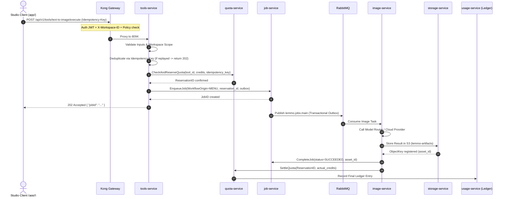

| فیلد / Field | مقدار / Value |
| :--- | :--- |
| **Title (EN)** | Tools Service, Asset Registry & Unified Execution Architecture Specification |
| **Title (FA)** | مشخصات فنی سرویس ابزارها، رجیستری دارایی‌ها و معماری اجرای مشترک |
| **ID** | DOC-BE-011 |
| **Category** | `backend` |
| **Status** | `Approved` |
| **Owner** | تیم پلتفرم بک‌اند / @behroz |
| **Last Updated** | 2026-10-08 |
| **Summary (EN)** | Authoritative specification for Stage 15 following ADR-018: Codifies Tools Service Clean Architecture (DualServer, lemmo_tools DB, tool-definition.schema.json, immutable versions, DB-backed catalog_version, Redis cached catalog), Single Unified Execution Path for tools invocation (WorkflowOrigin=MENU, end-to-end Idempotency-Key, transactional outbox in job-service, two-phase quota reservation, image-service worker), Asset Domain decoupling to storage-service (contracts/openapi/assets/v1, stored_assets DB, signed URLs with public endpoint, CSP), and Jobs Domain decoupling to job-service (contracts/openapi/jobs/v1, SSE events streaming, membership version fail-closed check). |
| **Summary (FA)** | سند منبع واحد حقیقت (SSOT) مرحله ۱۵ پیرو مصوبه ADR-018: کدگذاری معماری تمیز سرویس ابزارها (دوال‌سرور، دیتابیس lemmo_tools، اسکیما JSON تعریف ابزار، نسخه‌بندی کاتالوگ، کش ردیس)، مسیر اجرای مشترک ابزارها (منشأ MENU، آیدم‌پوتنسی سرتاسری، ترنزکشنال آوت‌باکس در job-service، رزرو دوفازی، ورکر تصویر)، انتقال دارایی‌ها به storage-service (قرارداد assets/v1، امضای عمومی، CSP)، و انتقال جاب‌ها به job-service (قرارداد jobs/v1، استریم SSE، کنترل دسترسی عضویت). |
| **Tags** | `doc-be-011`, `tools-service`, `storage-service`, `job-service`, `openapi`, `adr-018`, `stage15` |

---

## ۱. معرفی و دامنه سند (Overview & Scope)

این سند پیرو مصوبات رسمی **[ADR-018](../01-architecture/decisions/ADR-018-tools-platform-architecture-unified-execution-and-domain-decoupling.md)**، پاسخ‌های مصوب سوالات معماری OQ-050 تا OQ-055 و تصمیمات کلان قبلی (ADR-016، ADR-017، DOC-BE-007) تدوین شده و به عنوان **منبع واحد حقیقت (SSOT)** برای پیاده‌سازی مهندسی مرحله ۱۵ عمل می‌کند.

### اهداف اصلی مرحله ۱۵:
1. **استقرار سرویس ابزارها (`tools-service`):** راه‌اندازی مایکروسرویس Go با الگوی Clean Architecture و DualServer بر پورت‌های HTTP `8094` و gRPC `50065`.
2. **مدل ابزار = تعریف داده‌محور:** بارگذاری ابزارها از فایل‌های نسخه‌دار (`tool-definition.schema.json`)، Seed تغییرناپذیر در دیتابیس `lemmo_tools` با Advisory Lock و کش‌گذاری نسخه‌دار در Redis.
3. **مسیر اجرای یکپارچه و مشترک (Single Execution Path):** اجرای ابزار پایه (`text-to-image` با مدل `fal-ai/flux-dev`) از مسیر مشترک پلتفرم با اعتبارسنجی ورودی‌ها، رزرو اعتبار در `quota-service`، درج در `job-service` و صف RabbitMQ بدون ایجاد لاجیک موازی.
4. **تفکیک قطعی دامنه‌ها:** انتقال اندپوینت‌های دارایی (`/api/v1/assets`) به `storage-service` و اندپوینت‌های جاب (`/api/v1/jobs`) به `job-service`.
5. **جایگزینی کامل ماک:** حذف ۱۰۰٪ کانتینر ماک `lemmo-mock-tools` در داکر کامپوز و اتصال گیت‌وی Kong به سرویس‌های واقعی.

---

## ۲. مشخصات مایکروسرویس ابزارها (`tools-service`)

### ۲.۱. توپولوژی و پورت‌ها
- **نام کانتینر:** `lemmo-svc-tools`
- **پورت HTTP:** `8094` (پاسخ‌گویی به کاتالوگ و اجرای ابزار)
- **پورت gRPC:** `50065` (ارتباطات داخلی بین‌سرویسی)
- **پایگاه داده اختصاصی:** PostgreSQL `lemmo_tools`
- **کش:** Redis کش‌اَساید با پیشوند کلید `lemmo:tools:catalog:{catalog_version}`

### ۲.۲. پایگاه داده `lemmo_tools` (اسکیما DDL)

```sql
-- 000001_init_tools_schema.up.sql

CREATE TABLE IF NOT EXISTS tool_definitions (
    id VARCHAR(64) NOT NULL,
    version INT NOT NULL,
    category VARCHAR(64) NOT NULL,
    output_type VARCHAR(32) NOT NULL,
    name_en VARCHAR(255) NOT NULL,
    description_en TEXT NOT NULL,
    name_fa VARCHAR(255) NOT NULL,
    description_fa TEXT NOT NULL,
    input_fields JSONB NOT NULL DEFAULT '[]'::jsonb,
    handler_type VARCHAR(32) NOT NULL DEFAULT 'generic_rest',
    provider_ref VARCHAR(64),
    model_ref VARCHAR(128),
    param_mapping JSONB NOT NULL DEFAULT '{}'::jsonb,
    native_key VARCHAR(64),
    node_type_id VARCHAR(128) NOT NULL,
    cost_hint INT NOT NULL DEFAULT 0,
    ui_component_key VARCHAR(64),
    source VARCHAR(32) NOT NULL DEFAULT 'seed', -- 'seed' | 'admin'
    content_hash VARCHAR(64) NOT NULL,
    created_at TIMESTAMPTZ NOT NULL DEFAULT NOW(),
    PRIMARY KEY (id, version)
);

CREATE TABLE IF NOT EXISTS tool_state (
    tool_id VARCHAR(64) PRIMARY KEY,
    active_version INT NOT NULL,
    status VARCHAR(32) NOT NULL DEFAULT 'active', -- 'draft' | 'active' | 'disabled' | 'retired'
    updated_at TIMESTAMPTZ NOT NULL DEFAULT NOW()
);

CREATE TABLE IF NOT EXISTS catalog_metadata (
    key VARCHAR(64) PRIMARY KEY,
    value VARCHAR(255) NOT NULL,
    updated_at TIMESTAMPTZ NOT NULL DEFAULT NOW()
);

CREATE INDEX IF NOT EXISTS idx_tools_status ON tool_state(status);
```

### ۲.۳. چرخه Seeder و کش‌گذاری نسخه‌دار
1. در شروع به کار `tools-service`، فایل‌های تعریف موجود در پوشه `catalog/*.json` اعتبارسنجی می‌شوند.
2. با استفاده از `pg_advisory_xact_lock(746193)`، تعاریف به صورت Idempotent درج می‌شوند. اگر نسخه تکراری با هش متفاوت مشاهده شود، سرویس فوراً Fail-Fast می‌شود.
3. در صورت ایجاد نسخه جدید، مقدار `catalog_version` در جدول `catalog_metadata` به صورت اتمیک افزایش می‌یابد.
4. کلید کش ردیس برابر با `lemmo:tools:catalog:{catalog_version}` است. بنابراین با ارتقای نسخه، کلاینت‌ها بلافاصله داده جدید را دریافت کرده و هیچ تداخلی در استقرار موازی (Rolling Update) به وجود نمی‌آید.

---

## ۳. پایپ‌لاین اجرای مشترک ابزارها (Execution Pipeline)



### قواعد تضمین سازگاری و امنیت پایپ‌لاین:
1. **تضمین تطابق زمانی:** کانفیگ `job_hard_timeout` (مثلاً ۱۸۰ ثانیه) باید همواره کوچک‌تر از `quota_reservation_timeout` (مثلاً ۳۰۰ ثانیه) باشد؛ در غیر این صورت سرویس استارت نخواهد خورد.
2. **آیدم‌پوتنسی سرتاسری:** کلید هدر `Idempotency-Key` در دامنه‌‌ی `(workspace_id, user_id, key)` نگهداری شده و کلیدهای لجر و جاب از آن مشتق می‌شوند.
3. **تراکنش Outbox در جاب‌ها:** ایجاد جاب و صف‌بندی پیام در `job-service` با الگوی Transactional Outbox انجام می‌پذیرد تا هیچ جاب یتیمی بدون انتشار پیام در سیستم باقی نماند.

---

## ۴. تفکیک دامنه دارایی‌ها (`storage-service`)

1. **انتقال قرارداد:** اندپوینت‌های زیر از قرارداد ابزارها حذف و به `contracts/openapi/assets/v1/openapi.yaml` منتقل می‌گردند:
   - `GET /api/v1/assets`: دریافت لیست دارایی‌های ورک‌اسپیس با نشانگر Keyset Pagination.
   - `GET /api/v1/assets/{assetId}`: دریافت اطلاعات و لینک امضاشده موقت دارایی.
2. **ارتقای سرویس ذخیره‌سازی:** افزودن لایه HTTP DualServer بر روی پورت `8084` به `storage-service` در Go.
3. **امنیت Presigned URL:**
   - متغیر محیطی `STORAGE_PUBLIC_BASE_URL` هاست قابل دسترس از مرورگر را تعیین می‌کند.
   - کلیه URLها حامل هدر `Cache-Control: private, no-store` بوده و پارامترهای Query امضا در لاگ‌های گیت‌وی Redact می‌شوند.
   - درخواست دارایی متعلق به ورک‌اسپیس دیگر با خطای **۴۰۴** پاسخ داده می‌شود.

---

## ۵. تفکیک دامنه جاب‌ها (`job-service`)

1. **انتقال قرارداد:** اندپوینت‌های زیر به `contracts/openapi/jobs/v1/openapi.yaml` منتقل می‌گردند:
   - `GET /api/v1/jobs`: لیست جاب‌های ورک‌اسپیس (کاربر عادی فقط جاب‌های خودش، Owner/Admin تمام جاب‌ها).
   - `GET /api/v1/jobs/{jobId}`: وضعیت فعلی جاب.
   - `GET /api/v1/jobs/{jobId}/events`: استریم بلادرنگ رویدادهای Server-Sent Events (SSE).
2. **ارتقای سرویس جاب:** افزودن پورت HTTP اختصاصی `8095` به `job-service`.
3. **حذف روت موقت context-service:** تمام کدهای موقت SSE در `context-service` بازنشانی و حذف شده و روت گیت‌وی در Kong مستقیماً به `lemmo-svc-job:8095` متصل می‌گردد.
4. **اعتبارسنجی عضویت در SSE:** کنترل کلید `lemmo:membership:version:{workspace_id}:{user_id}` به صورت داخلی توسط کتابخانه مشترک `job-service` با الگوی Fail-Closed انجام می‌پذیرد.

---

## ۶. تفکیک قراردادهای OpenAPI و نگاشت Kong Gateway

```text
/api/v1/tools/**   ──>  lemmo-svc-tools:8094     (contracts/openapi/tools/v1)
/api/v1/assets/**  ──>  lemmo-svc-storage:8084   (contracts/openapi/assets/v1)
/api/v1/jobs/**    ──>  lemmo-svc-job:8095       (contracts/openapi/jobs/v1)
```

- **کانتینر `lemmo-mock-tools`:** پس از اعمال سرویس‌های واقعی، کانتینر ماک Prism به طور کامل از `infra/compose/dev.yml` حذف می‌گردد.
