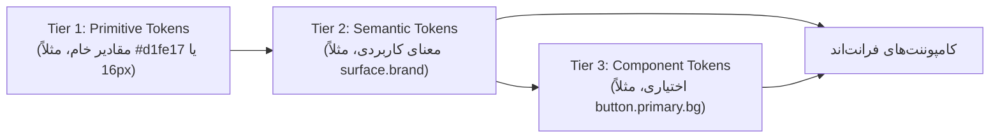

| فیلد / Field | مقدار / Value |
| :--- | :--- |
| **Title (EN)** | Container Relationship Styling & Inheritance Architecture |
| **Title (FA)** | معماری وراثت در کانتینرها و استایل‌دهی مبتنی بر رابطه |
| **ID** | DOC-DS-008 |
| **Category** | `design-system` |
| **Status** | `Active` |
| **Owner** | Design System & Core Architecture Team |
| **Last Updated** | 2026-09-18 |
| **Summary (EN)** | Concentric border-radius mathematical formula, container padding custom properties, three-tier token inheritance, and density synchronization to eliminate hardcoded child styles. |
| **Summary (FA)** | فرمول ریاضی رادیوس هم‌مرکز، سیستم پدینگ کانتینر در متغیرهای CSS، وراثت توکن‌های سه‌لایه و هماهنگی چگالی برای حذف استایل‌دهی دستی فرزندان. |
| **Tags** | `design-system`, `container-queries`, `border-radius`, `inheritance`, `tokens`, `elevation`, `gestalt` |

---

# معماری وراثت در کانتینرها و استایل‌دهی مبتنی بر رابطه
## Container-Relationship Styling & Inheritance Architecture

> **تفاوت این سند با سند تصمیم‌گیری ([DOC-DS-007](./design-decision-principles.md)):**  
> سند «اصول تصمیم‌گیری» به این سؤال پاسخ می‌دهد که «کدام مقدار را انتخاب کنیم؟». این سند به یک سؤال بنیادین معماری پاسخ می‌دهد:  
> **«چگونه کانتینر والد می‌تواند مقدار درست را خودکار به فرزندانش منتقل کند، بدون اینکه توسعه‌دهنده یا هوش مصنوعی مجبور باشد تک‌تک فرزندان را دستی و هاردکد استایل دهد؟»**

---

## ۱. قانون رادیوس هم‌مرکز (Concentric Corner Radius Rule)

### ۱.۱ فرمول دقیق ریاضی
برای اینکه انحنای گوشه یک کانتینر بیرونی با انحنای المان داخلی‌اش کاملاً هماهنگ، هم‌مرکز و چشم‌نواز باشد، رادیوس داخلی نباید یک عدد تصادفی یا برابر با والد باشد، بلکه طبق فرمول زیر محاسبه می‌شود:

$$\text{radius}_{\text{inner}} = \max\left(0\text{px}, \text{radius}_{\text{outer}} - \text{gap}\right)$$

که در آن `gap` فاصله‌ی واقعی بین لبه‌ی بیرونی کانتینر تا لبه‌ی بیرونی فرزند است، یعنی:

$$\text{gap} = \text{border-width} + \text{padding}$$

**چرا این فرمول کار می‌کند؟**  
اگر گوشه‌ی کانتینر بیرونی یک کمان با شعاع $R$ و مرکز در نقطه‌ی $(R,R)$ باشد، و فرزند به‌اندازه‌ی $p$ از هر طرف تورفتگی داشته و شعاع $r$ داشته باشد، مرکز کمان فرزند در نقطه‌ی $(p+r, p+r)$ خواهد بود. این دو کمان فقط و فقط زمانی **هم‌مرکز (Concentric)** می‌شوند که:

$$p + r = R \implies r = R - p$$

اگر همان مقدار رادیوس والد را عیناً روی فرزند بگذارید (مثلاً هر دو ۱۲px)، فاصله‌ی بین دو گوشه در نقطه‌ی مورب کمتر از فاصله‌ی بین دو لبه‌ی صاف می‌شود و چشم این ناهمگونی را فوراً تشخیص می‌دهد.

```
┌──────────────────────────────────────────────┐  ▲
│  کانتینر والد (Radius Outer = R)              │  │
│    ┌────────────────────────────────────┐    │  │ Padding (p)
│    │  المان فرزند                       │    │  │
│    │  (Radius Inner = R - p)            │    │  ▼
│    └────────────────────────────────────┘    │
└──────────────────────────────────────────────┘
```

### ۱.۲ پیاده‌سازی خودکار در CSS (بدون محاسبه دستی)
به‌جای هاردکد کردن مقادیر برای فرزندان، این فرمول مستقیماً در متغیرهای CSS کانتینر تعریف می‌شود:

```css
.lemmo-card {
  --container-radius: var(--lemmo-radius-16, 16px);
  --container-border: 1px;
  --container-pad: var(--lemmo-space-300, 12px);

  border: var(--container-border) solid var(--lemmo-border-default);
  padding: var(--container-pad);
  border-radius: var(--container-radius);
}

.lemmo-card > .card-inner {
  /* رادیوس فرزند به صورت ریاضی و پویا مشتق می‌شود */
  border-radius: max(0px, calc(var(--container-radius) - var(--container-border) - var(--container-pad)));
}
```

### ۱.۳ مدیریت حالت `padding ≥ radius_outer`
وقتی فاصله از رادیوس بیرونی بزرگ‌تر یا مساوی باشد (`gap ≥ radius_outer`)، حاصل فرمول صفر یا منفی می‌شود. در این حالت فرزند باید کاملاً **گوشه‌تیز (رادیوس صفر)** باشد (`max(0px, ...)` مانع از بروز خطای CSS یا مقادیر منفی می‌شود).

---

## ۲. معماری سه‌لایه دیزاین توکن‌ها (Three-Tier Token Architecture)

برای تضمین وراثت و جلوگیری از وابستگی مستقیم کامپوننت‌ها به مقادیر خام:



1. **Primitive Tokens (لایه‌ی خام):** صرفاً مقدار عددی یا هگز — مانند `--lemmo-palette-lime-500: #d1fe17`. هیچ مفهوم کاربردی ندارد.
2. **Semantic Tokens (لایه‌ی معنایی):** به یک Primitive اشاره دارد و معنای کاربرد را مشخص می‌کند — مانند `--lemmo-color-surface-brand: var(--lemmo-palette-lime-500)`.
3. **Component Tokens (لایه‌ی کامپوننت):** نگاشت اختصاصی به یک کامپوننت مشخص — مانند `--button-primary-bg: var(--lemmo-color-surface-brand)`.

> 🚨 **قانون بنیادین:** کامپوننت‌ها صرفاً باید به توکن‌های لایه ۲ (Semantic) یا لایه ۳ رفرنس بدهند؛ ارجاع مستقیم به مقادیر خام (Tier 1) در کامپوننت‌ها اکیداً ممنوع است.

---

## ۳. وراثت خودکار رنگ با `currentColor` در آیکون‌ها

### ۳.۱ اصل عملکرد
آیکون‌های وکتور نباید دارای رنگ هاردکد (`fill="#fff"` یا `stroke="#000"`) باشند. با تنظیم `fill="none"` و `stroke="currentColor"` روی آیکون، رنگ آن همیشه به صورت خودکار از ویژگی `color` نزدیک‌ترین والد خود ارث‌بری می‌کند:

```html
<button class="nav-btn">
  <svg class="icon" stroke="currentColor">...</svg>
  <span>پروژه‌ها</span>
</button>
```

```css
.nav-btn {
  color: var(--lemmo-color-font-secondary);
}

.nav-btn:hover {
  color: var(--lemmo-color-font-primary); /* آیکون خودبه‌خود روشن می‌شود */
}

.nav-btn.active {
  color: var(--lemmo-color-surface-brand); /* آیکون خودبه‌خود لیمویی می‌شود */
}
```

### ۳.۲ استثنای آیکون‌های معنادار مستقل
اگر آیکون دارای معنای مستقل از متن است (مانند آیکون هشدار که همیشه باید زرد بماند یا نشانگر خطای قرمز)، نباید از `currentColor` استفاده کند؛ در این صورت مستقیماً از توکن معنایی (`--lemmo-text-danger` یا `--lemmo-text-warning`) تغذیه می‌شود.

---

## ۴. سیستم ارتفاع و عمق لایه‌ها (Elevation System)

عمق سطوح بر اساس **سلسله‌مراتب تودرتویی و لایه‌بندی معنایی** تعیین می‌شود، نه سلیقه:

| سطح (Level) | کاربرد در Lemmo Studio | خصوصیات سایه و لایه‌بندی |
|---|---|---|
| **Level 0 (Surface/Canvas)** | بورد اصلی کانواس و پس‌زمینه صفحات | بدون سایه، مسطح (`#131517`) |
| **Level 1 (Panels & Cards)** | کارت‌های استودیو، ریل سایدبار | `border: border.soft`، بدون سایه سنگین |
| **Level 2 (Dropdowns & Popovers)** | پاپ‌اوور پروفایل، منوی ابزارها | `shadow: var(--lemmo-shadow-lg)`، `z-index: 50` |
| **Level 3 (Toasts & Tooltips)** | اعلان‌های گذرا و راهنمای تولتیپ | `shadow: var(--lemmo-shadow-xl)`، `z-index: 80` |
| **Level 4 (Modals & Drawers)** | پنجره‌های گفتگوی تایید، پیش‌نمایش تصویر | همراه با Scrim تیره (`rgba(0,0,0,0.75)`)، `z-index: 100` |

> ⚠️ **قانون اکید:** هرگز روی متن، دکمه‌های تخت (Flat)، چیپ‌ها یا اسلایدرها سایه نیندازید. سایه صرفاً برای نشان دادن جدایش یک سطح فیزیکی (Surface) از زمینه است.

---

## ۵. سیستم پدینگ کانتینر و فرار فرزندان (Container Padding System)

### ۵.۱ سناریوی کاربرد
هنگامی که یک کامپوننت فرزند (مانند یک جدول تمام‌عرض، تصویر شاخص یا خط جداکننده `Divider`) داخل کارتی قرار می‌گیرد و نیاز دارد لبه‌به‌لبه (Full-Bleed) کشیده شود، نباید پدینگ والد را حدس بزند.

### ۵.۲ پیاده‌سازی با متغیرهای CSS
کانتینر والد پدینگ خود را در قالب متغیر تعریف می‌کند و فرزند با مارجین منفی متناظر از آن فرار می‌کند:

```css
.lemmo-card {
  --card-padding-inline: var(--lemmo-space-600, 24px);
  --card-padding-block: var(--lemmo-space-600, 24px);

  padding-inline: var(--card-padding-inline);
  padding-block: var(--card-padding-block);
}

/* فرزند تمام‌عرض لبه‌به‌لبه */
.lemmo-card > .full-bleed-media {
  margin-inline: calc(var(--card-padding-inline) * -1);
}
```

---

## ۶. هماهنگی چگالی و ارتفاع (Size & Density Rhythm)

برای آنکه ترکیب دکمه‌ها (عناصر با ارتفاع ثابت) و فیلدهای ورودی (عناصر با ارتفاع متغیر ناشی از پدینگ) در یک ردیف همواره هم‌تراز بمانند:
* دکمه‌ها از توکن‌های ارتفاع ثابت استفاده می‌کنند: `size-sm: 32px` / `size-md: 40px` / `size-lg: 48px`.
* اینپوت‌ها با پدینگ عمودی متناظر کالیبره می‌شوند به نحوی که `font-size + line-height + 2 * padding + 2 * border` دقیقاً با ارتفاع دکمه هم‌اندازه شود.

---

## ۷. چک‌لیست ضدالگوهای معماری کانتینر (Anti-Patterns Checklist)

- [ ] **عدم هم‌مرکزی رادیوس:** رادیوس فرزند با والد برابر نباشد، بلکه همیشه از فرمول `R_outer - gap` پیروی کند.
- [ ] **وارونگی فواصل:** فاصله‌ی داخل گروه نباید مساوی یا بزرگ‌تر از فاصله‌ی بین گروه‌ها باشد (`Internal ≤ External`).
- [ ] **کارت‌های تودرتوی بی‌مورد (Nested Cards):** به جای افزودن کادرهای مکرر، ابتدا از فاصله‌گذاری و گشتالت برای تفکیک استفاده شود.
- [ ] **مقادیر خارج از شبکه (Off-grid):** هر مقدار رادیوس یا فاصله که مضرب ۴ پیکسلی نبوده یا به توکن‌های رسمی وصل نباشد، باید حذف گردد.
- [ ] **سایه روی عناصر تخت:** سایه نباید روی دکمه‌های درون خطی، تگ‌ها یا اسلایدرها اضافه شود.
- [ ] **رنگ آیکون هاردکد:** آیکون‌ها باید همیشه از `currentColor` ارث‌بری کنند مگر رنگ وضعیت خاص داشته باشند.
