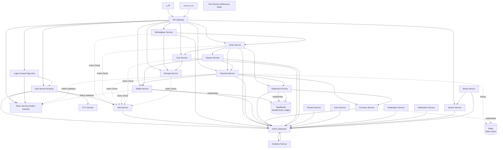

# جریان کلی

این دیاگرام نمای سطح بالا از معماری سیستم و ارتباط بین کانتینرهای اصلی را نمایش می‌دهد.

## اجزای اصلی

### لایه دسترسی
- **کاربران** — کاربران عادی و مدیران سیستم از طریق API Gateway به سرویس‌ها متصل می‌شوند
- **API Gateway** — نقطه ورود واحد، مسیریابی درخواست‌ها به سرویس‌های مربوطه

### لایه هویت
- **Auth Service** — احراز هویت کاربران و مدیریت نشست (ORY Kratos)
- **Token Service** — صدور و اعتبارسنجی توکن‌های OAuth2/OIDC و افشای JWKS (ORY Hydra)
- **Login-Consent App** — سرویس مستقل Go؛ واسط بین Hydra و Kratos (Login & Consent flow + Token Hook) — **تنها کد اختصاصی حوزه توکن**
- **KYC Service** — احراز هویت مشتریان و تأیید هویت
- **IAM Service** — مدیریت هویت‌ها، نقش‌ها، مجوزها و Policy Engine داخلی

> **تغییر:** موتور مجوزدهی Keto در معماری جدید منسوخ شده است. تمام بررسی‌های مجوز از طریق IAM Service با API `POST /v1/iam/authorization/check` انجام می‌شود. صدور و اعتبارسنجی توکن (JWT) از auth-service جدا شده و بر عهده **Token Service (Hydra)** است — میکروسرویس‌ها توکن را به‌صورت stateless با JWKS اعتبارسنجی می‌کنند.

### لایه سرویس‌های کسب‌وکار
- **Marketplace** — مدیریت محصولات و بازارگاه
- **Order** — مدیریت سفارش‌ها (فقط وضعیت کسب‌وکار)
- **Payment** — مدیریت Escrow و تراکنش‌های پرداخت
- **Wallet** — نگهداری و مدیریت موجودی مالی (Source of Truth)
- **Currency** — نرخ ارز و تبدیل مبلغ — **NEW**
- **Settlement** — کمیسیون، تسویه فروشنده و refund — **NEW**
- **Chat** — پیام‌رسانی بین خریدار و فروشنده

### لایه عملیاتی
- **Dispute** — رسیدگی به اختلافات
- **Review** — بازخورد و امتیازدهی
- **Zone** — حوزه تخصصی فروشندگان
- **Moderation** — بررسی تخلفات و محدودیت‌ها
- **Notification** — ارسال نوتیفیکیشن

### لایه رشد
- **Search** — ایندکس و جستجو
- **Boost** — ارتقاء و تبلیغات

### لایه ابزاری
- **Pool** — مدیریت متمرکز داده‌های مرجع (Reference Data) و مواد اولیه تولید (مثل کلمات تولید Username، آواتارها، لیست رزرو شده) — ر.ک. [Pool Service Blueprint](../../backend/services/pool-service/blueprint.md)
- **Storage** — ذخیره‌سازی فایل
- **Analytics** — تحلیل داده و گزارش‌گیری

### زیرساخت رویداد
- **NATS JetStream** — گذرگاه رویدادهای سیستم

### داده‌های مالی
- **TigerBeetle** — دفترکل تراکنش‌های مالی (Double-Entry) — **NEW**
- **Redis** — کش نرخ ارز (Rate Cache) — **NEW**

## جریان‌های اصلی

1. **کاربر** ← Gateway ← سرویس مقصد (درخواست مستقیم)
2. **سرویس** ← IAM (بررسی مجوز: POST /v1/iam/authorization/check)
3. **سرویس** ← NATS (انتشار رویداد)
4. **NATS** ← Analytics (تحلیل رویداد)
5. **Order** → **Payment** (ثبت پرداخت) → **Currency** (تبدیل ارز) → **Wallet** (تغییر موجودی)
6. **Payment** → **NATS** → **Settlement** (تسویه پس از تحویل)
7. **Settlement** → **Currency** (تبدیل ارز تسویه) → **TigerBeetle** (ثبت تراکنش)
8. **Dispute** → **Payment** + **Wallet** (تصمیمات داوری)

