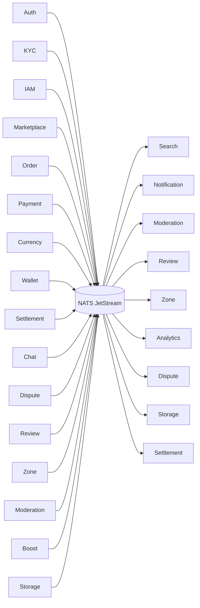

# جریان رویدادها
**Event Driven Architecture**

این دیاگرام معماری رویدادمحور سیستم را نشان می‌دهد. تمام سرویس‌ها از طریق NATS JetStream به صورت ناهمزمان با هم ارتباط برقرار می‌کنند.

## اصول معماری رویدادمحور

1. **تولیدکنندگان (Producers)** — تمام سرویس‌ها رویدادها را در NATS منتشر می‌کنند: Auth, KYC, IAM, Marketplace, Order, Payment, **Currency**, Wallet, **Settlement**, Chat, Dispute, Review, Zone, Moderation, Boost, Storage
2. **NATS JetStream** — گذرگاه رویداد با قابلیت ذخیره‌سازی، تکرار و Delivery Guarantee
3. **مصرف‌کنندگان (Consumers)** — سرویس‌های Search, Notification, Moderation, Review, Zone, Analytics, Storage, Dispute, **Settlement**, **Currency** رویدادها را مصرف می‌کنند

## جریان رویدادها

### رویدادهای هویت → همه لایه‌ها
- رویدادهای Auth و IAM (ایجاد کاربر، تغییر نقش، مسدودیت) به KYC, Moderation, Notification, Review, Zone ارسال می‌شوند

### رویدادهای مالی — جریان جدید
- `payment.confirmed.v1` از Payment به Settlement و Analytics ارسال می‌شود (آغازگر تسویه)
- `order.delivered.v1` از Order به Settlement ارسال می‌شود (تسویه پس از تحویل)
- `settlement.completed.v1` از Settlement به Wallet، Notification و Analytics ارسال می‌شود
- `settlement.commission.calculated.v1` از Settlement به Analytics ارسال می‌شود (درآمد پلتفرم)
- `settlement.refund.initiated.v1` از Settlement به Wallet و Notification ارسال می‌شود (برگشت وجه)

### رویدادهای کسب‌وکار → خدمات عملیاتی
- تغییرات Marketplace و Order به Moderation ارسال می‌شود (بررسی تخلف)
- رویدادهای پرداخت به Notification می‌رود (اطلاع‌رسانی)
- تکمیل سفارش به Review و Zone ارسال می‌شود (به‌روزرسانی امتیاز و اعتبار)
- رویدادهای سفارش به Dispute ارسال می‌شود (ثبت اختلاف)

### رویدادهای کسب‌وکار → خدمات رشد
- انتشار محصول جدید به Search ارسال می‌شود (ایندکس شدن)
- رویدادهای مختلف به Analytics می‌روند (گزارش‌گیری)

### رویدادهای عملیاتی → خدمات زیرساختی
- رویدادهای Dispute و Review به Storage ارسال می‌شود (ذخیره مدارک)
- رویدادهای Moderation به Notification ارسال می‌شود (اعلان محدودیت)

## مزایا

- **جداسازی (Decoupling)** — سرویس‌ها مستقیماً هم را صدا نمی‌زنند
- **مقیاس‌پذیری** — هر مصرف‌کننده مستقل مقیاس می‌شود
- **بازیابی** — NATS JetStream رویدادها را ذخیره و در صورت نیاز بازپخش می‌کند
- **انعطاف‌پذیری** — سرویس جدید می‌تواند بدون تغییر در تولیدکنندگان رویدادها را مصرف کند

