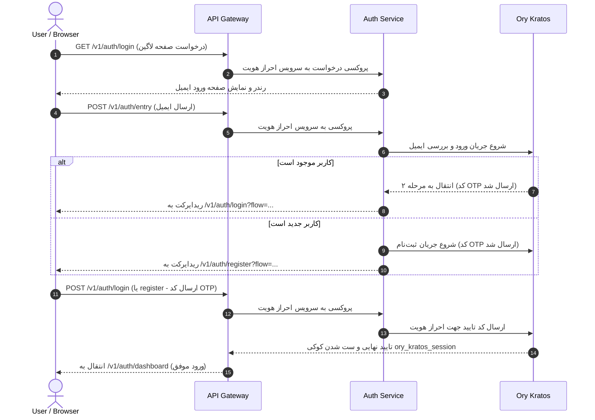
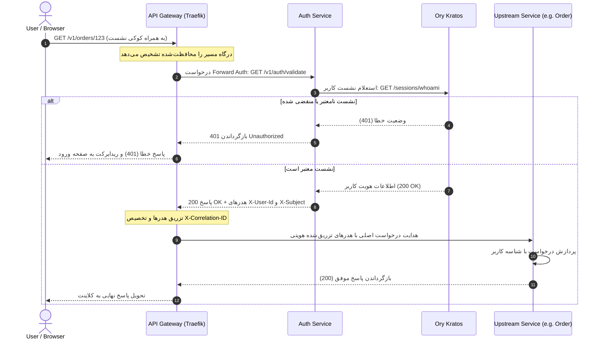
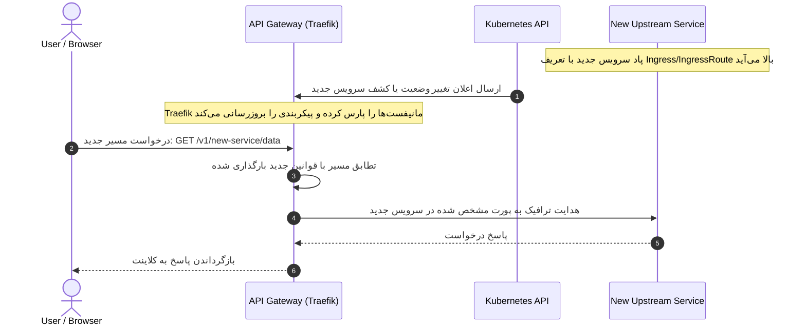

# بلوپرینت درگاه API Gateway

**API Gateway Service Blueprint**

> **Blueprint v1.0 — پیش از توسعه**

---

## فهرست محتوا

**Table of Contents**

1. [اهداف سرویس](#۱-اهداف-سرویس)
2. [مسئولیت‌ها](#۲-مسئولیت‌ها)
3. [خارج از مسئولیت‌ها (Non-Goals)](#۳-خارج-از-مسئولیت‌ها-non-goals)
4. [معماری ران‌تایم و وابستگی‌ها](#۴-معماری-ران‌تایم-و-وابستگی‌ها)
5. [استراتژی مسیریابی (Routing Strategy)](#۵-استراتژی-مسیریابی-routing-strategy)
6. [یکپارچگی با احراز هویت (Authentication Integration Flow)](#۶-یکپارچگی-با-احراز-هویت-authentication-integration-flow)
7. [مدل امنیتی (Security Model)](#۷-مدل-امنیتی-security-model)
8. [استراتژی قابلیت مشاهده (Observability Strategy)](#۸-استراتژی-قابلیت-مشاهده-observability-strategy)
9. [استراتژی مدیریت خطا (Error Handling Strategy)](#۹-استراتژی-مدیریت-خطا-error-handling-strategy)
10. [دیاگرام‌های توالی (Sequence Diagrams)](#۱۰-دیاگرام‌های-توالی-sequence-diagrams)

---

## ۱. اهداف سرویس

**Service Objectives**

سرویس درگاه API Gateway به عنوان **تنها نقطه ورود رسمی** برای تمام کلاینت‌ها (Frontend, Mobile App, Third-party) عمل می‌کند. هدف اصلی این سرویس، یکپارچه‌سازی نقاط دسترسی کلاینت به میکروسرویس‌ها، پنهان کردن پیچیدگی‌های توپولوژی شبکه داخلی بک‌اند، و پیاده‌سازی عملکردهای زیرساختی مشترک به شیوه‌ای متمرکز و با کارایی بالا است.

---

## ۲. مسئولیت‌ها

**Responsibilities**

- **مسیریابی هوشمند (Routing):** هدایت ترافیک ورودی به میکروسرویس‌های متناظر بر اساس الگوهای مشخص آدرس.
- **اعتبارسنجی توکن دسترسی (Stateless JWT Validation):** بررسی صحت امضا، انقضا و کلایم‌های اصلی توکن دسترسی با استفاده از کلیدهای عمومی JWKS که توسط **Token Service (Ory Hydra)** منتشر می‌شود.
- **تزریق هدرهای هویتی:** اضافه کردن هدرهای امن کاربر (مانند `X-User-Id` و `X-User-Roles`) پس از احراز هویت موفق جهت مصرف در سرویس‌های بالادستی.
- **تولید و انتشار Correlation ID:** بررسی وجود `X-Correlation-ID` در هدرها و ایجاد آن در صورت عدم وجود، جهت ایجاد قابلیت پیگیری تراکنش‌ها در سیستم توزیع‌شده.
- **مدیریت CORS:** پاسخ‌دهی متمرکز به درخواست‌های Preflight (OPTIONS) و مدیریت دسترسی‌های دامنه‌ها.
- **اعمال نرخ درخواست (Rate Limiting):** محدود کردن تعداد درخواست‌های هر کاربر/IP به منظور جلوگیری از حملات Brute Force و سوءاستفاده از سیستم.
- **امنیت لبه (Security Headers):** تزریق هدرهای امنیتی استاندارد مانند HSTS, CSP, X-Frame-Options و X-Content-Type-Options.
- **مدیریت خطاهای انتقال (Gateway Errors):** تولید ساختار خطای استاندارد و یکپارچه در زمان‌های قطعی سرویس‌های بالادست (502 Bad Gateway) یا Timeout (504).

---

## ۳. خارج از مسئولیت‌ها (Non-Goals)

**Non-Responsibilities**

- **منطق کسب‌وکار (Business Logic):** درگاه هیچ اطلاعی از سفارش‌ها، تراکنش‌های مالی، کاتالوگ محصولات یا چت‌ها ندارد.
- **ارزیابی مجوزهای دسترسی (Permission Evaluation):** بررسی اینکه آیا کاربر حق دسترسی به رکورد خاصی را دارد یا خیر، بر عهده IAM Service است (از طریق `POST /v1/iam/authorization/check`)؛ درگاه فقط نقش‌ها و صحت توکن کاربر را احراز می‌کند.
- **اعتبارسنجی داده‌های ورودی (Domain Validation):** بررسی صحت ساختار داده‌ها (مانند فرمت ایمیل یا قیمت مثبت) وظیفه سرویس مقصد است.
- **پایداری داده‌ها (State Persistence):** درگاه کاملاً بدون حالت (Stateless) است و هیچ داده‌ای را در دیتابیس محلی ذخیره نمی کند (از Redis صرفاً به عنوان کش و مدیریت Rate Limiting استفاده می‌کند).

---

## ۴. معماری ران‌تایم و وابستگی‌ها

**Runtime Architecture & Dependencies**

درگاه API Gateway پلتفرم NONS بر پایه **Traefik v3** راه‌اندازی می‌شود.

### ارتباطات فیزیکی لایه لبه (Network Edge Topology)

```mermaid
graph TD
    Client["Client (Browser / User)"] -->|HTTPS (Port 443/80)| Gateway["API Gateway (Traefik)"]
    Gateway -->|Forward Auth /v1/auth/validate| AuthService["Auth Service"]
    AuthService -->|Validate Session| Kratos["Ory Kratos"]
    Gateway -->|Route /v1/orders/*| OrderService["Order Service"]
    Gateway -->|Route /v1/wallet/*| WalletService["Wallet Service"]
    Gateway -->|Route /v1/chat/*| ChatService["Chat Service"]
    Gateway -->|Route /v1/marketplace/*| MarketService["Marketplace Service"]
```

### وابستگی‌های سرویس (Service Dependencies)

| وابستگی | نقش | حیاتی (Critical) | توضیحات |
| :---: | --- | :---: | --- |
| **Kubernetes API** | کشف پویای سرویس‌ها | بله | در تمامی محیط‌های رسمی K3s/K3d از Kubernetes Ingress/CRD Provider استفاده می‌شود. |
| **Auth Service** | اعتبارسنجی نشست‌ها | بله | برای تمامی مسیرهای محافظت‌شده (Protected Routes) نیاز است. |
| **Redis** | مدیریت محدودیت نرخ | بله | برای ذخیره‌سازی شمارنده‌های محدودیت نرخ از روز اول (Day 1). |

---

## ۵. استراتژی مسیریابی (Routing Strategy)

**Routing Strategy**

مسیریابی درگاه بر اساس ساختار استاندارد آدرس‌های پلتفرم انجام می‌شود:

### الگوهای مسیردهی (Path Patterns)

هر سرویس مسیر مشخص خود را در درگاه تصاحب می‌کند. تمامی مسیرها با `/v{version}` آغاز می‌شوند:

| الگو در درگاه | سرویس بالادستی (Upstream Service) | دسترسی |
| --- | --- | :---: |
| `/v1/auth/kratos/*` | `Ory Kratos` (Public/Admin APIs) | عمومی |
| `/v1/auth/*` | `Auth Service` | عمومی |
| `/v1/marketplace/*` | `Marketplace Service` | عمومی / احراز هویت‌شده |
| `/v1/orders/*` | `Order Service` | احراز هویت‌شده |
| `/v1/wallet/*` | `Wallet Service` | احراز هویت‌شده |
| `/v1/chat/*` | `Chat Service` | احراز هویت‌شده |

### کشف پویای سرویس‌ها (Service Discovery)

اضافه شدن سرویس‌های جدید بدون نیاز به تغییر در پیکربندی درگاه انجام می‌شود. استراتژی کشف سرویس و مسیریابی به شرح زیر سازمان‌دهی می‌شود (D17):
- **مسیر رسمی توسعه و استقرار (Kubernetes-Native):** مسیریابی و کشف سرویس‌ها در کلیه محیط‌ها (شامل توسعه محلی در کلاستر K3d و استقرار پروداکشن در K3s) به صورت پویا بر پایه Traefik + Kubernetes Ingress / IngressRoute CRD انجام می‌شود.
```yaml
labels:
  - "traefik.enable=true"
  - "traefik.http.routers.order-service.rule=PathPrefix(`/v1/orders`)"
  - "traefik.http.routers.order-service.entrypoints=web"
  - "traefik.http.services.order-service.loadbalancer.server.port=8080"
  - "traefik.http.routers.order-service.middlewares=protected-auth@file"
```

**عدم بازنویسی مسیر (No Path Rewriting):** درگاه عمل بازنویسی مسیر را انجام نمی‌دهد؛ هر میکروسرویس مسئول نسخه‌بندی APIهای اختصاصی خود است و درگاه صرفاً ترافیک کامل را فوروارد می‌کند.

---

## ۶. یکپارچگی با احراز هویت (Authentication Integration Flow)

**Authentication Integration Flow**

درگاه ترافیک‌ها را به دو دسته **عمومی (Public)** و **محافظت‌شده (Protected)** تقسیم می‌کند:

1. **مسیرهای عمومی (مانند کاتالوگ محصولات یا صفحه‌ی ورود Kratos):** بدون ارزیابی توکن، مستقیماً به سرویس بالادست هدایت می‌شوند.
2. **مسیرهای محافظت‌شده (مانند ایجاد سفارش یا کیف پول):** ابتدا باید از فیلتر اعتبارسنجی عبور کنند.

### نحوه اعتبارسنجی با Forward Auth:

```text
[درخواست کلاینت با Bearer Token] 
         ↓
[درگاه Traefik میان‌افزار Forward Auth را اجرا می‌کند]
         ↓
[ارسال درخواست به Auth Service: GET /v1/auth/validate]
         ↓
[بررسی امضای توکن دسترسی با کلیدهای عمومی JWKS توسط Auth Service]
         ↓
  ┌──────┴──────┐
  ↓ (نامعتبر)   ↓ (معتبر)
[بازگشت 401]  [بازگشت 200 OK + هدرهای هویت کاربر]
  ↓             ↓
[بلاک درخواست] [درگاه درخواست را به همراه هدرهای معتبر هویتی به سرویس بالادست می‌فرستد]
```

#### سیاست وابستگی و شکست (Auth Service Dependency Strategy):
سیاست وابستگی درگاه به سرویس احراز هویت به صورت **Fail-Closed** طراحی شده است. بدین معنی که در صورت در دسترس نبودن یا لود سنگین Auth Service، درگاه درخواست‌های محافظت‌شده را مسدود کرده و خطای `503 Service Unavailable` بازمی‌گرداند. بدین منظور تنظیمات ارتباطی درگاه با Auth Service با Timeout برابر **۲ ثانیه** و تعداد تلاش مجدد (Retry) برابر **۰** تنظیم می‌شود تا کارایی درگاه در زمان بروز قطعی دچار افت نگردد.

#### مرز امنیت و تزریق هدرها (Identity Injection & Trust Boundary):
پس از احراز هویت موفق، درگاه هدرهای هویتی معتبر را استخراج و به درخواست اضافه می‌کند:
- `X-User-Id`: شناسه کاربر در Kratos (Identity UUID).
- `X-Subject`: آدرس ایمیل کاربر.
- `X-Trace-Id`: شناسه ردگیری درخواست.

**قانون امنیتی حیاتی (Critical Trust Boundary):** هدرهای هویتی فوق صرفاً در صورتی برای میکروسرویس‌های داخلی معتبر و قابل اعتماد هستند که از محدوده آدرس شبکه خصوصی درگاه (Gateway subnet) ارسال شده باشند. کلیه میکروسرویس‌ها موظف هستند در صورتی که درخواستی حاوی این هدرها را به طور مستقیم از کلاینت‌های خارج شبکه درگاه دریافت کنند، آن‌ها را فیلتر و حذف (Strip) نمایند تا از حملات تظاهر به هویت (Identity Spoofing) جلوگیری شود.

---

## ۷. مدل امنیتی (Security Model)

**Security Model**

### ۱. اعتبارسنجی نشست (Session Validation)
بررسی صحت نشست‌ها به صورت مستقیم از طریق Traefik ForwardAuth و با بررسی در سرویس `auth-service` (که نشست را از Ory Kratos استعلام می‌کند) انجام می‌پذیرد. در این مدل، مرورگر کوکی نشست `ory_kratos_session` را ارسال کرده و درگاه آن را اعتبارسنجی می‌نماید.

**سیاست طول عمر نشست‌ها (Session TTL Policy):** مقادیر طول عمر نشست‌ها در Kratos پیکربندی شده و خارج از کدهای درگاه مدیریت می‌شوند. این طول عمرها به صورت کاملاً پویا و از طریق فایل تنظیمات Kratos مشخص می‌گردند.

**سیاست ابطال و خروج (Logout & Revocation):** خروج کاربر (Logout) منجر به ابطال آنی نشست در Kratos و در نتیجه بلاک شدن فوری تمام درخواست‌های بعدی کاربر در سطح درگاه می‌گردد.

### ۲. محدودیت نرخ (Rate Limiting)
برای جلوگیری از حملات Brute Force و سوء‌استفاده از APIها، درگاه میان‌افزار Rate Limit را بر اساس دو استراتژی اعمال می‌کند:
- **کاربران مهمان (IP-based):** حداکثر ۶۰ درخواست در دقیقه برای هر آدرس IP.
- **کاربران لاگین‌شده (User-based):** حداکثر ۱۲۰ درخواست در دقیقه برای هر شناسه کاربری (`X-User-Id`).
- **ذخیره‌سازی شمارنده‌ها (Redis-based):** برای سازگاری با معماری چند نسخه‌ای (Multi-Instance)، تمام شمارنده‌های Rate Limit از روز اول در **Redis** ذخیره و مدیریت می‌شوند. استفاده از حالت درون‌حافظه‌ای (In-memory) طبق تصمیم D5 کاملاً رد شده است.

### ۳. مدیریت CORS
مدیریت CORS به صورت انحصاری و متمرکز در سطح API Gateway پیکربندی می‌شود. هیچ سرویس داخلی بک‌اندی مجاز به داشتن CORS Policy مستقل یا موازی نیست. درگاه پاسخ به تمام درخواست‌های Preflight (با متد OPTIONS) را مدیریت می‌کند:
- هدرهای مجاز: `Content-Type, Authorization, X-Correlation-ID`
- متدهای مجاز: `GET, POST, PUT, PATCH, DELETE, OPTIONS`
- خروجی‌های هدر دسترسی: `Access-Control-Allow-Origin` بر اساس لیست سفید (White List) متغیرهای محیطی لود می‌شود.

### ۴. هدرهای امنیتی (Security Headers)
تزریق هدرهای زیر برای تمامی پاسخ‌ها الزامی است:
```ini
Strict-Transport-Security: max-age=31536000; includeSubDomains
X-Frame-Options: DENY
X-Content-Type-Options: nosniff
Referrer-Policy: strict-origin-when-cross-origin
X-XSS-Protection: 1; mode=block
```

### ۵. محدودیت اندازه درخواست (Request Size Limits)
- درخواست‌های عمومی و متنی: حداکثر **۲ مگابایت**.
- درخواست‌های بارگذاری فایل (مانند تصاویر محصولات در مسیرهای خاص): حداکثر **۱۰ مگابایت** (از طریق میان‌افزار اختصاصی Buffering محدود می‌شود).

### ۶. کنترل خطای آبشاری (Cascade Failure Prevention)
به منظور جلوگیری از قطعی‌های زنجیره‌ای و سرایت خرابی‌ها در سطح پلتفرم (به‌ویژه برای سرویس‌های حیاتی مانند `auth-service`):
- **تنظیمات Timeout:** برای تمامی درخواست‌های ارتباطی درگاه با سرویس‌های بالادستی زمان انتظار حداکثر ۳ ثانیه تعریف می‌گردد.
- **تعداد تلاش مجدد (Retry Limits):** در صورت قطع اتصال موقت، حداکثر ۳ بار تلاش مجدد با فاصله زمانی بازگشتی (Backoff) تنظیم می‌شود.
- **میان‌افزار Circuit Breaker:** درگاه Traefik مجهز به سیستم Circuit Breaker می‌شود تا در صورت شکست‌های مکرر سرویس واسط احراز هویت (مثلاً بروز خطا در ۵۰ درصد درخواست‌ها در بازه ۱۰ ثانیه‌ای)، مسیر فوروارد موقتاً قطع شده و بلافاصله خطای ۵۰۳ بازگردانده شود تا منابع درگاه اشغال نگردد.

### ۷. استراتژی ارتباطات امن داخلی (Internal mTLS Roadmap)
- ارتباطات شبکه محلی کانتینرها در محیط توسعه و استقرار اولیه به صورت HTTP ساده انجام می‌شود.
- با این حال، فعال‌سازی mTLS داخلی در فاز **Post-Kubernetes Adoption** و به عنوان بخشی از نقشه راه توسعه پیشرفته پلتفرم پیش‌بینی شده است. کلیه آدرس‌دهی‌ها منطبق بر Service Nameها انجام می‌پذیرد تا فرآیند فعال‌سازی بدون نیاز به بازطراحی معماری میکروسرویس‌ها انجام شود.

### ۸. مدیریت رازها (Secret Management)
هیچ رازی (مانند پسورد دیتابیس‌ها و کلیدهای امنیتی) در مخزن ذخیره نمی‌شود و تماماً از فایل‌های محیطی یا Secret Store تامین می‌شود:
- **فاز ۱ (استقرار اولیه):** استفاده از Kubernetes Secrets.
- **فاز ۲ (توسعه پیشرفته):** استفاده اختیاری از HashiCorp Vault.

---

## ۸. استراتژی قابلیت مشاهده (Observability Strategy)

**Observability Strategy**

### ۱. Correlation ID & Trace ID
برای ردیابی درخواست‌ها در سرتاسر زنجیره میکروسرویس‌ها، هدر `X-Correlation-ID` به صورت زیر مدیریت می‌شود:
- درگاه بررسی می‌کند که آیا درخواست کلاینت حاوی هدر `X-Correlation-ID` است یا خیر و در صورت عدم وجود، یک شناسه UUIDv4 یکتا تولید می‌کند.
- **قانون انتشار (Propagation):** این شناسه Correlation ID بدون استثنا باید به تمام سرویس‌های داخلی و خارجی همکار فرستاده و منتشر (Propagate) شود. انتشار این شناسه حیاتی‌ترین بخش ردیابی توزیع‌شده پلتفرم است.

### ۲. ثبت لاگ درخواست‌ها (Request Logging)
فرمت لاگ‌ها به صورت JSON استاندارد پلتفرم است و شامل فیلدهای زیر می‌باشد:
```json
{
  "timestamp": "2026-06-14T23:45:00Z",
  "level": "INFO",
  "service": "api-gateway",
  "correlationId": "550e8400-e29b-41d4-a716-446655440000",
  "method": "POST",
  "path": "/v1/orders",
  "status": 201,
  "durationMs": 42,
  "clientIp": "192.168.1.100",
  "bytesSent": 1024
}
```

### ۳. مانیتورینگ و متریک‌ها (Metrics)
درگاه Traefik متریک‌های استاندارد پرومتئوس (Prometheus Metrics) را در مسیر داخلی `:8082/metrics` اکسپورت می‌کند که شامل:
- تعداد کل درخواست‌ها بر اساس وضعیت پاسخ (HTTP Status).
- مدت زمان پاسخ‌دهی مسیرها (Response Latency Histograms).

---

## ۹. استراتژی مدیریت خطا (Error Handling Strategy)

**Error Handling Strategy**

زمانی که خطایی در سطح خود درگاه یا در ارتباط با سرویس‌های بالادستی رخ دهد، درگاه نباید صفحات HTML پیش‌فرض وب‌سرور را برگرداند. تمام پاسخ‌های خطا باید دارای فرمت JSON یکپارچه پلتفرم باشند.

### ساختار خطای درگاه (Gateway Error Payload)

```json
{
  "code": "GATEWAY_ERROR",
  "message": "توضیح خطا به زبان فارسی",
  "details": {
    "correlationId": "550e8400-e29b-41d4-a716-446655440000",
    "upstreamStatus": 502
  }
}
```

### نگاشت خطاهای انتقال:

| وضعیت رخ‌داده | کد خطا (JSON Code) | پیغام فارسی |
| --- | --- | --- |
| **502 Bad Gateway** | `UPSTREAM_UNAVAILABLE` | سرویس مقصد در حال حاضر در دسترس نیست. |
| **504 Gateway Timeout** | `UPSTREAM_TIMEOUT` | سرویس مقصد در زمان معین پاسخ نداد. |
| **404 Not Found (مسیر اشتباه)** | `ROUTE_NOT_FOUND` | مسیر مورد نظر یافت نشد. |
| **429 Too Many Requests** | `RATE_LIMIT_EXCEEDED` | تعداد درخواست‌های شما بیش از حد مجاز است. لطفاً کمی بعد تلاش کنید. |

---

## ۱۰. دیاگرام‌های توالی (Sequence Diagrams)

**Sequence Diagrams**

### ۱. جریان ورود (Login Flow)

جریان ورود کاربر و صدور کوکی نشست در Kratos که توسط درگاه API Gateway مسیریابی می‌شود.



### ۲. جریان درخواست احراز هویت‌شده (Authenticated Request Flow)

این جریان نشان می‌دهد که چگونه یک درخواست محافظت‌شده ابتدا توسط Gateway به کمک Auth Service اعتبارسنجی شده و سپس به میکروسرویس مقصد هدایت می‌شود.





---

## ۱۱. نقشه راه پیشرفته پلتفرم (Advanced Platform Roadmap)

توسعه قابلیت‌های زیر به فازهای پیشرفته توسعه موکول گردیده و معماری فعلی طوری پیاده‌سازی شده که به آسانی با آن‌ها ادغام شود:
- **mTLS داخلی (Internal mTLS):** در فاز **Post-Kubernetes Adoption** به منظور رمزنگاری و امنیت کانال‌های ارتباطی میان‌سرویسی فعال خواهد شد.
- **کنترل جریان خرابی (Circuit Breaker):** پیاده‌سازی Circuit Breaker در سطح پیشرفته پس از استقرار **Service Mesh** (بر پایه الگوهای Envoy، Istio یا Linkerd) انجام می‌پذیرد.
- **سیستم همکاران فروش (Affiliate Cookie):** سیاست دامنه کوکی (Cookie Domain Strategy) به **فاز Affiliate** موکول گردید و در آن زمان نهایی خواهد شد.
- **مدیریت ابطال آنی توکن‌ها (Token Revocation Cache):** ابطال آنی توکن‌ها (خروج فوری از کل سامانه) در فاز MVP تعهد نشده است. در صورت نیاز عملیاتی، یک کش ابطال توکن مبتنی بر Redis یا سیستم استعلام آنلاین (Hydra Introspection) بدون تغییر در ساختار اصلی درگاه اضافه خواهد شد.
- **مدیریت رازها (Secret Management):** انتقال از مخزن محلی و Kubernetes Secrets به ابزار پیشرفته مدیریت رازها مانند HashiCorp Vault در فازهای پیشرفته استقرار.
- **پیکربندی کشف سرویس (Service Discovery Configuration):** استفاده از Kubernetes Ingress / CRD Provider به عنوان تنها روش رسمی و بومی استقرار در کل سیستم (شامل کلاستر محلی K3d برای توسعه و کلاستر K3s برای پروداکشن) جهت کشف و ثبت پویای سرویس‌ها.

---

**آخرین بروزرسانی:** 2026-06-18  
**وضعیت:** ✅ تایید شده (APPROVED)

> **تغییرات احراز هویت:** با توجه به ADR-Backend-005، روش‌های احراز هویت به Magic Code (Primary) و Google Login (Secondary) محدود شده‌اند. روش `password` و `discord` از معماری فعال حذف شده‌اند.  
