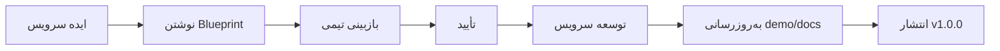

# سیاست بلوپرینت
**Blueprint Policy**

نسخه 1.0 | الزامی پیش از توسعه هر سرویس

---

## 1. اصل اساسی

**بدون Blueprint، توسعه سرویس مجاز نیست.**

هر سرویس قبل از شروع پیاده‌سازی باید یک Blueprint کامل داشته باشد که توسط تیم تأیید شده باشد.

---

## 2. فایل‌های اجباری

```
blueprint/
├── blueprint.md          # هدف، مسئولیت‌ها، نمای کلی
├── requirements.md       # نیازمندی‌های دقیق کسب‌وکار
├── scenarios.md          # سناریوهای اصلی و خطا
└── api-design.md         # (اختیاری) طرح API اولیه
```

---

## 3. محتوای `blueprint.md`

| بخش | توضیح | مثال |
|---|---|---|
| هدف سرویس | یک پاراگراف — این سرویس چه مسئله‌ای را حل می‌کند | "مدیریت فرآیند پرداخت و Escrow" |
| مسئولیت‌ها | لیست کارهایی که این سرویس انجام می‌دهد | "قفل کردن وجوه، آزادسازی پس از تحویل" |
| حوزه (Scope) | چه چیزهایی در این سرویس است و چه چیزهایی نیست | "در این سرویس: پرداخت. نیست: انصراف سفارش" |
| وابستگی‌ها | سرویس‌ها و پکیج‌هایی که به آنها وابسته است | `order-service`, `nons-api/contracts/` (Proto) |
| ریسک‌ها | چالش‌های بالقوه | "مدیریت همزمانی در آزادسازی Escrow" |

---

## 4. محتوای `requirements.md`

```markdown
# نیازمندی‌های سرویس پرداخت

## نیازمندی‌های وظیفه‌ای (Functional)

- [ ] کاربر بتواند سفارش را پرداخت کند
- [ ] وجوه در Escrow قفل شود
- [ ] پس از تأیید تحویل، وجوه به فروشنده آزاد شود
- [ ] در صورت انصراف، وجوه به خریدار برگردد

## نیازمندی‌های غیروظیفه‌ای (Non-Functional)

- زمان تأیید پرداخت کمتر از ۵ ثانیه
- قابلیت بازیابی پس از خطا
- ثبت تمام تراکنش‌ها برای حسابرسی
```

---

## 5. محتوای `scenarios.md`

### سناریوهای خوشحال (Happy Path)

- [ ] پرداخت موفق — کاربر سفارش را پرداخت می‌کند، وجوه قفل می‌شود
- [ ] تحویل موفق — خریدار تأیید می‌کند، وجوه به فروشنده می‌رسد

### سناریوهای خطا (Error Scenarios)

- [ ] موجودی ناکافی — کاربر موجودی کافی ندارد
- [ ] زمان‌گذرد (Timeout) — کاربر در مهلت مقرر پرداخت نکرد
- [ ] اختلاف (Dispute) — خریدار اعلام مشکل می‌کند
- [ ] ازکارافتادگی سرویس — سرویس پرداخت در دسترس نیست

### سناریوهای مرزی (Edge Cases)

- [ ] پرداخت همزمان — دو درخواست همزمان برای یک سفارش
- [ ] انصراف پس از پرداخت — سفارش پرداخت شده اما تحویل نشده
- [ ] مبلغ صفر — سفارش با مبلغ رایگان

---

## 6. ارتباط Blueprint با Demo

Blueprint و Demo دو مرحله مجزا و ترتیبی هستند:

1. **Blueprint** — README پیشنهادی سرویس، بدون دمو یا کد اجرایی
2. **بررسی و تأیید** — Blueprint توسط تیم بازبینی و تأیید می‌شود
3. **Demo** — پس از تأیید Blueprint، یک پیش‌نمایش اولیه در `demo/` ساخته می‌شود

```
demo/
├── index.html       # صفحه اصلی — هدف، نقاط پایانی، رویدادها
└── assets/          # فایل‌های CSS/JS (در صورت نیاز)
```

این دمو پس از توسعه به **نسخه نهایی** تبدیل می‌شود.

> **قانون:** دمو باید تا حد امکان به نسخه نهایی نزدیک باشد. هر تغییری در توسعه باید دمو را هم‌گام به‌روزرسانی کند.

---

## 7. تأیید Blueprint

| مرحله | مسئول | وضعیت |
|---|---|---|
| نوشتن Blueprint | توسعه‌دهنده ارشد سرویس | 📝 |
| بازبینی نیازمندی‌ها | مدیر محصول (Product Owner) | 👀 |
| بازبینی فنی | معمار سیستم (Architect) | 🔍 |
| تأیید نهایی | تیم کامل | ✅ |

پس از تأیید، Blueprint در مخزن commit می‌شود و توسعه آغاز می‌گردد.

---

## 8. چرخه عمر Blueprint



پس از انتشار `v1.0.0`، پوشه `blueprint/` بایگانی یا حذف می‌شود. محتوای آن به `docs/` منتقل می‌گردد.

---

## خلاصه

| مورد | وضعیت |
|---|---|
| وجود Blueprint پیش از توسعه | اجباری |
| تأیید تیمی پیش از توسعه | اجباری |
| هم‌گام‌سازی Blueprint با توسعه | اجباری |
| وجود دمو پس از تأیید Blueprint | اجباری |
| بایگانی Blueprint پس از انتشار | توصیه شده |
