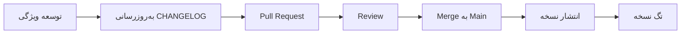

# سیاست تغییرات
**Changelog Policy**

نسخه 1.0 | الزامی برای همه سرویس‌ها و پکیج‌ها

---

## 1. الزامات

هر سرویس و هر پکیج باید فایل `CHANGELOG.md` در ریشه خود داشته باشد.

**اهداف:**
- ردیابی تاریخچه تغییرات هر سرویس
- کمک به بررسی PRها و انتشارات
- اطلاع‌رسانی شفاف به سایر تیم‌ها

---

## 2. ساختار استاندارد

الگوی زیر از **Keep a Changelog** پیروی می‌کند:

```markdown
# CHANGELOG
تمام تغییرات قابل توجه این سرویس در اینجا مستند می‌شود.

قالب بر اساس [Keep a Changelog](https://keepachangelog.com/) 
و این پروژه از [Semantic Versioning](https://semver.org/) پیروی می‌کند.

---

## [نسخه منتشر نشده] - Unreleased

### Added
- 

### Changed
- 

### Fixed
- 

### Deprecated
- 

### Removed
- 

---

## [1.0.0] - 2024-01-15

### Added
- ایجاد اولیه سرویس
- پیاده‌سازی CRUD سفارش
- انتشار رویداد `order.created` و `order.paid`

### Fixed
- رفع باگ محاسبه مدت گارانتی

---

## [0.1.0] - 2024-01-01

### Added
- Blueprint اولیه سرویس
- مستندات معماری
```

---

## 3. بخش‌های changelog

| بخش | زمان استفاده | مثال |
|---|---|---|
| `Added` | افزودن ویژگی جدید | `Added: اضافه کردن endpoint پرداخت` |
| `Changed` | تغییر در قابلیت موجود | `Changed: به‌روزرسانی فرمت پاسخ خطا` |
| `Fixed` | رفع باگ | `Fixed: رفع باگ محاسبه مالیات` |
| `Deprecated` | اعلام منسوخ شدن | `Deprecated: /v1/orders/status جایگزین می‌شود` |
| `Removed` | حذف قابلیت | `Removed: حذف endpoint قدیمی /v1/legacy` |
| `Security` | رفع آسیب‌پذیری | `Security: رفع نشت توکن در لاگ‌ها` |
| `Performance` | بهبود عملکرد | `Performance: کاهش ۵۰٪ زمان کوئری سفارشات` |

---

## 4. قوانین

| قانون | توضیح |
|---|---|
| ثبت هر تغییر رفتاری | هر PR که رفتار سرویس را تغییر می‌دهد باید CHANGELOG را به‌روز کند |
| تاریخ انتشار | نسخه منتشر شده باید تاریخ داشته باشد: `[1.2.0] - 2024-06-15` |
| نسخه منتشر نشده | تغییرات در جریان زیر `[نسخه منتشر نشده]` ثبت می‌شوند |
| پیوند به PR | هر مدخل می‌تواند شماره PR داشته باشد: `(#42)` |
| زبان | CHANGELOG به انگلیسی نوشته می‌شود |
| مرتب‌سازی | جدیدترین نسخه در بالای فایل قرار می‌گیرد |
| انتشار بدون CHANGELOG | انتشار بدون CHANGELOG به‌روز شده معتبر نیست |

---

## 5. چرخه به‌روزرسانی



---

## 6. مثال واقعی

```markdown
## [نسخه منتشر نشده]

### Added
- اضافه کردن timeout قابل تنظیم برای پرداخت (#47)
- انتشار رویداد جدید `payment.timeout` (#48)

### Changed
- به‌روزرسانی وابستگی NATS به نسخه 1.4 (#45)

### Fixed
- رفع race condition در آزادسازی escrow (#46)
```

---

## 7. ارتباط با Blueprint

- در فاز **Blueprint**، اولین نسخه changelog با `[0.1.0]` و `Added: Blueprint اولیه` شروع می‌شود
- پس از توسعه کامل، `[1.0.0]` منتشر می‌شود

---

## خلاصه

| مورد | وضعیت |
|---|---|
| وجود CHANGELOG.md | اجباری |
| ثبت هر تغییر | اجباری |
| به‌روزرسانی در PR | اجباری |
| تاریخ انتشار | اجباری |
| پیروی از Semantic Versioning | اجباری |
