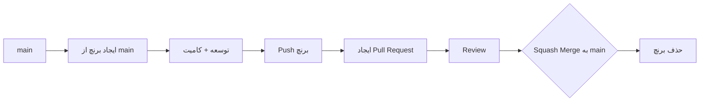

# سیاست گیت
**Git Policy**

نسخه 1.0 | الزامی برای همه مشارکت‌کنندگان

---

## 1. فرمت کامیت (Commit Message)

```
{type}({scope}): {description}
```

### مثال‌ها

```
feat(order): add guarantee timer with 24h default
fix(payment): prevent double escrow release
refactor(chat): extract message immutability guard
docs(marketplace): update product versioning ADR
test(auth): add refresh token rotation tests
chore(infra): add postgres helm values
perf(search): add index on product category
```

### انواع مجاز

| نوع | زمان استفاده | مثال |
|---|---|---|
| `feat` | ویژگی جدید | `feat(order): add dispute timeout` |
| `fix` | رفع باگ | `fix(payment): handle null escrow amount` |
| `refactor` | تغییر کد بدون تغییر رفتار | `refactor(auth): extract token validation` |
| `docs` | فقط مستندات | `docs: update architecture overview` |
| `test` | افزودن یا رفع تست | `test(order): add unit tests for state machine` |
| `chore` | ابزارها، تنظیمات، وابستگی‌ها | `chore: update nats dependency to v1.4` |
| `perf` | بهبود عملکرد | `perf(search): add composite index` |
| `style` | تغییرات ظاهری کد (فرمت‌بندی) | `style: format code with prettier` |
| `ci` | تغییر در CI/CD | `ci: add security scan step` |

### قوانین کامیت

| قانون | توضیح |
|---|---|
| scope اجباری | `{service-name}` یا `{package-name}` — مشخص کند کدام سرویس |
| description انگلیسی | توضیح کامیت به انگلیسی |
| description فعلی | با فعل امر: `add` نه `added`, `fix` نه `fixed` |
| طول | حداکثر ۷۲ کاراکتر برای خط اول |
| بدنه (body) | در صورت نیاز، بعد از یک خط خالی — توضیحات بیشتر |

---

## 2. فرمت برنچ (Branch)

```
{type}/{service}/{short-description}
```

### مثال‌ها

```
feature/order/guarantee-timer
feature/auth/social-login
fix/payment/double-escrow-release
chore/update-dependencies
docs/architecture-overview
```

### انواع برنچ

| نوع | مثال |
|---|---|
| `feature/` | `feature/order/dispute-resolution` |
| `fix/` | `fix/payment/null-pointer-escrow` |
| `chore/` | `chore/update-helm-values` |
| `docs/` | `docs/api-response-format` |
| `refactor/` | `refactor/auth/extract-middleware` |
| `perf/` | `perf/search/add-index` |

---

## 3. گردش کار (Workflow)



### قوانین

| قانون | توضیح |
|---|---|
| **برنچ از `main` ایجاد شود** | بدون برنچ‌های طولانی مدت (long-lived) |
| **هر PR یک موضوع** | یک feature، یک fix، یک موضوع |
| **عنوان PR = فرمت کامیت** | عنوان PR باید همان فرمت کامیت را دنبال کند |
| **Squash merge به main** | همه کامیت‌های برنچ در یک کامیت merge می‌شوند |
| **حذف برنچ پس از merge** | برنچ‌های remote پس از merge حذف شوند |

---

## 4. Pull Request

### عنوان PR

```
{type}({scope}): {description}
```

همان فرمت کامیت — مثال: `feat(order): add guarantee timer`

### تنبلیت PR

| بخش | توضیح |
|---|---|
| توضیحات | خلاصه تغییرات + انگیزه |
| نوع تغییر | feature, fix, refactor, docs, ... |
| لینک به issue | در صورت وجود |
| چک‌لیست DoD | مطابق Definition of Done |
| لینک به دمو | در صورت تغییر UI |

---

## 5. خطاهای رایج

| ❌ غلط | ✅ درست |
|---|---|
| `fixed bug in payment` | `fix(payment): prevent double escrow release` |
| `create-order-service` (برنچ) | `feature/order/create-service` |
| `Added new feature` | `feat(order): add new feature` |
| `main` ← مستقیم کامیت | همیشه از برنچ + PR استفاده کنید |
| برنچ ۲ ماهه | برنچ کوتاه مدت — حداکثر چند روز |

---

## خلاصه

| مورد | فرمت | مثال |
|---|---|---|
| کامیت | `{type}({scope}): {description}` | `feat(order): add guarantee timer` |
| برنچ | `{type}/{service}/{description}` | `feature/order/guarantee-timer` |
| PR | همان فرمت کامیت | `feat(order): add guarantee timer` |
| merge | Squash | همه کامیت‌ها در یک کامیت |
