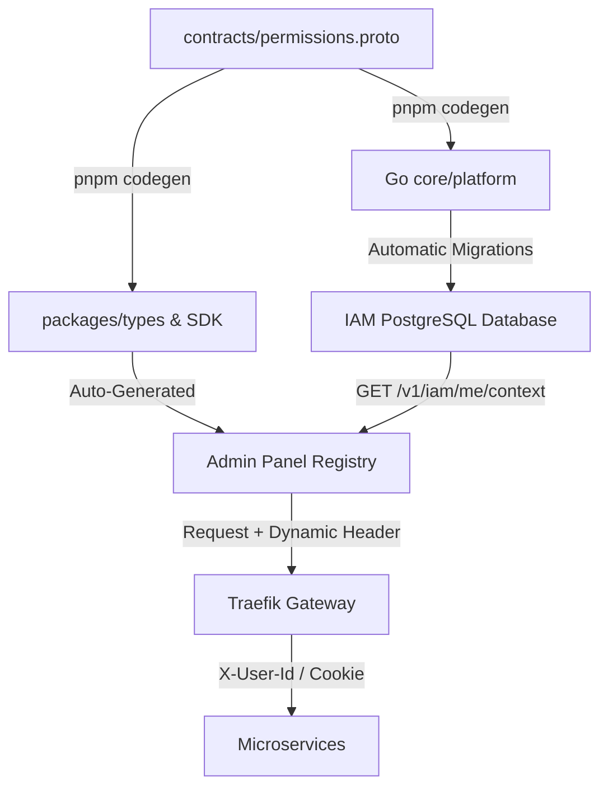

---
layout: doc
title: استاندارد همگام‌سازی مجوزها و تولید SDK
description: راهکار نهایی یکپارچه‌سازی مجوزهای IAM، هدرهای احراز هویت و زنجیره تولید خودکار SDK فرانت‌اند و بک‌اند
version: 1.0.0
status: DRAFT
author: Antigravity
owner: Platform Team
created_at: 2026-07-23
updated_at: 2026-07-23
tags:
  - Architecture
  - Standard
  - SDK
  - CodeGen
  - IAM
  - Permissions
reviewers:
  - Backend Team
  - Frontend Team
  - Platform Team
---

# استاندارد همگام‌سازی مجوزها و تولید SDK (Permission & SDK Sync Standard)

> [!IMPORTANT]
> **هدف سند:** این سند راهکار قطعی و استاندارد پلتفرم NONS را برای حل مشکل همیشگی مغایرت کلیدهای مجوز (Permission Keys) و هدرهای احراز هویت بین فرانت‌اند و بک‌اند ارائه می‌دهد. این طرح شامل مدل تک‌منبع حقیقت (Single Source of Truth) بر پایه Protobuf، مکانیسم تزریق هدر هوشمند در SDK و خودکارسازی ثبت مجوزها است.

> [!NOTE]
> **وضعیت پیاده‌سازی:** این سند در تاریخ ۲۰۲۶-۰۷-۲۳ به‌عنوان DRAFT نوشته شد. از آن زمان تاکنون:
> - ✅ **Proto به‌عنوان SSOT** — پیاده‌سازی شده (فاز ۵: مالکیت توزیع‌شده در `permissions.meta.yaml`)
> - ✅ **Pipeline codegen** — پیاده‌سازی شده (Go + TS + OpenAPI + SDK + aggregation)
> - ❌ **`createSmartClient`** — پیاده‌سازی نشده. Browser SDK ساده باقی مانده (Bearer token حذف شد)
> - ❌ **Self-registration در boot سرویس** — پیاده‌سازی نشده. ثبت مجوزها از طریق `permissions.meta.yaml` + codegen انجام می‌شود
> - ❌ **متادیتا در Proto** — پیاده‌سازی نشده. متادیتا (name, description, group) در YAML سرویس‌ها نگهداری می‌شود
> 
> بخش‌های پیاده‌سازی‌نشده برای فازهای بعدی ثبت شده‌اند. برای مستندات وضعیت فعلی، به [مدل مجوزها](/docs/team/platform/permission-model) مراجعه کنید.

---

## ۱. صورت مسئله و چالش‌ها (The Problem Statement)

در فازهای اولیه توسعه، چند ناهماهنگی اساسی شناسایی شد که توسعه سریع و پایدار را با مشکل مواجه می‌کند:
1. **کلیدهای مجوز اختراعی (Invented Permission Keys):** فرانت‌اند به صورت دستی کلیدهایی مانند `users.view` یا `roles.manage` را تعریف می‌کرد، در حالی که بک‌اند دیتابیس خود را با کلیدهای واقعی مانند `admin.access` یا `product.create` مقداردهی (Seed) می‌کرد. این مغایرت باعث پنهان شدن منوها یا قفل شدن صفحات می‌شد.
2. **قراردادهای متفاوت Auth Header:** سرویس‌های مختلف روش‌های متفاوتی برای خواندن هویت داشتند (مانند `X-User-Id` در `user-service` و `X-User-ID` در `iam-service` و کوکی Ory Kratos در `auth-service`).
3. **شکاف تولید خودکار SDK:** کدهای جنریتور در پوشه `.nons/sdk/generated/` فایل‌های کلاینت خامی تولید می‌کردند که از هدر پیش‌فرض `Authorization: Bearer` (بدون مقدار) استفاده می‌کرد و با قراردادهای واقعی احراز هویت سرویس‌ها سازگار نبود.

---

## ۲. نمای کلی معماری پیشنهادی (Proposed Architecture Overview)

طرح پیشنهادی بر اساس مدل **«یک‌بار تعریف در پروتو، تولید خودکار و مصرف یکپارچه در فرانت و بک»** طراحی شده است:



---

## ۳. منبع واحد حقیقت (Protobuf Registry) — دو سطح

**Proto منبع حقیقت تعریف Keyهاست؛ IAM منبع حقیقت وضعیت runtime.**

به جای تعریف کلیدهای مجوز در دیتابیس یا فایل‌های ثابت فرانت‌اند، **مرجع رسمی تعریف کلیدها فایل `contracts/permissions.proto` است.** IAM (و نه Proto) مشخص می‌کند که کدام کاربر در runtime کدام مجوز را دارد.

### پیشنهاد ساختار جدید `permissions.proto`

برای اینکه جزئیات نمایشی و ساختار در فرانت‌اند نیز خودکار باشد، فیلدهای متادیتای غنی به پروتو اضافه می‌شود:

```proto
syntax = "proto3";

package platform;

option go_package = "core/platform;platform";

// تعریف دامنه سرویس‌ها برای دسته‌بندی مجوزها
enum ServiceOwner {
  SERVICE_UNSPECIFIED = 0;
  SERVICE_IAM = 1;
  SERVICE_USER = 2;
  SERVICE_MARKETPLACE = 3;
  SERVICE_FINANCE = 4;
}

// تعریف کلیدهای رسمی پلتفرم به عنوان Enum
// این کار مانع از هاردکد کردن کلیدهای متنی اشتباه می‌شود
enum PermissionKey {
  PERM_UNSPECIFIED = 0;
  
  // سیستم ادمین عمومی
  ADMIN_ACCESS = 1; // "admin.access"
  
  // محصولات (Marketplace)
  PRODUCT_CREATE = 10; // "product.create"
  PRODUCT_EDIT = 11;
  PRODUCT_DELETE = 12;
  PRODUCT_PUBLISH = 13;
  
  // مالی (Finance)
  WALLET_WITHDRAW = 20; // "wallet.withdraw"
  WALLET_VIEW = 21;
}

message PermissionDetail {
  PermissionKey key = 1;
  string string_value = 2;      // معادل متنی مانند "product.create"
  string name_fa = 3;           // عنوان فارسی برای نمایش در پنل ادمین
  string name_en = 4;           // عنوان انگلیسی
  ServiceOwner owner = 5;       // سرویس مالک این مجوز
  bool is_admin_only = 6;       // آیا فقط مخصوص ادمین است؟
}
```

> [!TIP]
> **مزیت این روش:** با اجرای `pnpm codegen`، در فرانت‌اند پکیج `@nons/types` ثابت‌های Enum و نگاشت متنی آن‌ها را به صورت کاملاً Type-safe دریافت می‌کند. هرگز کلید اشتباه کامپایل نخواهد شد.

---

## ۴. چرخه حیات همگام‌سازی خودکار (Automatic Sync Lifecycle)

```
[توسعه‌دهنده] ──> ویرایش permissions.proto ──> pnpm codegen
                                                   │
                ┌──────────────────────────────────┴──────────────────────────────────┐
                ▼                                                                     ▼
    [بک‌اند (Go)]                                                        [فرانت‌اند (TypeScript)]
    ۱. Go تولید کدهای struct در                                         ۱. تولید انواع داده `@nons/types`
    ۲. خواندن خودکار Enumها در زمان بوت شدن سرویس                       ۲. استفاده از ثابت‌های تولیدشده در منوها
    ۳. ثبت خودکار مجوزها در دیتابیس IAM از طریق API                     ۳. دریافت داینامیک متادیتا (فارسی/انگلیسی)
```

### ثبت خودکار در بک‌اند (Self-Registration)
هر میکروسرویس در زمان Bootstrapping، از روی کدهای تولیدشده توسط پروتو، لیست مجوزهای مورد نیاز خود را به سرویس IAM گزارش می‌دهد:
```go
// اجرای خودکار در زمان استارت‌آپ هر سرویس
func RegisterServicePermissions(client *iam.Client) {
    client.RegisterPermissions([]platform.PermissionDetail{
        {Key: platform.PermissionKey_PRODUCT_CREATE, StringValue: "product.create", NameFa: "ایجاد محصول"},
    })
}
```

---

## ۵. استانداردسازی هدرهای احراز هویت در SDK (Smart Client Interceptor)

برای جلوگیری از ارسال هدرهای اشتباه یا خالی، کلاینت اصلی SDK در فرانت‌اند باید به الگوی **رهگیری و تزریق هوشمند هدرها (Interceptor Pattern)** مجهز شود:

```ts
// src/sdk/client.ts
import { useAuthStore } from '../auth/store'

export interface APIRequestOptions extends RequestInit {
  requiresAuth?: boolean
  serviceType?: 'user-service' | 'iam-service' | 'auth-service' | 'generic'
}

export function createSmartClient(baseURL: string) {
  return async function request<T>(endpoint: string, options?: APIRequestOptions): Promise<T> {
    const authStore = useAuthStore()
    const userId = authStore.state.user?.id
    
    // ۱. هدرهای پایه
    const headers: Record<string, string> = {
      'Content-Type': 'application/json',
      Accept: 'application/json',
      ...((options?.headers as Record<string, string>) || {}),
    }

    // ۲. تزریق هوشمند هدر بر اساس قرارداد سرویس مقصد
    if (userId) {
      if (options?.serviceType === 'user-service') {
        headers['X-User-Id'] = userId       // قرارداد user-service (حروف کوچک d)
      } else if (options?.serviceType === 'iam-service') {
        headers['X-User-ID'] = userId       // قرارداد iam-service (حروف بزرگ ID)
      }
    }

    const response = await fetch(`${baseURL}${endpoint}`, {
      ...options,
      credentials: 'include', // ارسال همیشگی کوکی Kratos برای احراز هویت session-based
      headers,
    })

    if (!response.ok) {
      throw new Error(`API Error: ${response.status} ${response.statusText}`)
    }

    return response.json()
  }
}
```

### قانون تولید کد کلاینت (CodeGen Rule)
فایل‌های جنریتور در `.nons/sdk/generated/` باید به جای هدرهای هاردکد شده از این نمونه کلاینت توسعه‌یافته ارث‌بری کنند. بدین ترتیب توسعه‌دهنده دیگر درگیر تنظیم هدرها یا فراموش کردن `credentials: 'include'` نخواهد شد.

---

## ۶. گام‌های پیاده‌سازی و یکپارچه‌سازی (Next Steps Checklist)

برای نهایی کردن این طرح، اقدامات زیر به عنوان فازهای بعدی پیشنهاد می‌شود:

- [ ] **فاز اول:** اصلاح فایل `contracts/permissions.proto` و ثبت رسمی تمام کلیدها.
- [ ] **فاز دوم:** آپدیت ابزار Buf جنریتور برای خروجی متادیتای مجوزها در `@nons/types`.
- [ ] **فاز سوم:** بازنویسی تمپلیت تولید خودکار کلاینت SDK در پروژه با الگوی `createSmartClient`.
- [ ] **فاز چهارم:** فعال‌سازی مکانیسم Self-Registration در بوت میکروسرویس‌های Go.
- [ ] **فاز پنجم:** تغییر فرمت منوی پنل ادمین از ساختار استاتیک به دریافت داینامیک از IAM.
