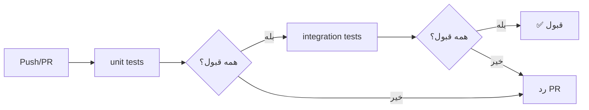

# سیاست تست
**Testing Policy**

نسخه 1.0 | الزامی برای همه سرویس‌ها

---

## 1. اصل اساسی

**هر سرویس قبل از merge به main باید تست داشته باشد.**

---

## 2. انواع تست

| نوع | هدف پوشش | چه چیزی را تست می‌کند | وابستگی |
|---|---|---|---|
| واحد (Unit) | منطق بحرانی کسب‌وکار | توابع خالص، ماشین حالت، محاسبات | ❌ بدون I/O |
| یکپارچه (Integration) | مسیر خوشحال + مسیرهای خطای اصلی | دیتابیس واقعی، NATS واقعی | ✅ دیتابیس + NATS واقعی |

---

## 3. تست واحد (Unit Test)

### چه چیزی را تست کنیم
- منطق خالص کسب‌وکار
- ماشین حالت (State Machine)
- محاسبات و تبدیل‌ها
- اعتبارسنجی
- توابع کمکی (Helpers/Utils)

### مثال

```typescript
// unit/order-status.test.ts
describe('OrderStateMachine', () => {
  it('should transition from pending to paid', () => {
    const result = transition('pending', 'pay');
    expect(result).toBe('paid');
  });

  it('should throw on invalid transition', () => {
    expect(() => transition('paid', 'pay')).toThrow('Invalid transition');
  });
});
```

### قوانین

| قانون | توضیح |
|---|---|
| **بدون I/O** | هیچ تماسی با دیتابیس، فایل سیستم یا شبکه |
| **بدون Side Effect** | تست‌ها pure — بدون تغییر وضعیت خارجی |
| **سریع** | هر تست واحد زیر ۱۰۰ms |
| **ایزوله** | هر تست مستقل — ترتیب اجرا不重要 |

---

## 4. تست یکپارچه (Integration Test)

### چه چیزی را تست کنیم
- مسیر خوشحال (Happy Path) کامل
- مسیرهای خطای اصلی
- تعامل با دیتابیس واقعی
- انتشار و مصرف رویدادهای NATS

### مثال

```typescript
// integration/order-create.test.ts
describe('Create Order - Integration', () => {
  it('should create order and publish event', async () => {
    const order = await orderService.create({
      sellerId: seller.id,
      productId: product.id,
      quantity: 1
    });

    expect(order.status).toBe('pending');
    expect(order.id).toBeDefined();

    // Verify event published
    const event = await natsClient.waitForEvent('nons.order.created');
    expect(event.payload.orderId).toBe(order.id);
  });

  it('should fail when seller has insufficient balance', async () => {
    await expect(
      orderService.create({
        sellerId: poorSeller.id,
        productId: expensiveProduct.id,
        quantity: 100
      })
    ).rejects.toThrow('INSUFFICIENT_BALANCE');
  });
});
```

### قوانین

| قانون | توضیح |
|---|---|
| **دیتابیس ایزوله** | هر تست یا suite دیتابیس تمیز دارد |
| **بدون اشتراک وضعیت** | هرگز وضعیت بین تست‌ها به اشتراک گذاشته نشود |
| **بدون Mock دیتابیس** | در تست یکپارچه از دیتابیس واقعی استفاده کنید — بدون mock |
| **NATS واقعی** | از NATS واقعی یا embedded استفاده کنید |
| **Cleanup** | پس از تست، داده‌ها پاک شوند |

---

## 5. ساختار پوشه تست

```
tests/
├── unit/
│   ├── order-status.test.ts
│   ├── payment-calc.test.ts
│   └── helpers.test.ts
└── integration/
    ├── order-create.test.ts
    ├── order-payment.test.ts
    └── dispute-resolution.test.ts
```

---

## 6. CI Pipeline



| مرحله | توضیح |
|---|---|
| **Push به هر برنچ** | اجرای تست‌های واحد |
| **Push به برنچ feature** | اجرای تست‌های واحد + یکپارچه |
| **Pull Request** | اجرای همه تست‌ها |
| **Merge به main** | اجرای همه تست‌ها |
| **شکست تست = مسدود شدن merge** | در صورت شکست، merge مجاز نیست |

---

## 7. پوشش تست (Test Coverage)

| نوع | حداقل پوشش | هدف ایده‌آل |
|---|---|---|
| Unit — منطق بحرانی | ۱۰۰٪ | ۱۰۰٪ |
| Unit — کل سرویس | ۷۰٪ | ۸۰٪ |
| Integration — مسیر خوشحال | ۱۰۰٪ مسیرهای اصلی | همه endpoints |
| Integration — خطاها | خطاهای اصلی | همه سناریوهای خطا |

---

## 8. قوانین نهایی

| قانون | توضیح |
|---|---|
| تست در CI | تست‌ها در CI روی هر PR اجرا می‌شوند |
| شکست تست = مسدود | در صورت شکست تست‌ها، merge مسدود می‌شود |
| دیتابیس ایزوله | تست‌های یکپارچه از دیتابیس ایزوله استفاده می‌کنند |
| بدون mock دیتابیس | در تست یکپارچه — دیتابیس واقعی |
| بدون state sharing | هرگز وضعیت بین تست‌ها به اشتراک گذاشته نشود |
| تست‌ها سریع | واحد < ۱۰۰ms, یکپارچه < ۵s |

---

## 9. الگوی تست سرویس‌های مالی

### Integration Test با TigerBeetle

برای تست‌های یکپارچه با TigerBeetle، از یک نمونه TigerBeetle واقعی (یا embedded) استفاده کنید:

```typescript
// integration/tigerbeetle.test.ts
describe('TigerBeetle Ledger - Integration', () => {
  it('should record double-entry transaction', async () => {
    const debitAccount = await tigerbeetle.createAccount({ type: 'buyer_wallet' })
    const creditAccount = await tigerbeetle.createAccount({ type: 'escrow' })

    const transfer = await tigerbeetle.createTransfer({
      debitAccountId: debitAccount.id,
      creditAccountId: creditAccount.id,
      amount: 1200n,      // BigInt — integer, نه float
      ledger: 1,          // 1 = USD
      code: 10,           // نوع تراکنش
    })

    expect(transfer.id).toBeDefined()
    const balance = await tigerbeetle.getAccountBalance(debitAccount.id)
    expect(balance.debits).toBe(1200n)
    expect(balance.credits).toBe(0n)
  })

  it('should fail on insufficient funds', async () => {
    await expect(
      tigerbeetle.createTransfer({
        debitAccountId: emptyAccount.id,
        creditAccountId: someAccount.id,
        amount: 999999n,
      })
    ).rejects.toThrow('INSUFFICIENT_FUNDS')
  })
})
```

**قوانین:**
- از `BigInt` برای مبالغ استفاده کنید — `float` برای پول ممنوع است
- هر تست یک `debit_account_id` و `credit_account_id` یکتا داشته باشد
- پس از تست، حساب‌های تست پاک شوند

### Mock Currency Conversion

برای تست واحد سرویس‌هایی که از currency-service استفاده می‌کنند:

```typescript
// unit/currency-client.mock.ts
export const createMockCurrencyClient = () => ({
  convert: jest.fn().mockResolvedValue({
    result: 1020000,
    rate: 85000,
    rateAt: '2024-01-01T12:00:00Z',
  }),
  getRates: jest.fn().mockResolvedValue({
    USD_IRR: 85000,
    updatedAt: '2024-01-01T12:00:00Z',
  }),
})
```

**سناریوهای تست:**

| سناریو | رفتار مورد انتظار |
|--------|-------------------|
| تبدیل موفق | مبلغ صحیح با rounding درست برگردانده شود |
| جفت ارز نامعتبر | خطای `UNSUPPORTED_PAIR` |
| سرویس در دسترس نیست | fallback به cache — لاگ هشدار |
| cache + سرویس هردو در دسترس نیستند | خطای `RATE_UNAVAILABLE` — توقف پرداخت |

### تست Idempotency در Settlement

settlement-service باید idempotent باشد — هر `settlement_id` فقط یک بار پردازش شود:

```typescript
// integration/settlement-idempotency.test.ts
describe('Settlement Idempotency', () => {
  it('should process same settlement only once', async () => {
    const settlementId = 'stl_001'

    // اولین بار — موفق
    const first = await settlementService.settle({
      settlementId,
      sellerId: 'seller_1',
      amountUsdCents: 1200,
    })
    expect(first.status).toBe('completed')

    // ارسال مجدد با same ID — نادیده گرفته شود
    const second = await settlementService.settle({
      settlementId,
      sellerId: 'seller_1',
      amountUsdCents: 1200,
    })
    expect(second.status).toBe('duplicated')
  })
})
```
