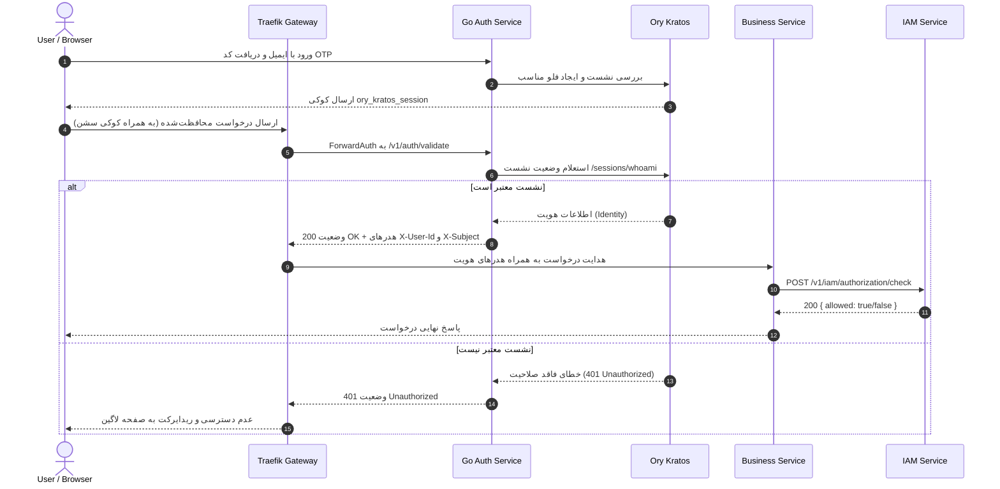
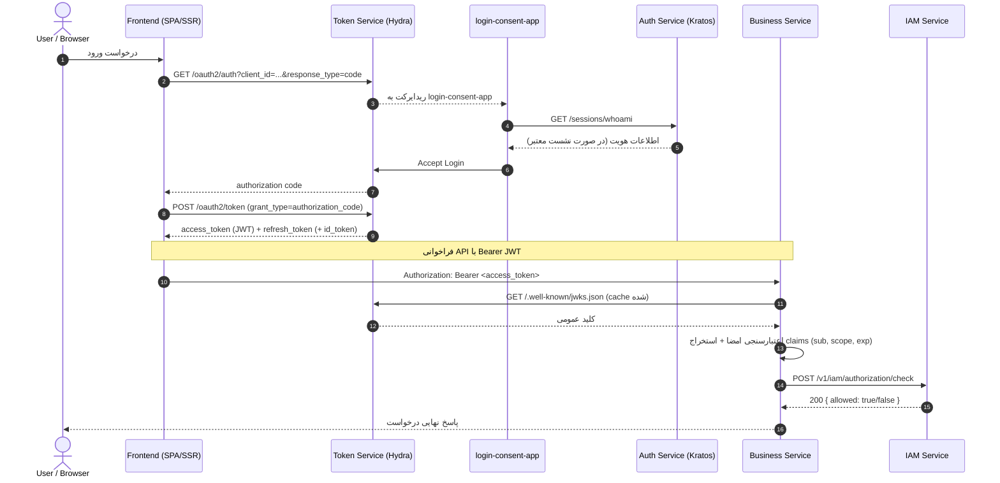

# فلو احراز هویت و مجوزها
**Authentication & Authorization Flow**

این فلو نحوه احراز هویت کاربران و بررسی مجوزهای دسترسی به سرویس‌ها را در پلتفرم NONS نشان می‌دهد.

## روش‌های احراز هویت

- **Primary:** Magic Code — ورود با ایمیل + کد یکبار مصرف (بدون رمز عبور)
- **Secondary:** Google Login — ورود با حساب Google (تطبیق خودکار ایمیل)
- روش‌های `password` و `discord` از معماری سیستم حذف شده‌اند.

## مراحل احراز هویت و دسترسی

1. **درخواست ورود** — کاربر با وارد کردن ایمیل در صفحه ورودی که توسط `auth-service` رندر شده، فرآیند را آغاز می‌کند.
2. **بررسی و هدایت پویا** — سرویس `auth-service` فلو ورود یا ثبت‌نام را در Kratos فعال ساخته و کاربر را به صفحه ورود کد تایید (OTP) هدایت می‌کند.
3. **تأیید و ایجاد نشست** — کاربر کد تایید ارسالی را در فرم وارد کرده و Kratos پس از تایید صحت کد، کوکی نشست را در مرورگر کاربر ثبت می‌نماید.
4. **درخواست به مسیر محافظت شده** — مرورگر کاربر درخواستی را به یک مسیر محافظت شده (مانند `/v1/protected`) در API Gateway ارسال می‌کند.
5. **اعتبارسنجی نشست (ForwardAuth)** — درگاه Traefik Gateway درخواست را متوقف کرده و نشست کاربر را از طریق فراخوانی مسیر `/v1/auth/validate` در `auth-service` ارزیابی می‌کند.
6. **بررسی در Kratos** — سرویس `auth-service` کوکی نشست کاربر را به صورت مستقیم از طریق API Kratos (`/sessions/whoami`) بررسی می‌نماید.
7. **تزریق هدرها** — در صورت معتبر بودن نشست، هدرهای `X-User-Id` (شناسه هویت Kratos) و `X-Subject` (ایمیل) تزریق شده و درخواست به سرویس مقصد هدایت می‌شود.
8. **بررسی مجوز (Authorization)** — سرویس تجاری مقصد برای اطمینان از مجوز عملیات کاربر، از IAM درخواست بررسی مجوز می‌کند: `POST /v1/iam/authorization/check`.
9. **کنترل دسترسی** — IAM با بررسی Authorization Context کاربر (نقش‌ها، مجوزها، محدودیت‌ها و وضعیت)، پاسخ مجاز (Allow) یا غیرمجاز (Deny) را به سرویس بازمی‌گرداند.

## سرویس‌های درگیر

- **Ory Kratos** — موتور مدیریت هویت، ذخیره‌سازی نشست‌ها و احراز هویت با Magic Code و Google OIDC.
- **Auth Service** — سرویس Go جهت مدیریت و رندر صفحات ورود/ثبت‌نام یکپارچه و انجام اعتبارسنجی ForwardAuth.
- **Token Service (Ory Hydra)** — سرور OAuth2/OIDC جهت صدور access/refresh/id token و افشای JWKS. تبدیل نشست Kratos به توکن از طریق `login-consent-app` انجام می‌شود.
- **login-consent-app** — رابط سبک بین Hydra و Kratos جهت اجرای جریان Login & Consent OAuth2.
- **IAM Service** — سرویس مدیریت کاربران، نقش‌ها، مجوزها و Policy Engine داخلی. تمام بررسی‌های مجوز از طریق `POST /v1/iam/authorization/check` انجام می‌شود.
- ~~**Ory Keto** — موتور بررسی مجوزها — منسوخ شده است. Policy Engine داخلی IAM جایگزین آن شده.~~
- **API Gateway (Traefik)** — مسیریابی ترافیک و هماهنگی با ForwardAuth جهت مسدودسازی یا تایید درخواست‌ها.

---

## نمودار توالی احراز هویت و مجوزها

---

## جریان صدور و اعتبارسنجی توکن (Token Service)

جریان یکپارچه‌سازی نشست Kratos با توکن‌های OAuth2 از طریق `token-service` (ORY Hydra) و `login-consent-app` انجام می‌شود. پس از دریافت `authorization code`، کلاینت آن را با `/oauth2/token` تبادل کرده و `access_token` (JWT)، `refresh_token` و (در صورت نیاز) `id_token` دریافت می‌کند.

میکروسرویس‌ها توکن را **به‌صورت stateless و محلی** با استفاده از کلید عمومی منتشر شده در JWKS endpoint (`/.well-known/jwks.json`) اعتبارسنجی می‌کنند — بدون نیاز به تماس شبکه‌ای هر بار (کلیدها cache می‌شوند).

