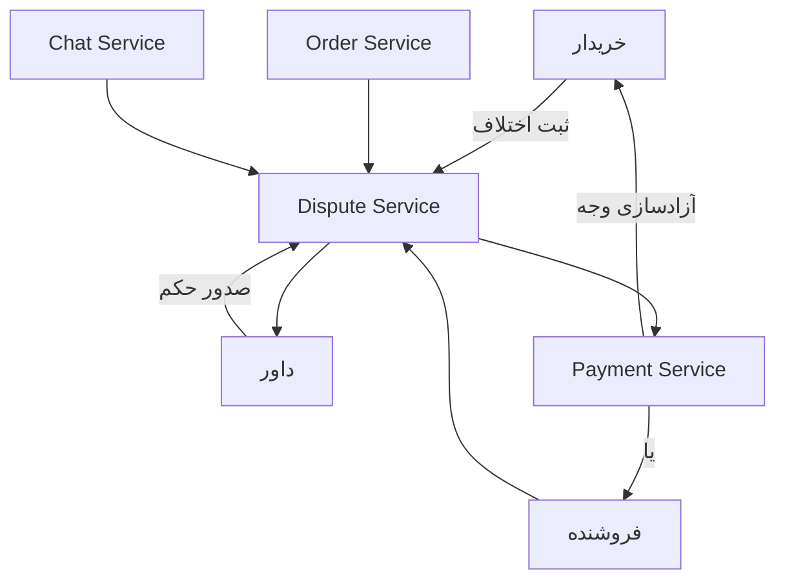

# فلو اختلاف و داوری
**Dispute Resolution Flow**

این فلو فرآیند ثبت، رسیدگی و حل اختلاف بین خریدار و فروشنده را نشان می‌دهد.

## مراحل

1. **ثبت اختلاف** — خریدار یا فروشنده اختلاف را از طریق Dispute Service ثبت می‌کند
2. **گردآوری شواهد** — سرویس‌های Order و Chat اطلاعات مرتبط را به Dispute ارسال می‌کنند
3. **ارجاع به داور** — Dispute Service اختلاف را به داور اختصاص می‌دهد
4. **صدور حکم** — داور پس از بررسی، حکم را صادر می‌کند
5. **اجرای حکم** — Payment Service وجه را مطابق حکم آزاد می‌کند

## سرویس‌های درگیر

- **Dispute Service** — مدیریت چرخه حیات اختلافات
- **Order Service** — اطلاعات سفارش مرتبط
- **Chat Service** — تاریخچه مکالمات خریدار و فروشنده
- **Payment Service** — اجرای حکم مالی (آزادسازی یا استرداد وجه)

## رویدادها

- `dispute.created` — اختلاف جدید ثبت شد
- `dispute.assigned` — داور به اختلاف تخصیص یافت
- `dispute.resolved` — اختلاف با حکم نهایی بسته شد

