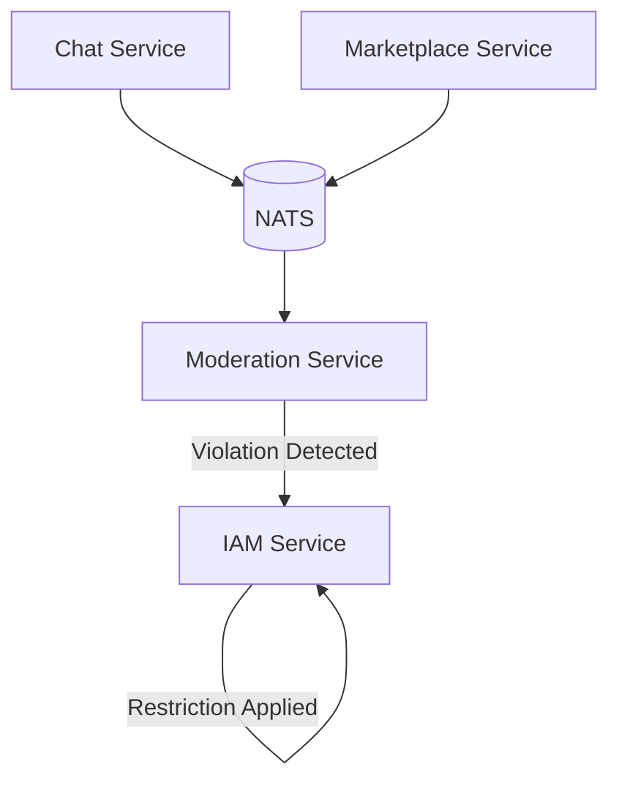

# جریان محدودیت کاربر

**Moderation & Restriction Flow**

این فلو نحوه تشخیص تخلف و اعمال محدودیت بر کاربران را نشان می‌دهد.

## مراحل

1. **گزارش تخلف** — سرویس‌های Chat و Marketplace تخلفات را از طریق NATS گزارش می‌دهند
2. **Moderation Service** — تخلف را بررسی و تأیید می‌کند
3. **اعمال محدودیت** — در صورت تأیید تخلف، IAM Service محدودیت را از طریق API ثبت می‌کند
4. **اجرای خط مشی** — IAM Policy Engine خط مشی دسترسی جدید را اعمال می‌کند
5. **مسدودسازی دسترسی** — سرویس‌های دیگر از IAM وضعیت کاربر را استعلام می‌کنند (`POST /v1/iam/authorization/check`)
6. **انتشار رویداد** — IAM رویداد `nons.iam.user.restriction_added` یا `nons.iam.user.status_changed` منتشر می‌کند

## انواع محدودیت

- **موقت** — محدودیت زمانی (ساعت/روز)
- **دائمی** — مسدودسازی کامل کاربر
- **جزئی** — محدودیت در سرویس خاص (فقط Chat یا فقط Marketplace)

## سرویس‌های درگیر

- **Moderation Service** — تشخیص و تأیید تخلف
- **IAM Service** — مدیریت وضعیت کاربر، اعمال محدودیت و اجرای Policy Engine داخلی
- **NATS JetStream** — رویدادمحور بودن تشخیص تخلف

## رویدادها

- `moderation.violation.detected` — تخلف جدید شناسایی شد
- `moderation.restriction.applied` — محدودیت بر کاربر اعمال شد
- `moderation.restriction.lifted` — محدودیت برداشته شد
- `nons.iam.user.restriction_added` — IAM محدودیت جدید ثبت کرد
- `nons.iam.user.status_changed` — وضعیت کاربر تغییر کرد

