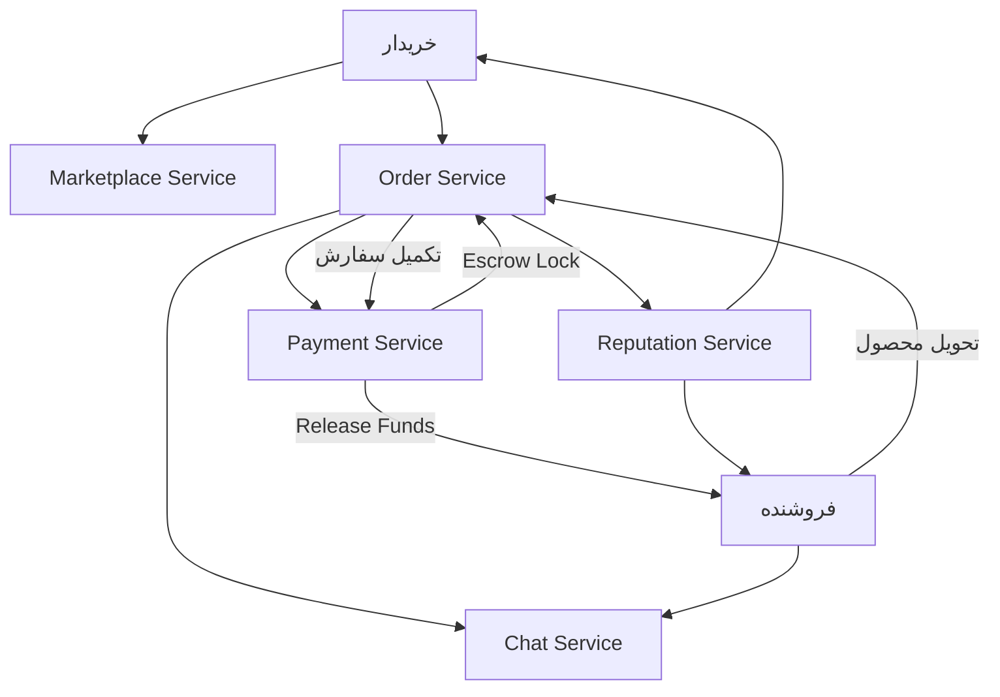

# جریان خرید و تکمیل سفارش
**Order Lifecycle**

این فلو چرخه حیات کامل یک سفارش از ثبت تا تکمیل را نشان می‌دهد.

## مراحل

1. **ثبت سفارش** — خریدار محصول را از Marketplace انتخاب و سفارش ثبت می‌کند
2. **پرداخت** — Order Service درخواست پرداخت را به Payment Service ارسال می‌کند
3. **قفل وجه (Escrow)** — Payment Service وجه را در حساب واسط قفل می‌کند
4. **ارتباط خریدار و فروشنده** — Chat Service برای هماهنگی باز می‌شود
5. **تحویل محصول** — فروشنده محصول را تحویل می‌دهد
6. **آزادسازی وجه** — پس از تأیید خریدار، وجه به فروشنده پرداخت می‌شود
7. **ثبت امتیاز** — Reputation Service امتیاز دو طرف را به‌روز می‌کند

## سرویس‌های درگیر

- **Marketplace Service** — نمایش و انتخاب محصول
- **Order Service** — مدیریت وضعیت سفارش
- **Payment Service** — تراکنش‌ها و مدیریت Escrow
- **Chat Service** — ارتباط خریدار و فروشنده
- **Reputation Service** — امتیازدهی پس از تکمیل

## رویدادها

- `nons.order.created` — سفارش جدید ثبت شد
- `nons.payment.escrow.held` — وجه در Escrow قفل شد
- `nons.order.delivered` — فروشنده محصول را تحویل داد
- `nons.order.completed` — سفارش با موفقیت تکمیل شد
- `nons.order.cancelled` — سفارش لغو شد

