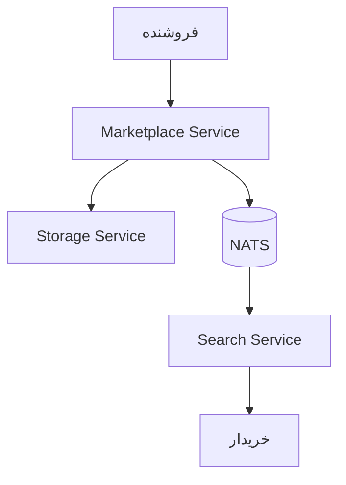

# جریان انتشار محصول
**Product Publishing Flow**

این فلو نحوه انتشار یک محصول توسط فروشنده تا نمایش در نتایج جستجو را نشان می‌دهد.

## مراحل

1. **ثبت محصول** — فروشنده محصول را در Marketplace Service ثبت می‌کند
2. **ذخیره فایل‌ها** — تصاویر و فایل‌های محصول به Storage Service ارسال می‌شود
3. **انتشار رویداد** — Marketplace Service رویداد `product.created` را در NATS منتشر می‌کند
4. **ایندکس شدن** — Search Service رویداد را دریافت و محصول را ایندکس می‌کند
5. **نمایش به خریدار** — محصول در نتایج جستجو برای خریداران نمایش داده می‌شود

## سرویس‌های درگیر

- **Marketplace Service** — ثبت و مدیریت محصولات
- **Storage Service** — ذخیره تصاویر و فایل‌های محصول
- **NATS JetStream** — انتقال رویداد انتشار محصول
- **Search Service** — ایندکس و جستجوی محصولات

## رویدادها

- `product.created` — محصول جدید ثبت شد
- `product.updated` — اطلاعات محصول به‌روز شد
- `product.activated` — محصول فعال و قابل جستجو شد
- `product.deactivated` — محصول از جستجو خارج شد

