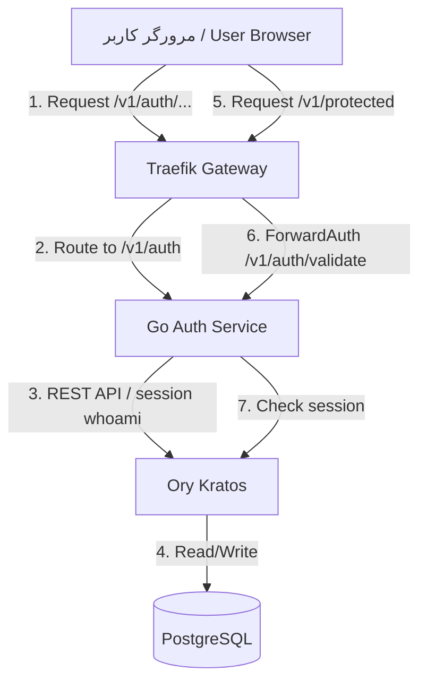
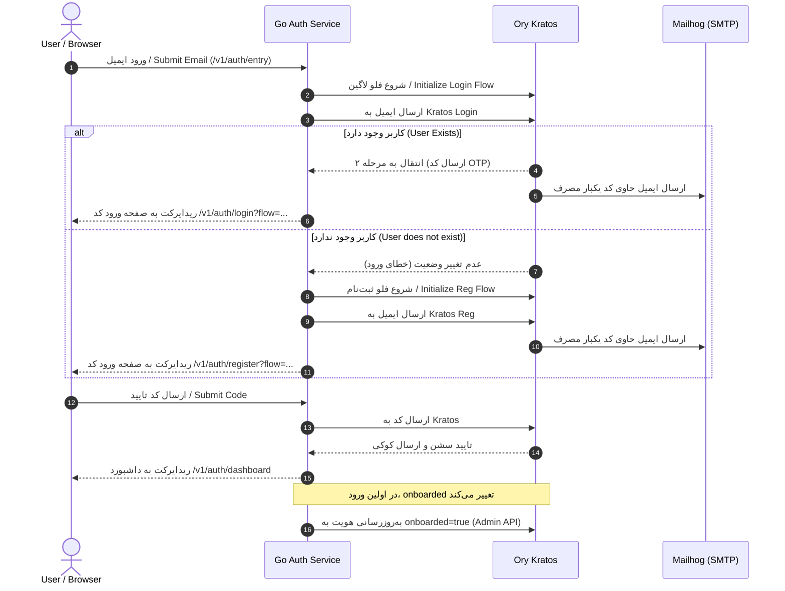

# Auth Service

**Auth Service Blueprint**

> **مستند رسمی سیستم احراز هویت و مدیریت نشست کاربری**

---

## فهرست محتوا
1. [هدف سرویس](#۱-هدف-سرویس)
2. [مسئولیت‌ها](#۲-مسئولیت‌ها)
3. [خارج از مسئولیت‌ها](#۳-خارج-از-مسئولیت‌ها)
4. [معماری ران‌تایم و دیاگرام‌ها](#۴-معماری-ران‌تایم-و-دیاگرام‌ها)
5. [جریان‌های احراز هویت](#۵-جریان‌های-احراز-هویت)
6. [تنظیمات Kratos](#۶-تنظیمات-kratos)
7. [قراردادهای API](#۷-قراردادهای-api)
8. [راهنمای راه‌اندازی لوکال](#۸-راهنمای-راه‌اندازی-لوکال)

---

## ۱. هدف سرویس

**Service Objective**

سرویس `auth-service` به عنوان واسط اختصاصی و مدیریت‌کننده نشست کاربری (Session Management) در پلتفرم NONS عمل می‌کند. این سرویس جریان یکپارچه ورود و ثبت‌نام کاربر را بر پایه **Ory Kratos** هدایت کرده، صفحات رابط کاربری (UI) مربوطه را به صورت محلی رندر و سرو می‌کند و به عنوان هماهنگ‌کننده نشست‌ها (Session Validator) برای درگاه **Traefik API Gateway** با استفاده از متد **ForwardAuth** ایفای نقش می‌نماید.

---

## ۲. مسئولیت‌ها

**Responsibilities**

- ارائه و رندر صفحات رابط کاربری (UI) شامل فرم ایمیل، فرم ورود کد (OTP)، داشبورد و صفحه خطاها با استفاده از قالب‌های محلی Go (`templates/` و `static/`).
- پیاده‌سازی و مدیریت فلو یکپارچه ثبت‌نام و ورود (Unified Auth Entry Flow) جهت شناسایی خودکار کاربران جدید و موجود.
- ارتباط با APIهای عمومی و ادمین Ory Kratos به منظور احراز هویت نشست کاربری و به‌روزرسانی مشخصات هویت (traits).
- ارائه نقطه پایانی `/v1/auth/validate` جهت اعتبارسنجی نشست‌های کاربری برای درگاه Traefik Gateway با استفاده از مکانیزم ForwardAuth.
- پیاده‌سازی محدودکننده درخواست (Rate Limiter) بر روی نقطه ورود احراز هویت جهت مقابله با حملات Brute Force.
- مدیریت و به‌روزرسانی فیلد `onboarded` در مشخصات کاربر (Traits) از طریق Kratos Admin API پس از اولین ورود موفق.
- دریافت وب‌هوک‌های پس از ثبت‌نام از Ory Kratos در مسیر `/v1/auth/webhooks/kratos/register`.

---

## ۳. خارج از مسئولیت‌ها

**Non-Responsibilities**

- **ذخیره‌سازی مستقیم اطلاعات هویتی:** هیچ پایگاه داده مستقلی برای ذخیره‌سازی اطلاعات هویت کاربران در این سرویس وجود ندارد و تمام داده‌ها منحصراً در لایه دیتابیس Ory Kratos ذخیره می‌شوند.
- **ارسال مستقیم ایمیل‌های حاوی کد یکبار مصرف (OTP):** ارسال ایمیل کدهای OTP مستقیماً توسط ماژول Courier در Ory Kratos و با استفاده از سرور SMTP (مانند Mailhog در محیط لوکال) انجام می‌شود.
- **مدیریت توکن‌های OAuth2/OIDC و Ory Hydra:** صدور، ابطال و اعتبارسنجی توکن‌های API بر عهده سرویس مستقل **`token-service`** (مبتنی بر Ory Hydra) است. این سرویس صرفاً نشست‌محور (Session-Cookie Based) را مدیریت کرده و توکن صادر نمی‌کند؛ تبدیل نشست Kratos به توکن از طریق `login-consent-app` بین Kratos و Hydra انجام می‌شود.
- **مدیریت نقش‌ها و دسترسی‌ها (Authorization):** تعیین و بررسی مجوزها و نقش‌های کاربران خارج از این سرویس بوده و بر عهده سرویس IAM است.

---

## ۴. معماری ران‌تایم و دیاگرام‌ها

**Runtime Architecture & Diagrams**

سرویس احراز هویت با ساختار زیر با API Gateway و موتور Kratos ارتباط برقرار می‌کند:



---

## ۵. جریان‌های احراز هویت

**Authentication Flows**

### ۵.۱. جریان ورود و ثبت‌نام یکپارچه (Unified Auth Flow)

پلتفرم NONS فاقد صفحات ورود و ثبت‌نام مجزا در رابط کاربری است. کاربر در ابتدا تنها آدرس ایمیل خود را وارد می‌کند و سیستم به صورت پویا مسیر مناسب را پیش می‌گیرد:



---

## ۶. تنظیمات Kratos

**Kratos Configuration**

تنظیمات Kratos در فایل کانفیگ کلاستر [kratos-config.yaml](file:///C:/Users/ASUS/Documents/GitHub/nons/nons-api/services/auth-service/kratos-config.yaml) تعریف شده و شامل بخش‌های زیر است:

### ۶.۱. ساختار هویت کاربر (Identity Schema)
مشخصات کاربر در فیلد `traits` به صورت زیر ساختاردهی شده است:
- `email`: آدرس ایمیل کاربر (شناسه اصلی و یکتا جهت احراز هویت با متد `code`).
- `onboarded`: وضعیت اونبوردینگ کاربر (نوع بولین، مقدار پیش‌فرض `false`).

```json
{
  "$id": "https://schemas.ory.sh/presets/kratos/identity.email.schema.json",
  "$schema": "http://json-schema.org/draft-07/schema#",
  "title": "Person",
  "type": "object",
  "properties": {
    "traits": {
      "type": "object",
      "properties": {
        "email": {
          "type": "string",
          "format": "email",
          "ory.sh/kratos": {
            "credentials": {
              "code": {
                "identifier": true,
                "via": "email"
              }
            }
          }
        },
        "onboarded": {
          "type": "boolean",
          "default": false
        }
      },
      "required": ["email"]
    }
  }
}
```

### ۶.۲. روش‌های احراز هویت فعال (Authentication Methods)
- **Passwordless Code (`code`):** با طول عمر ۱۰ دقیقه جهت ارسال کدهای یک‌بار مصرف ایمیلی فعال است.
- **OIDC (`oidc`):** ورود از طریق حساب کاربری گوگل فعال است و نگاشت اطلاعات هویت با استفاده از فایل Jsonnet به آدرس `file:///etc/config/kratos/oidc.google.jsonnet` انجام می‌پذیرد.
- سایر روش‌ها (شامل `password` و `totp`) غیرفعال هستند.

### ۶.۳. وب‌هوک ثبت‌نام (Registration Webhook Hook)
در تنظیمات فلو ثبت‌نام، پس از تأیید نهایی کد تایید، وب‌هوکی به آدرس زیر با هدر امنیتی صادر می‌شود:
- **URL:** `http://auth-service:3001/v1/auth/webhooks/kratos/register`
- **Body:** حاوی مشخصات کاربر `userId` و `traits` (به صورت فرمت‌دهی شده با Jsonnet).

---

## ۷. قراردادهای API

**API Contracts**

تمامی مسیرهای ارائه‌شده توسط سرویس `auth-service` با پیش‌وند `/v1/auth` در دسترس هستند (تعریف شده در [main.go](file:///C:/Users/ASUS/Documents/GitHub/nons/nons-api/services/auth-service/main.go#L1171-L1181)).

### `POST /v1/auth/entry`
- **توضیح:** نقطه ورود جریان احراز هویت یکپارچه. آدرس ایمیل کاربر را دریافت کرده و متناسب با وجود یا عدم وجود آن، فلو لاگین یا ثبت‌نام را در Kratos فعال می‌سازد.
- **فرمت داده ورودی:** `application/x-www-form-urlencoded`
- **پارامترهای بدنه:**
  - `email` (اجباری): آدرس ایمیل کاربر.
- **پاسخ:**
  - `302 Found`: ریدایرکت به مسیر `/v1/auth/login?flow=<flow_id>` (برای کاربر موجود) یا `/v1/auth/register?flow=<flow_id>` (برای کاربر جدید).

### `GET /v1/auth/login`
- **توضیح:** نمایش فرم ورود کد OTP یا دکمه ورود با گوگل.
- **پارامترهای Query:**
  - `flow` (اجباری): شناسه جریان ورود صادر شده از Kratos.

### `POST /v1/auth/login`
- **توضیح:** ارسال کد OTP وارد شده توسط کاربر برای تایید در فلو لاگین Kratos.
- **پارامترهای بدنه:**
  - `code` (اجباری): کد تایید ۶ رقمی دریافتی از ایمیل.
  - `csrf_token` (اجباری): توکن ضد جعل صادر شده برای نشست جاری.

### `GET /v1/auth/register`
- **توضیح:** نمایش فرم ثبت‌نام و تایید کد OTP برای کاربران جدید.
- **پارامترهای Query:**
  - `flow` (اجباری): شناسه جریان ثبت‌نام صادر شده از Kratos.

### `POST /v1/auth/register`
- **توضیح:** ارسال کد OTP وارد شده توسط کاربر برای تایید در فلو ثبت‌نام Kratos.

### `GET /v1/auth/validate`
- **توضیح:** نقطه پایانی ForwardAuth برای Traefik. نشست کاربر را با Kratos بررسی می‌کند.
- **پاسخ‌ها:**
  - `200 OK`: در صورت معتبر بودن نشست. هدرهای پاسخ شامل موارد زیر است:
    - `X-User-Id`: شناسه یکتای کاربر در Kratos (UUID v4).
    - `X-Subject`: آدرس ایمیل کاربر.
  - `401 Unauthorized`: در صورت نامعتبر بودن یا انقضای نشست.

### `GET /v1/auth/dashboard`
- **توضیح:** نمایش اطلاعات پروفایل کاربر پس از ورود موفق. در صورت غیرفعال بودن پرچم `onboarded` در هویت کاربر، این پرچم از طریق Kratos Admin API به صورت ناهمگام به `true` تغییر می‌یابد.

### `GET /v1/auth/logout`
- **توضیح:** ابطال نشست Kratos و خروج کامل کاربر.
- **پارامترهای Query:**
  - `token` (اجباری): توکن خروج صادر شده توسط Kratos.

### `GET /v1/auth/settings`
- **توضیح:** نمایش صفحه تنظیمات حساب کاربری (مانند تغییر مشخصات traits). در صورت عدم وجود پارامتر `flow` در درخواست، کاربر را برای راه‌اندازی فلو تنظیمات مرورگر به Kratos ریدایرکت می‌کند.
- **پارامترهای Query:**
  - `flow` (اختیاری): شناسه جریان تنظیمات Kratos.

### `POST /v1/auth/settings`
- **توضیح:** ثبت فرم اطلاعات حساب و مشخصات جدید کاربر در Kratos.
- **پارامترهای بدنه:**
  - `csrf_token` (اجباری): توکن ضد جعل صادر شده برای نشست جاری.
  - سایر فیلدهای traits (مانند `traits.name`).

### `GET /v1/auth/verification`
- **توضیح:** نمایش صفحه تاییدیه و احراز هویت ایمیل کاربر. در صورت عدم وجود پارامتر `flow` در درخواست، کاربر را برای راه‌اندازی فلو تایید مرورگر به Kratos ریدایرکت می‌کند.
- **پارامترهای Query:**
  - `flow` (اختیاری): شناسه جریان تایید Kratos.

### `POST /v1/auth/verification`
- **توضیح:** ارسال ایمیل مجدد یا تایید کد تایید در فلو وریفیکیشن Kratos.
- **پارامترهای بدنه:**
  - `email` (اجباری): آدرس ایمیل کاربر.
  - `csrf_token` (اجباری): توکن ضد جعل صادر شده برای نشست جاری.

### `GET /v1/auth/error`
- **توضیح:** صفحه رندر خطاهای هویتی صادر شده توسط Kratos.
- **پارامترهای Query:**
  - `id` (اجباری): شناسه خطای ثبت شده در Kratos.

### `POST /v1/auth/webhooks/kratos/register`
- **توضیح:** وب‌هوک ثبت‌نام پس از ثبت هویت موفق جدید در Kratos.
- **فرمت داده ورودی:** `application/json`
- **پارامترهای بدنه:**
  - `userId` (اجباری): شناسه کاربر جدید.
  - `traits` (اجباری): مشخصات کاربر جدید شامل ایمیل و نام.

---

## ۷.۵. رویدادهای صادر شده (Published Events)

سرویس `auth-service` پس از انجام موفقیت‌آمیز کنش‌های احراز هویت، رویدادهای زیر را روی NATS منتشر می‌کند:

- **ثبت‌نام موفق کاربر (`nons.auth.user.registered`):**
  - **زمان صدور:** پس از دریافت و پردازش وب‌هوک ثبت‌نام Kratos.
  - **Payload:**
    ```json
    {
      "id": "string (UUID)",
      "email": "string",
      "name": "string",
      "method": "string",
      "registeredAt": "string (ISO 8601)"
    }
    ```

- **ورود موفق کاربر (`nons.auth.user.logged_in`):**
  - **زمان صدور:** پس از تایید نهایی کد OTP در ورود کلاینت.
  - **Payload:**
    ```json
    {
      "id": "string (UUID)",
      "email": "string",
      "method": "string",
      "loggedInAt": "string (ISO 8601)"
    }
    ```

- **خروج موفق کاربر (`nons.auth.user.logged_out`):**
  - **زمان صدور:** پس از ابطال موفق سشن در Kratos.
  - **Payload:**
    ```json
    {
      "id": "string (UUID)",
      "loggedOutAt": "string (ISO 8601)"
    }
    ```

---

## ۸. راهنمای راه‌اندازی لوکال

**Local Setup Guide**

### پیش‌نیازها
- نصب Go نسخه ۱.۲۶ یا بالاتر.
- کلاستر کوبرنتیز محلی فعال (مانند k3d) به همراه Traefik و Kratos مستقر شده.

### گام‌های اجرا
۱. انتقال به دایرکتوری سرویس احراز هویت:
```bash
cd nons-api/services/auth-service
```

۲. تنظیم متغیرهای محیطی مورد نیاز:
```bash
# آدرس دسترسی عمومی به Kratos
$env:KRATOS_PUBLIC="http://kratos:4433"
# آدرس دسترسی ادمین به Kratos
$env:KRATOS_ADMIN="http://kratos:4434"
# پورت اجرای وب‌سرویس
$env:PORT="3001"
```

۳. اجرای محلی سرویس:
```bash
go run main.go
```

۴. استقرار داکر ایمیج و اعمال تغییرات در کلاستر k3d محلی:
```powershell
powershell -File redeploy.ps1
```

۵. اعمال تغییرات کلیدها و متغیرها در کلاستر:
```powershell
powershell -File update-secrets.ps1
```

۶. فوروارد کردن پورت Mailhog جهت دریافت کدهای تایید در محیط محلی:
```bash
kubectl port-forward -n nons-platform svc/mailhog-ui 8025:8025
```
سپس می‌توانید مرورگر خود را روی `http://localhost:8025` باز کرده و کدهای ارسالی را دریافت نمایید.
