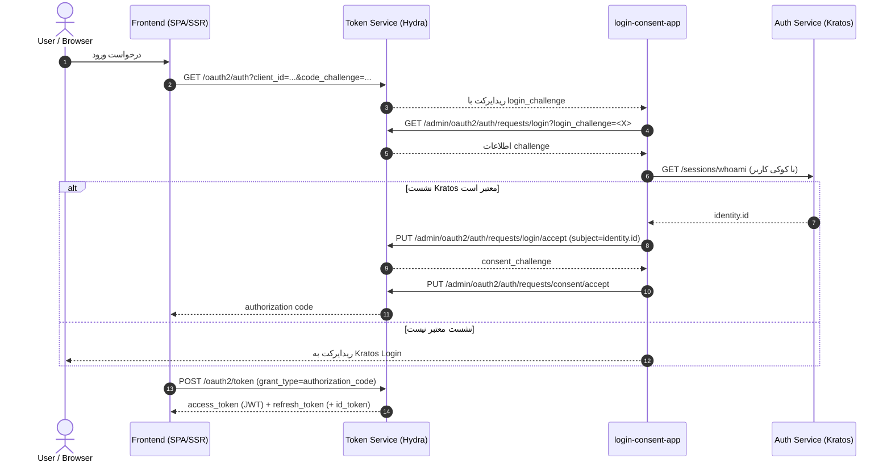
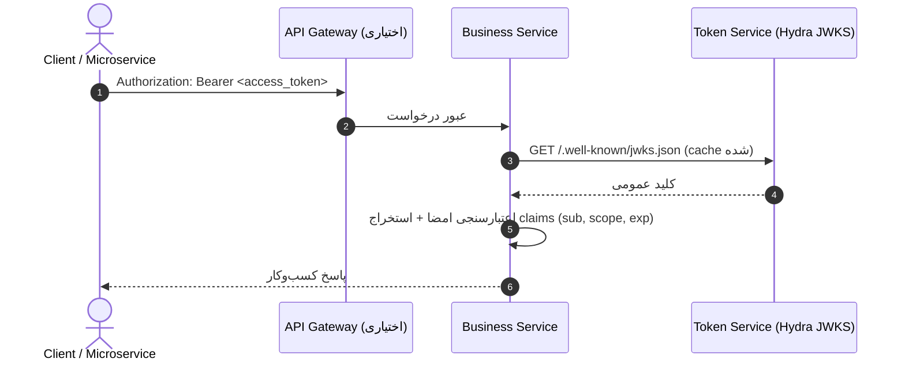

# Token Service

**Token Service — مشخصات فنی نهایی**

> **مستند معماری سرویس — نسخه نهایی (FINAL)**
>
> مرجع تصمیمات معماری: [`ADR-Backend-006`](../../backend/ADR/ADR-Backend-006) (تمام تصمیمات قطعی و بایگانی سناریوهای قدیمی در ADR ثبت شده‌اند).
>
> منبع اصلی مشخصات فنی: `nons-api/services/token-service/blueprint.md` (نسخه ۳.۳).

---

## فهرست محتوا

1. [هدف و دامنه](#۱-هدف-و-دامنه)
2. [مسئولیت‌ها](#۲-مسئولیتها)
3. [خارج از مسئولیت‌ها](#۳-خارج-از-مسئولیتها)
4. [اجزای معماری](#۴-اجزای-معماری)
5. [جریان‌های اصلی](#۵-جریانهای-اصلی)
6. [مدل داده و Claims](#۶-مدل-داده-و-claims)
7. [امنیت](#۷-امنیت)
8. [توپولوژی استقرار](#۸-توپولوژی-استقرار)
9. [رویدادها](#۹-رویدادها)
10. [فازهای پیاده‌سازی](#۱۰-فازهای-پیادهسازی)
11. [سوالات باز باقی‌مانده](#۱۱-سوالات-باز-باقیمانده)

---

## ۱. هدف و دامنه

**Service Objective**

سرویس `token-service` مسئول **صدور، ابطال و اعتبارسنجی توکن‌های API** (OAuth2 / OIDC) در پلتفرم NONS است. این سرویس لایه توکن را از لایه هویت/نشست (auth-service مبتنی بر Kratos) جدا می‌کند تا:

- اعتبارسنجی توکن به‌صورت **stateless و محلی** توسط هر میکروسرویس انجام شود (بدون تماس همزمان با auth-service).
- چند نوع کلاینت پشتیبانی شود: وب (SPA/SSR)، موبایل، و در آینده third-party.

### در دامنه این سند

- صدور access token، refresh token، id token (Hydra)
- ابطال توکن (revoke) و مدیریت نشست‌های توکنی
- افشای کلیدهای عمومی از طریق JWKS endpoint
- الگوی اعتبارسنجی JWT در میکروسرویس‌ها
- مدل داده claims، چرخه عمر توکن، چرخش کلید (key rotation)
- **login-consent-app** به عنوان واسط استاندارد Ory بین Hydra و Kratos (شامل endpoint `/token-hook` برای غنی‌سازی claims)

### خارج از دامنه این سند

- ثبت‌نام، لاگین، MFA، مدیریت نشست مرورگر (بر عهده auth-service / Kratos)
- طراحی UI صفحات لاگین/ثبت‌نام
- منطق کسب‌وکار میکروسرویس‌های داخلی
- RBAC/ABAC تفصیلی در سطح هر سرویس

---

## ۲. مسئولیت‌ها

**Responsibilities**

- میزبانی سرور OAuth2/OIDC (ORY Hydra) جهت صدور access/refresh/id token.
- اجرای جریان Login & Consent بین Hydra و Kratos از طریق `login-consent-app` (الگوی استاندارد Ory).
- غنی‌سازی claims قبل از صدور توکن از طریق Hydra OAuth2 Token Hook.
- افشای نقاط پایانی عمومی شامل JWKS (`/.well-known/jwks.json`) و OIDC discovery.
- ابطال توکن‌ها (refresh token rotation، revoke، logout سمت سرور با **ترتیب صحیح**: ابتدا Hydra سپس Kratos).
- نگهداری دیتابیس اختصاصی (جدا از Kratos) برای client، consent و grants.
- انتشار رویدادهای حیات‌نامه توکن (صدور / ابطال) جهت audit trail.

---

## ۳. خارج از مسئولیت‌ها

**Non-Responsibilities**

- **مدیریت هویت و نشست مرورگر:** بر عهده `auth-service` (ORY Kratos) است. token-service صرفاً توکن صادر می‌کند؛ تأیید اینکه «کاربر واقعاً لاگین کرده» از طریق `login-consent-app` و استعلام `GET /sessions/whoami` در Kratos انجام می‌شود.
- **مدیریت نقش‌ها و دسترسی‌ها (Authorization):** بر عهده `iam-service` است. claims حساس (نقش، سطح دسترسی) از طریق **Hydra OAuth2 Token Hook** اضافه می‌شوند.
- **رندر UI:** هیچ صفحه رابط کاربری در token-service رندر نمی‌شود؛ تمام تعاملات کلاینت از طریق پروتکل OAuth2 انجام می‌گیرد.

---

## ۴. اجزای معماری

**Architecture Components**

| مؤلفه | نقش | فناوری |
|---|---|---|
| `auth-service` | مدیریت هویت، ثبت‌نام، لاگین، MFA، نشست مرورگر | ORY Kratos + Go wrapper |
| `token-service` | سرور OAuth2/OIDC، صدور و ابطال توکن، افشای JWKS — **بدون کد اختصاصی** | ORY Hydra (Helm chart) |
| `login-consent-app` | **سرویس مستقل — تنها کد اختصاصی این دامنه** — endpointهای `/login`, `/consent`, `/token-hook` | سرویس سفارشی Go |
| API Gateway (Traefik) | اعتبارسنجی اولیه توکن، مسیریابی، نرخ‌محدودسازی | Traefik + ForwardAuth / JWKS |
| میکروسرویس‌ها | اعتبارسنجی محلی JWT با JWKS، اعمال authorization | هر استک |
| دیتابیس Kratos | ذخیره identity، credentials، sessions | PostgreSQL |
| دیتابیس Hydra | ذخیره client، consent، grants | PostgreSQL (جدا از Kratos) |

> **نکته طراحی:** Kratos و Hydra باید دیتابیس‌های جدا داشته باشند تا coupling نداشته باشند. این الگوی استاندارد Ory است.
>
> `login-consent-app` یک **سرویس مستقل** است (مانند auth-service / iam-service)، نه بخشی از token-service یا auth-service — مستندات آن در [login-consent-app.md](./login-consent-app.md).

---

## ۵. جریان‌های اصلی

**Core Flows**

### ۵.۱ تبدیل نشست Kratos به توکن OAuth2 (Login & Consent)

```
[مرورگر] → GET /oauth2/auth?client_id=...&code_challenge=... → [Hydra]
[Hydra] → 302 → [login-consent-app]/login?login_challenge=<X>
[login-consent-app] → GET /admin/oauth2/auth/requests/login?login_challenge=<X> → [Hydra Admin]
[login-consent-app] → GET /sessions/whoami (با Cookie: ory_kratos_session کاربر) → [Kratos Public]
  ├─ نشست معتبر:
  │   [login-consent-app] → PUT /admin/oauth2/auth/requests/login/accept?login_challenge=<X>
  │                          {subject: "<kratos-identity-id>", remember: true}
  │   [Hydra] → 302 → [login-consent-app]/consent?consent_challenge=<Y>
  │   [login-consent-app] → PUT /admin/oauth2/auth/requests/consent/accept
  │   [Hydra] → 302 → redirect_uri?code=<auth_code>
  └─ نشست نامعتبر:
      [login-consent-app] → 302 → [Kratos Login]
```

**نکات کلیدی:**
- **کوکی `ory_kratos_session` باید forward شود.** بدون آن، whoami همیشه 401 برمی‌گرداند.
- **Subject = Kratos Identity ID** (identity.id)، نه email/username.
- **هر login_challenge و consent_challenge یک‌بار مصرف.** خطا → restart flow، retry ممنوع.
- **skip_consent** برای first-party clients باید **صریحاً** در تنظیمات Hydra client تنظیم شود: `skip_consent: true, skip_logout_consent: true`. از Admin API قابل تنظیم است.



### ۵.۲ فراخوانی API با توکن

کلاینت access_token را در هدر `Authorization: Bearer <token>` قرار می‌دهد. میکروسرویس‌ها امضای JWT را با کلید عمومی از **JWKS endpoint** هیدرا به‌صورت محلی اعتبارسنجی می‌کنند (کلیدها cache می‌شوند).



### ۵.۳ تمدید توکن (Refresh)

کلاینت با `refresh_token` به `/oauth2/token` (grant_type=refresh_token) درخواست می‌دهد. Hydra اعتبار refresh_token را (stateful، در دیتابیس خود) بررسی و توکن جدید صادر می‌کند. **Refresh token rotation** فعال است.

### ۵.۴ خروج (Logout) — ترتیب صحیح

1. **ابتدا** توکن‌های Hydra را revoke کنید: `POST /oauth2/revoke` (access + refresh token)
2. **سپس** نشست Kratos را باطل کنید: `/self-service/logout`
3. اگر از OIDC Front-Channel/Back-Channel Logout استفاده می‌کنید (برای third-party clients آینده)، از `/oauth2/sessions/logout` استفاده کنید.

صرفاً پاک‌کردن توکن در کلاینت کافی نیست.

---

## ۶. مدل داده و Claims

**Token Data Model & Claims**

### ساختار پیشنهادی JWT access_token

```json
{
  "iss": "https://api.nons.ir/v1/auth/hydra",
  "sub": "<kratos-identity-id>",
  "aud": ["order-service", "payment-service"],
  "scope": "orders:read orders:write",
  "client_id": "web-frontend",
  "exp": 1735900000,
  "iat": 1735896400
}
```

نکات:
- `sub` = Kratos Identity ID (از whoami). مقدار ثابت و نامتغیر.
- `aud` محدود به سرویس‌های مجاز.
- claims اضافی (نقش، سطح دسترسی) از طریق **Hydra OAuth2 Token Hook** اضافه می‌شوند — نه در JWT base.
- مقدار `iss` محیط‌محور است (رجوع به blueprint §۲.۲).

### طول عمر

| توکن | طول عمر | محل ذخیره سمت کلاینت |
|---|---|---|
| access_token | ۱۵ دقیقه | حافظه (در BFF: اصلاً به مرورگر نمی‌رسد) |
| refresh_token | ۳۰ روز (rotation فعال) | httpOnly cookie یا BFF |
| Kratos session | ۱ تا ۲۴ ساعت (قابل تنظیم) | httpOnly cookie |

> **BFF pattern:** در معماری BFF، access_token و refresh_token هرگز به مرورگر نمی‌رسند — BFF آن‌ها را نگه داشته و یک session cookie به مرورگر می‌دهد.

---

## ۷. امنیت

**Security**

- **Refresh token rotation** در Hydra فعال شود.
- **JWKS key rotation** دوره‌ای (هر ۹۰ روز) با overlap.
- **CORS** محدود به دامنه‌های مجاز (در سطح Gateway).
- **PKCE** برای کلاینت‌های **عمومی** (SPA، موبایل) **الزامی** است. برای confidential clients (server-side) اختیاری است.
- **BFF pattern** برای SPA.
- محدودیت scope per-client در Hydra.
- لاگ و audit trail برای صدور/ابطال توکن از طریق Hydra webhook.
- **Admin API فقط از شبکه داخلی** — Kratos Admin و Hydra Admin هرگز public نیستند.
- Hydra Admin API (port 4445) با **Kubernetes NetworkPolicy** در MVP ایزوله می‌شود (فقط `login-consent-app`)؛ mTLS در Roadmap.

---

## ۸. توپولوژی استقرار

**Deployment Topology**

```
[کاربر/مرورگر]
      |
[Traefik Gateway]
      |-----> [auth-service (Kratos)]             --- DB: kratos_db
      |-----> [token-service (Hydra Public 4444)] --- DB: hydra_db
      |-----> [login-consent-app] --(NetworkPolicy)--> [Hydra Admin 4445]
      |          └── endpoints: /login, /consent, /token-hook (تنها کد اختصاصی Go)
      |-----> [میکروسرویس‌ها ...]                 --- هرکدام JWKS از Hydra cache
```

- همه سرویس‌های Ory در یک namespace داخلی.
- میکروسرویس‌ها فقط JWKS عمومی Hydra را می‌خوانند.
- Admin APIهای Kratos و Hydra فقط شبکه داخلی — `NetworkPolicy` دسترسی به Hydra Admin (4445) را فقط به `login-consent-app` محدود می‌کند.

---

## ۹. رویدادها

**Events**

سرویس `token-service` رویدادهای زیر را مطابق با استاندارد `ADR-EVENT-001` منتشر می‌کند:

| رویداد | زمان صدور | توضیح |
|---|---|---|
| `nons.token.issued` | پس از صدور موفق access/refresh token | شامل `client_id`, `sub`, `scope`, `grantedAt` |
| `nons.token.revoked` | پس از ابطال توکن / logout | شامل `sub`, `client_id`, `revokedAt` |

تعاریف رسمی و Payload دقیق در `nons-api/catalog/events/token/events.yaml` ثبت شده‌اند.

---

## ۱۰. فازهای پیاده‌سازی

**Implementation Phases**

| فاز | محدوده | خروجی |
|---|---|---|
| فاز ۱ | راه‌اندازی Kratos + auth-service (session-based) | auth-service قابل استفاده مستقل |
| فاز ۲ | راه‌اندازی Hydra (Helm) + **login-consent-app** (شامل /login, /consent, /token-hook) | صدور access/refresh token واقعی |
| فاز ۳ | پیاده‌سازی middleware اعتبارسنجی JWT در یک سرویس pilot | اثبات الگوی stateless validation |
| فاز ۴ | افزودن Gateway (Oathkeeper/Fortress) برای اعتبارسنجی متمرکز | کاهش تکرار کد در سرویس‌ها |
| فاز ۵ | claims enrichment، rotation کلید، سخت‌سازی امنیتی | آماده برای production |
| فاز ۶ | Rollout به همه میکروسرویس‌ها، مانیتورینگ | معماری کامل در تولید |

---

## ۱۱. سوالات باز باقی‌مانده

### موارد غیربحرانی (خارج از MVP، مانع توسعه نیستند)

1. **Third-party OAuth2 در MVP:** فعلاً فقط first-party. در صورت نیاز، DCR فعال شود.
2. **ابطال آنی JWT:** پیش‌فرض بدون Redis blacklist (مطابق ADR-Gateway-001) — انقضای طبیعی access_token (۱۵ دقیقه) کافی است.
3. **CORS و Rate Limiting:** در سطح Gateway.
4. **Audit trail:** ذخیره از طریق NATS event → audit-service.

---

> **وضعیت سند:** FINAL — تمام تصمیمات معماری در [`ADR-Backend-006`](../../backend/ADR/ADR-Backend-006) ثبت شده‌اند. توسعه فاز ۱–۲ می‌تواند آغاز شود.
>
> منابع: `nons-api/services/token-service/blueprint.md` (نسخه ۳.۳), [`ADR-Backend-006`](../../backend/ADR/ADR-Backend-006)
