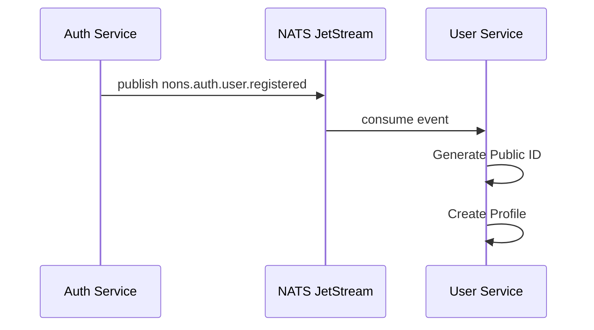
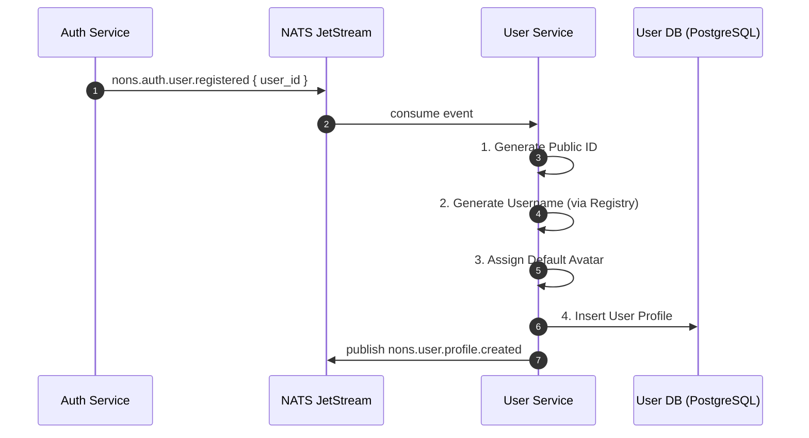
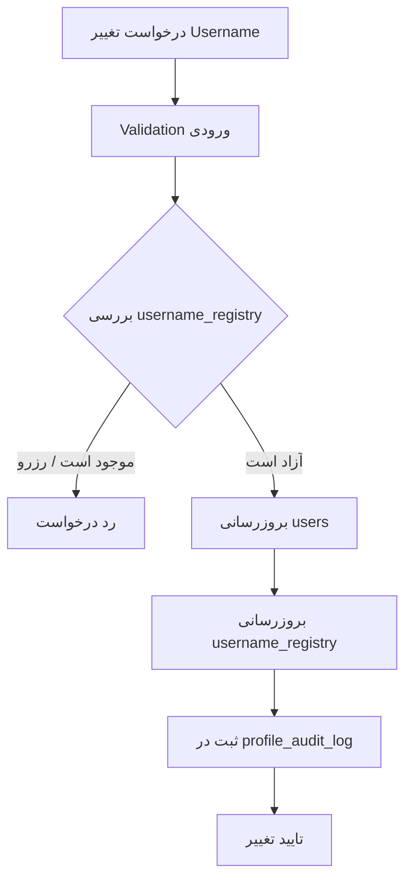
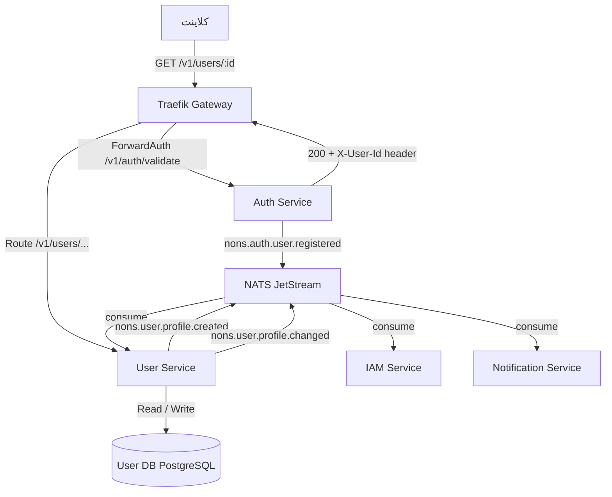

---
layout: doc
title: User Service
description: سرویس مدیریت پروفایل کاربر، شناسه عمومی، Username و تنظیمات شخصی در پلتفرم NONS
version: 1.1.0
status: APPROVED
author: Antigravity
owner: Backend Team
created_at: 2026-06-22
updated_at: 2026-07-14
tags:
  - Backend
  - Service
  - User
  - Profile
  - Blueprint
reviewers:
  - Backend Team
  - Platform Team
---

# User Service

**User Service Blueprint**

> **مستند رسمی معماری، مرزهای مسئولیت و تعاملات سرویس مدیریت پروفایل کاربر**

---

## فهرست محتوا

1. [هدف و دامنه سرویس](#۱-هدف-و-دامنه-سرویس)
2. [موارد خارج از مسئولیت](#۲-موارد-خارج-از-مسئولیت)
3. [مدل شناسه کاربر](#۳-مدل-شناسه-کاربر)
4. [Public ID](#۴-public-id)
5. [Username System](#۵-username-system)
6. [Username Generator](#۶-username-generator)
7. [Username Registry](#۷-username-registry)
8. [Default Avatar System](#۸-default-avatar-system)
9. [مدل داده پروفایل](#۹-مدل-داده-پروفایل)
10. [Display Name](#۱۰-display-name)
11. [Preferences](#۱۱-preferences)
12. [User Status](#۱۲-user-status)
13. [Onboarding Boundary](#۱۳-onboarding-boundary)
14. [Event Flow](#۱۴-event-flow)
15. [رویدادهای خروجی](#۱۵-رویدادهای-خروجی)
16. [تغییر Username](#۱۶-تغییر-username)
17. [Audit Log](#۱۷-audit-log)
18. [Profile Change Policy](#۱۸-profile-change-policy)
19. [Database Ownership](#۱۹-database-ownership)
20. [قراردادهای API](#۲۰-قراردادهای-api)
21. [Security Rules](#۲۱-security-rules)
22. [معماری ران‌تایم و دیاگرام](#۲۲-معماری-رانتایم-و-دیاگرام)
23. [آینده توسعه](#۲۳-آینده-توسعه)

---

## ۱. هدف و دامنه سرویس

**Service Objective**

User Service مسئول مدیریت اطلاعات مرتبط با **تجربه کاربری و پروفایل** در پلتفرم NONS است.

این سرویس منبع حقیقت (Source of Truth) برای موارد زیر است:

| حوزه | توضیح |
|------|-------|
| **پروفایل کاربر** | اطلاعات نمایشی هویت کاربر در پلتفرم |
| **شناسه عمومی (Public ID)** | شناسه قابل انتشار برای کاربر |
| **Username** | شناسه انسانی برای تعاملات اجتماعی |
| **Avatar** | تصویر نمایشی پیشفرض و شخصی |
| **تنظیمات شخصی** | ترجیحات ارز، زبان و تم |
| **اطلاعات نمایشی** | Display Name و داده‌های عمومی پروفایل |

**قانون کلی معماری:**

```
Auth Service  → «این شخص کیست؟»
User Service  → «این شخص چگونه نمایش داده شود؟»
IAM Service   → «این شخص چه کاری اجازه دارد انجام دهد؟»
Billing       → «این شخص چه سطح خدماتی دارد؟»
```

---

## ۲. موارد خارج از مسئولیت

**Non-Responsibilities**

User Service مالک موارد زیر نیست و نباید آن‌ها را ذخیره کند:

### Authentication

**مالک:** Auth Service / Ory Kratos

شامل: ایمیل (به عنوان identifier)، رمز عبور، Magic Code، Google Login، Session، Identity Verification

### Authorization

**مالک:** IAM Service

شامل: Role، Permission، Access Policy

### Subscription

**مالک:** Billing Service

شامل: Plan، Payment، Subscription Status

### Onboarding Flow

**مالک:** IAM Service

User Service فقط **اطلاعات نمایشی مورد نیاز UI** را از IAM دریافت یا Sync می‌کند.

---

## ۳. مدل شناسه کاربر

**Identity Model**

برای جلوگیری از وابستگی مستقیم به سیستم احراز هویت، سه سطح شناسه تعریف شده است:

| شناسه | مالک | تغییرپذیری | کاربرد |
|-------|------|------------|--------|
| **Internal UUID** | User Service | خیر (Immutable) | ارتباطات داخلی و دیتابیس |
| **Public ID** | User Service | خیر (Immutable) | نمایش عمومی، لینک، چت |
| **Username** | User Service | بله (Mutable) | تعامل انسانی |

> **نکته:** UUID داخلی هرگز در API عمومی نمایش داده نمی‌شود. Public ID تنها شناسه عمومی کاربر است.

---

## ۴. Public ID

**Public Identifier**

### هدف

شناسه عمومی قابل انتشار برای کاربر — جایگزین ایمن UUID داخلی در فضای عمومی.

```
id483920183
```

استفاده:

```
nons.app/u/id483920183
chat/user/id483920183
```

### خصوصیات

- **Unique** — در سطح پلتفرم یکتا است
- **Immutable** — پس از ایجاد قابل تغییر نیست
- **بدون ارتباط مستقیم** با UUID دیتابیس

### تولید

Public ID هنگام ایجاد پروفایل، پس از دریافت رویداد `nons.auth.user.registered` از Auth Service تولید می‌شود:



---

## ۵. Username System

**Username System**

Username یک **شناسه انسانی** برای تعاملات اجتماعی در پلتفرم است.

```
night_fox
pixel_star
blue_wave
```

### کاربرد

- چت و پیام‌رسانی
- پروفایل عمومی
- جستجوی کاربر
- نمایش عمومی

### قوانین

| قانون | توضیح |
|-------|-------|
| **Unique** | در سطح پلتفرم یکتا است |
| **مستقل از ایمیل** | هیچ ارتباطی به ایمیل کاربر ندارد |
| **قابل تغییر** | کاربر می‌تواند آن را تغییر دهد |
| **فاقد اطلاعات حساس** | نباید شامل ایمیل، UUID یا اطلاعات شخصی باشد |

---

## ۶. Username Generator

**Username Generator**

برای کاربر جدید، سیستم به صورت خودکار Username ایجاد می‌کند.

**منبع تولید:** Pool Service (مواد اولیه تولید — `adjectives` / `nouns`) — ر.ک. [Pool Service Blueprint](./pool-service/blueprint.md)

> **تصمیم معماری (D2):** Username Registry دیگر منبع تولید Username نیست. تولید (Generator) از داده‌های موجود در Pool Service توسط همین سرویس (Consumer) انجام می‌شود؛ Registry صرفاً مالک یکتایی، رزرو، انتقال مالکیت و Audit است.

**الگو:**

```
adjective + noun + number
```

**نمونه خروجی:**

```
silent_fox_381
bright_star_921
dark_wolf_047
```

فرآیند تولید:
1. انتخاب تصادفی صفت از لیست مصوب
2. انتخاب تصادفی اسم از لیست مصوب
3. افزودن عدد تصادفی (۳ رقمی)
4. بررسی یکتایی در `username_registry`
5. در صورت تکرار، بازتولید

---

## ۷. Username Registry

**Username Registry**

> **تصمیم معماری (D2):** Registry **منبع تولید نیست**؛ تنها مالک یکتایی، رزرو (Reservation)، آزادسازی (Release)، انتقال مالکیت و Audit است. مواد اولیه تولید از Pool Service تأمین می‌شود.

جدول مدیریت یکتایی و وضعیت Usernameها.

### جدول: `username_registry`

| Field | Type | توضیح |
|-------|------|-------|
| `id` | UUID | کلید اصلی |
| `username` | VARCHAR | مقدار نام کاربری |
| `status` | ENUM | `AVAILABLE` / `RESERVED` / `USED` |
| `source` | ENUM | `SYSTEM` (سیستمی) / `USER` (انتخاب کاربر) |
| `created_at` | TIMESTAMPTZ | زمان ایجاد |

### هدف

- **جلوگیری از تکرار** — هر Username فقط یک بار در پلتفرم استفاده می‌شود
- **رزرو نام‌های سیستمی** — نام‌های خاص از دسترس عموم خارج می‌شوند
- **مدیریت blacklist** — نام‌های نامناسب با وضعیت `RESERVED` مسدود می‌شوند

---

## ۸. Default Avatar System

**Default Avatar System**

کاربر جدید پیش از انتخاب Avatar شخصی، یک تصویر پیشفرض دریافت می‌کند.

```
avatar_default_01
avatar_default_02
```

### جدول: `avatar_registry`

| Field | Type | توضیح |
|-------|------|-------|
| `id` | UUID | کلید اصلی |
| `asset_url` | TEXT | آدرس تصویر در Storage |
| `type` | ENUM | `DEFAULT` / `CUSTOM` |
| `status` | ENUM | `ACTIVE` / `INACTIVE` |

---

## ۹. مدل داده پروفایل

**User Profile Data Model**

### جدول: `users`

```json
{
  "id": "uuid",
  "public_id": "id483920183",
  "username": "silent_fox_381",
  "display_name": null,
  "avatar_id": "default_01",
  "preferences": {
    "currency": "USD",
    "theme": "system",
    "language": "fa"
  },
  "status": "ACTIVE",
  "created_at": "timestamp",
  "updated_at": "timestamp"
}
```

### توضیح فیلدها

| Field | Type | توضیح |
|-------|------|-------|
| `id` | UUID | کلید اصلی داخلی — هرگز عمومی نمی‌شود |
| `public_id` | VARCHAR | شناسه عمومی — تنها شناسه قابل نمایش |
| `username` | VARCHAR | شناسه انسانی — یکتا و قابل تغییر |
| `display_name` | VARCHAR | نام نمایشی اختیاری |
| `avatar_id` | VARCHAR | ارجاع به `avatar_registry` |
| `preferences` | JSONB | تنظیمات شخصی کاربر |
| `status` | ENUM | وضعیت حساب کاربری |
| `created_at` | TIMESTAMPTZ | زمان ایجاد |
| `updated_at` | TIMESTAMPTZ | آخرین بروزرسانی |

---

## ۱۰. Display Name

**Display Name**

Display Name با Username متفاوت است و برای نمایش نام واقعی یا انتخابی کاربر استفاده می‌شود.

| فیلد | نمونه |
|------|-------|
| **Username** | `night_fox` |
| **Display Name** | `Ali Mohammadi` |

### خصوصیات

- **خصوصی‌تر** از Username — ممکن است در همه جا نمایش داده نشود
- **قابل تغییر** — کاربر هر زمان می‌تواند آن را ویرایش کند
- **اختیاری** — در صورت عدم تنظیم، Username جایگزین می‌شود
- **برای نمایش داخل پروفایل** و تعاملات مستقیم

---

## ۱۱. Preferences

**User Preferences**

User Service مالک تنظیمات شخصی کاربر است:

```json
{
  "currency": "USD",
  "theme": "dark",
  "language": "fa"
}
```

| Preference | مقادیر مجاز | پیشفرض |
|------------|------------|--------|
| `currency` | `IRR`, `USD`, `TRY` | `IRR` |
| `theme` | `light`, `dark`, `system` | `system` |
| `language` | `fa`, `en`, `tr` | `fa` |

---

## ۱۲. User Status

**User Status**

وضعیت حساب کاربری (نه وضعیت دسترسی):

| Status | توضیح |
|--------|-------|
| `ACTIVE` | حساب فعال و عادی |
| `PENDING` | در انتظار تکمیل پروفایل |
| `SUSPENDED` | حساب معلق (توسط ادمین) |
| `DELETED` | حساب حذف‌شده (Soft Delete) |

> **تصمیم معماری (D7):** این `status` صرفاً **بازتاب‌دهنده** وضعیتی است که توسط **IAM / Onboarding** تعیین می‌شود؛ User Service مالک چرخه انتقال (`PENDING → ACTIVE`) نیست و آن را مدیریت نمی‌کند. هنگام ایجاد پروفایل، مقدار اولیه مستقیماً `ACTIVE` در نظر گرفته می‌شود.

> **مهم:** وضعیت **دسترسی** (ban, suspend برای دلایل امنیتی) توسط **IAM Service** مدیریت می‌شود. این `status` صرفاً وضعیت خود حساب پروفایل است.

---

## ۱۳. Onboarding Boundary

**Onboarding Boundary**

Onboarding در User Service **مدیریت نمی‌شود**.

**مالک:** IAM Service (یا سرویس Onboarding)

> **تصمیم معماری (D6):** State Machine مربوط به Onboarding در سرویس Onboarding/IAM است و User Service صرفاً یک **Projection** (نمایش) از آن را نگهداری می‌کند. حذف State Machine از User Service صحیح است.

User Service فقط وضعیت Onboarding را از IAM **دریافت یا Sync می‌کند**:

```
onboarding_status:
  NEW
  PROFILE_REQUIRED
  COMPLETED
```

این مقدار از IAM خوانده می‌شود و User Service هیچ تصمیمی درباره مراحل Onboarding نمی‌گیرد.

---

## ۱۴. Event Flow

**Event Flow — ایجاد کاربر**



**مراحل پردازش User Service پس از دریافت رویداد:**

1. دریافت رویداد `nons.auth.user.registered`
2. ساخت Public ID یکتا
3. ساخت Username از طریق Username Generator
4. اختصاص Default Avatar
5. ایجاد Profile در دیتابیس
6. انتشار رویداد `nons.user.profile.created`

---

## ۱۵. رویدادهای خروجی

**Outgoing Events**

تمام رویدادها مطابق استاندارد `ADR-EVENT-001` در دامنه `user` تعریف می‌شوند.

### `nons.user.profile.created`

**زمان:** ایجاد پروفایل کاربر پس از ثبت‌نام

```json
{
  "user_id": "uuid",
  "public_id": "id483920183",
  "username": "silent_fox_381",
  "created_at": "timestamp"
}
```

**Consumers:** IAM Service، Notification Service

---

### `nons.user.profile.changed`

**زمان:** تغییر هر یک از فیلدهای اطلاعات پروفایل

```json
{
  "user_id": "uuid",
  "changed_fields": ["display_name", "avatar_id"]
}
```

**Consumers:** Notification Service، Search Service

---

### `nons.user.username.changed`

**زمان:** تغییر Username کاربر (توسط خود کاربر یا ادمین)

```json
{
  "public_id": "id483920183",
  "old_username": "silent_fox_381",
  "new_username": "bright_wolf_204",
  "changed_at": "timestamp"
}
```

**Consumers:** Search Service، Notification Service، Activity Service، Audit Service

> **تصمیم معماری (D10):** تغییر Username از طریق این رویداد اختصاصی منتشر می‌شود. رویداد `nons.user.profile.changed` دیگر فیلد `username` را در `changed_fields` منتشر نمی‌کند (جلوگیری از انتشار دوگانه یک تغییر — ر.ک. قانون ۵).

---

### رویدادهای مصرف‌شده توسط User Service

| رویداد | Publisher | عکس‌العمل |
|--------|-----------|----------|
| `nons.auth.user.registered` | Auth Service | ایجاد پروفایل کاربر |

---

## ۱۶. تغییر Username

**Username Change Flow**



### قوانین

| قانون | توضیح |
|-------|-------|
| **Unique Check** | یکتایی در `username_registry` بررسی شود |
| **Blacklist Check** | Username رزرو شده یا ممنوع (از Pool Service) قبول نشود |
| **Policy Check** | محدودیت‌های تغییر (تعداد مجاز در سال، Cooldown، حداقل عمر حساب) توسط **IAM Policy Engine** اعمال می‌شود — ر.ک. [IAM Service](./iam-service.md) (تصمیم D8) |
| **Audit Required** | هر تغییر در `profile_audit_log` ثبت شود |
| **Old Username** | پس از تغییر، وضعیت قبلی به `AVAILABLE` برگردد |

---

## ۱۷. Audit Log

**Audit Log**

برای تغییرات مهم پروفایل، یک ردپای کامل نگهداری می‌شود.

### جدول: `profile_audit_log`

| Field | Type | توضیح |
|-------|------|-------|
| `id` | UUID | کلید اصلی |
| `user_id` | UUID | FK به `users.id` |
| `action` | VARCHAR | نوع عملیات |
| `old_value` | JSONB | مقدار قبل از تغییر |
| `new_value` | JSONB | مقدار بعد از تغییر |
| `actor` | VARCHAR | کاربر یا سرویس انجام‌دهنده |
| `created_at` | TIMESTAMPTZ | زمان ثبت |

### موارد ثبت‌شده

- تغییر Username
- تغییر Avatar
- بروزرسانی پروفایل (display_name)
- تغییر وضعیت Status

---

## ۱۸. Profile Change Policy

**Profile Change Policy**

| نوع تغییر | روش | Audit |
|-----------|-----|-------|
| **تغییرات شخصی** (display_name, avatar, preferences) | مستقیم ثبت می‌شوند | دارد |
| **تغییر Username** | از طریق Registry Check + تایید پالیسی IAM | دارد |

> **تصمیم معماری (D8):** محدودیت تغییر Username (مثلاً `max_changes_per_year`، `cooldown_days`، `minimum_account_age`) توسط **IAM Policy Engine** تعریف و اعمال می‌شود. User Service صرفاً نتیجه بررسی پالیسی IAM را اجرا می‌کند و خودش محدودیتی را هاردکد نمی‌کند.

> **تصمیم معماری (D9):** همین سیاست (cooldown، rate_limit، quota) برای تغییر Avatar نیز توسط IAM اعمال می‌شود.

> **آینده:** امکان اضافه شدن Approval Flow برای تغییرات حساس در فازهای بعدی وجود دارد.

---

## ۱۹. Database Ownership

**Database Ownership**

User Service یک **دیتابیس مستقل PostgreSQL** دارد و مالک آن است.

### جداول متعلق به User Service

| جدول | توضیح |
|------|-------|
| `users` | پروفایل اصلی کاربر |
| `username_registry` | مدیریت یکتایی Username‌ها |
| `avatar_registry` | لیست Avatar‌های پیشفرض و سفارشی |
| `profile_audit_log` | تاریخچه تغییرات |

### جداول ممنوع

User Service **نباید** موارد زیر را ذخیره کند:

- `password` / Credentials
- `email` (به عنوان identifier)
- Role / Permission
- Billing / Subscription data
- Session / Token

---

## ۲۰. قراردادهای API

**API Contracts**

تمامی مسیرها با پیشوند `/v1/users` ارائه می‌شوند.

### Profile Endpoints

| Method | Path | توضیح |
|--------|------|-------|
| `GET` | `/v1/users/{publicId}` | دریافت پروفایل عمومی کاربر با Public ID |
| `GET` | `/v1/users/me` | دریافت پروفایل کاربر جاری (احراز هویت‌شده) |
| `PATCH` | `/v1/users/me/profile` | بروزرسانی اطلاعات پروفایل |
| `PATCH` | `/v1/users/me/preferences` | بروزرسانی تنظیمات شخصی |
| `PATCH` | `/v1/users/me/username` | تغییر Username |
| `PATCH` | `/v1/users/me/avatar` | تغییر Avatar |

### فرمت پاسخ‌ها

مطابق با استاندارد پلتفرم (ر.ک. `standard/api-response-format`):

```json
// GET /v1/users/{publicId} → 200
{
  "data": {
    "public_id": "id483920183",
    "username": "silent_fox_381",
    "display_name": "Ali Mohammadi",
    "avatar_url": "https://cdn.nons.app/avatars/default_01.png"
  }
}
```

```json
// PATCH /v1/users/me/profile → 200
{
  "data": {
    "public_id": "id483920183",
    "display_name": "Ali Mohammadi",
    "updated_at": "2026-06-22T00:00:00Z"
  }
}
```

```json
// خطای Username تکراری → 409
{
  "error": {
    "code": "USERNAME_ALREADY_TAKEN",
    "message": "The requested username is not available",
    "details": []
  }
}
```

---

## ۲۱. Security Rules

**Security Rules**

| قانون | توضیح |
|-------|-------|
| **UUID محرمانه** | UUID داخلی هرگز در API عمومی نمایش داده نمی‌شود |
| **فقط Public ID** | Public ID تنها شناسه قابل انتشار کاربر است |
| **عدم ذخیره Email** | Email ذخیره نمی‌شود مگر با تصمیم معماری جدید |
| **Username Validation** | اعتبارسنجی Username برای جلوگیری از XSS و Injection اجباری است |
| **Audit Mandatory** | همه تغییرات حساس باید در Audit Log ثبت شوند |

---

## ۲۲. معماری ران‌تایم و دیاگرام

**Runtime Architecture**



### ماتریس وابستگی

| سرویس | نوع ارتباط | جهت |
|-------|-----------|------|
| **Auth Service** | رویداد `nons.auth.user.registered` | ورودی |
| **IAM Service** | مصرف رویداد `nons.user.profile.created` | خروجی |
| **Notification Service** | مصرف رویدادهای `nons.user.*` | خروجی |
| **Traefik Gateway** | Forward به `/v1/users/...` | ورودی |

---

## ۲۳. آینده توسعه

**Future Extensions**

این سرویس با حفظ مدل اصلی User قابلیت توسعه برای موارد زیر را دارد:

| قابلیت | توضیح |
|--------|-------|
| **Social Profile** | پروفایل عمومی با bio، لینک‌های اجتماعی |
| **Chat Identity** | شناسه یکتای کاربر در سیستم پیام‌رسانی |
| **Marketplace Profile** | پروفایل فروشنده (در هماهنگی با Marketplace Service) |
| **Public Pages** | صفحه عمومی کاربر در پلتفرم |
| **Reputation System** | امتیاز و اعتبار کاربر |

> **قانون:** هیچ قابلیت جدیدی که تغییر در مدل اصلی `users` ایجاد می‌کند، بدون ADR مجزا اضافه نخواهد شد.
