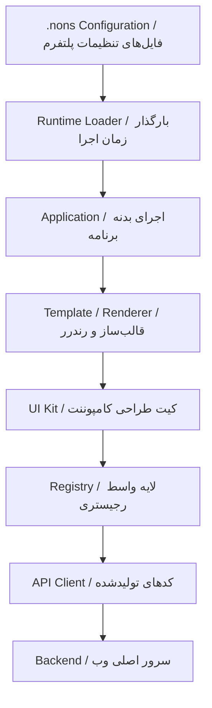
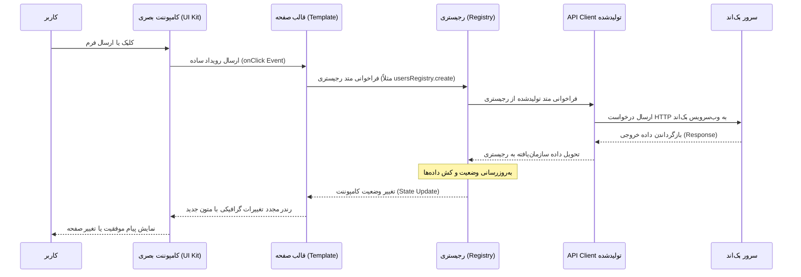

# جریان داده‌ها در زمان اجرا (Official Data Flow)

این مستند جریان چرخش داده‌ها و چرخه حیات بارگذاری پلتفرم Nons را در زمان اجرای فرانت‌بند (Runtime) تشریح می‌کند.

---

## ۱. چرخه حیات کلان و بارگذاری پیکربندی

هنگام راه‌اندازی فرانت‌بند، سیستم از زنجیره سلسله‌مراتبی زیر برای خواندن پیکربندی‌ها، آماده‌سازی قالب‌ها و ارسال درخواست‌ها استفاده می‌کند:

### تشریح زنجیره اجرای زمان اجرا (Runtime Lifecycle)

1. **مرحله بارگذاری تنظیمات (.nons Configuration):**
   در بدو اجرای وب‌سایت، فایل‌های پیکربندی پروژه (از جمله `config.yaml` ،`theme.yaml` و `navigation.yaml`) خوانده می‌شوند.
2. **مرحله راه‌انداز زمان اجرا (Runtime Loader):**
   بارگذار سیستم کدهای پیکربندی را تحلیل کرده، توکن‌های پوسته، زبان سیستم، ساختار منوها و نگاشت رجیستری‌ها را در حافظه زمان اجرا بارگذاری می‌کند.
3. **مرحله برنامه (Application):**
   برنامه کلاینت (درون پوشه `src/`) با استفاده از داده‌های بارگذاری‌شده آغاز به کار می‌کند.
4. **مرحله قالب و رندرینگ (Template / Renderer):**
   برنامه بر اساس شِمای صفحات، قالب‌ها (`Templates`) و پوسته‌های ساختاری را فراخوانی و ساختار بصری را آماده می‌کند.
5. **مرحله کیت رابط کاربری (UI Kit):**
   کامپوننت‌های پایه (لایه `components/`) استایل‌ها و متون خود را از توکن‌های تم و لوکال سیستم طراحی دریافت کرده و ظاهر صفحه را رندر می‌کنند.
6. **مرحله رجیستری (Registry):**
    لایه واسط رجیستری (مطابق [الگوی رجیستری](./registry-pattern)) فراخوانی‌های صفحات را به متدهای API Client هدایت می‌کند. این لایه خطاها را قالب‌بندی کرده و خروجی تمیز به صفحه تحویل می‌دهد.
7. **مرحله ارتباطات شبکه (API Client):**
    کدهای API Client تولیدشده (توسط `nons generate` در `.nons/generated/api-client/`) متدهای تایپ‌پذیر را با Mapping خودکار فرمت داده فراخوانی کرده و درخواست‌های HTTP به سمت بک‌اند ارسال می‌کند.

---

## ۲. جریان رویدادها در تعاملات کاربری (User Event Flow)

هنگامی که کاربر تعاملی با صفحه ایجاد می‌کند (مانند کلیک روی دکمه ثبت فرم)، اطلاعات و پاسخ‌ها مسیر زیر را طی می‌کنند:

