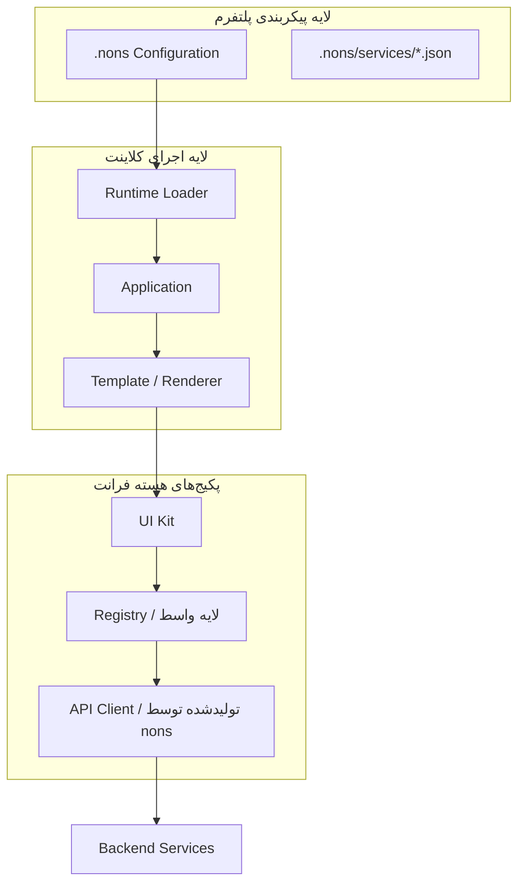

# معماری پلتفرم فرانت‌اند (Frontend Architecture Overview)

هدف اصلی در بازطراحی معماری فرانت‌اند پلتفرم Nons، **استقلال کامل معماری سیستم از ساختار داخلی، فریم‌ورک‌ها (مانند React, Vue) یا ابزارهای خاص توسعه فرانت‌بند** است. این استقلال به ما اجازه می‌دهد پلتفرم را فراتر از یک ساختار کدنویسی خاص توسعه داده و پتانسیل پیشبرد سیستم‌های آینده همچون توسعه مبتنی بر شِما (Schema Driven)، قالب‌سازها (Builders) و رندررها (Renderers) را بدون نیاز به تغییر در شالوده معماری، فراهم سازیم.

---

## سلسله‌مراتب کلی جریان معماری

لایه‌بندی ارتباطات و جریان داده در پلتفرم به صورت زیر ساختاردهی شده است:

---

## تفکیک وظایف پکیج‌های هسته (Package Responsibilities)

فرانت‌اند پلتفرم Nons به سه پکیج اصلی با مسئولیت‌های کاملاً تفکیک‌شده تقسیم می‌شود:

### ۱. کیت رابط کاربری (UI Kit)
این پکیج فاقد وضعیت شبکه یا منطق تجاری بوده و منحصراً بر اساس متغیرها و پوسته‌های ورودی کار می‌کند.
* **مسئولیت‌ها:**
  * ارائه کامپوننت‌های بصری پایه و اتمیک کلاینت (`Components`).
  * مدیریت توکن‌های گرافیکی (`Tokens`).
  * پیاده‌سازی سیستم‌های پوسته و استایل (`Theme`).
  * پیاده‌سازی متون و ترجمه‌های محلی بر اساس پیکربندی‌ها (`Locale`).

### ۲. پلتفرم مدیریت و پنل ادمین (Admin Platform)
این پکیج هسته پردازشی لایه کلاینت Nons را تشکیل می‌دهد و وظیفه تفسیر تنظیمات پلتفرم را دارد.
* **مسئولیت‌ها:**
  * موتور رندرینگ صفحات و کامپوننت‌ها (`Renderer`).
  * موتور پردازش و تحلیل تعاریف صفحات (`Schema Engine`).
  * قالب‌های چیدمان عمومی پنل‌ها (`Templates`).
  * مدیریت زمان اجرای لایه رجیستری (`Registry Runtime`).

### ۳. مصنوعات API تولیدشده (Generated API Artifacts)
ارتباط با وب‌سرویس‌های بک‌اند پلتفرم توسط کدهای تولیدشده **Platform CLI** (بر اساس [ADR-Platform-004](../../platform/ADR/ADR-Platform-004)) انجام می‌شود. CLI با دستور `nons generate` کدهای تایپ‌پذیر را در `.nons/generated/` تولید می‌کند — بدون وابستگی NPM.
* **مسئولیت‌ها:**
  * مدیریت و برقراری ارتباطات API و شبکه (`API Communication`).
  * هماهنگی دقیق قراردادهای داده‌ای ورودی و خروجی (`Request / Response Contracts`).
  * مدیریت اعتبارسنجی نشست‌ها و احراز هویت.
  * **تولید خودکار:** ماژول‌ها از روی Service Manifestها توسط `nons generate` بازتولید می‌شوند — ویرایش دستی ممنوع.
  * **پایداری در برابر تغییر:** تغییر مسیر اندپوینت‌ها در بک‌اند نیازی به تغییر کد فرانت‌اند ندارد؛ تنها `nons registry build` + `nons generate` کافی است.
