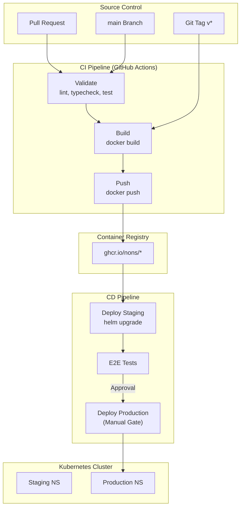

# بلوپرینت معماری CI/CD

**CI/CD Architecture Blueprint**

---

## ۱. نمای کلی معماری



---

## ۲. مؤلفه‌ها

### ۲.۱ Source Control Integration

| مؤلفه | ابزار |
|-------|-------|
| Version Control | GitHub |
| CI Runner | GitHub Actions (ubuntu-latest) |
| Artifact Storage | GitHub Container Registry (ghcr.io) |
| Secret Management | GitHub Secrets + Environments |

### ۲.۲ Build Automation

| مرحله | ابزار | ورودی | خروجی |
|-------|------|-------|-------|
| Lint | ESLint / golangci-lint | Source Code | Report |
| Type Check | tsc --noEmit / go build | Source Code | — |
| Unit Test | vitest / go test | Source + Test | Coverage |
| Integration Test | vitest / go test + K3d | Source + Infra | Test Result |
| Container Build | docker build | Source + Dockerfile | OCI Image |

### ۲.۳ Image Publishing

```yaml
# CI Job: publish
steps:
  - name: Build Image
    run: |
      IMAGE_TAG=sha-${{ github.sha::8 }}
      docker build -t ghcr.io/nons/${{ env.SERVICE }}:$IMAGE_TAG .
      docker push ghcr.io/nons/${{ env.SERVICE }}:$IMAGE_TAG

  - name: Build Release Image
    if: startsWith(github.ref, 'refs/tags/')
    run: |
      VERSION=${GITHUB_REF_NAME#*/v}
      docker build -t ghcr.io/nons/${{ env.SERVICE }}:$VERSION .
      docker tag ghcr.io/nons/${{ env.SERVICE }}:$VERSION ghcr.io/nons/${{ env.SERVICE }}:latest
      docker push --all-tags ghcr.io/nons/${{ env.SERVICE }}
```

### ۲.۴ Deployment Automation

```yaml
# CD Job: deploy-staging
steps:
  - name: Deploy to Staging
    run: |
      helm upgrade --install ${{ env.RELEASE }} ./deploy/helm/${{ env.SERVICE }} \
        --set image.tag=sha-${{ github.sha::8 }} \
        -n nons-platform \
        -f ./deploy/environments/staging/values.yaml
```

### ۲.۵ Release Governance

| مرحله | گیت | تأییدکننده |
|-------|-----|-----------|
| PR → main | Protected Branch + CI Green | Code Reviewer |
| Staging Deploy | خودکار پس از merge | CI |
| E2E Pass | خودکار پس از deploy | CI |
| Production Deploy | تأیید دستی | Devops Team Lead |
| Git Tag | دستی + GitHub Release | Devops Team |

---

## ۳. Pipeline Types

### ۳.۱ Pull Request Pipeline

```yaml
name: PR Validation
on: pull_request

jobs:
  validate:
    runs-on: ubuntu-latest
    steps:
      - lint
      - typecheck
      - test:unit
      - test:integration
      - build:test  # docker build بدون push
```

### ۳.۲ Main Branch Pipeline

```yaml
name: Main Build
on:
  push:
    branches: [main]

jobs:
  validate:
    runs-on: ubuntu-latest
    steps:
      - lint
      - typecheck
      - test:unit
      - test:integration

  publish:
    needs: [validate]
    steps:
      - docker build
      - docker push (sha tag)

  deploy-staging:
    needs: [publish]
    steps:
      - helm upgrade staging
      - e2e tests
```

### ۳.۳ Release Pipeline

```yaml
name: Release
on:
  push:
    tags: ['*/v*']

jobs:
  publish-release:
    runs-on: ubuntu-latest
    steps:
      - docker build
      - docker push (version tag)
      - docker push (latest)
      - create github release

  deploy-production:
    needs: [publish-release]
    environment: production
    steps:
      - helm upgrade production
      - verification
```

---

## ۴. Security Integration

| مرحله | ابزار | زمان |
|-------|-------|------|
| Secret Scanning | GitHub Secret Scanner | هر commit |
| Dependency Audit | `npm audit` / `go mod verify` | هر PR |
| Container Scan | Trivy / Docker Scout | هر push (فاز ۵) |
| Signature | Cosign | هر Release (فاز ۵) |
| SBOM | Syft | هر Release (فاز ۵) |

---

## ۵. GitHub Environments

| Environment |的保护规则 | Approvers |
|------------|-----------|-----------|
| `staging` | خودکار — بدون گیت | — |
| `production` | Required reviewer + wait timer | Devops Team Lead |
| `release` | Required tag | — |

---

## ۶. Failure Recovery

| مرحله | خطا | اقدام |
|-------|-----|-------|
| Validate | Lint/Test fail | PR blocked — developer fix |
| Publish | Push fail | Retry job — اگر دوباره fail شد، issue |
| Deploy | Helm fail | Rollback خودکار + notification |
| E2E | Test fail | Rollback خودکار + block production gate |
| Production | Health check fail | Rollback خودکار (helm rollback) |

---

## ۷. معماری هدف (Phased)

| فاز | قابلیت | وابستگی |
|-----|--------|---------|
| **Base** (Phase 0) | Lint + Build + Test (موجود) | — |
| **CI** (Phase 1) | Image Build + Push + Staging Deploy | Container Registry Strategy |
| **CD** (Phase 2) | Production Gate + Rollback | GitHub Environments |
| **GitOps** (Phase 3) | ArgoCD / Flux + Declarative Config | فاز ۵ |
| **Advanced** (Phase 4) | Image Signing + SBOM + Policy | فاز ۵ |

---

## ۸. خلاصه

| مؤلفه | تصمیم |
|-------|--------|
| CI Platform | GitHub Actions |
| Build Tool | Docker CLI + BuildKit |
| Registry | ghcr.io |
| Deploy Tool | Helm CLI |
| Environments | staging (auto) → production (manual gate) |
| Rollback | `helm rollback` |
| Security Scanning | فاز ۵ |
| GitOps | فاز ۵ |
