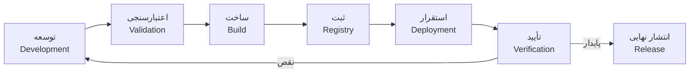

# بلوپرینت چرخه انتشار

**Release Lifecycle Blueprint**

---

## ۱. مراحل چرخه

### ۱.۱ نمای کلی



### ۱.۲ شرح هر مرحله

| مرحله | ورودی | خروجی | مالک |
|-------|-------|-------|------|
| **توسعه** | Task/Issue در GitHub | Pull Request + Code Review | Backend Team |
| **اعتبارسنجی** | Pull Request merged | تست‌های خودکار (lint, unit, integration) | CI (GitHub Actions) |
| **ساخت** | Commit به `main` | Container Image + SHA Tag | CI |
| **ثبت** | Container Image | Image در `ghcr.io/nons/*` | CI |
| **استقرار** | Image Tag + Helm Values | Running Pod در K3s | CD / Devops |
| **تأیید** | Pod Running | Health Check + E2E Tests | CI / Devops |
| **انتشار** | تأیید در Staging | Git Tag + Release Image + Changelog | Devops |

---

## ۲. توسعه (Development)

### ۲.۱ گردش کار توسعه‌دهنده

```text
1. Branch ایجاد کن: feat/order-status-webhook
2. کد بزن + تست بنویس
3. Pull Request به main باز کن
4. CI: lint + build + test (unit + integration)
5. تیم review کند
6. Merge به main
```

### ۲.۲ قوانین

| قانون | جزئیات |
|-------|--------|
| نام برنچ | `feat/*`, `fix/*`, `chore/*`, `refactor/*` |
| محافظت main | Protected Branch — نیاز به review + CI پاس |
| PR size | ترجیحاً زیر ۴۰۰ خط |
| Commit message | Conventional Commits (`feat:`, `fix:`, `chore:`) |

---

## ۳. اعتبارسنجی (Validation)

### ۳.۱ Pipeline اعتبارسنجی

```text
PR opened / updated
  ↓
Lint (ESLint / golangci-lint)
  ↓
Type Check (TypeScript / Go compile)
  ↓
Unit Tests
  ↓
Integration Tests (با K3d)
  ↓
Build Test (Docker build بدون push)
  ↓
✅ Green → Merge مجاز
❌ Red  → Fix required
```

### ۳.۲ قوانین

| مرحله | در PR | در merge به main |
|-------|-------|-----------------|
| Lint | ✅ | ✅ |
| Type Check | ✅ | ✅ |
| Unit Tests | ✅ | ✅ |
| Integration Tests | ✅ | ✅ |
| Build | ✅ (بدون push) | ✅ (با push) |
| Image Push | ❌ | ✅ |
| Deploy | ❌ | فقط Staging |

---

## ۴. ساخت (Build)

### ۴.۱ Pipeline ساخت

```bash
# برای هر commit به main
docker build -t ghcr.io/nons/{service}:sha-${GITHUB_SHA::8} .
docker push ghcr.io/nons/{service}:sha-${GITHUB_SHA::8}

# برای Git Tag v* (Release)
docker build -t ghcr.io/nons/{service}:{version} .
docker push ghcr.io/nons/{service}:{version}
docker tag ... {service}:latest
docker push ... latest
```

---

## ۵. ثبت (Registry)

تصاویر به `ghcr.io/nons/*`推送 می‌شوند. جزئیات کامل در [Container Delivery Architecture](./container-delivery-architecture.md).

---

## ۶. استقرار (Deployment)

### ۶.۱ مدل استقرار

```text
Staging: خودکار — هر commit به main
Production: دستی — با تأیید تیم
```

### ۶.۲ فرمان استقرار Staging

```bash
helm upgrade {release} ./deploy/helm/{service} \
  --set image.tag=sha-${GITHUB_SHA::8} \
  -n nons-platform \
  -f ./deploy/environments/staging/values.yaml
```

### ۶.۳ فرمان استقرار Production

```bash
helm upgrade {release} ./deploy/helm/{service} \
  --set image.tag=${VERSION} \
  -n nons-platform \
  -f ./deploy/environments/production/values.yaml
```

---

## ۷. تأیید (Verification)

### ۷.۱ Post-Deployment Checks

```bash
# Health Check
curl -f http://localhost/v1/auth/health

# Pod Status
kubectl rollout status deployment/{service} -n nons-platform

# Logs (بدون خطا)
kubectl logs -l app={service} -n nons-platform --tail=50
```

### ۷.۲ E2E Tests

پس از استقرار به Staging، تست‌های E2E اجرا می‌شوند:

```bash
# E2E Test Suite
pnpm test:e2e --service={service}
```

---

## ۸. انتشار نهایی (Release)

### ۸.۱ فرمان انتشار

```bash
# 1. Git Tag
git tag auth-service/v1.2.0
git push origin auth-service/v1.2.0

# 2. Build Release Image
docker build -t ghcr.io/nons/auth-service:1.2.0 .
docker push ghcr.io/nons/auth-service:1.2.0

# 3. Tag as latest
docker tag ghcr.io/nons/auth-service:1.2.0 ghcr.io/nons/auth-service:latest
docker push ghcr.io/nons/auth-service:latest

# 4. Create GitHub Release (manual or CI)
gh release create auth-service/v1.2.0 --title "Auth Service v1.2.0" --notes "..."

# 5. Deploy to Production
helm upgrade nons-auth-service ./deploy/helm/auth-service \
  --set image.tag=1.2.0 \
  -n nons-platform \
  -f ./deploy/environments/production/values.yaml
```

### ۸.۲ Changelog

هر Release باید CHANGELOG به‌روز شده داشته باشد:

```markdown
# Changelog — Auth Service

## [1.2.0] - 2026-06-15

### Added
- Webhook endpoint for order status changes

### Fixed
- Rate limiting bypass on /health endpoint

### Security
- Updated Go dependencies for CVE-2026-XXXX
```

---

## ۹. چرخه سریع (Hotfix)

برای رفع باگ‌های بحرانی در Production:

```text
1. Branch از آخرین Release Tag: git checkout -b hotfix/auth-service-1.2.1 auth-service/v1.2.0
2. Fix commit
3. PR به main + backport به hotfix branch
4. CI: lint + test + build
5. Git Tag: auth-service/v1.2.1
6. Deploy مستقیم به Production
7. Merge به main
```

---

## ۱۰. خلاصه

| مرحله | خودکار | دستی | مسئول |
|-------|--------|------|--------|
| توسعه | ❌ | ✅ | Backend Team |
| PR Validation | ✅ | ❌ | CI |
| Build (SHA) | ✅ | ❌ | CI |
| پوش به Registry | ✅ | ❌ | CI |
| استقرار Staging | ✅ | ❌ | CI |
| تأیید Staging | ✅ | ❌ | CI |
| استقرار Production | ❌ | ✅ | Devops |
| Release (Tag) | ❌ | ✅ | Devops |
| Hotfix | ❌ | ✅ | Devops |
