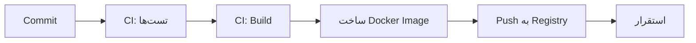

# سیاست مصنوعات ساخت
**Build Artifact Policy**

نسخه 1.0 | الزامی برای همه Docker Imageها و Release Packageها

> **دامنه اعمال:** این پالیسی فقط برای مصنوعات قابل ساخت و استقرار (buildable/deployable artifacts) در مخزن `nons-api/` اعمال می‌شود. برای مخزن مستندات (`dotdive/`) و مستندات تیمی اعمال نمی‌شود.

---

## 1. اصل اساسی

**مصنوعات ساخت (Build Artifacts) فقط باید شامل فایل‌های مورد نیاز Runtime باشند.**

هیچ فایل توسعه، مستندات، تست یا دمویی نباید وارد تصویر نهایی شود.

---

## 2. محتوای ممنوع در Build

| پوشه / فایل | دلیل | سرنوشت |
|---|---|---|
| `docs/` | مستندات — فقط برای توسعه‌دهندگان | ❌ حذف از Build |
| `demo/` | پیش‌نمایش — فقط برای همکاری تیمی | ❌ حذف از Build |
| `tests/` | تست‌ها — فقط در CI اجرا می‌شوند | ❌ حذف از Build |
| `blueprint/` | طرح اولیه — فقط قبل از توسعه | ❌ حذف از Build |
| `.git/` | تاریخچه git | ❌ حذف از Build |
| `.env` | اسرار محیطی | ❌ حذف از Build |
| `.env.*` (جز `.env.example`) | اسرار محیطی | ❌ حذف از Build |
| `node_modules/` (در مرحله نهایی) | وابستگی‌های توسعه | ❌ حذف در Multi-stage Build |
| `*.test.*` | فایل‌های تست | ❌ حذف از Build |
| `*.spec.*` | فایل‌های تست | ❌ حذف از Build |

---

## 3. `.dockerignore` — مثال

```dockerignore
# Git
.git/
.gitignore

# Development
docs/
demo/
tests/
blueprint/
*.test.*
*.spec.*

# Environment
.env
.env.development
.env.local

# IDE
.vscode/
.idea/

# OS
.DS_Store
Thumbs.db

# CI
.github/
.gitlab-ci.yml
```

---

## 4. Docker Multi-stage Build

برای به حداقل رساندن حجم تصویر نهایی، **همیشه از Multi-stage Build** استفاده کنید:

```dockerfile
# Stage 1: Build
FROM node:20-alpine AS builder
WORKDIR /app
COPY package*.json ./
RUN npm ci --only=production
COPY . .
RUN npm run build

# Stage 2: Runtime — فقط فایل‌های لازم
FROM node:20-alpine
WORKDIR /app
COPY --from=builder /app/dist ./dist
COPY --from=builder /app/node_modules ./node_modules
COPY --from=builder /app/package.json ./
COPY --from=builder /app/.env.example ./

EXPOSE 3000
CMD ["node", "dist/main.js"]
```

---

## 5. قوانین Release Package

برای انتشارات (GitHub Release, npm, Go module):

| مورد | در Release | خارج از Release |
|---|---|---|
| کد کامپایل شده / بیلد شده | ✅ | ❌ |
| کد منبع | ✅ (در صورت لزوم) | ✅ (در مخزن) |
| مستندات | ❌ | ✅ (در مخزن) |
| دمو | ❌ | ✅ (در مخزن) |
| تست | ❌ | ✅ (در مخزن) |
| `.env.example` | ✅ | ✅ |
| `CHANGELOG.md` | ✅ | ✅ |

---

## 6. CI/CD Pipeline



**قوانین CI:**
- Build فقط پس از قبولی همه تست‌ها انجام می‌شود
- تصویر نهایی همیشه از Multi-stage Build ساخته می‌شود
- تگ تصویر دقیقاً با نسخه سرویس مطابقت دارد
- از `docker scan` یا ابزار مشابه برای بررسی امنیتی استفاده کنید

---

## 7. امنیت Build

| قانون | توضیح |
|---|---|
| اسکن امنیتی | تصویر نهایی باید از نظر آسیب‌پذیری اسکن شود |
| حداقل دسترسی | کاربر Runtime در کانتینر `root` نباشد |
| حداقل وابستگی | فقط پکیج‌های ضروری در تصویر نهایی باشند |
| بدون راز | هیچ رازی در تصویر نهایی کدگذاری نشود |
| Alpine / Slim | از تصاویر پایه حداقلی استفاده شود |

---

## 8. خلاصه

| مرحله | وضعیت |
|---|---|
| حذف `docs/` از Build | اجباری |
| حذف `demo/` از Build | اجباری |
| حذف `tests/` از Build | اجباری |
| حذف `.git/` از Build | اجباری |
| Multi-stage Build | اجباری |
| اسکن امنیتی | توصیه شده |
| کاربر غیر-root | اجباری |
